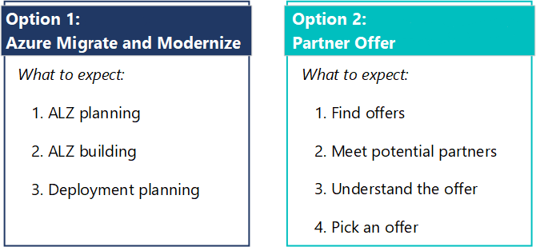

# How to get help building a landing zone

Getting your Azure landing zone (ALZ) done right and on time is important. Working with a certified Azure partner is a great way to get the support you need to build your ALZ.

We'll show you how to find a partner and what to expect from your partner.

There are two options to find an ALZ partner (*see image*).

- *Option 1* - use Azure Migrate and Modernize.
- *Option 2* - find a partner offer for a landing zone in our marketplace.

## Option 1 - Azure Migrate and Modernize

The easiest option to find an ALZ partner is through Azure Migrate and Modernize.

### How to find an Azure Migrate and Modernize partner

Take 5 minutes to [fill out the Azure Migrate and Modernize form](https://azure.microsoft.com/migration/migration-modernization-program/#program-form). Someone from the team will help you find the right partner.

### What to expect from an Azure Migrate and Modernize partner

All the partners in the program adhere to ALZ best-practices. We vet partners to ensure customers receive ALZ guidance that follows CAF principles. Here are some of the deliverables you and your partner will work through together.

1. *ALZ planning* – The Azure Migrate and Modernize partner will work with you to create the business and technical foundation needed to build your ALZ. ALZ planning includes:

    - Selecting your operating models
    - Reviewing your ALZ implementation options
    - Identifying your compliance requirements
    - Identifying any customization needed

1. *ALZ building* – Your partner will build and monitor an ALZ pilot. ALZ building includes:

    - Reviewing your ALZ objectives and outcomes
    - Defining your ALZ build plan
    - Building your ALZ pilot
    - Monitoring your ALZ pilot

1. *Deployment planning* – Your partner will work with you to define your deployment plan. Deployment planning includes:

    - Assessing existing workload compatibility
    - Presenting deployment plan options
    - Defining resources, timeline, and next steps to execute the deployment plan

## Option 2 - Partner offers

We have a self-discovery process that you can use to find a partner. The [Find an Azure partner](https://azure.microsoft.com/partners/) page provides information about working with certified Azure partners and links to the offers.

Offers come from Azure advanced specialization partners and Azure Expert Managed Services Providers (MSPs). Microsoft vets and approves each offer before it enters Azure Marketplace.

Advanced specialization partners demonstrate deep technical knowledge, proven success, and ethical business practices. Azure Expert MSPs also meet these criteria but must additionally pass a time- and cost-intensive auditing process.

Offers in the marketplace have a price, description, and contact information. Like any marketplace, there's flexibility in what the offer can be. Partners design and propose offers. Microsoft approves them for the marketplace.

This flexibility creates value for you and allows you to find an offer that meets your specific needs.

### How to find partner offers

1. Go to the [Find an Azure partner](https://azure.microsoft.com/partners/) page. This page provides information about both Azure advanced specialization partners and Azure Expert MSPs. 

   In the **Azure advanced specialization partners** section, there's a list of links for specific types of migrations. Available offers are listed on the resulting pages.

   In the **Azure Expert MSPs** section, select **Find an Azure Expert Managed Service Provider** to go to a similar list of available offers.  

   Each tile or square on these offer pages represents a different offer. Some partners have multiple offers, so you might see a partner appear more than once. Selecting a tile takes you to the partner offer. (There's also a button for contacting the partner. See the next step.)

   - You can filter the results by expanding the categories in the **Filters** section on the left side of the page. You can use the search box to filter that list. You can also filter the results by location. 

   - Look for landing zone offers. Not every tile on the page will be a landing zone offer. Select **Contact me** to fill out a contact form. (See the next step.) Select anywhere else in the tile to see the details about the partner's offerings. The partner's technology specializations are listed in the tile. If there are more than one, there's a blue number next to the technology. Hover over the blue number to see the full list. 

1. *Meet potential partners* – Use the **Contact me** button to reach out to partners. Meet with several landing zone partners to find the right fit. Get a sense of their process, experience, and successes.

1. *Understand the offers* – Partners have more freedom to customize their ALZ approach outside of Azure Migrate and Modernize. Read the offer. Ask follow-up questions. Make sure you understand the offer and define expectations.

1. *Pick an offer* - Pick the offer that best meets your needs. Formalize the agreement and start building your landing zone with your partner.

### What to expect from partner offers

Partner offers are vetted and approved for the marketplace. They follow CAF principles in general but have more freedom to customize their approach to the ALZ process. Expectations should align with the offer description and any other agreements made between you and your chosen partner.

## Links to find a landing zone partner

- Option 1 - [Azure Migrate and Modernize](https://azure.microsoft.com/migration/migration-modernization-program/#program-form)
- Option 2 - [Find an Azure partner](https://azure.microsoft.com/partners/)

## Next steps

Learn about the process for refactoring landing zones.

> [!div class="nextstepaction"]
> [Refactor landing zones](./refactor.md)
