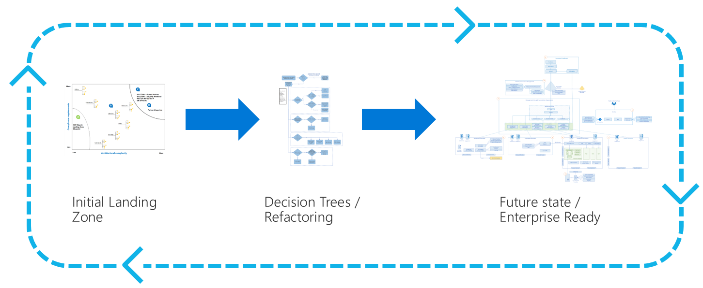
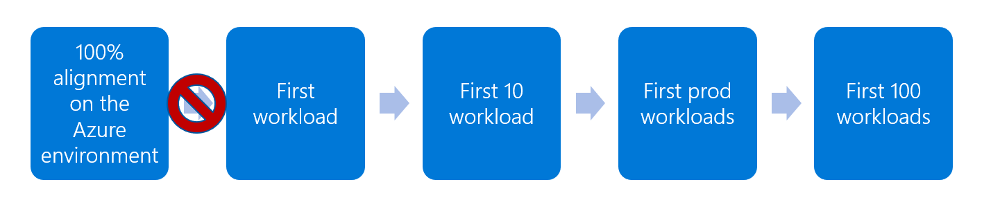
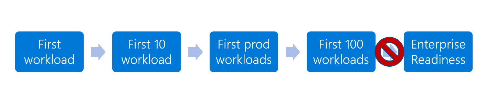
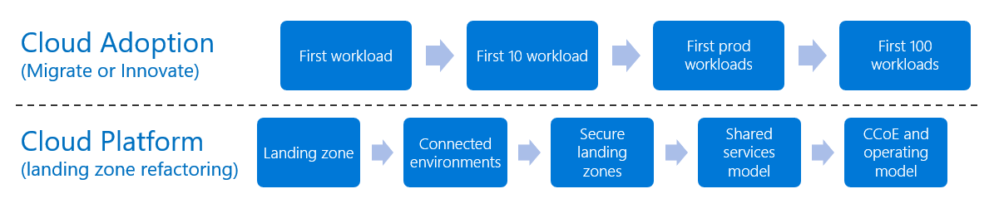
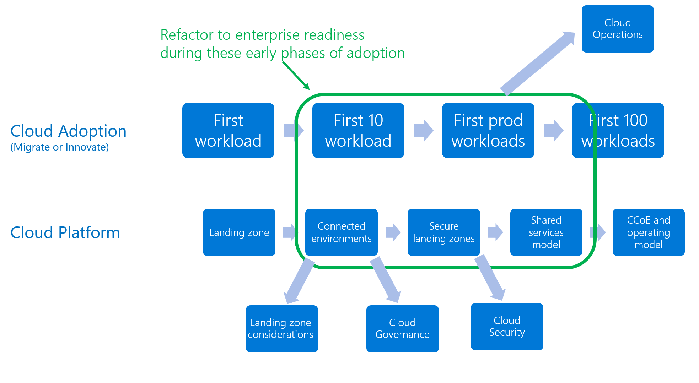

# Refactor landing zones

A landing zone is an environment for hosting your workloads that's **preprovisioned through code**. Since landing zone infrastructure is defined in code, it can be refactored similar to any other codebase. Refactoring is the process of modifying or restructuring source code to optimize the output of that code without changing its purpose or core function.

The Ready methodology uses the concept of refactoring to accelerate migration and remove common blockers. The steps in the ready overview discuss a process that starts with predefined landing zone template that aligns best with your hosting function. Then refactor or add to the source code to expand the landing zones ability to deliver that function through improved security, operations, or governance. The following image illustrates the concept of refactoring.

*Figure 1: Landing zone refactoring.*

## Common blockers

When customers adopt the cloud, landing zone considerations are the single most common blocker to adoption and cloud-related business results. Customers tend to lean towards one of the following two blockers. Various teams often lean towards one of these two blockers, resulting in cultural deadlocks that make adoption difficult.

Both of the primary blockers are rooted in one belief, the cloud environment and the existing datacenters should be at or near feature parity regarding operations, governance, and security. This is a wise long-term goal. But the pain comes from the delicate balance between the timing to achieve that goal and the speed required to deliver business results.

### Blocker: Acting too soon

It took years and significant effort to reach the current state of security governance and operations in the current datacenter. It also required observations, learning, and customization to meet the unique constraints of that environment. Replicating those same procedures and configurations will take time. Reaching complete feature parity may also result in an environment that underperforms in the cloud. This parity approach also commonly leads to significant unplanned overspending in the cloud environment. Don't try to apply current-state requirements to a future-state environment as an early stage gate. Such an approach rarely proves to be profitable.

*Figure 2: Acting too soon is a common blocker.*

In the image above, the customer has an objective of 100 workloads running in the cloud. To get there, the customer will likely deploy their first workload and then their first ten or so workloads before they're ready to release one of them to production. Eventually, they'll reach the objective of the adoption plan and have a robust portfolio in the cloud. But the red *X* in the image shows where customers commonly get stuck. Waiting for total alignment can delay the first workload by weeks, months, or even years.

### Blocker: Acting too late

On the other hand, acting too late can have significant long-term consequences on the success of the cloud adoption effort. If the team waits to reach feature parity until the adoption efforts are complete, they will encounter unnecessary roadblocks and require several escalations to keep the efforts on track.

*Figure 3: Acting too late is a common blocker.*

Similar to acting too soon, in this image, the customer waits too long to reach enterprise readiness across landing zones. By waiting too long, the customer will be constrained on the amount of refactoring and expansion they can do in the environment. Those constraints will limit their ability to drive continued success.

### Finding balance

To avoid these common blockers, we suggest an iterative approach based on well-structured cloud adoption plan, which maximizes learning opportunities and minimizes time to business success. Refactoring and parallel efforts are critical to this approach.

> [!WARNING]
> Adoption teams who have a mid-term objective (within 24 months) to **host more than 1,000 assets (applications, infrastructure, or data assets) in the cloud** are highly unlikely to be successful using a refactoring approach. The learning curve is too high and the timeline too tight to allow for organic approaches to skills attainment. A more complete starting point requiring less customization will be a better path to achieve your objectives. Your implementation partners will likely be able to guide you through a better approach.

The remainder of this article will focus on some key constraints that can empower a refactoring approach, while minimizing risk.

## Theory

The concept of refactoring a landing zone is simple, but execution requires proper guardrails. The concept shown above outlines the basic flow:

- When you're ready to build your first landing zone, start with an initial landing zone defined via a template.
- Once that landing zone is deployed, use the decision trees in the subsequent articles under the `Expand your landing zone` section of the table of contents to refactor and add to your initial landing zone.
- Repeat decision trees and refactoring until you have an enterprise-ready environment that meets the enhanced requirements of your security, operations, and governance teams.

## Development approach

The advantage of a refactoring-based approach, is the ability to create parallel iteration paths for development. The image below provides an example of two parallel iteration paths: cloud adoption and cloud platform. Both progress at their own pace, with minimal risk of becoming a blocker to either team's daily efforts. Alignment on the adoption plan and refactoring guardrails can lead to agreement about milestones and clarity about future-state dependencies.

*Figure 4: Landing zone parallel iteration.*

In the example iteration paths above, the cloud adoption team is migrating their portfolio of 100 workloads to the cloud. In parallel, the cloud platform team is focused on staying ahead of the cloud adoption plan to ensure the environment is prepared for those workloads.

In this example, the planned iterations run as follows:

- The cloud platform team starts the development efforts by deploying an initial landing zone. That landing zone allows the cloud adoption team to deploy and begin testing their first workload.
- To prepare for the cloud adoption team's next deployment of 10 workloads, the cloud platform team works ahead to refactor and add a connected environment, treating the cloud as a perimeter network.
- Before the adoption team can release their first production workload, the security team requires a security review. While the adoption team deploys their first 10 workloads, the platform team moves ahead to define and implement security requirements.
- By the time the first workload is released to production, both teams should have enough learnings to prepare for a longer term shared service model. Centralizing core service architectures will help align governance and operations team. Centralizing core services will help prepare the adoption team to scale and release the next several waves of production workloads.
- As the team approaches their goal of migrating 100 workloads, the team will natural begin to move towards more of a cloud center of excellence collaboration model and team structure.

Configuring an enterprise-ready environment will take time. This approach will not eliminate that requirement. Instead, this approach is designed to remove early blockers and create opportunities for the platform and adoption teams to learn together.

## Landing zone refactoring guardrails

All initial landing zone templates have limitations. Guardrails or policies during refactoring should reflect those limitations. Before beginning a landing zone refactoring process, it is important to understand the long-term requirements of the cloud adoption plan and classification of the candidate workloads, compared to the initial template limitations.

As an example of establishing refactoring guardrails, lets compare the development approach in the prior example and the CAF Migration landing zone blueprint.

- Per the [assumptions of the CAF Migration landing zone blueprint](./migrate-landing-zone.md#assumptions), this initial landing zone is not designed for sensitive data or mission-critical workloads. Those features will have to be added through refactoring.
- In this example, lets assume that the portfolio of 100 workloads will require both mission critical and sensitive data hosting capabilities.

To balance these two competing requirements, the adoption team and platform team will agree to and operate under the following conditions:

- The cloud adoption team will prioritize production workloads that don't have access to sensitive data and are not deemed mission critical.
- Prior to production release, the security and operations team will validate alignment to the prior policy.
- The cloud platform team will work with the security and governance teams to implement a security baseline. Once security approves the implementation, the adoption team will be cleared to migrate workloads that have access to some sensitive data.
- The cloud platform team will work with the operations team to implement a management baseline. Once the operations team approves the implementation, the adoption team will be cleared to migrate workloads with a higher level of criticality.

For this example, the above set of agreed upon conditions will allow the adoption team get started on their migration effort. It also helps the platform team shape their interactions with other teams, as they build towards a longer-term enterprise ready environment.

## Meeting long-term requirements while refactoring

The section of the Ready methodology on expanding your landing zone will aid in moving towards the longer term requirements. As the cloud adoption team progresses with their adoption plan, review [Expand your landing zone](../considerations/index.md) for guidance to help make decisions and refactor to meet the evolving requirements of various teams.

*Figure 5: Deeper methodologies assisting a parallel landing zone iteration.*

Each subsection of [expand your landing zone](../considerations/index.md) maps to one of the additions outlined in the image above. Beyond those basic expansions, the deeper methodologies (such as govern or manage) of this framework will aid in going beyond basic landing zone modifications to implement long-term disciplines.

## Next steps

To get started on a refactoring process, get started using [Azure landing zones](./index.md).

> [!div class="nextstepaction"]
> [Azure landing zones](./index.md)
