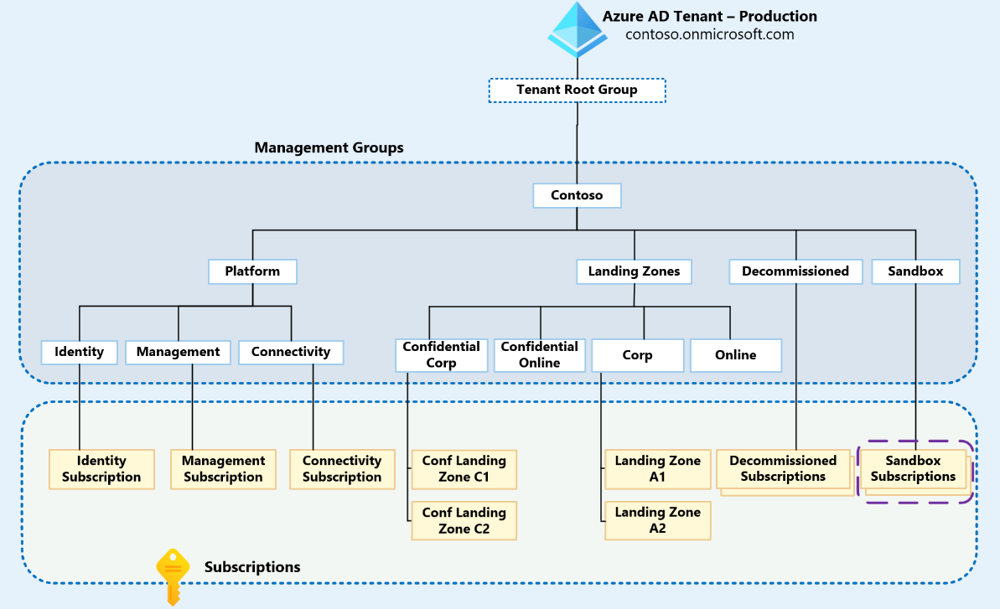

# Sovereignty considerations for Azure Landing Zones

## Microsoft Cloud for Sovereignty

Adopting cloud computing while meeting digital sovereignty requirements is complex and can differ greatly between organizations, industries, and geographies. [Microsoft Cloud for Sovereignty](https://aka.ms/MicrosoftCloudForSovereignty) addresses the sovereignty needs of government organizations by combining the power of the global Azure platform with several sovereignty capabilities that are designed to help mitigate sovereignty risks.

Microsoft Cloud for Sovereignty provides capabilities across different layers:

* Advanced sovereign control services like Azure Confidential Computing and Managed Hardware Security Module (HSM).
* Sovereign guardrails through codified architecture, workload accelerators, localized Azure Policy Initiatives, tooling, and guidance.
* Regulatory compliance and transparency into the cloud operator\'s activities.
* Built on top of the Azure public cloud capabilities.

Public sector customers with sovereignty needs that want to start using Azure can accelerate the definition and deployment of a sovereign environment using Microsoft Cloud for Sovereignty tools and guidelines, such as the Sovereign Landing Zone (Preview).

## Sovereign Landing Zone

The Sovereign Landing Zone (Preview) is an opinionated tailored variant of the [Azure Landing Zone architecture](./index.md/#azure-landing-zone-architecture) and is intended for organizations that need advanced sovereignty controls. A Sovereign Landing Zone (Preview) aligns Azure capabilities such as service residency, customer-managed keys, Azure Private Link, and confidential computing to create a cloud architecture where data and workloads default to encryption and protection from threats.

> [!NOTE]
> Microsoft Cloud for Sovereignty is oriented towards government organizations with sovereignty needs. Customers should carefully consider whether they need the Microsoft Cloud for Sovereignty capabilities, and only then consider adopting the Sovereign Landing Zone (Preview) architecture.

## Sovereign landing zone design area's

The Azure Landing Zone architecture consists of 8 design area's. Each design area describes what to consider before deploying a landing zone. The following sections will specifically describe the additional considerations when deploying the Sovereign Landing Zone (Preview)

### Resource organization

#### "Confidential" management groups

The Sovereign Landing Zone is a tailored version of the Azure Landing Zone conceptual architecture, and aligns to the guidance as outlined in [Tailor the Azure landing zone architecture - Cloud Adoption Framework \| Microsoft Learn](https://learn.microsoft.com/azure/cloud-adoption-framework/ready/landing-zone/tailoring-alz)

Building on the Azure Landing Zone architecture, from a management group organization perspective, "Confidential Corp" and "Confidential Online" management groups are added under the "Landing Zones" Management Group, and a set of specific policy initiatives, ie [Microsoft Cloud for Sovereignty Policy Baseline](./sovereign-landing-zone.md/#microsoft-cloud-for-sovereignty-policy-baseline), are applied that offer controls such as resource deployment location, resource deployment types, encryption, etc.

#### Microsoft Cloud for Sovereignty Policy Baseline

The Sovereign Landing Zone (Preview) comes with the Sovereignty Policy Baseline initiatives deployed, and enables other policy sets to be deployed within the Sovereign Landing Zone (Preview). This enables customers to add additional policies to be layered on top of a Sovereign Landing Zone (Preview), like for example ALZ Policies and policy sets that address control frameworks such as NIST 800-171 rev2 and Microsoft Cloud Security Benchmark.

The Sovereignty Policy Baseline consists of:

* Policies to enforce the use of confidential computing resources when workloads are deployed into the confidential management groups. These policies create a platform where workloads are protected at rest, in transit, and while in use, removing Microsoft from the trust chain.
* Location policies are also deployed by default to provide cloud admin control over where Azure resources can be deployed. 
* Key management is controlled by a FIPS 140-2 Level 3 validated HSM and enforced by policy.

The policies and opinions that the Sovereign Landing Zone (Preview) layers on top of the Azure Landing Zone creates a platform that is biased towards increased security and confidentiality by default.

For more information on the Sovereignty Policy Baseline initiative, review the documentation [Microsoft Cloud for Sovereignty policy portfolio \| Microsoft Learn](https://learn.microsoft.com/industry/sovereignty/policy-portfolio-baseline)

### Network topology and connectivity

#### Network traffic encryption

The Sovereign Landing Zone (Preview) focuses on operational control of data at rest, in transit, and in use. Customers should consider following best practices on network encryption as described in [Define network encryption requirements - Cloud Adoption Framework \| Microsoft Learn](https://learn.microsoft.com/azure/cloud-adoption-framework/ready/azure-best-practices/define-network-encryption-requirements)

#### Internet inbound and outbound connectivity

Similar to Azure Landing Zone deployments, The Sovereign Landing Zone deployment allows for parameterized deployment of Azure Firewall premium, for enabling DDoS protection, and for deploying a central Azure bastion infrastructure.

Customers should consult the best practices on internet inbound and outbound connectivity found [Plan for inbound and outbound internet connectivity - Cloud Adoption Framework \| Microsoft Learn](https://learn.microsoft.com/azure/cloud-adoption-framework/ready/azure-best-practices/plan-for-inbound-and-outbound-internet-connectivity) before enabling those features.

### Security

#### Azure Key Vault managed HSM

The Sovereign Landing Zone architecture leverages the use of confidential computing in the confidential landing zones. Azure Key Vault is a necessary service for deploying confidential computing resources. Customers are encouraged to consult the design considerations and recommendations found at [Encryption and key management in Azure - Cloud Adoption Framework \| Microsoft Learn](https://learn.microsoft.com/azure/cloud-adoption-framework/ready/landing-zone/design-area/encryption-and-keys), and may have to choose Azure Key Vault Managed HSM for compliancy requirements.

#### Azure Attestation

Customers using Azure confidential computing may want to leverage Azure Attestation by enabling guest attestation. The guest attestation feature helps to confirm that a confidential VM runs on a hardware-based trusted execution environment (TEE) with security features (isolation, integrity) enabled.

For more information enabling guest attestation, review the documentation [What is guest attestation for confidential VMs? \|  Microsoft Learn](https://learn.microsoft.com/azure/confidential-computing/guest-attestation-confidential-vms)

### Governance

#### Customer lockbox for Microsoft Azure

Most operations, support, and troubleshooting performed by Microsoft personnel and sub-processors do not require access to customer data. In those rare circumstances where such access is required, Customer Lockbox for Microsoft Azure provides an interface for customers to review and approve or reject customer data access requests. It is used in cases where a Microsoft engineer needs to access customer data, whether in response to a customer-initiated support ticket or a problem identified by Microsoft.

Consider enabling Customer Lockbox for Microsoft Azure. Note that enabling this option requires the Global Admin role. Further information on how to correctly setup RBAC for Customer Lockbox can be found in [Customer Lockbox for Microsoft Azure \| Microsoft Learn](https://learn.microsoft.com/azure/security/fundamentals/customer-lockbox-overview).

### Platform Automation and DevOps

#### Deployment options

The Sovereign Landing Zone (Preview) is available as a GitHub repository <https://github.com/Azure/sovereign-landing-zone-preview> and can be deployed as a whole or on a component per component basis, which allows for integration in a customer's existing deployment workflow. Deployment guidance is located [here](https://github.com/Azure/sovereign-landing-zone-preview/blob/main/docs/03-Deployment-Overview.md)

The deployed components are:

1. Bootstrap: Sets up the management group hierarchy and creates the subscriptions as dictated by the architecture of the Sovereign Landing Zone (Preview). This is deployed under the tenant root group of the Azure customer tenant.

2. Platform: Sets up the hub network and logging resources used by the Sovereign Landing Zone (Preview) platform and workloads.

3. Compliance: Creates and assigns the default policy sets, and provided custom policies, enforced in the environment.

4. Dashboard: Provides customers with a visual representation of their resource compliance.

#### Compliance dashboard

As part of the Sovereign Landing Zone (Preview) deployment, a compliance dashboard will be deployed to help customers validate the Sovereign Landing Zone (Preview) against their requirements and local laws and regulations. Customers can get insight into resource level compliance against the baseline policies deployed with the Sovereign Landing Zone (Preview) as well as additional custom compliance that has been deployed. The compliance dashboard documentation can be found in the documenation section in the GitHub repository.