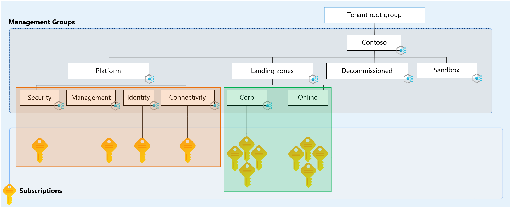
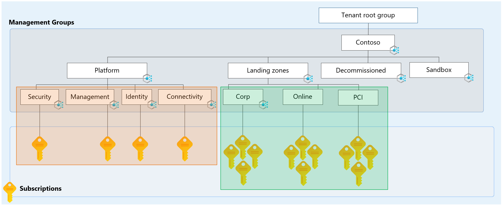

# Tailor the Azure landing zone architecture to meet requirements

As part of the Azure landing zone guidance, several reference [implementation options](../enterprise-scale/implementation.md) are available:

- Azure landing zone with Azure Virtual WAN
- Azure landing zone with traditional hub and spoke
- Azure landing zone foundation
- Azure landing zone for small enterprises

These options can help your organization get started quickly by using configurations that deliver the Azure landing zone conceptual architecture and best practices in the design areas.

The reference implementations are based on the best practices and learnings of Microsoft teams from engagements with customers and partners. This knowledge represents the "80" side of the 80/20 rule. The various implementations take positions on technical decisions that are part of the architecture design process.

Because not all use cases are the same, not all organizations can use an implementation approach in the exact way it was intended. You need to understand the considerations when a requirement for tailoring is identified.

## What is a landing zone archetype in Azure landing zones?

A *landing zone archetype* describes what needs to be true to ensure a landing zone (Azure subscription) meets the expected environment and compliance requirements at a specific scope. Examples include:

- Azure Policy assignments.
- Role-based access control (RBAC) assignments.
- Centrally managed resources such as networking.

Consider each management group in the resource hierarchy as contributing to the final landing zone archetype output because of the way policy inheritance works in Azure. Think about what's applied at the upper levels in the resource hierarchy when you design the lower levels.

There's a close relationship between management groups and landing zone archetypes, but a management group alone isn't a landing zone archetype. Instead, it forms part of the framework that's used to implement each of the landing zone archetypes in your environment.

You can see this relationship in the Azure landing zone conceptual architecture. Policy assignments are created at the intermediate root management group, for example *Contoso*, for settings that must apply to all workloads. More policy assignments are created at lower levels of the hierarchy for more specific requirements.

Subscription placement within the management group hierarchy determines the resultant set of Azure Policy and access control (IAM) assignments that are inherited, applied, and enforced to that particular landing zone (Azure subscription).

More processes and tooling might be required to ensure a landing zone has the required centrally managed resources. Some examples include:

- Diagnostic settings to send activity log data to a Log Analytics workspace.
- Continuous export settings for Microsoft Defender for Cloud.
- Virtual network with managed IP address spaces for application workloads.
- Linking of virtual networks to a distributed denial of service (DDoS) Network Protection.

> [!NOTE]
> In the Azure landing zone reference implementations, Azure policies with the `DeployIfNotExists` and `Modify` [effects](/azure/governance/policy/concepts/effects) are used to achieve the deployment of some of the preceding resources. They follow the [policy-driven governance](./design-principles.md#policy-driven-governance) design principle.
>
> For more information, see [Adopt policy-driven guardrails](../enterprise-scale/dine-guidance.md).

## Built-in archetypes for the Azure landing zone conceptual architecture

The conceptual architecture includes example landing zone archetypes for application workloads such as *corp* and *online*. These archetypes might apply to your organization and meet your requirements. You might want to make changes to these archetypes or create new ones. Your decision depends on your organization's needs and requirements.

> [!TIP]
> To review the landing zone archetypes in the Azure landing zone accelerator, see [Management groups in the Azure landing zone accelerator](./design-area/resource-org-management-groups.md).

You might also want to create changes elsewhere in the resource hierarchy. When you plan the hierarchy for your implementation of Azure landing zones for your organization, follow the guidelines in the [design areas](./design-areas.md).

The following landing zone archetype examples from the conceptual architecture help you to understand their purpose and intended use:

| Landing zone archetype (management group) | Purpose or use                                                                                                                                                                                                                                                          |
| ----------------------------------------- | ---------------------------------------------------------------------------------------------------------------------------------------------------------------------------------------------------------------------------------------------------------------------- |
| Corp                                      | The dedicated management group for corporate landing zones. This group is for workloads that require connectivity or hybrid connectivity with the corporate network via the hub in the connectivity subscription. |
| Online                                    | The dedicated management group for online landing zones. This group is for workloads that might require direct internet inbound/outbound connectivity or for workloads that might not require a virtual network.     |
| Sandbox | The dedicated management group for subscriptions that will only be used for testing and exploration by an organization. These subscriptions will be securely disconnected from the corporate and online landing zones. Sandboxes also have a less restrictive set of policies assigned to enable testing, exploration, and configuration of Azure services. |

## Scenarios where tailoring might be required

As mentioned, we provide common landing zone archetypes in [Azure landing zone conceptual architecture](./index.md#azure-landing-zone-architecture). They are *corp* and *online*. These archetypes aren't fixed and aren't the only permitted landing zone archetypes for application workloads. You might need to tailor landing zone archetypes to suit your needs and requirements.

Before you tailor landing zone archetypes, it's important to understand the concepts and also visualize the area of the hierarchy that we suggest you customize. The following diagram shows the default hierarchy of the Azure landing zone conceptual architecture.

Two areas of the hierarchy are highlighted. One is underneath **Landing Zones**, and the other is underneath **Platform**.

### Tailor application landing zone archetypes

Notice the area highlighted in blue underneath the **Landing Zones** management group. It's the *most common and safest place* in the hierarchy to add more archetypes to meet new or more requirements that can't be added as more policy assignments to an existing archetype by using the existing hierarchy.

For example, you might have a new requirement to host a set of application workloads that need to meet payment card industry (PCI) compliance requirements. But this new requirement doesn't need to apply to all workloads across your entire estate.

There's a simple and safe way to meet this new requirement. Create a new management group called **PCI** underneath the **Landing Zones** management group in the hierarchy. You can assign more policies like the [Microsoft Defender for Cloud regulatory compliance](/azure/defender-for-cloud/update-regulatory-compliance-packages) policy initiative for [PCI v3.2.1:2018](/azure/governance/policy/samples/built-in-initiatives#regulatory-compliance) to the new **PCI** management group. This action forms a new archetype.

Now you can place new or move existing Azure subscriptions into the new **PCI** management group to make it inherit the required policies and form the new archetype.

Another example is [Microsoft Cloud for Sovereignty](/industry/sovereignty/cloud-for-sovereignty), which adds management groups for confidential compute and is aligned for use in regulated industries. [Microsoft Cloud for Sovereignty](/industry/sovereignty/cloud-for-sovereignty) provides tools, guidance, and guardrails for public cloud adoption with appropriate sovereignty controls.

> [!TIP]
> You need to know what to consider and what happens when you move Azure subscriptions between management groups in relation to RBAC and Azure Policy. For more information, see [Transition existing Azure environments to the Azure landing zone conceptual architecture](../enterprise-scale/transition.md#move-subscriptions).

### Tailor platform landing zone archetypes

You might also want to tailor the area highlighted in orange underneath the **Platform** management group. The zones in this area are known as *platform landing zones*.

For example, you might have a dedicated SOC team that requires its own archetype to host its workloads. These workloads need to meet Azure Policy and RBAC assignment requirements different from those of the **Management** management group. 

Create a new **Security** management group underneath the **Platform** management group in the hierarchy. You can assign the required Azure Policy and RBAC assignments to it.

Now you can place new or move existing Azure subscriptions into the new **Security** management group to make it inherit the required policies and form the new archetype.

### Example of a tailored Azure landing zone hierarchy

The following diagram shows a tailored Azure landing zone hierarchy. It uses examples from the preceding diagram.

## Points to consider

Consider the following points when you think about tailoring your implementation of Azure landing zone archetypes in the hierarchy:

- Tailoring the hierarchy isn't mandatory. The default archetypes and hierarchy we provide are suitable for most scenarios.
- Don't re-create your organizational hierarchy, teams, or departments in archetypes.
- Always try to build on the existing archetypes and hierarchy to meet new requirements.
- Only create new archetypes when they're truly needed.
  
  For example, a new compliance requirement like PCI is required for only a subset of application workloads and doesn't need to apply to all workloads.
- Only create new archetypes in the highlighted areas shown in the preceding diagrams.
- Avoid going beyond a hierarchy depth of **four** layers to avoid complexity and unnecessary exclusions. Expand archetypes horizontally instead of vertically in the hierarchy.
- Don't create archetypes for environments like development, test, and production.
  
  For more information, see [How do we handle dev/test/production workload landing zones in the Azure landing zones conceptual architecture?](../enterprise-scale/faq.md#how-do-we-handle-devtestproduction-workload-landing-zones-in-azure-landing-zone-architecture)
- If coming from a brownfield environment or are looking for an approach to host subscriptions in the Landing Zones Management Group with policies in an "audit only" enforcement mode, review [Scenario: Transition an environment by duplicating a landing zone management group](/azure/cloud-adoption-framework/ready/landing-zone/align-approach-duplicate-brownfield-audit-only)
