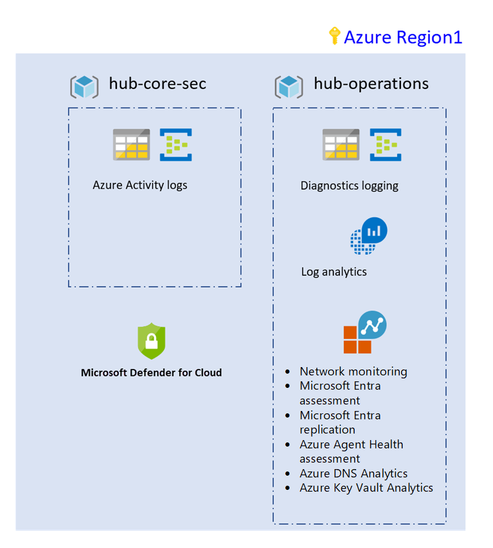

<!-- cSpell:ignore eastasia southeastasia vCPUs lalogs tfvars NetworkMonitoring ADAssessment ADReplication AgentHealthAssessment DnsAnalytics KeyVaultAnalytics -->

# Use Terraform to build your landing zones

Azure provides native services for deploying your landing zones. Other third-party tools can also help with this effort. One such tool that customers and partners often use to deploy landing zones is Terraform by HashiCorp. This section shows how to use a sample landing zone to deploy foundational governance, accounting, and security capabilities for an Azure subscription.

## Purpose of the landing zone

The Cloud Adoption Framework foundations landing zone for Terraform provides features to enforce logging, accounting, and security. This landing zone uses standard components known as Terraform modules to enforce consistency across resources deployed in the environment.

## Use standard modules

Reuse of components is a fundamental principle of infrastructure as code. Modules are instrumental in defining standards and consistency across resource deployment within and across environments. The modules used to deploy this first landing zone are available in the official [Terraform registry](https://registry.terraform.io/modules/aztfmod).

## Architecture diagram

The first landing zone deploys the following components in your subscription:


*Figure 1: A foundation landing zone using Terraform.*

<!-- docutune:casing NetworkMonitoring AdAssessment AdReplication AgentHealthAssessment DnsAnalytics KeyVaultAnalytics -->

## Capabilities

The components deployed and their purpose include the following:

| Component | Responsibility |
|---|---|
| Resource groups | Core resource groups needed for the foundation |
| Activity logging | Auditing all subscription activities and archiving: <li> Storage account <li> Azure Event Hubs |
| Diagnostics logging | All operation logs kept for a specific number of days: <li> Storage account <li> Event Hubs |
| Log Analytics | Stores the operation logs. Deploy common solutions for deep application best practices review: <li> NetworkMonitoring <li> AdAssessment <li> AdReplication <li> AgentHealthAssessment <li> DnsAnalytics <li> KeyVaultAnalytics |
| Azure Security Center | Security hygiene metrics and alerts sent to email and phone number |

## Use this blueprint

Before you use the Cloud Adoption Framework foundation landing zone, review the following assumptions, decisions, and implementation guidance.

## Assumptions

The following assumptions or constraints were considered when this initial landing zone was defined. If these assumptions align with your constraints, you can use the blueprint to create your first landing zone. The blueprint also can be extended to create a landing zone blueprint that meets your unique constraints.

- **Subscription limits:** This adoption effort is unlikely to exceed [subscription limits](/azure/azure-resource-manager/management/azure-subscription-service-limits). Two common indicators are an excess of 25,000 VMs or 10,000 vCPUs.
- **Compliance:** No third-party compliance requirements are needed for this landing zone.
- **Architectural complexity:** Architectural complexity doesn't require additional production subscriptions.
- **Shared services:** No existing shared services in Azure require this subscription to be treated like a spoke in a hub and spoke architecture.

If these assumptions match your current environment, this blueprint might be a good way to start building your landing zone.

## Design decisions

The following decisions are represented in the CAF Terraform modules:

| Component              | Decisions                                                                                                                                                                                                                                                                | Alternative approaches                                                                                                                                                                                                                                          |
|------------------------|--------------------------------------------------------------------------------------------------------------------------------------------------------------------------------------------------------------------------------------------------------------------------|-----------------------------------------------------------------------------------------------------------------------------------------------------------------------------------------------------------------------------------------------------------------|
| Logging and monitoring | Azure Monitor Log Analytics workspace is used. A diagnostics storage account as well as event hub is provisioned.                                                                                                                                                        |                                                                                                                                                                                                                                                                 |
| Network                | N/A - network is implemented in another landing zone.                                                                                                                                                                                                                    | [Networking decisions](../considerations/networking-options.md)                                                                                                                                                                                                 |
| Identity               | It's assumed that the subscription is already associated with an Azure Active Directory instance.                                                                                                                                                                        | [Identity management best practices](/azure/security/fundamentals/identity-management-best-practices)                                                                                                                               |
| Policy                 | This landing zone currently assumes that no Azure policies are to be applied.                                                                                                                                                                                            |                                                                                                                                                                                                                                                                 |
| Subscription design    | N/A - designed for a single production subscription.                                                                                                                                                                                                                     | [Create initial subscriptions](../azure-best-practices/initial-subscriptions.md)                                                                                                                                                                                  |
| Resource groups        | N/A - designed for a single production subscription.                                                                                                                                                                                                                     | [Scale subscriptions](../azure-best-practices/scale-subscriptions.md)                                                                                                                                                                                           |
| Management groups      | N/A - designed for a single production subscription.                                                                                                                                                                                                                     | [Organize subscriptions](../azure-best-practices/organize-subscriptions.md)                                                                                                                                                                                     |
| Data                   | N/A                                                                                                                                                                                                                                                                      | [Choose the correct SQL Server option in Azure](/azure/sql-database/sql-database-paas-vs-sql-server-iaas) and [Azure data store guidance](/azure/architecture/guide/technology-choices/data-store-overview) |
| Storage                | N/A                                                                                                                                                                                                                                                                      | [Azure Storage guidance](../considerations/storage-options.md)                                                                                                                                                                                                  |
| Naming standards       | When the environment is created, a unique prefix is also created. Resources that require a globally unique name (such as storage accounts) use this prefix. The custom name is appended with a random suffix. Tag usage is mandated as described in the following table. | [Naming and tagging best practices](../azure-best-practices/naming-and-tagging.md)                                                                                                                                                                              |
| Cost management        | N/A                                                                                                                                                                                                                                                                      | [Tracking costs](../azure-best-practices/track-costs.md)                                                                                                                                                                                                        |
| Compute                | N/A                                                                                                                                                                                                                                                                      | [Compute options](../considerations/compute-options.md)                                                                                                                                                                                                         |

### Tagging standards

The minimum set of tags shown below must be present on all resources and resource groups:

<!-- TODO: Review capitalization and hyphenation -->
<!-- TODO: Eliminate either "Tag name" or "Key" column -->

| Tag name          | Description                                                                                        | Key               | Example values                                    |
|-------------------|----------------------------------------------------------------------------------------------------|-------------------|--------------------------------------------------|
| Business unit     | Top-level division of your company that owns the subscription or workload the resource belongs to. | `BusinessUnit`    | `finance`, `marketing`, `<product-name>`, `corp`, `shared` |
| Cost center       | Accounting cost center associated with this resource.                                              | `CostCenter`      | `<cost-center-number>`                                     |
| Disaster recovery | Business criticality of the application, workload, or service.                                     | `DR`              | `dr-enabled`, `non-dr-enabled`                   |
| Environment       | Deployment environment of the application, workload, or service.                                   | `Env`             | `prod`, `dev`, `qa`, `staging`, `test`, `training` |
| Owner name        | Owner of the application, workload, or service.                                                    | `Owner`           | `email`                                            |
| Deployment type   | Defines how the resources are being maintained.                                                    | `DeploymentType`  | `manual`, `terraform`                                |
| Version           | Version of the blueprint deployed.                                                                 | `Version`         | `v0.1`                                             |
| Application name  | Name of the associated application, service, or workload associated with the resource.             | `ApplicationName` | `<app-name>`                                       |

## Customize and deploy your first landing zone

You can [clone your Terraform foundation landing zone](https://github.com/azure/caf-terraform-landingzones). Get started easily with the landing zone by modifying the Terraform variables. In our example, we use **blueprint_foundations.sandbox.auto.tfvars**, so Terraform automatically sets the values in this file for you.

Let's look at the different variable sections.

In this first object, we create two resource groups in the `southeastasia` region named `-hub-core-sec` and `-hub-operations` along with a prefix added at runtime.

```hcl
resource_groups_hub = {
    HUB-CORE-SEC    = {
        name = "-hub-core-sec"
        location = "southeastasia"
    }
    HUB-OPERATIONS  = {
        name = "-hub-operations"
        location = "southeastasia"
    }
}
```

Next, we specify the regions where we can set the foundations. Here, `southeastasia` is used to deploy all the resources.

```hcl
location_map = {
    region1   = "southeastasia"
    region2   = "eastasia"
}
```

Then, we specify the retention period for the operations logs and the Azure subscription logs. This data is stored in separate storage accounts and an event hub, whose names are randomly generated because they must be unique.

```hcl
azure_activity_logs_retention = 365
azure_diagnostics_logs_retention = 60
```

Into the tags_hub, we specify the minimum set of tags that are applied to all resources created.

```hcl
tags_hub = {
    environment     = "DEV"
    owner           = "Arnaud"
    deploymentType  = "Terraform"
    costCenter      = "65182"
    BusinessUnit    = "SHARED"
    DR              = "NON-DR-ENABLED"
}
```

Then, we specify the Log Analytics name and a set of solutions that analyze the deployment. Here, we retained network monitoring, Active Directory assessment and replication, DNS Analytics, and Key Vault analytics.

```hcl

analytics_workspace_name = "lalogs"

solution_plan_map = {
    NetworkMonitoring = {
        "publisher" = "Microsoft"
        "product"   = "OMSGallery/NetworkMonitoring"
    },
    ADAssessment = {
        "publisher" = "Microsoft"
        "product"   = "OMSGallery/ADAssessment"
    },
    ADReplication = {
        "publisher" = "Microsoft"
        "product"   = "OMSGallery/ADReplication"
    },
    AgentHealthAssessment = {
        "publisher" = "Microsoft"
        "product"   = "OMSGallery/AgentHealthAssessment"
    },
    DnsAnalytics = {
        "publisher" = "Microsoft"
        "product"   = "OMSGallery/DnsAnalytics"
    },
    KeyVaultAnalytics = {
        "publisher" = "Microsoft"
        "product"   = "OMSGallery/KeyVaultAnalytics"
    }
}

```

Next, we configured the alert parameters for Azure Security Center.

```hcl
# Azure Security Center Configuration
security_center = {
    contact_email   = "joe@contoso.com"
    contact_phone   = "+6500000000"
}
```

## Take action

After you've reviewed the configuration, you can deploy the configuration as you would deploy a Terraform environment. We recommend that you use the rover, which is a Docker container that allows deployment from Windows, Linux, or macOS. You can get started with the [landing zones](https://github.com/azure/caf-terraform-landingzones).

## Next steps

The foundation landing zone lays the groundwork for a complex environment in a decomposed manner. This edition provides a set of simple capabilities that can be extended by adding other modules to the blueprint or layering additional landing zones on top of it.

Layering your landing zones is a good practice for decoupling systems, versioning each component that you're using, and allowing fast innovation and stability for your infrastructure as code deployment.

Future reference architectures will demonstrate this concept for a hub and spoke topology.

> [!div class="nextstepaction"]
> [Review the sample foundation Terraform landing zone](https://github.com/azure/caf-terraform-landingzones)
