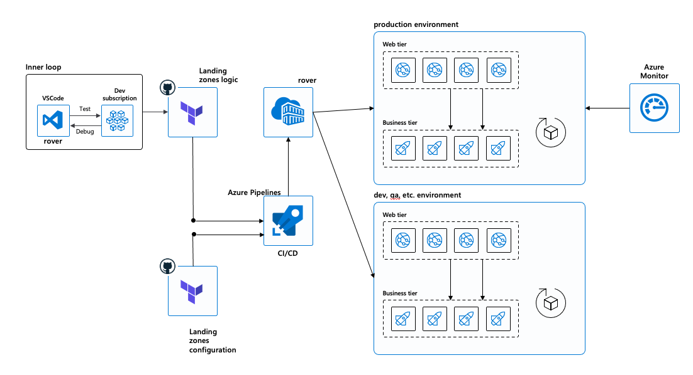
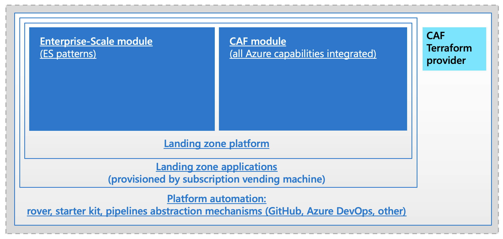

<!-- cSpell:ignore eastasia southeastasia vCPUs lalogs tfvars NetworkMonitoring ADAssessment ADReplication AgentHealthAssessment DnsAnalytics KeyVaultAnalytics -->

# Cloud Adoption Framework Terraform landing zones

> [!NOTE]
> This article describes one of two ways to implement landing zones on Azure by using Terraform. For guidance on choosing the right approach, see [this article](deploy-landing-zones-with-terraform.md).

Azure provides multiple native services for deploying your landing zones. Other tools can also help with this effort. One tool that customers and partners often use to deploy landing zones is Terraform by HashiCorp.

This article illustrates a methodology that some customers use for Terraform on Azure to run complex infrastructure as code (IaC) projects. To some extent, it can be called "everything as code." 

To help you take action, you can use public open-source artifacts where the community builds on GitHub. Those components are curated by experts and the community. They're published and verified on the HashiCorp registry. They can help you put DevOps to work and advance the operating model of your organization toward a site reliability engineering (SRE) model.

The following video is a good introduction to Cloud Adoption Framework Terraform landing zones.

<!-- markdownlint-disable MD034 -->

> [!VIDEO https://channel9.msdn.com/Shows/Azure-Enablement/Deploying-Azure-Landing-Zones-using-Terraform/player]

<!-- markdownlint-enable MD034 -->

## Key concepts

Before you deploy any component on an Azure subscription, you need to understand a few key concepts to be successful with Terraform on Azure.

### Start with DevOps

The Terraform experience starts with one individual on a laptop. But it's likely that you'll work in a team and adopt DevOps and GitOps concepts to realize benefits such as continuous integration and continuous delivery (CI/CD), more reliability, and predictability on your deployments.

On the journey, you'll realize that disruption can happen between the local experience (it works on the developer's laptop) and the pipelines. If there's too much difference between the two environments, you'll likely spend much time troubleshooting issues that are related to this dichotomy and lose focus on delivering value.

Another common caveat is the difficulty of having a consistent development or running environment for the various developers. Terraform is always evolving, so make sure that all your developers are running the right versions. You also need some code excellence tools, like pre-commit validation hooks to avoid committing wrong things in a repository, static code analysis tools, and plan-phase compliance tools. 

DevOps is not achieved by a single tool. Your running environment might include more tools, like jq, the Azure CLI, PowerShell, PowerShell DSC, Ansible, Chef, and Puppet.

The following diagram shows an overview of a developer environment, including an inner feedback loop with pipelines.

For all of those reasons, we recommend the use of containers on the developer's machine and in the pipelines. The Cloud Adoption Framework serves this purpose. All GitHub repositories for the Cloud Adoption Framework have a `.devcontainer` folder that includes a reference to a container (Rover) for the recommended runtime environment.

>[!TIP]
>Although Rover is useful, it's not mandatory. You can use any Cloud Adoption Framework Terraform component separately.

### Organize the Terraform state files for the enterprise

When you're working with Terraform in a team of DevOps engineers and with pipelines, you need to share the Terraform state files. Many organizations struggle to find the right level of state management. Although customers can use solutions like Terraform Cloud or Terraform Enterprise from HashiCorp, the Cloud Adoption Framework also comes with a structured approach based on Azure storage accounts to achieve those objectives.

In the model proposed by Cloud Adoption Framework Terraform landing zones, you can observe the composability where a state file from one level down can be read but can't be changed. This model allows you to:

- Manage multiple state files to segregate levels of privileges.
- Compose the environment with independent pipelines. 

The DevOps toolset provides mechanisms to deploy those levels, along with reading and composing from different levels.

### Innovate faster with inner sourcing

When DevOps teams start working with Terraform, they tend to spend a large amount of time curating their own artifacts. Over time and with experience, those teams start defining a set of common engineering criteria.

In essence, having one code for the module and multiple configuration files used across the organization can centralize the quality of the engineering. Having the common engineering criteria enumerated will encourage community involvement (internal business users, or public contributors for the Cloud Adoption Framework module). The more people use the module, contribute to it, and test it, the more quality you'll have.

This core concept applies for all areas of your environment. By taking advantage of published modules, landing zones, and solution accelerators for application landing zones, you can use the community to increase the velocity of innovation in the enterprise. You can use those components from the community and contribute directly (or fork the public components in your private Git repositories) to validate them. Then, you can periodically resync with the public (upstream) repository, to get the latest innovations or to contribute back to the community.

## Empowering the site reliability engineer

Cloud Adoption Framework Terraform landing zones split multiple functions across components. That level of decomposition and decorrelation might be confusing at the beginning. But it maximizes flexibility and reusability of the components, if any of the following cases apply to you: 

- You're using the complete Cloud Adoption Framework Terraform landing zones.
- You want to use the well-tested Cloud Adoption Framework module in your own pipelines or in Terraform Cloud.
- You want to benefit from the Cloud Adoption Framework naming provider inside your own enterprise-grown modules.

The following diagram shows an overview of the SRE components that Cloud Adoption Framework Terraform landing zones provide.

The following sections describe the components.

### Cloud Adoption Framework supermodule

Customers often create their own Terraform modules in their own private repositories. Finding the right balance of what components should be inside a single module can be a time-consuming task. 

As part of Microsoft engagements with customers, the Cloud Adoption Framework took advantage of Terraform 0.13 to include a supermodule, which is similar to the concept of a superapp. The supermodule allows you to create configuration files for any Azure components while focusing on one tested logic. By using a single module, you can easily compose across all components inside the module. For example, you can describe a virtual machine and how it's linked to a virtual network, along with a key vault.

The core concept of the module is to compose an environment based on Terraform configuration files instead of writing ad hoc code for each component. It promotes infrastructure as data in favor of infrastructure as code, to make composition more accessible and rely on a strong community to write code.

By using this module, you can:

- Accelerate innovation with the community. Many users contribute to the module across the world, have tested it, and are using it in production. So your DevOps teams can focus on delivering value instead of coding and testing a module.
- Compose across all the Azure components to quickly create new architectures.

The Cloud Adoption Framework Terraform module is verified by HashiCorp and is in the [HashiCorp Terraform Registry](https://registry.terraform.io/modules/aztfmod). You can contribute to the module on [GitHub](https://github.com/aztfmod/terraform-azurerm-caf).

> [!NOTE]
> Although the module is part of the solution of Cloud Adoption Framework landing zones, you can use it as a standalone module directly from the Terraform Registry or from pipelines. For more information, see the [HashiCorp blog post](https://www.hashicorp.com/blog/go-big-or-go-small-building-in-azure-caf-with-terraform-cloud).

### Cloud Adoption Framework provider

The Cloud Adoption Framework provider helps you manage naming conventions, whether you're relying on Cloud Adoption Framework recommendations or using your own naming conventions.

The provider allows you to go faster from integration to production. While you're running in test mode, it generates names randomly. This function is useful for test resources in which names need to be unique. When you're ready to deploy to production, you select pass-through mode to use your own name (after cleaning the name based on the allowed character set for each Azure resource).

The Cloud Adoption Framework provider is verified by HashiCorp and is in the [HashiCorp Terraform Registry](https://registry.terraform.io/providers/aztfmod/azurecaf/latest). You can contribute to it on [GitHub](https://github.com/aztfmod/terraform-azurerm-caf).

### Rover

Although as a first approach it might seem more natural and simple to use Terraform on your laptop, Rover in the Cloud Adoption Framework helps you manage your enterprise Terraform deployments on Azure. It has two parts:

- **Docker container**:
  - Allows a consistent developer experience on PC, Mac, and Linux, including the right tools, Git hooks, and DevOps tools.
  - Natively integrates with [Visual Studio Code](https://code.visualstudio.com/docs/remote/containers) and [GitHub Codespaces](https://github.com/features/codespaces).
  - Contains the versioned toolset that you need for applying landing zones.
  - Helps you switch component versions fast by separating the run environment and the configuration environment.
  - Ensures pipeline ubiquity and abstraction. You can run the rover everywhere, whichever pipeline technology you're using.

- **Terraform wrapper**:
  - Helps you store and retrieve Terraform state files transparently on an Azure storage account.
  - Facilitates the transition to CI/CD.
  - Enables a seamless experience (with elements like state connection and execution traces) locally and inside pipelines.

Using Rover has the following advantages:

- Simplifies setup and configuration across DevOps teams. Everyone works with the same versions of the tools.
- Abstracts and helps with Terraform state management.
- Helps preserve stability across component versions.
- Helps in testing different versions of binaries (for example, new versions of Terraform, the Azure CLI, jq, and TFLint).
- Facilitates the identity transition to any CI/CD pipeline. All CI/CD pipelines have container capabilities.
- Allows easy transition from one DevOps environment to another (for example, GitHub Actions, Azure DevOps, Jenkins, and CircleCI).

Rover is an open-source project. You can use it directly from [Docker Hub](https://hub.docker.com/search?q=aztfmod&type=image), or create your own to match your organization's own DevOps toolkit. You can find the Rover project on [GitHub](https://github.com/aztfmod/rover).

### Azure landing zone module

You can use the Azure landing zones Terraform module to deploy the management groups and policy recommendations for the enterprise-scale critical design area. This module is available from the [Terraform Registry](https://registry.terraform.io/modules/Azure/caf-enterprise-scale/azurerm/latest).

The configuration of the enterprise-scale module, through either the default parameters or a highly customized environment for management groups and policies, is left to the implementation phase to map the needs of each organization.

### Landing zones

In the Cloud Adoption Framework, a landing zone is a set of resources that share a Terraform state and that deliver an environment.

In addition to *core platform* and *application* landing zones, a special landing zone called *launchpad* acts as your DevOps foundation. Launchpad deploys:

- Storage accounts to deploy the Terraform state files.
- Key vaults that define the storage of secrets for the Terraform state.

Most of the time, unless you're a core Cloud Adoption Framework contributor, you don't need to worry about the logic of landing zones. You just consume it from the repository and customize it with variables. If you want to review the details, you can find them on [GitHub](https://github.com/Azure/caf-terraform-landingzones).

### Starter project

The starter project is a template for your configuration repository for your IaC. Its purpose is to show you an example of configuration files that deploy a complete environment.

You can find the starter project on [GitHub](https://github.com/Azure/caf-terraform-landingzones-platform-starter).

## Next steps

> [!div class="nextstepaction"]
> [Start deploying landing zones](https://aka.ms/caf/terraform)
