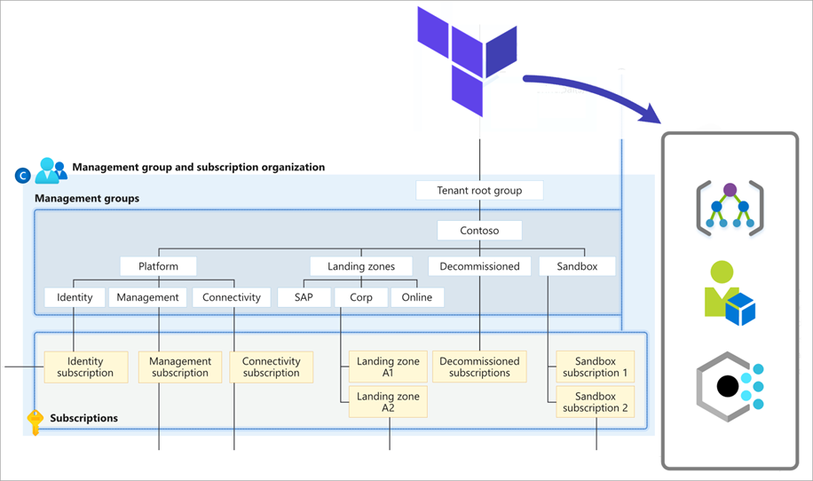
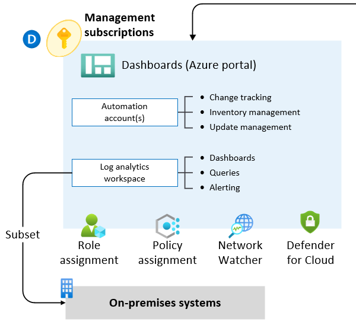
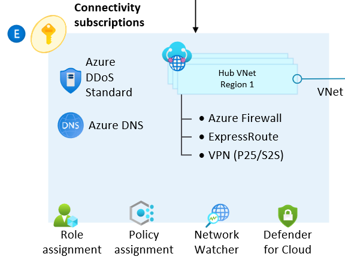
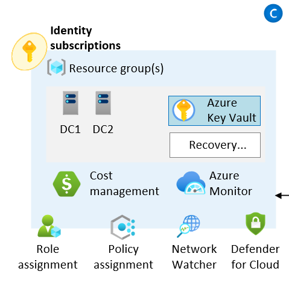

# Terraform module for Azure landing zones

The [Terraform Module for Cloud Adoption Framework Enterprise-scale][caf-enterprise-scale] provides a rapid implementation of the platform resources that you need to manage [Azure landing zones][msdocs-alz-architecture] at scale by using Terraform.

> [!NOTE]
> This article describes one of two ways to implement landing zones on Azure by using Terraform. For guidance on choosing the right approach, see [this article](deploy-landing-zones-with-terraform.md).

## Prerequisites

If you're new to Terraform and you want information about installing and using it, see the [Install Terraform][tf-install] tutorial on HashiCorp Learn.

For information on how to set up the Terraform provider and authenticate with Azure, see the [azurerm provider guides][azurerm-auth] on the Terraform website. To learn how to set up the provider for deploying across multiple subscriptions, see the [Provider Configuration][wiki_provider_configuration] wiki page.

## Importance of using standard modules

Reuse of components is a fundamental principle of infrastructure as code.
Modules are instrumental in defining standards and consistency across resource deployment within and across environments.

The Terraform module for Azure landing zones is published to the official [Terraform Registry][tf-reg-azure] and is verified by HashiCorp.

Deploying the module from the Terraform Registry provides:

- An accelerated delivery of Azure landing zones in your environment.
- A tested upgrade path to the latest version of Azure landing zones Terraform module, along with strict version control.

## Benefits of using the module

Benefits of using the Terraform module for Azure landing zones include:

- A managed and extensible core resource hierarchy for subscription organization through management groups.
- Scalable security governance and compliance through Azure identity and access management (IAM) controls, with an extensive library of custom definitions ready to assign.
- Enforcement of policy across subscriptions through management group inheritance.
- Managed resources for management and connectivity landing zones. These resources provide:
  - Assured policy compliance through tight integration of resources managed by the module and corresponding policy assignments.
  - Integration between resources to reduce management overhead and provide an improved user experience, like automatic creation of virtual network links for Azure Private DNS.

> [!TIP]
> The template library is updated programmatically from the [Azure/Enterprise-Scale][gh-es] GitHub repository. To stay up to date with the latest archetype configuration, policies, and roles, make sure you're using the latest version of the module.

## Resource deployment

You can configure the module to deploy sets of resources that align with critical design areas in Azure landing zones. Customize these resources to meet the requirements of your organization.

| Resource category | Critical design area |
| --- | --- |
| Core resources | [Resource organization][alz-resourceorg]</br>[Security][alz-security]</br> [Governance][alz-governance] |
| Management resources | [Management and monitoring][alz-management] |
| Connectivity resources | [Network topology and connectivity][alz-connectivity] |
| Identity resources | [Identity and access management][alz-identity] |

Packaging these capabilities into a single Terraform module makes it easier to build and enforce consistency across the Azure platform when you're operating at scale.

These resources align with the following conceptual architecture for Azure landing zones:

[](media/ns-arch-cust-inline.png#lightbox)

You can deploy these resources, by capability, across multiple Subscriptions by using the [Provider Configuration][wiki_provider_configuration] on the module block.

The following sections outline the resource types and configuration options.

### Core resources

The core capability of this module deploys the foundations of the [conceptual architecture for Azure landing zones][msdocs-alz-architecture], with a focus on the central [resource organization][alz-hierarchy]:



When you're using core resources, the module deploys and manages the following resource types:

| Resource | Azure resource type | Terraform resource type |
| --- | --- | --- |
| Management groups | [`Microsoft.Management/managementGroups`][arm_management_group] | [`azurerm_management_group`][azurerm_management_group] |
| Management group subscriptions | [`Microsoft.Management/managementGroups/subscriptions`][arm_management_group_subscriptions] | [`azurerm_management_group`][azurerm_management_group] |
| Policy assignments | [`Microsoft.Authorization/policyAssignments`][arm_policy_assignment] | [`azurerm_management_group_policy_assignment`][azurerm_management_group_policy_assignment] |
| Policy definitions | [`Microsoft.Authorization/policyDefinitions`][arm_policy_definition] | [`azurerm_policy_definition`][azurerm_policy_definition] |
| Policy set definitions | [`Microsoft.Authorization/policySetDefinitions`][arm_policy_set_definition] | [`azurerm_policy_set_definition`][azurerm_policy_set_definition] |
| Role assignments | [`Microsoft.Authorization/roleAssignments`][arm_role_assignment] | [`azurerm_role_assignment`][azurerm_role_assignment] |
| Role definitions | [`Microsoft.Authorization/roleDefinitions`][arm_role_definition] | [`azurerm_role_definition`][azurerm_role_definition] |

The exact number of resources that the module creates depends on the module configuration. In general, you can expect the module to create up to 180 resources for a default installation, based on the [example later in this article](#simple-example).

> [!TIP]
> None of these resources are deployed at the subscription scope, but Terraform still requires a subscription to establish an authenticated session with Azure. For more information on authenticating with Azure, see [Azure Provider: Authenticating using the Azure CLI](https://registry.terraform.io/providers/hashicorp/azurerm/latest/docs/guides/azure_cli) in the Terraform Registry.

### Management resources

The module provides an option to enable deployment of [management and monitoring][es-management] resources into the specified subscription, as described on the [Provider Configuration][wiki_provider_configuration] wiki page. The module also ensures that the specified subscription is placed in the right management group.

The module provides the benefit of managing the full lifecycle of these resources by using Terraform, with native integration, into the corresponding policy assignments to ensure full policy compliance.



When you enable management resources, the module deploys and manages the following resource types:

| Resource | Azure resource type | Terraform resource type |
| --- | --- | --- |
| Resource groups | [`Microsoft.Resources/resourceGroups`][arm_resource_group] | [`azurerm_resource_group`][azurerm_resource_group] |
| Log Analytics workspace | [`Microsoft.OperationalInsights/workspaces`][arm_log_analytics_workspace] | [`azurerm_log_analytics_workspace`][azurerm_log_analytics_workspace] |
| Log Analytics solutions | [`Microsoft.OperationsManagement/solutions`][arm_log_analytics_solution] | [`azurerm_log_analytics_solution`][azurerm_log_analytics_solution] |
| Automation account | [`Microsoft.Automation/automationAccounts`][arm_automation_account] | [`azurerm_automation_account`][azurerm_automation_account] |
| Log Analytics linked service | [`Microsoft.OperationalInsights/workspaces /linkedServices`][arm_log_analytics_linked_service] | [`azurerm_log_analytics_linked_service`][azurerm_log_analytics_linked_service] |

For more information about how to use this capability, see the [Deploy Management Resources][wiki_deploy_management_resources] wiki page.

### Connectivity resources

The module provides an option to enable deployment of [network topology and connectivity][es-connectivity] resources into the current Subscription context.
It also ensures the specified Subscription is placed in the right Management Group.
This capability currently enables deployment of a multi-region Hub & Spoke network topology. Virtual WAN is on the product roadmap.



> [!NOTE]
> The module currently only configures the networking hub and dependent resources for the `connectivity` Subscription.
> Although we provide an option to enable outbound Virtual Network Peering from hub to spoke, users will still need to initiate peering from spoke to hub.
> This is caused by limitations in how the azurerm provider targets a specific Subscription for deployment.

When you enable the Connectivity resources capability, the module deploys and manages the following resource types:

| Resource | Azure resource type | Terraform resource type |
| --- | --- | --- |
| Resource Groups | [`Microsoft.Resources/resourceGroups`][arm_resource_group] | [`azurerm_resource_group`][azurerm_resource_group] |
| Virtual Networks | [`Microsoft.Network/virtualNetworks`][arm_virtual_network] | [`azurerm_virtual_network`][azurerm_virtual_network] |
| Subnets | [`Microsoft.Network/virtualNetworks/subnets`][arm_subnet] | [`azurerm_subnet`][azurerm_subnet] |
| Virtual Network Gateways | [`Microsoft.Network/virtualNetworkGateways`][arm_virtual_network_gateway] | [`azurerm_virtual_network_gateway`][azurerm_virtual_network_gateway] |
| Azure Firewalls | [`Microsoft.Network/azureFirewalls`][arm_firewall] | [`azurerm_firewall`][azurerm_firewall] |
| Public IP Addresses | [`Microsoft.Network/publicIPAddresses`][arm_public_ip] | [`azurerm_public_ip`][azurerm_public_ip] |
| DDoS Protection Plans | [`Microsoft.Network/ddosProtectionPlans`][arm_ddos_protection_plan] | [`azurerm_network_ddos_protection_plan`][azurerm_network_ddos_protection_plan] |
| DNS Zones (pending) | [`Microsoft.Network/dnsZones`][arm_dns_zone] | [`azurerm_dns_zone`][azurerm_dns_zone] |
| Virtual Network Peerings (pending) | [`Microsoft.Network/virtualNetworks/virtualNetworkPeerings`][arm_virtual_network_peering] | [`azurerm_virtual_network_peering`][azurerm_virtual_network_peering] |

For more information about how to use this capability, see the [Deploy Connectivity Resources][wiki_deploy_connectivity_resources] wiki page.

### Identity resources

The module provides an option to enable deployment of [identity and access management][alz-identity] resources into the current Subscription context.
It also ensures the specified Subscription is placed in the right Management Group.



No other resources are deployed by this capability.
If you'd like to update policy settings related to the `identity` Management Group, you can do so via the `configure_identity_resources` input variable.

For more information about how to use this capability, see the [Deploy Identity Resources][wiki_deploy_identity_resources] wiki page.

## Getting started

The module requires Terraform `v0.15.0` or later.

To simplify getting started, the module has been published to the [Terraform Registry][tf-reg-azure].
You can reference it directly within your code, as per the [simple example](#simple-example) below.
Running `terraform init` will automatically download the module and all dependencies.

You can view module and provider dependencies on the [Dependencies][caf-es-dependencies] tab in the Terraform Registry.

> [!IMPORTANT]
> There are known issues with some Terraform and AzureRM provider version combinations.
>
> You can resolve some known issues by upgrading to the latest Terraform and AzureRM provider versions.
> Other known issues are transient errors that you can typically fix by re-running your deployment.
>
> We generally recommend pinning to specific versions, and testing thoroughly before upgrading.
>
> We will release major versions of the module when changes are needed.
> New major releases will ensure compatibility with the latest Terraform and AzureRM provider versions.
> It may result in a change in the minimum supported versions.
>
> To get the latest features, ensure the module version is set to the latest version.
> If you're upgrading to a later version of the module, don't forget to run `terraform init -upgrade`.
>
> 

## Simple example

This example code will deploy the minimum recommended [Management Group and Subscription organization][es-hierarchy] from the enterprise-scale reference architecture.
Once you've got this simple example up and running, you can start to customize your deployment.

> [!TIP]
> Even though `root_parent_id` is the module's only mandatory variable, we also recommend setting `root_id`.
> Changing the `root_id` value will initiate a full redeployment of all resources managed by the module, including downstream dependencies.

The following code is a simple starting configuration for your `main.tf` root module:

```hcl
# Configure Terraform to set the required AzureRM provider
# version and features{} block.

terraform {
  required_providers {
    azurerm = {
      source  = "hashicorp/azurerm"
      version = ">= 2.77.0"
    }
  }
}

provider "azurerm" {
  features {}
}

# Get the current client configuration from the AzureRM provider.
# This is used to populate the root_parent_id variable with the
# current Tenant ID used as the ID for the "Tenant Root Group"
# Management Group.

data "azurerm_client_config" "core" {}

# Use variables to customize the deployment

variable "root_id" {
  type    = string
  default = "es"
}

variable "root_name" {
  type    = string
  default = "Enterprise-Scale"
}

# Declare the Terraform Module for Cloud Adoption Framework
# Enterprise-scale and provide a base configuration.

module "enterprise_scale" {
  source  = "Azure/caf-enterprise-scale/azurerm"
  version = ">= 1.0.0"

  providers = {
    azurerm              = azurerm
    azurerm.connectivity = azurerm
    azurerm.management   = azurerm
  }

  root_parent_id = data.azurerm_client_config.core.tenant_id
  root_id        = var.root_id
  root_name      = var.root_name

}
```

## Next steps

The [Terraform module for Cloud Adoption Framework enterprise-scale][caf-enterprise-scale] provides an accelerated path to building out your enterprise-scale landing zones.
It also provides the flexibility to expand and customize your deployment while maintaining a simplified approach to managing the configuration of each landing zone.

To find out more, [review the module on Terraform Registry][caf-enterprise-scale], and explore the [module documentation][gh-wiki] on GitHub.
We'll post more examples and tutorials there that will cover how to customize your deployment.

Learn how to [Deploy the Microsoft Cloud Adoption Framework Enterprise-Scale Module][hcl-deploy-es] through HashiCorp Learn.
Once there, you can also discover how some parts of the module work.

<!-- Common links -->

[terraform]: https://www.terraform.io/ "Terraform by HashiCorp"

[hcl-deploy-es]: https://learn.hashicorp.com/tutorials/terraform/microsoft-caf-enterprise-scale "Deploy the Microsoft Cloud Adoption Framework Enterprise-Scale Module."

[caf-enterprise-scale]: https://registry.terraform.io/modules/Azure/caf-enterprise-scale/azurerm/latest "See the Terraform Module for Cloud Adoption Framework Enterprise-scale on Terraform Registry."
[caf-es-dependencies]: https://registry.terraform.io/modules/Azure/caf-enterprise-scale/azurerm/latest?tab=dependencies "See dependencies for the Terraform Module for Cloud Adoption Framework Enterprise-scale on Terraform Registry."

[msdocs-alz-architecture]: index.md#azure-landing-zone-conceptual-architecture "Azure landing zones conceptual architecture."

[alz-resourceorg]:    design-area/resource-org.md "Resource organization for Azure kanding zones on the Cloud Adoption Framework."
[alz-security]:      design-area/security.md "Security for Azure landing zones on the Cloud Adoption Framework."
[alz-governance]:    design-area/governance.md "Governance for Azure landing zones on the Cloud Adoption Framework."
[alz-management]:   design-area/management.md "Management and monitoring for enterprise-scale on the Cloud Adoption Framework."
[alz-connectivity]: design-area/network-topology-and-connectivity.md "Network topology and connectivity for enterprise-scale on the Cloud Adoption Framework."
[alz-identity]:     design-area/identity-access.md "Identity and access management for enterprise-scale on the Cloud Adoption Framework."
[alz-ref-arch]:     index.md#azure-landing-zone-conceptual-architecture "Enterprise-scale reference architecture."

[gh-es]: https://github.com/Azure/Enterprise-Scale "GitHub repository for Enterprise-Scale."
[gh-wiki]: https://github.com/Azure/terraform-azurerm-caf-enterprise-scale/wiki "Module documentation on the GitHub Wiki."

[wiki_provider_configuration]:        https://github.com/Azure/terraform-azurerm-caf-enterprise-scale/wiki/%5BUser-Guide%5D-Provider-Configuration "Provider configuration guide on the GitHub Wiki."
[wiki_deploy_management_resources]:   https://github.com/Azure/terraform-azurerm-caf-enterprise-scale/wiki/%5BExamples%5D-Deploy-Management-Resources "Wiki - Deploy Management Resources"
[wiki_deploy_connectivity_resources]: https://github.com/Azure/terraform-azurerm-caf-enterprise-scale/wiki/%5BExamples%5D-Deploy-Connectivity-Resources "Wiki - Deploy Connectivity Resources"
[wiki_deploy_identity_resources]:     https://github.com/Azure/terraform-azurerm-caf-enterprise-scale/wiki/%5BExamples%5D-Deploy-Identity-Resources "Wiki - Deploy Identity Resources"

[tf-reg-azure]: https://registry.terraform.io/modules/Azure "Search Azure modules on the Terraform Registry."
[tf-install]:   https://learn.hashicorp.com/tutorials/terraform/install-cli?in=terraform/azure-get-started "See how to install Terraform."
[azurerm-auth]: https://registry.terraform.io/providers/hashicorp/azurerm/latest/docs#authenticating-to-azure "See how to authenticate to Azure when using the azurerm provider."

[arm_management_group]:               /azure/templates/microsoft.management/managementgroups
[arm_management_group_subscriptions]: /azure/templates/microsoft.management/managementgroups/subscriptions
[arm_policy_assignment]:              /azure/templates/microsoft.authorization/policyassignments
[arm_policy_definition]:              /azure/templates/microsoft.authorization/policydefinitions
[arm_policy_set_definition]:          /azure/templates/microsoft.authorization/policysetdefinitions
[arm_role_assignment]:                /azure/templates/microsoft.authorization/roleassignments
[arm_role_definition]:                /azure/templates/microsoft.authorization/roledefinitions
[arm_resource_group]:                 /azure/templates/microsoft.resources/resourcegroups
[arm_log_analytics_workspace]:        /azure/templates/microsoft.operationalinsights/workspaces
[arm_log_analytics_solution]:         /azure/templates/microsoft.operationsmanagement/solutions
[arm_automation_account]:             /azure/templates/microsoft.automation/automationaccounts
[arm_log_analytics_linked_service]:   /azure/templates/microsoft.operationalinsights/workspaces/linkedservices
[arm_virtual_network]:                /azure/templates/microsoft.network/virtualnetworks
[arm_subnet]:                         /azure/templates/microsoft.network/virtualnetworks/subnets
[arm_virtual_network_gateway]:        /azure/templates/microsoft.network/virtualnetworkgateways
[arm_firewall]:                       /azure/templates/microsoft.network/azurefirewalls
[arm_public_ip]:                      /azure/templates/microsoft.network/publicipaddresses
[arm_ddos_protection_plan]:           /azure/templates/microsoft.network/ddosprotectionplans
[arm_dns_zone]:                       /azure/templates/microsoft.network/dnszones
[arm_virtual_network_peering]:        /azure/templates/microsoft.network/virtualnetworks/virtualnetworkpeerings

[azurerm_management_group]:                   https://registry.terraform.io/providers/hashicorp/azurerm/latest/docs/resources/management_group
[azurerm_management_group_policy_assignment]: https://registry.terraform.io/providers/hashicorp/azurerm/latest/docs/resources/management_group_policy_assignment
[azurerm_policy_assignment]:                  https://registry.terraform.io/providers/hashicorp/azurerm/latest/docs/resources/policy_assignment
[azurerm_policy_definition]:                  https://registry.terraform.io/providers/hashicorp/azurerm/latest/docs/resources/policy_definition
[azurerm_policy_set_definition]:              https://registry.terraform.io/providers/hashicorp/azurerm/latest/docs/resources/policy_set_definition
[azurerm_role_assignment]:                    https://registry.terraform.io/providers/hashicorp/azurerm/latest/docs/resources/role_assignment
[azurerm_role_definition]:                    https://registry.terraform.io/providers/hashicorp/azurerm/latest/docs/resources/role_definition
[azurerm_resource_group]:                     https://registry.terraform.io/providers/hashicorp/azurerm/latest/docs/resources/resource_group
[azurerm_log_analytics_workspace]:            https://registry.terraform.io/providers/hashicorp/azurerm/latest/docs/resources/log_analytics_workspace
[azurerm_log_analytics_solution]:             https://registry.terraform.io/providers/hashicorp/azurerm/latest/docs/resources/log_analytics_solution
[azurerm_automation_account]:                 https://registry.terraform.io/providers/hashicorp/azurerm/latest/docs/resources/automation_account
[azurerm_log_analytics_linked_service]:       https://registry.terraform.io/providers/hashicorp/azurerm/latest/docs/resources/log_analytics_linked_service
[azurerm_virtual_network]:                    https://registry.terraform.io/providers/hashicorp/azurerm/latest/docs/resources/virtual_network
[azurerm_subnet]:                             https://registry.terraform.io/providers/hashicorp/azurerm/latest/docs/resources/subnet
[azurerm_virtual_network_gateway]:            https://registry.terraform.io/providers/hashicorp/azurerm/latest/docs/resources/virtual_network_gateway
[azurerm_firewall]:                           https://registry.terraform.io/providers/hashicorp/azurerm/latest/docs/resources/firewall
[azurerm_public_ip]:                          https://registry.terraform.io/providers/hashicorp/azurerm/latest/docs/resources/public_ip
[azurerm_network_ddos_protection_plan]:       https://registry.terraform.io/providers/hashicorp/azurerm/latest/docs/resources/network_ddos_protection_plan
[azurerm_dns_zone]:                           https://registry.terraform.io/providers/hashicorp/azurerm/latest/docs/resources/dns_zone
[azurerm_virtual_network_peering]:            https://registry.terraform.io/providers/hashicorp/azurerm/latest/docs/resources/virtual_network_peering
