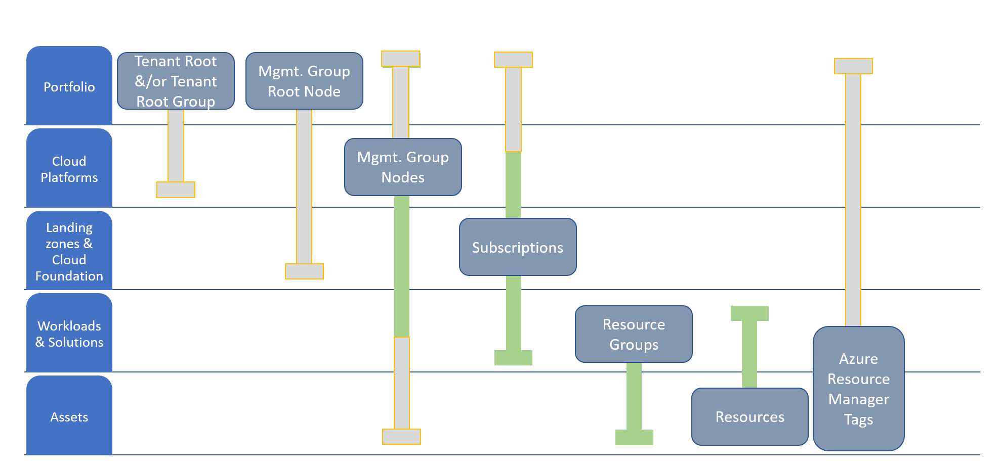

# How do Azure products support the portfolio hierarchy?

In [Understanding and aligning the portfolio hierarchy](./hosting-hierarchy.md), a set of definitions for the portfolio hierarchy and role mapping established a hierarchy of scope for most portfolio approaches. As described in that article, you might not need each of the outlined levels or *scopes*. Minimizing the number of layers reduces complexity, so these layers shouldn't all be viewed as a requirement.

This article shows how each level or scope of the hierarchy is supported in Azure through organizational tools, deployment and governance tools, and some solutions in the Microsoft Cloud Adoption Framework for Azure.

## Organizing the hierarchy in Azure

Azure Resource Manager includes several organizational approaches that help organize assets at each level of the cloud hierarchy.

The slide bars in the following diagram demonstrate common variants in alignment. The gray parts of the slide bars are common but should be used only for specific business requirements. The points after the image describe a suggested best practice.

- **Portfolio:** The enterprise or business unit probably won't contain any technical assets but might affect cost decisions. The enterprise and business units are represented in the root nodes of the management group hierarchy.
- **Cloud platforms:** Each environment has its own node in the management group hierarchy.
- **Landing zones and cloud foundation:** Each landing zone is represented as a subscription. Likewise, platform foundations are contained in their own subscriptions. Some subscription designs might call for a subscription per cloud or per workload, which would change the organizing tool for each.
- **Workloads:** Each workload is represented as a resource group. Resource groups are often used to represent solutions, deployments, or other technical groupings of assets.
- **Assets:** Each asset is inherently represented as a resource in Azure.

## Organizing with tags

Deviations from the best practice are common. You can record them by tagging all assets. Use a tag to represent each of the relevant layers of the hierarchy. For more information, see [Recommended naming and tagging conventions](../../ready/azure-best-practices/naming-and-tagging.md).
