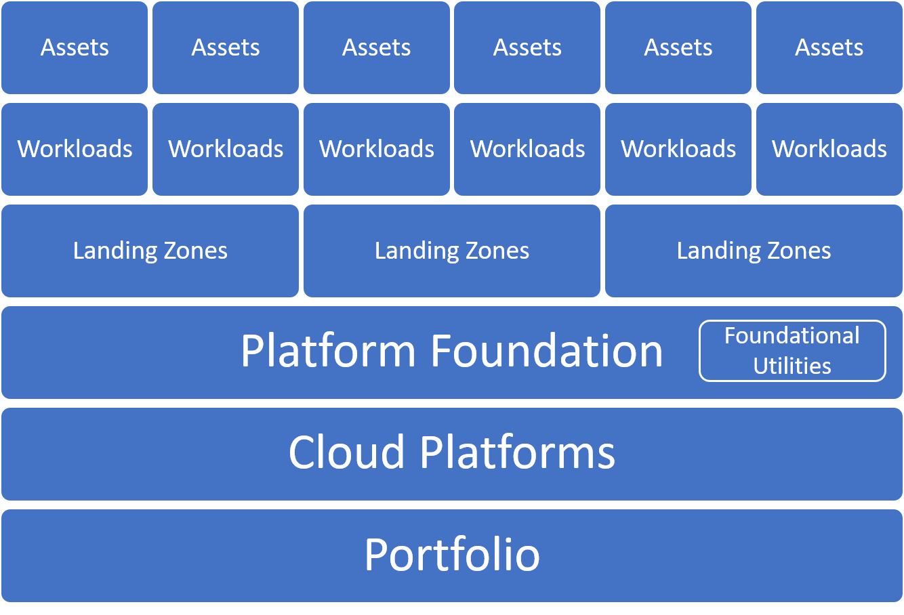

<!-- cSpell:ignore matrixed ISVs -->

<!-- markdownlint-disable MD026 -->

# Understand and align the portfolio hierarchy

Business needs are often supported, improved, or accelerated through information technology. A collection of technologies that delivers defined business value is known as a _workload_. That collection may include applications, servers or virtual machines, data, devices, and other similarly grouped assets.

Typically, a business stakeholder and technical leader share accountability for the ongoing support of each workload. In some phases of the workload lifecycle, those roles are clearly stated. In more operational phases of a workload's lifecycle, those roles may be transitioned to a shared operations management team or cloud operations team. As the number of workloads increase, the roles (stated or implied) become more complex and more matrixed.

Most businesses rely on multiple workloads to deliver vital business functions. The collection of workloads, assets, and the supporting projects, people, processes, and investments are referred to as a _portfolio_. The matrix of business, development, and operations staff require a portfolio hierarchy to understand how the workloads and supporting services all fit together.

This article provides clear definitions for the levels of the portfolio hierarchy. The article aligns various teams with the appropriate accountability in each layer, along with the source of the best guidance for that team to deliver on the expectations for that level. Throughout this article, each level of the hierarchy is also referred to as a _scope_.

## Portfolio hierarchy

Workloads and their supporting assets are at the core of any portfolio. The additional scopes or layers below define how those workloads are viewed and to what extent they are affected by the matrix of potential supporting teams.

When deploying your first workload, the workload and its assets may be the only defined scope. The other layers may be explicitly defined as more workloads are deployed.

Why the terms may vary, all IT solutions include assets and workloads:

- **Asset:** Assets are the smallest unit of technical function supporting a workload or solution.
- **Workload:** Workloads are the smallest unit of IT support for the business. A workload is a collection of assets (infrastructure, applications, and data) that together supports a common business goal or the execution of a common business process.

When companies support workloads through matrixed approaches or centralized approaches, a broader hierarchy likely exists to support those workloads:

- **Landing zone:** Landing zones provide workloads with access to all of the _foundational utilities_ (or shared plumbing) that is provided from a _platform foundation_ required to support one or more workloads.
- **Foundational utilities:** Shared IT services required for workloads to operate within the technology and business portfolio.
- **Platform foundation:** The organizational construct to centralize foundational solutions and ensure those controls are enforced for all landing zones.
- **Cloud platforms:** Depending on the overall strategy for supporting the full _portfolio_, customers may required multiple cloud platforms with distinct deployments of the platform foundation, to govern multiple regions, hybrid solutions, or even multicloud solutions.
- **Portfolio:** Through a technology lense, the portfolio is the collection of the workloads, assets, and supporting resources that spans all cloud platforms. Through a business lense, the portfolio is the collection of projects, people, processes, and investments that support and manage the technology portfolio to drive business outcomes. Together these two lenses capture the _portfolio_.

## Hierarchy accountability and guidance

Each layer of the portfolio hierarchy is managed by an accountable party. The following diagram shows the mapping between the accountable team and the guidance to support their business and technical decisions and subsequent technical implementation.

> [!NOTE]
> The teams mentioned in the following section might be virtual teams (v-teams) or single individuals. For some variants of this hierarchy, some of the accountable teams can be collapsed as described in the accountability variants below.

- **Portfolio:** The cloud strategy team and the cloud center of excellence (CCoE) use the Strategy and Plan methodologies to guide decisions that affect the overall portfolio. The cloud strategy team is accountable for the enterprise level of the overall cloud portfolio hierarchy. They should also be informed of decisions regarding the environment, landing zones, and high-priority workloads.
- **Cloud platform:** The cloud governance team is accountable for the disciplines that ensure consistency across each environment in alignment with the Govern methodology. The cloud governance team is accountable for governance of all resources in all environments. The cloud governance team should be consulted on changes that may require an exception or change to governing policies. The cloud governance team should also be informed of progress regarding workload and asset adoption.
- **Landing zone and platform foundations:** The cloud platform team is accountable for developing the landing zones and platform utilities that support adoption. The cloud automation team is accountable for automating the development of and ongoing support for those landing zones and platform utilities. Both teams use the Ready methodology to guide implementation. Both teams should be informed of progress with workload adoption and any changes to the enterprise or environment.
- **Workload:** Adoption happens at the workload level. Cloud adoption teams use the Migrate and Innovate methodologies to establish scalable processes to accelerate adoption. Once adoption is complete, the ownership of workloads is likely transferred to a cloud operations team that uses the Manage methodology to guide operations management. Both teams should be comfortable using the Azure Architecture Framework to make detailed architectural decisions that affect the workloads they support. Both teams should be informed of changes to landing zones and environments. Both teams may occasionally contribute to landing zone features.
- **Asset:** Assets are typically the responsibility of the cloud operations team. That team uses the management baseline in the Manage methodology to guide operations management decisions. They should also use the Azure Advisor and Azure Architecture Framework to make detailed resource and architectural changes required to deliver on advance operations requirements.

### Accountability variants:

- **Single environment:** When an enterprise needs only one environment, a CCoE is typically not required.
- **Single landing zone:** If an environment contains only a single landing zone, the governance and platform capabilities can likely be consolidated into one team.
- **Single workload:** Some businesses need only one workload, or few workloads, in a single landing zone and a single environment. In those cases, there is little need for a separation of duties between governance, platform, and operations teams.

## Common workload and accountability examples

The following examples illustrate the portfolio hierarchy.

### Commercial off the shelf (COTS) workloads

Traditionally, enterprises have favored commercial-off-the-shelf (COTS) software solutions to power business processes. These solutions are installed, configured, and then operated. There is little change to the solutions architecture after configuration. In these scenarios, any cloud adoption of COTS solutions concludes with a transition to a cloud operations team. The cloud operations team then becomes the technical owner for that software and assumes accountability for managing configuration, cost, patching cycles, and other operational needs.

These workloads include accounting packages, logistics software, or industry-specific solutions. In Microsoft terminology, the vendors of these packages are called independent software vendors (ISVs). Many ISVs offer a service to deploy and maintain an instance of their software package in your subscriptions. They may also offer a version of the software package that runs in their own cloud-hosted environment, providing a platform as a service (PaaS) alternative to the workload. With the exception of PaaS offerings, cloud operations teams bear the burden of ensuring basic operational compliance requirements for those workloads and should work with the cloud governance team to align cost, performance, and other architecture pillars.

### In development with active revisions

When a COTS solution or PaaS offering isn't aligned to the business need, or no solution exists, enterprises build custom-developed workloads. Typically, a small percentage of the overall IT portfolio uses this workload approach. However, these workloads tend to drive a disproportionately high percentage of IT's contribution to business outcomes, especially outcomes related to new revenue streams. These workloads tend to map well to new innovation ideas.

Given various movements that are rooted in agile methodologies and DevOps practices, these workloads favor a business/DevOps alignment over traditional IT management. For these workloads, there might not be a handoff to the cloud operations team for several years. In those cases, the development team serves as the technical owner of the workload.

Due to extensive time and associated capital constraints, custom development options are often limited to high-value opportunities. Typical examples include application innovations, deep data analysis, or mission-critical business functions.

### Break/fix or sunset development

Once a custom-developed workload reaches peak maturity, the development team may be reassigned to other projects. In these cases, technical ownership typically transitions to a cloud operations team. When there is a need for small fixes, the operations team will enlist developers to resolve the error.

In some cases, the development team moves to a project that will eventually replace the current workload. Alternatively, they might move on because the business opportunity supported by the workload is being phased out. These are examples of sunset scenarios, where the cloud operations team serves as the technical owner until the workload is no longer needed.

In both scenarios, the cloud operations team typically serves as the long-term technical owner and decision maker. They will likely enlist application developers when operational changes require significant architectural changes.

### Mission-critical workloads

In every company, a few workloads are too important to the business for them to fail. With these mission-critical workloads, there are usually operations and development owners with various levels of responsibility. Those teams should align operational changes and architectural changes to minimize disruptions to the production solution. These scenarios require a strong focus on separation of duties. To achieve separation of duties, the operations team will generally hold accountability for day-to-day operational changes in the production environment. When those operational changes require an architectural change, they will be completed by the development or adoption team in a nonproduction environment, before the operations team applies the changes to production.

Examples of mission-critical workloads with a required separation of duties would include workloads like SAP, Oracle, or other enterprise resource planning (ERP) solutions, which span multiple business units in the company.

## Strategy portfolio alignment

As discussed in the article on balancing the portfolio, it's important to understand the strategic objectives of the cloud adoption effort and align the portfolio to support that transformation. A few common types of strategic portfolio alignment help shape the structure of the portfolio hierarchy. The following sections provide examples of the portfolio alignment and impact on the portfolio hierarchy.

### Innovation or development-led portfolio

Some companies, especially fast-growing established startups, have a higher-than-average percentage of custom development projects. In development-heavy portfolios, the environment, landing zone, and workloads are often compressed&mdash;there may be specific environments (production or nonproduction environments) for specific workloads. This results in a 1:1 ratio between environment, landing zone, and workload. Furthermore, since the environment hosts custom solutions, the DevOps pipeline and application-level reporting might replace the need for operations and governance functions. For those customers, a reduced focus on operations, governance, or other supporting roles is likely. A stronger emphasis on the responsibilities of the cloud adoption and cloud automation teams is also typical.

**Portfolio alignment:** The IT portfolio will likely focus on workloads and workload owners to drive critical architecture decisions. Those teams are likely to find more value in the Azure Architecture Framework guidance during adoption and operations activities.
**Boundary definitions:** The logical boundaries, even at an enterprise level, will likely focus on production and nonproduction environment segmentation. There may also be clear segmentation between products in the companies software portfolio. At times, there may also be segmentation between development and hosted customer instances.

### Operations-led portfolio

Multinational enterprise organizations with more established IT operations teams typically have a stronger focus on governance and operations than development. In these organizations, a higher percentage of workloads typically align to the COTS or break/fix categories, maintained by technical owners within the cloud operations team.

**Portfolio alignment:** The IT portfolio will be workload aligned, but those workloads are then aligned to operating units or business units. There may also be organization around funding models, industry, or other business segmentation requirements.
**Boundary definitions:** Landing zones will likely group applications into application archetypes to keep similar operations in a similar segmentation. Environments will likely refer to physical constructs like datacenter, nation, cloud-provider region, or other operational organization standards.

### Migration-led portfolio

Similar to operations-led portfolios, a portfolio that is largely built through migration will be based on specific business drivers that led to the migration of existing assets. Typically, the datacenter is the biggest factor in those drivers.

**Portfolio alignment:** The IT portfolio may be workload aligned, but it's more likely asset aligned. If transitions to IT operations have happened in the company's history, many active-use assets might not be easily mapped to a funded workload. In these cases, many assets might not have a defined workload or clear workload owner until late in the migration process.
**Boundary definitions:** Landing zones will likely group applications into boundaries that reflect on-premises segmentation. Though not a best practice, environments often match the on-premises datacenter name and landing zones that represent network segmentation practices. It is a better practice to adhere to segmentation that more closely aligns with an operations-led portfolio.

### Governance-led portfolio

Alignment to governance teams should happen as early as possible. Using governance practices and cloud governance tooling, portfolios and environmental boundaries can best balance the needs of innovation, operations, and migration efforts.

- **Portfolio alignment:** Governance-led portfolios tend to include data points that capture innovation and operations details, such as workload, operations owner, data classification, and operational criticality. These data points create a well-rounded view of the portfolio.
- **Boundary definitions:** Boundaries in a governance-led portfolio tend to favor operations over innovation while using a management-group-driven hierarchy that maps to business unit and development environment criteria. At each level of the hierarchy, a cloud governance boundary can receive different degrees of policy enforcement to allow for development and creative flexibility. At the same time, production grade requirements can be applied to production subscriptions to ensure separation of duties and consistent operations.
