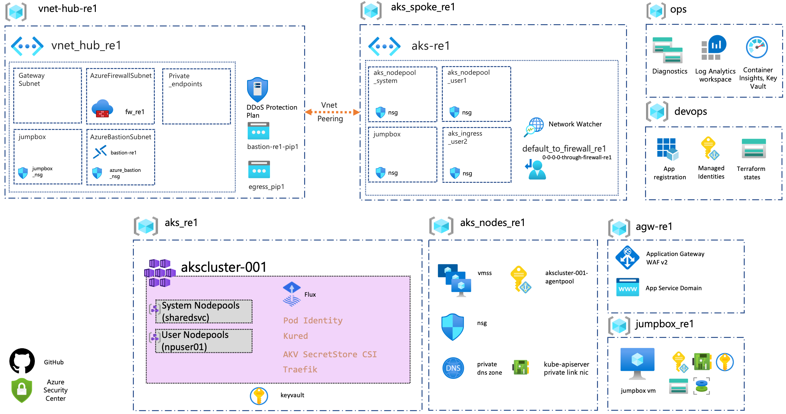

# Construction set for AKS enterprise-scale scenario

Prepare your enterprise-scale landing zone for a scalable Azure Kubernetes Service (AKS) cluster by using the AKS construction set. Learn about the assets that the AKS construction set brings to your project. The AKS construction set is a collection of templates that provides an architectural approach and reference implementation. The implementation follows the architecture and best practices of the Cloud Adoption Framework.

The construction set templates are open source. You can adapt the templates to create an architecture that meets your needs. The following guidance provides design considerations for implementing a scalable AKS cluster in your landing zone. The design decisions your organization makes, based on this guidance, can lay the groundwork for scalability.

## To begin, implement an enterprise-scale landing zone

The AKS construction set assumes that an enterprise-scale landing zone has been successfully implemented. For more information on this prerequisite, review these articles:

- [Start with Cloud Adoption Framework enterprise-scale landing zones](../../ready/enterprise-scale/index.md)
- [Implement Cloud Adoption Framework enterprise-scale landing zones in Azure](../../ready/enterprise-scale/implementation.md)

If you are not operating within an enterprise-scale landing zone topology, you may instead wish to follow the guidance found in the [AKS Baseline reference architecture](/azure/architecture/reference-architectures/containers/aks/secure-baseline-aks).

## What the AKS construction set provides

The construction set approach to landing zones provides these assets to support your project:

- A modular approach, so that you can customize environment variables
- Design guidelines to aid in evaluating critical decisions
- The landing zone architecture
- An implementation that includes:
  - A deployable reference capable of creating the environment for your AKS deployment
  - A Microsoft-approved AKS reference implementation to test the deployed environment

## Design guidelines

These articles provide guidelines for the AKS enterprise-scale scenario:

- [Identity and access management](./eslz-identity-and-access-management.md)
- [Network topology and connectivity](./eslz-network-topology-and-connectivity.md)
- [Management and monitoring](./eslz-management-and-monitoring.md)
- [Business continuity and disaster recovery](./eslz-business-continuity-and-disaster-recovery.md)
- [Security, governance, and compliance](./eslz-security-governance-and-compliance.md)
- [Platform automation and DevOps](./eslz-platform-automation-and-devops.md)

## Example conceptual reference architecture

The following conceptual reference architecture is an example that shows design areas and best practices.

## Obtain the AKS construction set

The AKS construction set is an open-source collection of Terraform templates, available in [this GitHub repo](https://github.com/Azure/caf-terraform-landingzones-starter/tree/starter/enterprise_scale/construction_sets/aks/online/aks_secure_baseline).

There are two types of templates:

- Terraform modules that deploy infrastructure components like virtual machines, networks, or storage to Azure.
- Ansible playbooks that run different roles to configure virtual machines, and to install AKS HANA and required applications, on the already deployed infrastructure.

## Next steps

- Review the AKS construction set critical design areas to make complete considerations and recommendations for your AKS construction set architecture. See [Azure Kubernetes Service (AKS) enterprise-scale scenario](./eslz-identity-and-access-management.md).
