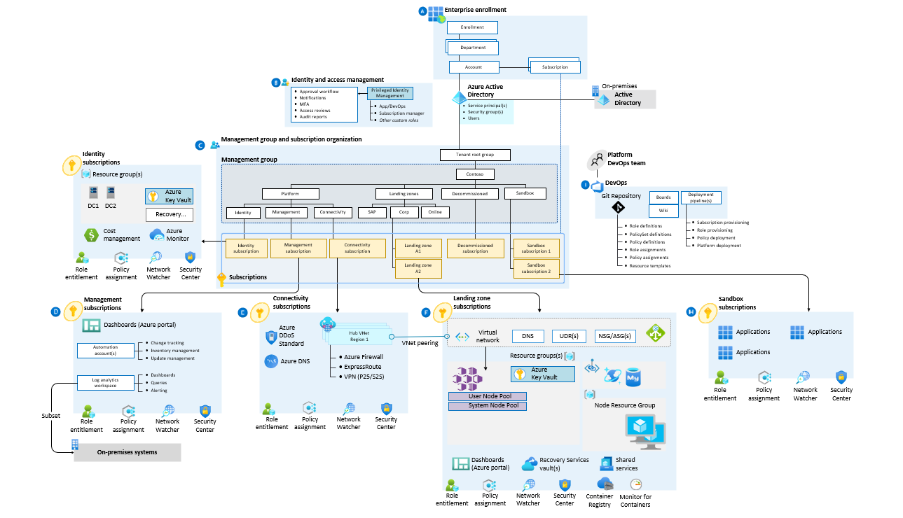
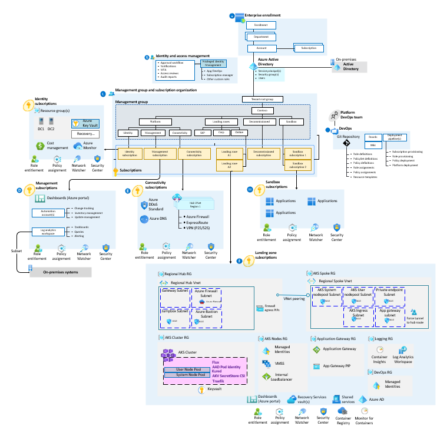

<!-- cspell:ignore landingzones -->

# Enterprise-scale for AKS

Enterprise-scale for AKS represents the strategic design path and target technical state for an Azure Kubernetes Service (AKS) deployment. This solution provides an architectural approach and reference implementation to prepare landing zone subscriptions for a scalable Azure Kubernetes Service (AKS) cluster. The implementation adheres to the architecture and best practices of the Cloud Adoption Framework's Azure landing zones with a focus on the design principles of enterprise-scale.

This solution is open source. You can adapt the templates to create an architecture that meets your needs. The following guidance provides design considerations for implementing a scalable AKS cluster in your landing zone. The design decisions your organization makes, based on this guidance, can lay the groundwork for scalability.

## To begin, implement an enterprise-scale landing zone

Enterprise-scale for AKS assumes that an enterprise-scale landing zone has been successfully implemented. For more information on this prerequisite, review these articles:

- [Start with Cloud Adoption Framework enterprise-scale landing zones](../../ready/enterprise-scale/index.md)
- [Implement Cloud Adoption Framework enterprise-scale landing zones in Azure](../../ready/enterprise-scale/implementation.md)

## What enterprise-scale for AKS provides

The enterprise-scale approach for AKS provides these assets to support your project:

- A modular approach that allows you to customize your environment variables.
- Design guidelines for evaluating critical decisions.
- The landing zone architecture.
- A Microsoft-recommended AKS reference implementation based on the [AKS secure baseline](https://github.com/mspnp/aks-secure-baseline).

## Design areas

These articles provide guidelines for creating your landing zone based on the design areas of Azure landing zones:

- [Enterprise enrollment](./eslz-enterprise-enrollment.md)
- [Identity and access management](./eslz-identity-and-access-management.md)
- [Network topology and connectivity](./eslz-network-topology-and-connectivity.md)
- [Resource organization](./eslz-resource-organization.md)
- [Governance disciplines](./eslz-security-governance-and-compliance.md)
- [Operations management](./eslz-management-and-monitoring.md)
- [Business continuity and disaster recovery](./eslz-business-continuity-and-disaster-recovery.md)
- [Deployment options](./eslz-platform-automation-and-devops.md)

## Example conceptual reference architecture

The following conceptual reference architecture is an example that shows a golden state for an enterprise-scale landing zone with a corporate landing zone subscription and shows design areas and best practices.

## Deploy enterprise-scale for AKS

Enterprise-scale for AKS is an open-source collection of Terraform templates, available in the [`caf-terraform-landingzones-starter`
 repo](https://github.com/Azure/caf-terraform-landingzones-starter/tree/starter/enterprise_scale/construction_sets/aks/online/aks_secure_baseline).

Terraform templates are used to deploy infrastructure components such as virtual machines, networks, or storage to Azure. To get the templates, see the [enterprise-scale construction set for Azure Kubernetes services using Terraform](https://github.com/Azure/caf-terraform-landingzones-starter/tree/starter/enterprise_scale/construction_sets/aks/online/aks_secure_baseline). This reference implementation currently deploys a simplistic version of an AKS implementation that resides in its own subscription within the online management group of an enterprise-scale landing zone. An application deployed in the subscription for an online landing zone is internet-facing and doesn't require hybrid connectivity.

## Next steps

Learn about design considerations for identity and access management in your Azure landing zones.

- [Identity and access management for Azure Kubernetes Service (AKS) enterprise-scale scenario](./eslz-identity-and-access-management.md)
