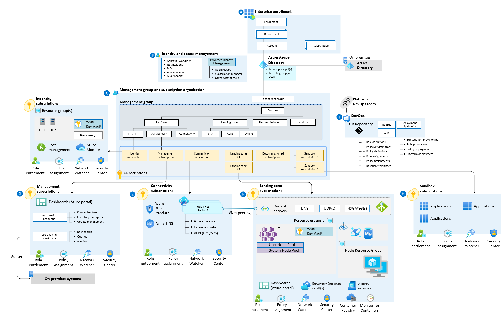

# Construction set for AKS enterprise-scale scenario

The fenterprise scale AKS construction set represents the strategic design path and target technical state for an Azure Kubernetes Service (AKS) landing zone. The AKS construction set provides an architectural approach and reference implementation to prepare landing zone subscriptions for a scalable Azure Kubernetes Service (AKS) cluster. The implementation of construction set landing zones adhere to the architecture and best practices of the Cloud Adoption Framework.
The enterprise scale AKS construction set represents the strategic design path and target technical state for an Azure Kubernetes Service (AKS) landing zone. The AKS construction set provides an architectural approach and reference implementation to deploy a scalable Azure Kubernetes Service (AKS) cluster into a prepared Enterprise-scale landing zone. The implementation of construction set landing zones adhere to the architecture and best practices of the Cloud Adoption Framework.

Customers adopt AKS in various ways. The construction set can be adapted to produce an architecture that fits *your* way and puts your organization on a path to sustainable scale.

@@ -30,15 +30,13 @@ The construction set approach to landing zones provides these assets to support
- A modular approach, so that you can customize environment variables
- Design guidelines to aid in evaluating critical decisions
- The landing zone architecture
- An implementation that includes:
  - A deployable reference capable of creating the environment for your AKS deployment
  - A Microsoft-approved AKS reference implementation to test the deployed environment
- A Microsoft-approved AKS reference implementation based on the [AKS secure baseline](https://github.com/mspnp/aks-secure-baseline)

## Design guidelines

These articles provide guidelines for creating your landing zone:

- [Azure Kubernetes Service (AKS) enterprise-scale scenario](./eslz-identity-and-access-management.md)
- [Identity and access management for AKS enterprise-scale scenario](./eslz-identity-and-access-management.md)
- [Network topology and connectivity for AKS enterprise-scale scenario](./eslz-network-topology-and-connectivity.md)
- [Management and monitoring for AKS enterprise-scale scenario](./eslz-management-and-monitoring.md)
- [Business continuity and disaster recovery for AKS enterprise-scale scenario](./eslz-business-continuity-and-disaster-recovery.md)
@@ -47,18 +45,19 @@ These articles provide guidelines for creating your landing zone:

## Example conceptual reference architecture

The following conceptual reference architecture is an example that shows design areas and best practices.
The following conceptual reference architecture is an example that shows a golden state for an enterprise scale landing zone with a corporate landing zone subscription and shows design areas and best practices.

## Obtain the AKS construction set
## AKS Construction Set RI for Online Landing Zone

The AKS construction set is an open-source collection of Terraform templates, available in [this GitHub repo](https://github.com/Azure/caf-terraform-landingzones-starter/tree/starter/enterprise_scale/construction_sets/aks/online/aks_secure_baseline).
The AKS construction set reference implementation (RI) is an open-source collection of Terraform templates, available in [this GitHub repo](https://github.com/Azure/caf-terraform-landingzones-starter/tree/starter/enterprise_scale/construction_sets/aks/online/aks_secure_baseline). This RI is based on the [AKS secure baseline](https://github.com/mspnp/aks-secure-baseline) and currently deploys a simplistic version of an AKS implementation that can sit in its own subscription within the online management group of an ESLZ. An application deployed in the subscription for an online landing zone will be internet-facing, and does not require hybrid connectivity.

There are two types of templates:

- Terraform modules that deploy infrastructure components like virtual machines, networks, or storage to Azure.
- Ansible playbooks that run different roles to configure virtual machines, and to install AKS HANA and required applications, on the already deployed infrastructure.

## Next steps

- Review the AKS construction set critical design areas to make complete considerations and recommendations for your AKS construction set architecture. See [Azure Kubernetes Service (AKS) enterprise-scale scenario](./eslz-identity-and-access-management.md).
