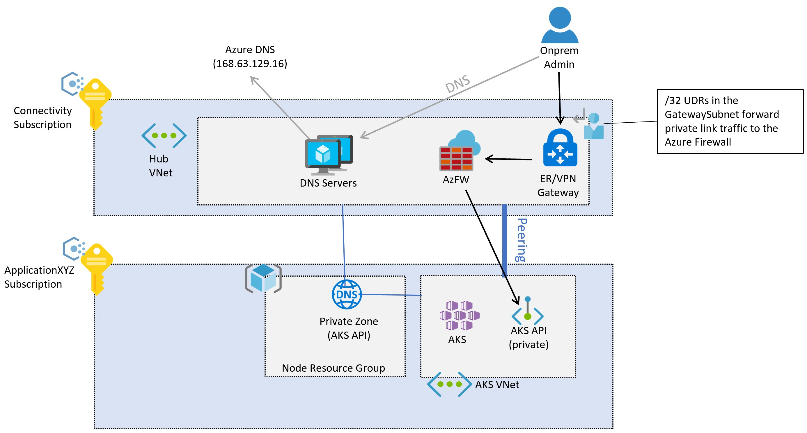
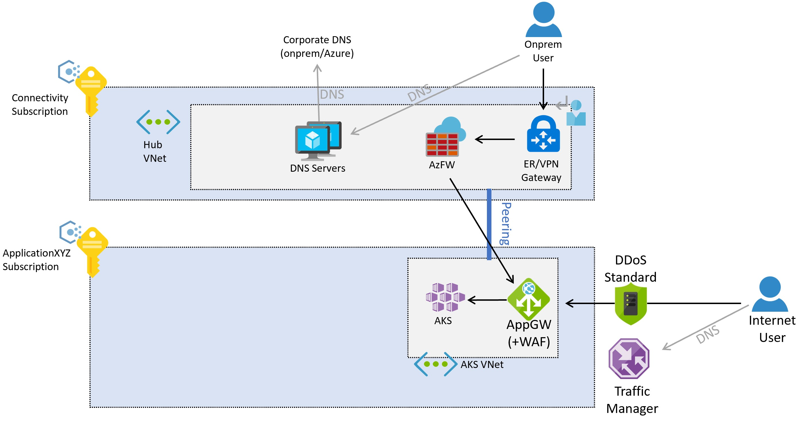
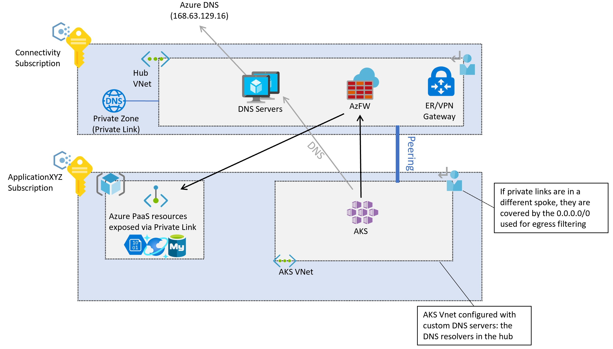

# Network topology and connectivity for AKS Enterprise-Scale scenario

## Design considerations

- AKS supports two networking models: kubenet and Azure Container Networking Interface (CNI):
  - CNI requires additional planning for IP addresses.
  - Only CNI supports Windows Server node and Network Policies pool.
  - kubenet requires UDRs to be manually applied.
  - Verify the [current list](https://docs.microsoft.com/azure/aks/concepts-network#compare-network-models) of supported capabilities by each CNI plugin.
- IP addressing and the size of the VNet subnet must be carefully planned to support the scaling of the cluster by adding more nodes, etc.
- Virtual nodes can be used for quick cluster scaling, but there are some [known limitations](https://docs.microsoft.com/azure/aks/virtual-nodes-portal#known-limitations).
- AKS clusters support Basic and Standard Azure Load Balancer SKUs.
- AKS services can be exposed with public or internal Load Balancers. Internal Load Balancers can be configured in the same subnet as the Kubernetes nodes or in a dedicated subnet.
- Azure Policy and the [Azure Policy add-on for AKS](https://docs.microsoft.com/azure/governance/policy/concepts/policy-for-kubernetes "Azure Policy for AKS") can control and limit the objects created in your AKS cluster, such as for example to deny the creation of public IP addresses in the cluster.
- AKS uses CoreDNS to provide name resolution to pods running in the cluster:
  - CoreDNS will resolve cluster-internal domains directly
  - Other domains will be forwarded to the DNS servers configured in the Virtual Network, either the default Azure DNS resolver or any custom DNS servers configured at the Virtual Network level.
- Egress network traffic can optionally be sent through an Azure Firewall or Network Virtual Appliance cluster:
  - By default, AKS clusters have unrestricted outbound (egress) Internet access.
  - Egress traffic from the AKS cluster can be sent through Azure Firewall or a Network Virtual Appliance cluster by configuring User-Defined Routes in the AKS subnet.
- By default, all pods in an AKS cluster can send and receive traffic without limitations. Kubernetes network policies can be used to improve security and filter network traffic between pods in an AKS cluster: two [network policy models](https://docs.microsoft.com/azure/aks/use-network-policies#network-policy-options-in-aks) are available for AKS.
- A service mesh provides capabilities like traffic management, resiliency, policy, security, strong identity, and observability, see the documented [selection criteria](https://docs.microsoft.com/azure/aks/servicemesh-about#selection-criteria).
- Global load balancing mechanisms such as [Azure Traffic Manager](https://docs.microsoft.com/azure/traffic-manager/traffic-manager-overview) and [Azure Front Door](https://docs.microsoft.com/azure/frontdoor/front-door-overview) increase resiliency by routing traffic across multiple clusters, potentially in different Azure regions.

### Private clusters

AKS cluster IP visibility can be either public or private (see [Create a private AKS cluster](https://docs.microsoft.com/azure/private-clusters). Private clusters expose the Kubernetes API over a private IP address, and not over a public one. This private IP address is actually represented in the AKS Virtual Network through a [Private Endpoint](https://docs.microsoft.com/azure/private-link/private-endpoint-overview). The Kubernetes API should not be accessed via its IP address but through its Fully Qualified Domain Name (FQDN). The resolution from the Kubernetes API FQDN to its IP address will be typically performed by an [Azure Private DNS Zone](https://docs.microsoft.com/azure/dns/private-dns-overview). This DNS zone can be created by Azure in the AKS node resource group (see [Why are two resource groups created with AKS?](https://docs.microsoft.com/azure/aks/faq#why-are-two-resource-groups-created-with-aks)), or you can specify an existing DNS zone (see [No Private DNS Zone Prerequisites](https://docs.microsoft.com/azure/aks/private-clusters#no-private-dns-zone-prerequisites)).

Following Enterprise Scale proven practices, DNS resolution for Azure workloads is offered by centralized DNS servers deployed in the Connectivity Subscription (either in a hub Virtual Network, or in a Shared Services Virtual Network connected to Virtual WAN). These servers will conditionally resolve Azure-specific and public names using Azure DNS (IP address 168.63.129.16), as well as private names using corporate DNS servers. However, these centralized DNS servers will not be able to resolve the AKS API Fully-Qualified Domain Name (FQDN) until they are connected with the DNS private zone created for the AKS cluster. Note that each AKS will have a unique DNS private zone, since a random GUID is prepended to the zone name. As a consequence, for each new AKS cluster its corresponding private DNS zone should be connected to the Virtual Network where the central DNS servers are located.

All Virtual Networks should be configured to use these central DNS servers for name resolution. However, if the AKS Virtual Network is configured to use the central DNS servers, and these are not connected to the private DNS zone yet, the AKS nodes will not be able to resolve the FQDN of the Kubernetes API, and the creation of the AKS cluster will fail. Hence, the AKS Virtual Network should be configured to use the central DNS servers only after cluster creation.

Once the cluster is created, the connection is created between the DNS private zone and the Virtual Network where the central DNS servers are deployed, and the AKS Virtual Network has been configured to use the central DNS servers in the Connectivity Subscription, administrator access to the AKS Kubernetes API will follow this flow:

> [!NOTE]
> The images in this document reflect the design using the traditional hub and spoke connectivity model. Enterprise Scale Landing Zones can opt for the Virtual WAN connectivity model, in which the central DNS servers would be located in a Shared Services Virtual Network connected to a Virtual WAN hub.

1. The administrator will resolve the FQDN of the Kubernetes API. The on-premises DNS servers will forward the request to the authoritative servers - the DNS resolvers in Azure. These servers will forward the request to the Azure DNS server (168.63.129.16), which will find out the IP address from the Azure Private DNS Zone.
1. After resolving the IP address, traffic to the Kubernetes API will be routed from on-premises to the VPN or ExpressRoute gateway in Azure, depending on the connectivity model.
1. Note that the private endpoint will have introduced a /32 route in the Hub Virtual Network, so the VPN and ExpressRoute gateways will send traffic straight to the Kubernetes API private endpoint deployed in the AKS Virtual Network

### Traffic from application users to the cluster

Ingress controllers can optionally be used to expose applications running in the AKS clusters:

- Ingress controllers provide application-level routing, at the cost of a slight complexity increase.
- Ingress controllers can optionally incorporate Web Application Firewall functionality.
- Ingress controllers can run off-cluster and in-cluster:
  - An off-cluster Ingress controller offloads compute (HTTP traffic routing, TLS termination, etc.) to another service outside of AKS, e.g. [Azure Application Gateway Ingress Controller (AGIC) add-on](https://docs.microsoft.com/azure/application-gateway/ingress-controller-overview).
  - An in-cluster solution consumes AKS cluster resources for compute (HTTP traffic routing, TLS termination, etc.). In-cluster ingress-controllers can offer lower cost, but they require careful resource planning and maintenance.
- The Basic HTTP Application Routing Add-on is very easy to use, but has some restrictions as documented in [HTTP Application Routing](https://docs.microsoft.com/azure/aks/http-application-routing).

Ingress controllers can expose applications and APIs with a public or a private IP address:

- The configuration should be aligned with the egress filtering design in order to avoid asymmetric routing.
- If TLS termination is required, management of TLS certificates will have to be considered.

Application traffic can come from either on-premises or the public Internet. The following picture describes an example where an [Azure Application Gateway](https://docs.microsoft.com/azure/application-gateway/overview) is configured to reverse-proxy connections to the clusters both from on-premises and the public Internet:

Traffic from on-premises will follow this flow (the numbers in blue bullets in the previous picture):

1. The client will resolve the FQDN assigned to the application, either using the DNS servers deployed in the Connectivity Subscription or on-premises DNS servers.
1. After resolving the application FQDN to an IP address (the private IP address of the Application Gateway), traffic will be routed through a VPN or ExpressRoute gateway.
1. Routing in the GatewaySubnet will be configured to send the request to the Web Application Firewall.
1. The Web Application Firewall will send valid requests to the workload running in the AKS cluster.

The Azure Application Gateway in this example can be deployed in the same subscription as the AKS cluster, since its configuration is very closely related to the workloads deployed in AKS, and hence it is managed by the same application team. Access from the Internet will follow this sequence (the numbers in green bullets in the picture above):

1. Clients from the public Internet will resolve the DNS name for the application using [Azure Traffic Manager](https://docs.microsoft.com/azure/traffic-manager/traffic-manager-overview).  Alternatively other global load balancing technologies can be used, such as [Azure Front Door](https://docs.microsoft.com/azure/frontdoor/front-door-overview).
1. The application public FQDN will be resolved by Traffic Manager to the public IP address of the Application Gateway, which clients will access over the public Internet.
1. The Application Gateway will access the workload deployed in AKS.

Note that these flows are only valid for web applications. Non-web applications are outside of the scope of this document, they can be exposed through the Azure Firewall in the hub Virtual Network (or the secure virtual hub if using the Virtual WAN connectivity model).

Alternatively, the traffic flows for web-based applications can be made to traverse both the Azure Firewall in the Connectivity Subscription as the WAF in the AKS VNet. This approach has the advantage of offering some additional protection, such as [Azure Firewall Intelligence-based Filtering](https://docs.microsoft.com/azure/firewall/threat-intel) to drop traffic from known malicious IP addresses in the Internet. However it has some drawbacks too, such as the loss of the original client IP address, as well as the additional coordination required between the Firewall and the Application teams when exposing applications, since Destination Network Address Translation (DNAT) rules will be needed in the Azure Firewall.

### Traffic from the AKS pods to backend services

The pods running inside of the AKS cluster will potentially need to access backend services such as Azure Storage, Azure SQL Databases or Azure Cosmos DB noSQL databases. [Virtual Network Service Endpoints](https://docs.microsoft.com/azure/virtual-network/virtual-network-service-endpoints-overview) and [Private Link](https://docs.microsoft.com/azure/private-link/private-link-overview) can be used to secure connectivity to these Azure managed (PaaS) services.

If using Azure Private Endpoints for backend traffic, DNS resolution for the Azure services can be performed using Azure Private DNS Zones. Since the DNS resolvers for the whole environment are in the Hub Virtual Network (or the Shared Services Virtual Network if using the Virtual WAN connectivity model), these private zones should be created in the Connectivity subscription. To create the A-record required to resolve the FQDN of the private service, you can associate the private DNS zone (in the Connectivity subscription) with the private endpoint (in the Application subscription). This operation will require certain privilege in each of those subscriptions.

It is possible creating the A-records manually as well, but associating the private DNS zone with the private endpoint would result in a setup less prone to misconfigurations.

Backend connectivity from AKS pods to Azure PaaS services exposed through private endpoints will follow this sequence:

1. The AKS pods will resolve the FQDN of the Azure PaaS service using the central DNS servers in the Connectivity subscription, which are defined as custom DNS servers in the AKS Virtual Network.
1. The resolved IP will be the private IP address of the private endpoints, which will be accessed directly from the AKS pods

Note that traffic between the AKS pods and the private endpoints per default will not go through the Azure Firewall in the Hub Virtual Network (or the secure virtual hub if using Virtual WAN), even if the AKS cluster is configured for [egress filtering with Azure Firewall](https://docs.microsoft.com/azure/aks/limit-egress-traffic). The reason is that the private endpoint will create a /32 route in the subnets of the Application Virtual Network, where AKS is deployed.

## Design recommendations

- If your security policy mandates having the Kubernetes API with a private IP address (instead of a public IP address), [deploy a private AKS cluster](https://docs.microsoft.com/azure/aks/private-clusters).
  - Use custom Private DNS zones when creating a private cluster, instead of letting the creation process use a system Private DNS Zone ([Configure Private DNS Zone](https://docs.microsoft.com/azure/aks/private-clusters#configure-private-dns-zone))
- Use Azure Container Networking Interface (CNI) as network model, unless you have a limited range of IP addresses that can be assigned to the AKS cluster.
  - Follow the documentation with regards to [IP address planning](https://docs.microsoft.com/azure/aks/configure-azure-cni#plan-ip-addressing-for-your-cluster) with CNI.
  - If you want to use Windows Server node pools and virtual nodes verify eventual limitations, please refer to the [Windows AKS support FAQ](https://docs.microsoft.com/azure/aks/windows-faq).
- Use Azure DDoS Protection Standard to protect the Azure VNet used for the AKS cluster
- Use the DNS configuration linked to the overall network setup with Azure Virtual WAN or hub and spoke architecture, Azure DNS Zones and your own DNS infrastructure.
- Use Private Link to secure network connections and use private IP-based connectivity to other used managed Azure services that support Private Link, such as Azure Storage, Azure Container Registry, Azure SQL Database, Azure Key Vault, etc.
- Use an Ingress controller to provide advanced HTTP routing and security and offer a single endpoint for applications.
- To conserve compute and storage resources of your AKS cluster, use an off-cluster Ingress controller.
  - Use the [Azure Application Gateway Ingress Controller (AGIC)](https://docs.microsoft.com/azure/application-gateway/ingress-controller-overview) add-on, which is a 1st party managed Azure service.
  - With AGIC, deploy a dedicated Azure Application Gateway for each AKS cluster, do not share the same Application Gateway across multiple AKS clusters.
  - If there are no resource or operational constraints, or AGIC does not provide the required features, use an in-cluster Ingress controller solution like NGINX, Traefik, or any other Kubernetes-supported solution.
- For Internet-facing  and security-critical internal-facing web applications, use a Web Application Firewall (WAF) with the Ingress controller.
  - Azure Application Gateway and Azure Front Door both integrate the [Azure WAF](https://docs.microsoft.com/azure/web-application-firewall/ag/ag-overview) to protect web-based applications.
- If your security policy mandates inspecting all Internet-outbound traffic generated in the AKS cluster, secure egress network traffic using Azure Firewall or a 3rd party network virtual appliance (NVA) deployed in the (managed) hub VNet, see [Limit Egress Traffic](https://docs.microsoft.com/azure/aks/limit-egress-traffic) for more details