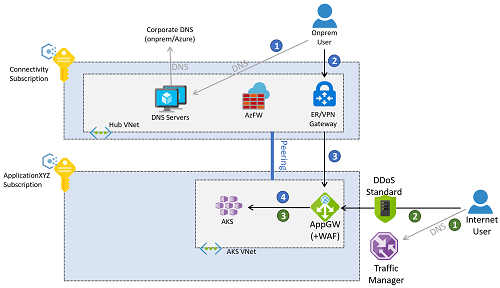

# Network topology and connectivity considerations for AKS

<!-- docutune:casing "Basic and Standard" -->

## Design considerations

- AKS supports two networking models: kubenet and Azure Container Networking Interface (CNI).
  - CNI requires extra planning for IP addresses.
  - Only CNI supports Windows Server node and network policies pool.
  - UDR for kubenet is automatically set up by AKS.
  - kubenet only supports up to 400 nodes.
  - Verify the current list of [capabilities supported by each CNI plug-in](/azure/aks/concepts-network#compare-network-models).
- IP addressing and the size of the virtual network subnet must be carefully planned to support the scaling of the cluster. For example, you can add more nodes.
- Virtual nodes can be used for quick cluster scaling, but there are some [known limitations](/azure/aks/virtual-nodes-portal).
- AKS clusters support Basic and Standard Azure Load Balancer SKUs.
- AKS services can be exposed with public or internal load balancers. Internal load balancers can be configured in the same subnet as the Kubernetes nodes or in a dedicated subnet.
- Azure Policy and the [Azure Policy add-on for AKS](/azure/governance/policy/concepts/policy-for-kubernetes) can control and limit the objects created in your AKS cluster, such as denying the creation of services with a public load balancer.
- AKS uses CoreDNS to provide name resolution to pods running in the cluster.
  - CoreDNS will resolve cluster-internal domains directly.
  - Other domains will be forwarded to the DNS servers configured in Azure Virtual Network, which will be either the default Azure DNS resolver, or any custom DNS servers configured at the virtual network level.
- Outbound (egress) network traffic can be sent through an Azure Firewall or network virtual appliance cluster.
  - By default, AKS clusters have unrestricted egress internet access.
  - There are two deployment models for outbound connectivity: [`LoadBalancer` or `UserDefinedRouting (UDR)`](/azure/aks/egress-outboundtype). With `UDR`, there's no public IP address created in the cluster for egress traffic, which is especially important when deploying an AKS cluster to a "Corp" subscription with a policy to forbid creation of a public IP address, as described in [Policies included in Enterprise-Scale Landing Zones reference implementations](https://github.com/Azure/Enterprise-Scale/blob/main/docs/ESLZ-Policies.md).
  - Egress traffic from the AKS cluster can be sent through Azure Firewall or a network virtual appliance cluster by configuring UDRs in the AKS subnet.
  - If using outbound mode `loadBalancer`, you must carefully manage outbound ports, since you might use up the available outbound ports.
- By default, all pods in an AKS cluster can send and receive traffic without limitations. Kubernetes network policies can be used to improve security and filter network traffic between pods in an AKS cluster. Two [network policy models](/azure/aks/use-network-policies#network-policy-options-in-aks) are available for AKS. Azure network policies are fully supported by Microsoft, while Calico is an open-source network security solution with more features and is also recommended.
- A service mesh provides capabilities like traffic management, resiliency, policy, security, strong identity, and observability. For more information, see the [selection criteria](/azure/aks/servicemesh-about#selection-criteria).
- Global load-balancing mechanisms such as [Azure Traffic Manager](/azure/traffic-manager/traffic-manager-overview) and [Azure Front Door](/azure/frontdoor/front-door-overview) increase resiliency by routing traffic across multiple clusters, potentially in different Azure regions.
- AKS sets up a network security group (NSG) on the subnet in which the cluster is deployed. Don't manually edit this NSG, but you can influence by configuring the services you deploy in AKS.
- Consider using [NodeLocal DNSCache](https://kubernetes.io/docs/tasks/administer-cluster/nodelocaldns/) in Kubernetes clusters.

### Private clusters

AKS cluster IP visibility can be either public or private. [Private clusters](/azure/aks/private-clusters) expose the Kubernetes API over a private IP address, but not over a public one. This private IP address is represented in the AKS virtual network through a [Private Endpoint](/azure/private-link/private-endpoint-overview). The Kubernetes API shouldn't be accessed through its IP address, but instead through its fully qualified domain name (FQDN). The resolution from the Kubernetes API FQDN to its IP address will typically be performed by an [Azure Private DNS zone](/azure/dns/private-dns-overview). This DNS zone can be created by Azure in the [AKS node resource group](/azure/aks/faq#why-are-two-resource-groups-created-with-aks), or you can specify an [existing DNS zone](/azure/aks/private-clusters#no-private-dns-zone-prerequisites).

Following enterprise-scale proven practices, DNS resolution for Azure workloads is offered by centralized DNS servers deployed in the connectivity subscription, either in a hub virtual network or in a shared services virtual network connected to an Azure Virtual WAN. These servers will conditionally resolve Azure-specific and public names using Azure DNS (IP address `168.63.129.16`), and private names using corporate DNS servers. However, these centralized DNS servers will not be able to resolve the AKS API FQDN until they are connected with the DNS private zone created for the AKS cluster. Each AKS will have a unique DNS private zone, since a random GUID is prepended to the zone name. So, for each new AKS cluster its corresponding private DNS zone should be connected to the virtual network where the central DNS servers are located.

All virtual networks should be configured to use these central DNS servers for name resolution. However, if the AKS virtual network is configured to use the central DNS servers, and these DNS servers aren't connected to the private DNS zone yet, the AKS nodes won't be able to resolve the FQDN of the Kubernetes API, and the creation of the AKS cluster will fail. The AKS virtual network should be configured to use the central DNS servers only after cluster creation.

Once the cluster is created, the connection is created between the DNS private zone and the virtual network where the central DNS servers are deployed. The AKS virtual network has also been configured to use the central DNS servers in the connectivity subscription, and administrator access to the AKS Kubernetes API will follow this flow:

> [!NOTE]
> The images in this article reflect the design using the traditional hub and spoke connectivity model. Enterprise-scale landing zones can opt for the Virtual WAN connectivity model, in which the central DNS servers would be in a shared services virtual network connected to a Virtual WAN hub.

1. The administrator will resolve the FQDN of the Kubernetes API. The on-premises DNS servers forward the request to the authoritative servers - the DNS resolvers in Azure. These servers forward the request to the Azure DNS server (`168.63.129.16`), which will find out the IP address from the Azure Private DNS zone.
2. After resolving the IP address, traffic to the Kubernetes API is routed from on-premises to the VPN or ExpressRoute gateway in Azure, depending on the connectivity model.
3. The private endpoint will have introduced a `/32` route in the hub virtual network, so the VPN and ExpressRoute gateways will send traffic straight to the Kubernetes API Private Endpoint deployed in the AKS virtual network.

### Traffic from application users to the cluster

Incoming (ingress) controllers can be used to expose applications running in the AKS clusters.

- Ingress controllers provide application-level routing at the cost of a slight complexity increase.
- Ingress controllers can incorporate Web Application Firewall (WAF) functionality.
- Ingress controllers can run off-cluster and in-cluster:
  - An off-cluster ingress controller offloads compute (such as HTTP traffic routing or TLS termination) to another service outside of AKS, like the [Azure Application Gateway Ingress Controller (AGIC) add-on](/azure/application-gateway/ingress-controller-overview).
  - An in-cluster solution consumes AKS cluster resources for compute (such as HTTP traffic routing or TLS termination). In-cluster ingress controllers can offer lower cost, but they require careful resource planning and maintenance.
- The basic HTTP application routing add-on is easy to use, but has some restrictions as documented in [HTTP application routing](/azure/aks/http-application-routing).

Ingress controllers can expose applications and APIs with a public or a private IP address.

- The configuration should be aligned with the egress filtering design to avoid asymmetric routing. UDRs can cause asymmetric routing (potentially), but not necessarily. Application Gateway can SNAT on traffic, meaning return traffic will go back to Application Gateway node and not to UDR route if UDR is only set up for internet traffic.
- If TLS termination is required, management of TLS certificates must be considered.

Application traffic can come from either on-premises or the public internet. The following picture describes an example where an [Azure Application Gateway](/azure/application-gateway/overview) is configured to reverse-proxy connections to the clusters both from on-premises and from the public internet.

Traffic from on-premises follows the flow of the numbered blue callouts in the previous diagram.

1. The client will resolve the FQDN assigned to the application, either using the DNS servers deployed in the connectivity subscription or on-premises DNS servers.
2. After resolving the application FQDN to an IP address (the private IP address of the application gateway), traffic is routed through a VPN or ExpressRoute gateway.
3. Routing in the gateway subnet is configured to send the request to the web application firewall.
4. The web application firewall sends valid requests to the workload running in the AKS cluster.

The Azure Application Gateway in this example can be deployed in the same subscription as the AKS cluster, since its configuration is closely related to the workloads deployed in AKS and is therefore managed by the same application team. Access from the internet follows the flow of the numbered green callouts in the previous diagram.

1. Clients from the public internet resolve the DNS name for the application using [Azure Traffic Manager](/azure/traffic-manager/traffic-manager-overview). Alternatively, other global load-balancing technologies like [Azure Front Door](/azure/frontdoor/front-door-overview) can be used.
2. The application public FQDN will be resolved by Traffic Manager to the public IP address of the application gateway, which clients access over the public internet.
3. The application gateway will access the workload deployed in AKS.

> [!NOTE]
> These flows are only valid for web applications. Non-web applications are outside the scope of this article, and they can be exposed through the Azure Firewall in the hub virtual network, or the secure virtual hub if using the Virtual WAN connectivity model.

Alternatively, the traffic flows for web-based applications can be made to traverse both the Azure Firewall in the connectivity subscription and the WAF in the AKS virtual network. This approach has the advantage of offering some more protection, such as using [Azure Firewall intelligence-based filtering](/azure/firewall/threat-intel) to drop traffic from known malicious IP addresses in the internet. However, it has some drawbacks too. For example, the loss of the original client IP address, and the extra coordination required between the firewall and the application teams when exposing applications. This is because Destination Network Address Translation (DNAT) rules will be needed in the Azure Firewall.

### Traffic from the AKS pods to backend services

The pods running inside of the AKS cluster might need to access backend services such as Azure Storage, Azure SQL databases, or Azure Cosmos DB NoSQL databases. [Virtual network service endpoints](/azure/virtual-network/virtual-network-service-endpoints-overview) and [Private Link](/azure/private-link/private-link-overview) can be used to secure connectivity to these Azure managed services.

If you are using Azure private endpoints for backend traffic, DNS resolution for the Azure services can be performed using Azure Private DNS zones. Since the DNS resolvers for the whole environment are in the hub virtual network (or the shared services virtual network if using the Virtual WAN connectivity model), these private zones should be created in the connectivity subscription. To create the A-record required to resolve the FQDN of the private service, you can associate the private DNS zone (in the connectivity subscription) with the private endpoint (in the application subscription). This operation requires certain privileges in each of those subscriptions.

It's possible to create the A-records manually, but associating the private DNS zone with the private endpoint results in a setup less prone to misconfigurations.

Backend connectivity from AKS pods to Azure PaaS services exposed through private endpoints will follow this sequence:

1. The AKS pods will resolve the FQDN of the Azure platform as a service (PaaS) using the central DNS servers in the connectivity subscription, which are defined as custom DNS servers in the AKS virtual network.
2. The resolved IP will be the private IP address of the private endpoints, which are accessed directly from the AKS pods.

Traffic between the AKS pods and the private endpoints per default will not go through the Azure Firewall in the hub virtual network (or the secure virtual hub if using Virtual WAN), even if the AKS cluster is configured for [egress filtering with Azure Firewall](/azure/aks/limit-egress-traffic). The reason is that the private endpoint will create a `/32` route in the subnets of the application virtual network, where AKS is deployed.

## Design recommendations

- If your security policy mandates having the Kubernetes API with a private IP address (instead of a public IP address), [deploy a private AKS cluster](/azure/aks/private-clusters).
  - Use custom private DNS zones when creating a private cluster, rather than letting the creation process use a [system private DNS zone](/azure/aks/private-clusters#configure-private-dns-zone).
- Use Azure Container Networking Interface (CNI) as a network model, unless you have a limited range of IP addresses that can be assigned to the AKS cluster.
  - Follow the documentation about [IP address planning](/azure/aks/configure-azure-cni#plan-ip-addressing-for-your-cluster) with CNI.
  - To use Windows Server node pools and virtual nodes to verify eventual limitations, refer to the [Windows AKS support FAQ](/azure/aks/windows-faq).
- Use Azure DDoS Protection Standard to protect the virtual network used for the AKS cluster **unless you use Azure Firewall or WAF in a centralized subscription**.
- Use the DNS configuration linked to the overall network setup with Azure Virtual WAN or hub and spoke architecture, Azure DNS zones, and your own DNS infrastructure.
- Use Private Link to secure network connections and use private IP-based connectivity to other managed Azure services used that support Private Link, such as Azure Storage, Azure Container Registry, Azure SQL Database, and Azure Key Vault.
- Use an ingress controller to provide advanced HTTP routing and security, and to offer a single endpoint for applications.
- All web applications configured to use an ingress should use TLS encryption and not allow access over unencrypted HTTP. This policy is already enforced if the subscription includes the recommended policies in [Policies included in Enterprise-Scale Landing Zones reference implementations](https://github.com/Azure/Enterprise-Scale/blob/main/docs/ESLZ-Policies.md).
- Optionally, to conserve the compute and storage resources of your AKS cluster, use an off-cluster ingress controller.
  - Use the [Azure Application Gateway Ingress Controller (AGIC)](/azure/application-gateway/ingress-controller-overview) add-on, which is a first-party managed Azure service.
  - With AGIC, deploy a dedicated Azure Application Gateway for each AKS cluster and do not share the same Application Gateway across multiple AKS clusters.
  - If there are no resource or operational constraints, or AGIC does not provide the required features, use an in-cluster ingress controller solution like NGINX, Traefik, or any other Kubernetes-supported solution.
- For internet-facing and security-critical, internal-facing web applications, use a web application firewall with the ingress controller.
  - Azure Application Gateway and Azure Front Door both integrate the [Azure Web Application Firewall](/azure/web-application-firewall/ag/ag-overview) to protect web-based applications.
- If your security policy mandates inspecting all outbound internet traffic generated in the AKS cluster, secure egress network traffic using Azure Firewall or a third-party network virtual appliance (NVA) deployed in the managed hub virtual network. For more information, see [Limit egress traffic](/azure/aks/limit-egress-traffic). The AKS [outbound type UDR](/azure/aks/egress-outboundtype#deploy-a-cluster-with-outbound-type-of-udr-and-azure-firewall) requires associating a route table to the AKS node subnet, so it cannot be used today with the dynamic route injection supported by Azure Virtual WAN or Azure Route Server.
- For non-private clusters, use authorized IP ranges.
- Use the Standard tier rather than the Basic tier of Azure Load Balancer.
