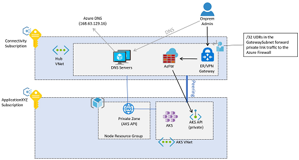
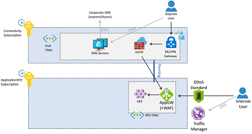
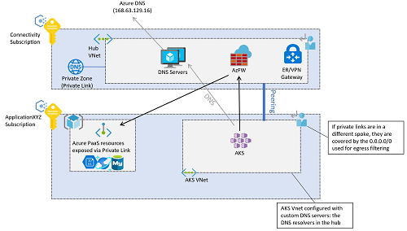

# Network topology and connectivity for AKS Enterprise-Scale scenario

## Design considerations

- Decide on cluster IP visibility, whether it should have a public or a private IP address
- Plan the IP addressing and the size of the VNet subnet, to support the scaling of the cluster by adding more nodes, etc.
- Decide on the supported network model for the VNet integration, kubenet or Azure Container Networking Interface (CNI).
  - CNI requires additional planning for IP addresses.
  - Only CNI supports Windows Server node and Network Policies pool.
  - kubenet requires UDRs to be manually applied.
  - Verify the [current list](https://docs.microsoft.com/azure/aks/concepts-network#compare-network-models) of supported capabilities by each CNI plugin.
- Plan and decide on the usage of virtual nodes, and verify the documented [known limitations](https://docs.microsoft.com/azure/aks/virtual-nodes-portal#known-limitations).
- Decide on the Azure Load Balancer SKU for the AKS cluster: AKS supports Basic and Standard load balancer SKUs.
- Decide on the VNet subnet setup with an internal load balancer: An internal load balancer can be deployed in the same VNet subnet as the nodes, or in a dedicated subnet.
- Plan and decide on the DNS integration.
  - CoreDNS will resolve cluster-internal domains directly
  - Other domains will be forwarded to the DNS servers configured on the VNet level.
- Plan and decide on the connectivity to other Azure managed (PaaS) services.
  - Consider using available features such as VNet Service Endpoints or Private Link.
- Plan and decide on the Ingress controller.
  - Decide whether an Ingress controller is required for your applications (e.g. more complex routing, additional security features, etc.).
  - Decide whether a Web Application Firewall is required, as part of the Ingress controller.
  - Understand the requirements and differences between off-cluster and in-cluster solutions:
    - An off-cluster Ingress controller offloads compute (HTTP traffic routing, TLS termination, etc.) to another service outside of AKS, e.g.  [Azure Application Gateway Ingress Controller (AGIC) add-on](https://docs.microsoft.com/azure/application-gateway/ingress-controller-overview).
    - An in-cluster solution consumes AKS cluster resources for compute (HTTP traffic routing, TLS termination, etc.). In-cluster ingress-controllers can offer lower cost, but they require careful resource planning and maintenance.
  - If using the Basic HTTP Application Routing Add-on, read the considerations in [HTTP Application Routing](https://docs.microsoft.com/azure/aks/http-application-routing).
- Decide on the network visibility (public or private IP address) for the Ingress controller, and therefore availability of applications and APIs.
  - An Ingress controller can be configured with a public IP address or private IP address; however, the configuration should be aligned with the egress filtering in order to avoid asymmetric routing.
  - Decide whether TLS termination is required, and what TLS certificates are used.
- Decide whether using Azure Policy and the [Azure Policy add-on for AKS](https://docs.microsoft.com/azure/governance/policy/concepts/policy-for-kubernetes "Azure Policy for AKS") to control and limit the objects created in your AKS cluster, such as for example to deny the creation of public IP addresses in the cluster.
- Plan and decide on the egress network traffic.
  - By default, AKS clusters have unrestricted outbound (egress) internet access.
  - Decide whether egress network traffic must go through Azure Firewall or a Network Virtual Appliance.
- Decide whether network traffic between pods in a cluster must be filtered.
  - By default, all pods in an AKS cluster can send and receive traffic without limitations. Kubernetes network policies can be used to improve security.
  - Decide on any of the available [network policy models](https://docs.microsoft.com/azure/aks/use-network-policies#network-policy-options-in-aks) based on the capabilities and requirement for support. 
- Decide whether a service mesh is required.
  - A service mesh provides capabilities like traffic management, resiliency, policy, security, strong identity, and observability.
  - Understand the requirements and reasons for installing a service mesh, and verify the documented [selection criteria](https://docs.microsoft.com/azure/aks/servicemesh-about#selection-criteria).
- Consider using a global load balancing mechanism like [Azure Traffic Manager](https://docs.microsoft.com/azure/traffic-manager/traffic-manager-overview) or [Azure Front Door](https://docs.microsoft.com/azure/frontdoor/front-door-overview) to increase resiliency by routing traffic across multiple clusters

## Design recommendations

- If your security policy mandates having the Kubernetes API with a private IP address (instead of a public IP address), [deploy a private AKS cluster](https://docs.microsoft.com/azure/aks/private-clusters).
- Use Azure Container Networking Interface (CNI) as network model, unless you have a limited range of IP addresses that can be assigned to the AKS cluster.
  - Follow the documentation with regards to [IP address planning](https://docs.microsoft.com/azure/aks/configure-azure-cni#plan-ip-addressing-for-your-cluster) with CNI.
  - If you want to use Windows Server node pools and virtual nodes verify eventual limitations, please refer to the [Windows AKS support FAQ](https://docs.microsoft.com/azure/aks/windows-faq).
- Use Azure DDoS Protection Standard to protect the Azure VNet used for the AKS cluster
- Use the DNS configuration linked to the overall network setup with Azure Virtual WAN or hub and spoke architecture, Azure DNS Zones and your own DNS infrastructure.
- Use Private Link to secure network connections and use private IP-based connectivity to other used managed Azure services that support Private Link, such as Azure Storage, Azure Container Registry, Azure SQL Database, Azure Key Vault, etc.
- Use an Ingress controller to provide advanced HTTP routing and security and offer a single endpoint for applications.
- To conserve compute and storage resources of your AKS cluster, use an off-cluster Ingress controller.
  - Use the [Azure Application Gateway Ingress Controller (AGIC)](https://docs.microsoft.com/azure/application-gateway/ingress-controller-overview) add-on, which is a 1st party managed Azure service.
  - With AGIC, deploy a dedicated Azure Application Gateway for each AKS cluster, do not share the same Application Gateway across multiple AKS clusters.
  - If there are no resource or operational constraints, or AGIC does not provide the required features, use an in-cluster Ingress controller solution like NGINX, Traefik, or any other Kubernetes-supported solution.
- For Internet-facing  and security-critical internal-facing web applications, use a Web Application Firewall (WAF) with the Ingress controller.
  - Azure Application Gateway and Azure Front Door both integrate the [Azure WAF](https://docs.microsoft.com/azure/web-application-firewall/ag/ag-overview) to protect web-based applications.
- If your security policy mandates inspecting all Internet-outbound traffic generated in the AKS cluster, secure egress network traffic using Azure Firewall or a 3rd party network virtual appliance (NVA) deployed in the (managed) hub VNet, see [Limit Egress Traffic](https://docs.microsoft.com/azure/aks/limit-egress-traffic) for more details

## Implementation details

### DNS considerations for private clusters

Following Enterprise Scale proven practices, DNS resolution for Azure workloads is offered by DNS servers deployed in the connectivity hub Virtual Network. These servers will conditionally resolve Azure-specific and public names using Azure DNS (IP address 168.63.129.16), as well as private names. All Virtual Networks should be configured to use these DNS servers for name resolution.

[AKS private clusters](https://docs.microsoft.com/azure/aks/private-clusters) expose the Kubernetes API over a private IP address, and not over a public one. This private IP address is actually represented in the AKS Virtual Network through a [Private Endpoint](https://docs.microsoft.com/azure/private-link/private-endpoint-overview). The Kubernetes API should not be accessed via its IP address but through its Fully Qualified Domain Name (FQDN). The resolution from the Kubernetes API FQDN to its IP address will be typically performed by an [Azure Private DNS Zone](https://docs.microsoft.com/azure/dns/private-dns-overview) that the cluster creation process will deploy in the AKS node resource group (see [Why are two resource groups created with AKS?](https://docs.microsoft.com/azure/aks/faq#why-are-two-resource-groups-created-with-aks) for more details on the node resource group).

As a consequence, the private DNS zone created in the AKS node resource group will have to be linked to the connectivity hub Virtual Network, so that the central DNS servers can resolve the Kubernetes API FQDN. Note that each AKS will have a different private zone name, since a random GUID is prepended to the zone name. As a consequence, for each new AKS cluster its corresponding private DNS zone will be connected to the linked VNet.

The previous image describes how DNS resolution would work, taking as example an AKS administrator connecting to the Kubernetes API from the on-premises network:

1. The administrator will resolve the FQDN of the Kubernetes API. The on-premises DNS servers will forward the request to the authoritative servers - the DNS resolvers in Azure. These servers will forward the request to the Azure DNS server (168.63.129.16), which will find out the IP address from the Azure Private DNS Zone.
1. After resolving the IP address, traffic to the Kubernetes API will be routed from on-premises to the VPN or ExpressRoute gateway in Azure, depending on the connectivity model.
1. Note that the private endpoint will have introduced a /32 route in the hub Virtual Network, that route needs to be overwritten with a User-Defined Route (UDR) in the Gateway Subnet, so that traffic is forwarded to the Azure Firewall and not directly to the private endpoint bypassing the firewall.
1. Finally, the Azure Firewall will deliver the traffic to the Kubernetes API private endpoint.

### Traffic from application users to the cluster

Application traffic can come from either on-premises or the public Internet, as the following picture describes.

Traffic from on-premises will start with internal DNS resolution, either using the DNS servers deployed in the connectivity hub Virtual Network or on-premises DNS servers. After resolving the application FQDN to an IP address (the private IP address of the Application Gateway), traffic will be routed through a VPN or ExpressRoute gateway. The GatewaySubnet will typically have a User-Defined Route to send all traffic addressed to the Application VNet to the central Azure Firewall. The Azure Firewall will then forward the traffic to a private IP address configured in the Application Gateway.

The Application Gateway is typically deployed in the same subscription as the AKS cluster, since its configuration is very closely related to the workloads deployed in AKS, and hence it is managed by the same application team. That is the reason why applications are usually exposed to the public Internet directly from the Application Gateway in the AKS Virtual Network. Clients from the public Internet would resolve the DNS name for the application using [Azure Traffic Manager](https://docs.microsoft.com/azure/traffic-manager/traffic-manager-overview), which would send the clients to the public IP address of the Application Gateway. Alternatively other global load balancing technologies can be used, such as [Azure Front Door](https://docs.microsoft.com/azure/frontdoor/front-door-overview).

It is recommended protecting the public IP address of the Application Gateway with [Azure DDoS Protection Standard](https://docs.microsoft.com/azure/ddos-protection/ddos-protection-overview) for a higher security.

Another possibility is exposing the applications from the Azure Firewall in the hub, for consistent traffic flows for on-premises and Internet users. This approach has the advantage of offering some additional protection, such as [Azure Firewall Intelligence-based Filtering](https://docs.microsoft.com/azure/firewall/threat-intel) to drop traffic from known malicious IP addresses. However it has some drawbacks too, such as the loss of the original client IP address, as well as the additional coordination required between the Firewall and the Application teams when exposing applications, since DNAT rules will be needed in the Azure Firewall.

### Traffic from the AKS pods to backend services

The pods running inside of the AKS cluster will potentially need to access backend services such as Azure Storage, Azure SQL Databases or Azure Cosmos DB noSQL databases. For security reasons, this services should be deployed as [Private Endpoints](https://docs.microsoft.com/azure/private-link/private-endpoint-overview).

DNS resolution of Azure PaaS services exposed over Private Endpoints is carried out using Azure Private DNS Zones. Since the DNS resolvers for the whole environment are in the connectivity hub VNet, these private zones should be created in the Connectivity subscription too. To create the A-record required to resolve the FQDN of the private service, it is recommended associating the private DNS zone (in the Connectivity subscription) with the private endpoint (in the Application subscription). This operation will require certain privilege in each of those subscriptions.

It is possible creating the A-records manually as well, but associating the private DNS zone with the private endpoint would result in a setup less prone to misconfigurations.

The next point to consider is whether traffic between the AKS pods and the private endpoints for the backend services should go through the Azure Firewall in the hub. Per default it will not, even if the AKS cluster is configured for [egress filtering with Azure Firewall](https://docs.microsoft.com/azure/aks/limit-egress-traffic). The reason is that the private endpoint will create a /32 route in the Application VNet as well as in the Connectivity VNet. If going through the Azure Firewall is required, an User-Defined Route for the IP address of the private endpoint needs to be created. Note that there is a limit of 400 User-Defined Routes in an Azure route table (see the [Azure Networking Limits](https://docs.microsoft.com/azure/azure-resource-manager/management/azure-subscription-service-limits#azure-resource-manager-virtual-networking-limits) for more details). If you are planning on more than 400 private endpoints, a workaround is deploying the private endpoints in a separate virtual network, as [this scenario](https://docs.microsoft.com/azure/private-link/inspect-traffic-with-azure-firewall#scenario-1-hub-and-spoke-architecture---dedicated-virtual-network-for-private-endpoints) describes.
