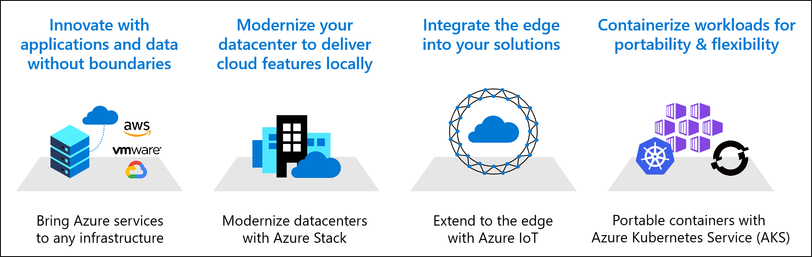

# Innovation on modern app platforms

In the [Innovate methodology](../../innovate/index.md) of the Cloud Adoption Framework for Azure, establishes the processes to drive impactful customer adoption through the Build, Measure, Learn cycle. This methodology focuses on disciplines of digital innovation across data, applications, analytics and AI/ML. With so much innovation potential its imperative to establish a vision for the innovation you want to deliver using the abstraction layers provided by a modern app platform.

## Vision for modern app platform innovation

When integrating modern app platforms into your cloud adoption strategy, the opportunities to innovate are not limited to containers. Integration of modern app platform can unlock all of the innovation that comes with other forms of hybrid and multicloud strategy.

The following are a few examples of innovation unlocked through the layers of abstraction provided by a modern app platform innovation approach:

- **Data and innovation anywhere:** Unlocking application portability between clouds means that data can live where it makes the most sense for your end users. Applications can then follow the data removing boundaries to data democratization and application innovation. *Azure Arc for data* and *Azure Arc for Kubernetes* allows for consistency in management as applications and data move to various environments, allowing developers to focus more on the app & data with less focus on cloud or infrastructure.
- **Modernize your data center:** Modernizing your data centers allows even the most extensively governed workloads to evolve and modernize to use Azure-native tools that can accelerate development times. Building on *Azure Application Services for Kubernetes with Arc* or *Azure Stack HCI* abstract out data center dependencies and allow teams to build for cloud capabilities without leaving the data center.
- **Application platforms for the edge:** Extend your common runtime, shared containers, and orchestration to the edge running IoT or your application runtime on Kubernetes. Install [IoT Edge on Kubernetes](https://docs.microsoft.com/azure/iot-edge/how-to-install-iot-edge-kubernetes) to create a common runtime for IoT devices.
- **Workload portability:** Standardize and centralize container orchestration around *Kubernetes*, *Azure Kubernetes Service*, &/or *Azure Application Services for Kubernetes with Arc* to enable portability of workloads across instances of the common application platform running on public cloud, private cloud, and edge environments.

Understanding how you will integrate modern app platform into you vision will innovation will inform how you apply the CAF Innovate methodology across each of the innovation discipline section below:

## Democratize data

Learn more about ways you can [democratize data](../../innovate/best-practices/data.md). Your modern app platform scenario can accelerate democratization of data. Breaking down data silos across clouds will open doors for business users and data scientists alike. New analytics and insights can be formed by combining data that lives on-prem and in the cloud.

## Engage on applications

Learn more about ways you can [build applications](../../innovate/best-practices/apps.md) on a variety of modern app platforms using the consistent runtimes provided by Azure.

Further extend the capabilities of a common runtime through new applications as:

- Citizen developers, to empower business teams from sales, payroll, finance, and so on. To extend professional applications by creating their own Power Apps and Power Automate solutions.
- Intelligent experiences, to build modern applications in the public cloud, private cloud, or edge with web apps or serverless functions. Infuse intelligence into your modern applications with speech, text, vision, and chat bots.
- Azure Application Services provide an Azure-native runtime. Building on that application platform accelerates development and unlocks Azure-native features like Intelligent experiences.
- Workload portability built on top of the Azure Application Services allows developers to build solutions in the cloud or edge environment that best meets their development criteria. Since those workloads are portable, issues of governance, compliance, and security associated with public cloud, private cloud, or edge decisions can be delayed until later in the development cycles with no fear of re-work or release impacts.

## Interact on devices

Learn more about using [device interactions](../../innovate/best-practices/devices.md) to get closer to your customers.

Bring the business integration of your modern app platform into your customer's environment with:

- **Mobile experiences:** Extend applications through the rapid development of mobile apps using the Azure Application Services runtime.
- **IoT:** Collect data in near-real time from devices in your business environments with Azure IoT on Kubernetes.

## Next step: Govern your modern application platform

The following articles will take you to guidance at specific points in the cloud adoption journey and help you be successful in the cloud adoption scenario.

- [Govern modern app platform solutions](./govern.md)
- [Manage modern app platform solutions](./manage.md)
