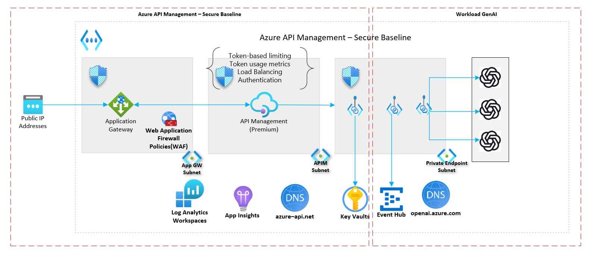

# Azure API Management landing zone accelerator

The Microsoft Azure API Management landing zone accelerator provides an architectural approach and reference implementation to prepare landing zone subscriptions for a scalable API Management infrastructure. The implementation adheres to the architecture and best practices of the Cloud Adoption Framework's Azure landing zones with a focus on the design principles of enterprise-scale.

Customers adopt API Management in various ways. The architectural approach can be used as design guidance for greenfield implementation and as an assessment for brownfield customers already using API Management. The reference implementation can be adapted to produce an architecture that fits **your** way and puts your organization on a path to sustainable scale.

The provided infrastructure-as-code template can be modified to fit your naming conventions, use existing resource such as Azure DevOps agents and Azure Key Vault, and extend to different backends. For example, you can add connections to APIs hosted on Azure App Service or Microsoft Azure Kubernetes Service (AKS).

## Implement a platform foundation

The API Management landing zone accelerator assumes that a platform foundation that takes care of the shared services (network, security, identity, and governance) required to effectively construct and operationalize an enterprise-scale landing zone has been successfully implemented. This isn't mandatory when implementing the API Management landing zone accelerator, but it does handle much of the security and management required to safely manage your cloud environment. If you already have one, you can skip this step. For more information on this, review these articles:

- [Start with Cloud Adoption Framework enterprise-scale landing zones](../../../ready/enterprise-scale/index.md)
- [Implement Cloud Adoption Framework enterprise-scale landing zones in Azure](../../../ready/enterprise-scale/implementation.md)

## What the Azure API Management landing zone accelerator provides

The landing zone accelerator approach provides multiple scenarios and these assets to support your project:

- A modular approach, so that you can customize environment variables
- Design guidelines to aid in evaluating critical decisions
- The landing zone architecture
- An implementation that includes:
  - A deployable reference capable of creating the API Management deployment with a secure baseline configuration with no backends and a sample API
  - A Microsoft-approved API Management reference implementation to test the deployed environment
  - A [generative AI gateway](/azure/architecture/ai-ml/guide/azure-openai-gateway-guide) scenario that deploys on top of the secure baseline. The deployment provides Azure OpenAI endpoints as the backends and provision a client-facing API that can handle [multiple gateway offloading functionality](https://github.com/Azure/apim-landing-zone-accelerator/blob/main/scenarios/workload-genai/README.md#scenarios-handled-by-this-accelerator). Responsibilities such as load balancing multiple Azure OpenAI endpoints, tracking token usage, adaptive rate limiting, managing spikes with pay-as-you-go, and more.

## Design guidelines

These articles provide guidelines for creating your landing zone based on the design areas of Azure landing zones:

- [Identity and access management](./identity-and-access-management.md)
- [Network topology and connectivity](./network-topology-and-connectivity.md)
- [Security](./security.md)
- [Management](./management.md)
- [Governance](./governance.md)
- [Platform automation and DevOps](./platform-automation-and-devops.md)

## Example conceptual reference architecture

The following conceptual reference architecture is an example that shows design areas and best practices.

This architecture consists of API Management deployed in a virtual network in internal mode, fronted by an Application Gateway.

## Generative AI gateway scenario

The generative AI gateway sample code demonstrates how to provision and interact with generative AI resources through API Management. Gateway offloading is a common design pattern when interacting with generative AI models. For more information on this pattern, see [Access Azure OpenAI and other language models through a gateway](/azure/architecture/ai-ml/guide/azure-openai-gateway-guide). The implementation is on top of the API Management baseline and additionally includes private deployments of Azure OpenAI endpoints, and the API Management policies that are tailored for generative AI use cases.

By the end of the deployment guide, you deploy private Azure OpenAI endpoints and an opinionated set of policies in API Management to manage traffic to these endpoints. You test the policies by sending requests to the gateway. You should use the provided policy fragments or modify the solution to include your own custom policies.

The recommended approach for enterprise implementation is to begin with an Azure landing zone to ensure scalability, governance, and security are aligned with Cloud Adoption Framework best practices. If you’re planning to start your baseline integration with Azure OpenAI within an Azure landing zone, follow the steps mentioned in the official documentation: [Azure OpenAI baseline in an application landing zone](/azure/architecture/ai-ml/architecture/azure-openai-baseline-landing-zone).

## Deploy the Azure API Management landing zone accelerator

The API Management landing zone accelerator implementation with infrastructure-as-code templates is available on [GitHub](https://github.com/Azure/apim-landing-zone-accelerator).

## Next steps

Learn about design considerations for identity and access management in your Azure landing zones.

- [Identity and access management for the Azure API Management landing zone accelerator](./identity-and-access-management.md)
