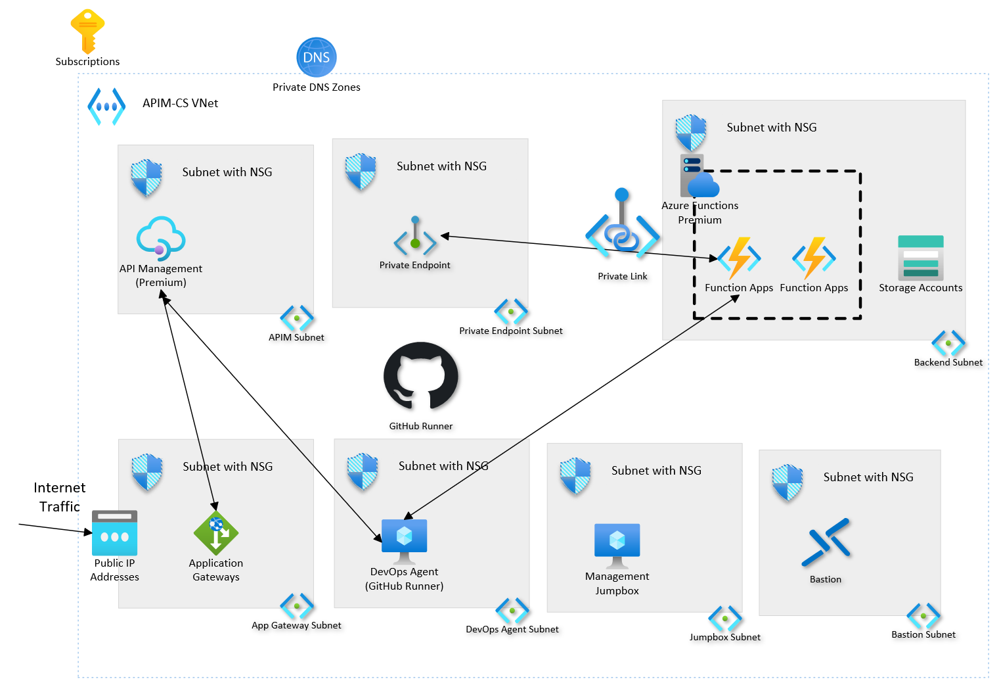

# Azure API Management landing zone accelerator

The Azure API Management landing zone accelerator provides an architectural approach and reference implementation to prepare landing zone subscriptions for a scalable API Management infrastructure. The implementation adheres to the architecture and best practices of the Cloud Adoption Framework's Azure landing zones with a focus on the design principles of enterprise-scale.

Customers adopt API Management in various ways. The architectural approach can be used as design guidance for greenfield implementation and as an assessment for brownfield customers already using API Management. The reference implementation can be adapted to produce an architecture that fits **your** way and puts your organization on a path to sustainable scale.

The provided infrastructure-as-code template can be modified to fit your naming conventions, use existing resources (DevOps agent, key vault, and so on), and extend to different backends. For example, add connections to APIs hosted on App Service, AKS, etc.

## Implement a platform foundation

The Azure API Management landing zone accelerator assumes that a platform foundation that takes care of the shared services (network, security, identity, and governance) required to effectively construct and operationalize an enterprise-scale landing zone has been successfully implemented. This isn't mandatory when implementing the API Management landing zone accelerator, but it does handle much of the security and management required to safely manage your cloud environment. If you already have one, you can skip this step. For more information on this, review these articles:

- [Start with Cloud Adoption Framework enterprise-scale landing zones](../../../ready/enterprise-scale/index.md)
- [Implement Cloud Adoption Framework enterprise-scale landing zones in Azure](../../../ready/enterprise-scale/implementation.md)

## What the Azure API Management landing zone accelerator provides

The landing zone accelerator approach provides these assets to support your project:

- A modular approach, so that you can customize environment variables
- Design guidelines to aid in evaluating critical decisions
- The landing zone architecture
- An implementation that includes:
  - A deployable reference capable of creating the environment for your API Management deployment
  - A Microsoft-approved API Management reference implementation to test the deployed environment

## Design guidelines

These articles provide guidelines for creating your landing zone based on the design areas of Azure landing zones:

- [Identity and access management](./identity-and-access-management.md)
- [Network topology and connectivity](./network-topology-and-connectivity.md)
- [Security](./security.md)
- [Management](./management.md)
- [Governance](./governance.md)
- [Platform automation and DevOps](./platform-automation-and-devops.md)

## Example conceptual reference architecture

The following conceptual reference architecture is an example that shows design areas and best practices.

It consists of API Management deployed in a virtual network in internal mode, fronted by an Application Gateway, with sample Azure Functions backends.

## Deploy the Azure API Management landing zone accelerator

The Azure API Management landing zone accelerator implementation with infrastructure-as-code templates is available on [GitHub](https://github.com/Azure/apim-landing-zone-accelerator).

## Next steps

Learn about design considerations for identity and access management in your Azure landing zones.

- [Identity and access management for the Azure API Management landing zone accelerator](./identity-and-access-management.md)
