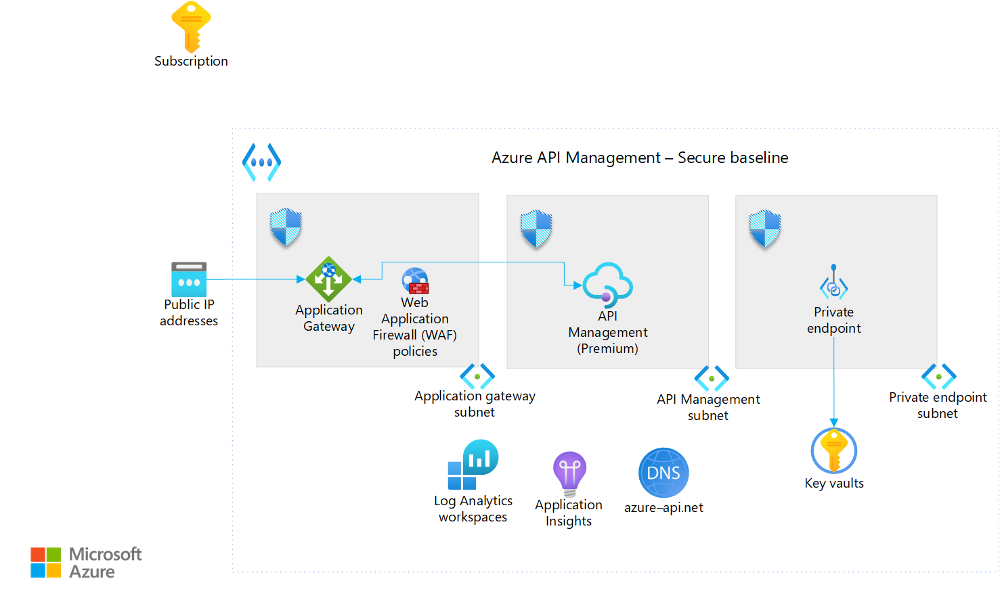

# Azure API Management landing zone accelerator

The Azure API Management landing zone accelerator provides an architectural approach and reference implementation to prepare landing zone subscriptions for a scalable API Management infrastructure. The implementation adheres to the architecture and best practices of the Cloud Adoption Framework for Azure landing zones with a focus on the design principles of enterprise-scale landing zones.

Customers adopt API Management in various ways. You can use this architecture as design guidance for greenfield implementations and as an assessment for brownfield implementations that already use API Management. You can adapt the reference implementation to produce an architecture that fits your workload and puts your organization on a path to sustainable scale.

The provided infrastructure as code (IaC) template can be modified to fit your naming conventions, use existing resources such as Azure DevOps agents and Azure Key Vault, and extend to different back ends. For example, you can add connections to APIs that are hosted on Azure App Service or Azure Kubernetes Service (AKS).

## Implement a platform foundation

The API Management landing zone accelerator assumes that a platform foundation is in place. This foundation handles shared services like network, security, identity, and governance services. These services are required to effectively construct and operationalize an enterprise-scale landing zone and help ensure that it's successfully implemented. This platform foundation isn't mandatory when you implement the API Management landing zone accelerator, but it does handle much of the security and management required to safely manage your cloud environment. If you already have one, you can skip this step. For more information, see the following articles:

- [Start with Cloud Adoption Framework enterprise-scale landing zones](../../../ready/enterprise-scale/index.md)

- [Implement Cloud Adoption Framework enterprise-scale landing zones in Azure](../../../ready/enterprise-scale/implementation.md)

## What the API Management landing zone accelerator provides

The landing zone accelerator approach provides multiple scenarios and these assets to support your project:

- A modular approach so that you can customize environment variables.

- Design guidelines to aid in evaluating critical decisions.

- The landing zone architecture.

- An implementation that includes:

  - A deployable reference that can create the API Management deployment with a secure baseline configuration with no back ends and a sample API.
  
  - A Microsoft-approved API Management reference implementation to test the deployed environment.
  
  - A [generative AI gateway](/azure/architecture/ai-ml/guide/azure-openai-gateway-guide) scenario that deploys on top of the secure baseline. The deployment provides Azure OpenAI Service endpoints as the back ends and provisions a client-facing API that can handle [multiple gateway offloading functionality](https://github.com/Azure/apim-landing-zone-accelerator/blob/main/scenarios/workload-genai/README.md#scenarios-handled-by-this-accelerator). Responsibilities include load balancing multiple Azure OpenAI endpoints, tracking token usage, implementing adaptive rate limiting, and managing spikes with pay-as-you-go models.

## Design guidelines

The following articles provide guidelines to create your landing zone based on the design areas of Azure landing zones:

- [Identity and access management](./identity-and-access-management.md)

- [Network topology and connectivity](./network-topology-and-connectivity.md)

- [Security](./security.md)

- [Management](./management.md)

- [Governance](./governance.md)

- [Platform automation and DevOps](./platform-automation-and-devops.md)

## Example conceptual reference architecture

The following conceptual reference architecture is an example that outlines design areas and best practices.

This architecture consists of API Management deployed in a virtual network in internal mode and is fronted by Application Gateway.

## Generative AI gateway scenario

The generative AI gateway sample code describes how to provision and interact with generative AI resources through API Management. Gateway offloading is a common design pattern when you interact with generative AI models. For more information about this pattern, see [Access Azure OpenAI and other language models through a gateway](/azure/architecture/ai-ml/guide/azure-openai-gateway-guide). The implementation is on top of the API Management baseline and incorporates private deployments of Azure OpenAI endpoints. It also includes API Management policies specifically tailored for generative AI use cases.

Use the deployment guide to deploy private Azure OpenAI endpoints and an opinionated set of policies in API Management to manage traffic to these endpoints. Test the policies by sending requests to the gateway. You should use the provided policy fragments or modify the solution to include your own custom policies.

The recommended approach for an enterprise implementation is to begin with an Azure landing zone to help ensure that scalability, governance, and security are aligned with Cloud Adoption Framework best practices. If you plan to start your baseline integration with Azure OpenAI within an Azure landing zone, follow the steps in [Azure OpenAI baseline in an application landing zone](/azure/architecture/ai-ml/architecture/azure-openai-baseline-landing-zone).

## Deploy the API Management landing zone accelerator

The API Management landing zone accelerator implementation with IaC templates is available on [GitHub](https://github.com/Azure/apim-landing-zone-accelerator).

## Next step

Learn about design considerations for identity and access management in your Azure landing zones.

- [Identity and access management for the API Management landing zone accelerator](./identity-and-access-management.md)
