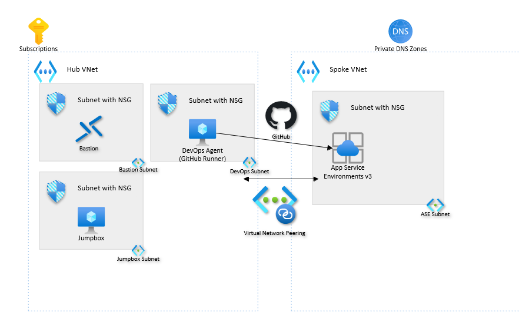

# Azure App Service landing zone accelerator

The Azure App Service landing zone accelerator is an open-source collection of architectural guidance and reference implementation to accelerate deployment of Azure App Service at scale. It can provide a specific architectural approach and reference implementation via infrastructure as code templates to prepare your landing zones. The landing zones adhere to the architecture and best practices of the Cloud Adoption Framework.

The architectural approach can be used as design guidance for greenfield implementation and as an assessment for brownfield customers already using App Service. The reference implementation can be adapted to produce an architecture that fits **your** way and puts your organization on a path to sustainable scale.

The provided infrastructure-as-code template can be modified to fit your naming conventions, use existing resources (DevOps agent, key vault, and so on), and use different modes of App Service Environment v3.

## Implement a platform foundation

Azure App Service landing zone accelerator assumes that a platform foundation that takes care of the shared services (network, security, identity, and governance) required to effectively construct and operationalize a landing zone has been successfully implemented. This isn't mandatory when implementing the Azure App Service landing zone accelerator, but it does handle much of the security and management required to safely manage your cloud environment. If you already have one, you can skip this step. For more information on this, review this article:

- [Implement Cloud Adoption Framework Azure landing zone](../../../ready/landing-zone/index.md)

## What Azure App Service landing zone accelerator provides

The landing zone accelerator approach provides these assets to support your project:

- A modular approach, so that you can customize environment variables
- Design guidelines to aid in evaluating critical decisions. For guidance that is specific to multi-tenant App Service or App Service Environments, individual sections are listed, otherwise the guidance should apply to either deployment.
- An implementation that includes:
  - A deployable reference capable of creating the environment for your Azure App Service deployment
  - A Microsoft-approved Azure App Service reference implementation to test the deployed environment

## Design guidelines

These articles provide guidelines for creating your landing zone:

- [Identity and access management](./identity-and-access-management.md)
- [Network topology and connectivity](./network-topology-and-connectivity.md)
- [Security](./security.md)
- [Management](./management.md)
- [Governance](./governance.md)
- [Platform automation and DevOps](./platform-automation-and-devops.md)

## Example conceptual reference architecture

The following conceptual reference architecture is an example that shows design areas and best practices.

## Deploy Azure App Service landing zone accelerator

The Azure App Service landing zone accelerator reference implementation with infrastructure-as-code templates is available on [GitHub](https://github.com/Azure/appservice-landing-zone-accelerator).

## Next steps

- Review the critical design areas to make complete considerations and recommendations for your Azure App Service architecture. Start with [identity and access management](./identity-and-access-management.md).
