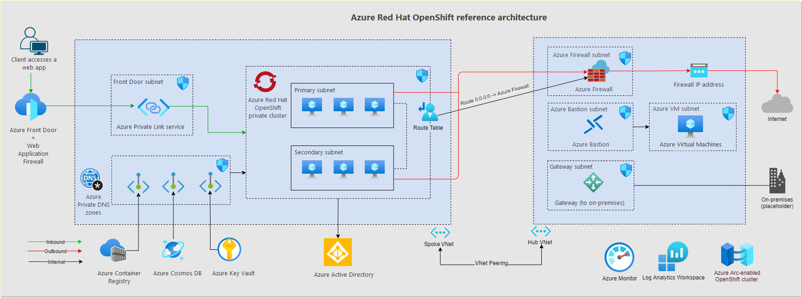

# Azure Red Hat OpenShift landing zone accelerator

The Azure Red Hat OpenShift landing zone accelerator is a collection of design guidance and implementation references to accelerate deployment of Azure Red Hat OpenShift clusters in your landing zone.

This solution is open source. You can adapt the templates to create an architecture that meets your needs. The landing zone accelerator is both a strategic design path and a target technical state, and it adheres to the architecture and best practices of the Cloud Adoption Framework's Azure landing zones. The design decisions your organization makes, based on this guidance, can lay the groundwork for scalability.

## Implement a platform foundation

The Azure Red Hat OpenShift landing zone accelerator assumes that a platform foundation has been successfully implemented, which will take care of the shared services required to construct and operationalize a landing zone. Shared services include networking, security, identity, and governance.

A platform foundation isn't mandatory to implement a landing zone accelerator, but it does handle much of the security and management required to safely manage your cloud environment. If you already have a platform foundation, you can skip this step. For more information, review [Implement Cloud Adoption Framework Azure landing zone](../../../ready/landing-zone/index.md).

## Landing zone accelerator benefits

The landing zone accelerator approach for Azure Red Hat OpenShift provides:

- A modular approach that allows you to customize your environment variables.
- Design guidelines for evaluating critical decisions.
- The landing zone architecture.
- A Microsoft-recommended reference implementation using Azure CLI.

## Design areas

There are many issues to consider when creating Azure landing zones.

- [Identity and access management considerations](./identity-access-management.md)
- [Network topology and connectivity considerations](./network-topology-connectivity.md)
- [Resource organization considerations](./resource-organization.md)
- [Security considerations](./security.md)
- [Operations management and baseline considerations](./operations.md)
- [Deployment option considerations](./platform-automation-devops.md)

## Reference architecture

The following diagram shows the landing zone accelerator architecture.

## Resources on GitHub

The landing zone accelerator is an open-source repo that consists of an Azure CLI reference implementation along with Critical Design Area recommendations. The repo is [available on GitHub](https://github.com/Azure/ARO-Landing-Zone-Accelerator).

## Next steps

Learn about [identity and access management for your Azure Red Hat OpenShift landing zone](./identity-access-management.md).
