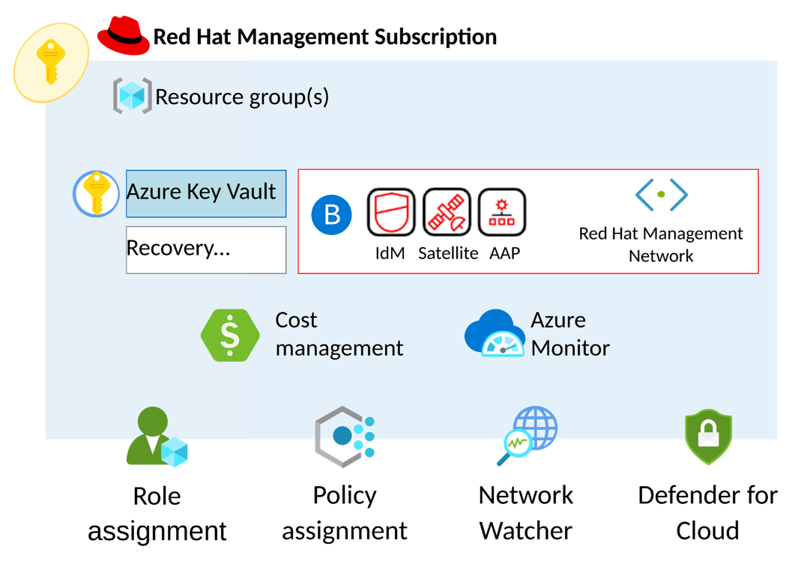

# Identity and access considerations for Red Hat Enterprise Linux on Azure

Identity and access management (IAM) is a key part of an organization's security settings when it deploys the Azure Red Hat Enterprise Linux landing zone accelerator. The Red Hat Enterprise Linux operating system and the applications that run on it need to consume external identities to scale operations. Careful design of your hybrid cloud IAM implementation is required to ensure smooth integration and management of your instance landscape in Azure cloud. Red Hat and Microsoft continue to work together to ensure there's native integration between Red Hat Enterprise Linux, Microsoft Active Directory, and Microsoft Entra ID identity management.

## Design considerations

Use these design considerations and recommendations to create an identity and access management plan that meets your organization's requirements in your Azure Red Hat Enterprise Linux deployment.

In general, a Red Hat Enterprise Linux deployment in a hybrid-cloud environment should:

- Use a centralized Linux identity authority that integrates with the operating system security subsystem where possible to increase operational efficiency and access control visibility. Utilizing a centralized Linux identity authority enables:
  - Managing host-specific authorization for the Linux operating system
  - Achieving consistency across hybrid deployments
  - Delegating authentication to external sources
  - Streamlining the access control review process
  - Ensuring uniformity
  - Accelerating the implementation process
  - Enhancing the security framework of a hybrid cloud Linux infrastructure.

- Be capable of applying policies uniformly to multiple instances simultaneously without modifying each instance in the infrastructure through automation whenever there's a change.  

- Support centralized, secure, differentiated instance-level access control using host-based access control, delegation, and other rules.

- Centrally manage system-level privilege escalation rules across the identity authority and be able to apply this policy consistently across individual instances and groups of instances within the environment.

- Support or provide modern automation tooling capability to test and consistently implement security configurations across fleets of systems. Design security automation into a hybrid-cloud deployment from the beginning.  

- Support the integration of existing legacy enterprise SSO capabilities to ease migration burdens, maintain consistency of security operations, and support modern integrations for cloud-based deployments.

Linux deployments tend to implement local user authentication environments at the operating system level. System-level authentication and authorization, object ownership, object permissions, and application integrations are based on this model. Operating system applications use these identities in many ways:

- Application processes run under some user identity.

- Application processes create or access files attributed to specific users and groups.

- A set of groups that a user belongs to is fixed at sign-in time, and membership changes are only applied to new sessions.

- Authentication and authorization flow of a user is directly tied to the login session that is instantiated as a result of authentication.

User-initiated shell sessions based on these identities were previously the primary means of interaction with applications on Linux. With the move to web, mobile, and cloud-oriented user interfaces, this pattern of identity consumption by applications is less common.  

Today, these identities are typically a support mechanism for running isolated applications or services on the operating system. Application-level identities don't necessarily have to be the same as the system-level users anymore. However, system-level identity is still critical in efficiently running and securing a Linux infrastructure running at scale in a cloud environment.  

For smaller cloud deployments or pilot deployments, these traditional IAM methodologies provide a straightforward way of getting started. As an environment scales, these mechanisms start to become more difficult to manage even when using automation. As the number of touch points increases, so does the volume of configuration, logging, and drift data and required analysis. Centralizing IAM becomes a critical activity.  

There are various tools that provide for centralized security within a Linux environment. Any of these tools that meet the general considerations and recommendations for deploying centralized IAM management in a cloud can be used as long as they meet business and technical requirements. Red Hat Enterprise Linux has a broad software compatibility list with respect to security. Customers can integrate application-level security using Azure's native Microsoft Entra ID, commercial open-source software solutions like Okta, Sailpoint, or JumpCloud, or open-source project solutions such as Keycloak. Additionally, various security solutions are available at the operating system level as well. Many commercial solutions and open-source software projects can be operated in the cloud.

## Design recommendations - Red Hat Identity Management

Design recommendations for identity and access management regarding Azure Landing Zones for Red Hat Enterprise Linux using Red Hat Identity Management (IdM) and Red Hat single sign-on (SSO) follow the Microsoft Azure Cloud Adoption Framework and Red Hat Infrastructure Standard Adoption Model. The recommendations extend the principles you would use to implement a hybrid-cloud deployment.  

Red Hat developed a centralized way to manage identity stores, authentication, policies, and authorization in a Linux-based domain called Red Hat Identity Management (IdM). Red Hat IdM natively integrates with Microsoft Active Directory and Microsoft Entra ID and is included with Red Hat Enterprise Linux. Organizations extending their on-premises Active Directory to Azure could benefit from Red Hat IdM's native AD trust capability. Similarly, those adopting Microsoft Entra ID or using an alternate IdP provider can also use Red Hat IdM and Red Hat single sign-on (SSO) for seamless integration. Red Hat SSO is a supported enterprise implementation of the Keycloak open-source project. It's provided at no extra cost with various Red Hat subscriptions, including Red Hat Ansible Automation Platform. Red Hat recommends implementing Red Hat Identity Management within your Red Hat Enterprise Linux deployment in Azure.

*Figure n: A high-level depiction of a Red Hat Enterprise Linux management subscription deployment.*

The identity and access management components for your Red Hat deployment in Azure use the subscription scaling model described in the Azure Cloud Adoption Framework documentation to provide extra control and isolation to the management tooling. The Identity Management primary and replica systems and Red Hat single sign-on instances reside in a Red Hat Management Subscription with other tools. The subscription provides resource groups throughout the implementation to provide localized services and high availability.

 *Figures: Zone level HA and Regional level HA with Red Hat Identity Management*

*Figure N: A recommended high availability deployment of Red Hat Identity Management across regions and availability zones. IdM servers within each region replicate to one another and a hidden replica. There are at least two replication links across regions. The hidden replicas serve as the backup points as they might be taken offline for full backups without affecting availability.*
*IdM clients can load balance and failover between IdM servers based on service record discovery or via a list of servers in sssd.conf. Don't use external load balancing or HA configurations with IdM.*

Critical design recommendations for your Red Hat Identity Management deployment are:

- Implement Infrastructure-as-Code (IaC) automation for deployment, configuration, and day-2 operation of Red Hat Identity Management. Red Hat offers the certified Ansible collection [redhat.rhel_idm](https://console.redhat.com/ansible/automation-hub/repo/published/redhat/rhel_idm/) through the [Ansible Automation Hub](https://console.redhat.com/ansible/automation-hub/), designed for automating Red Hat Identity Management. Additionally, there's the [redhat.sso](https://console.redhat.com/ansible/automation-hub/repo/published/redhat/sso/) certified Ansible collection for automating Red Hat single sign-on.

- Implement enterprise and application identity support. Understand clearly which services are exposed by instances and require authentication at the operating system level and which require authentication at the application level. Red Hat IdM is recommended to implement OS layer security, host-based access control rules, privilege escalation management rules (for example, sudo), SELinux policy mapping, and identity mapping for legacy systems. Red Hat single sign-on is recommended to integrate enterprise authentication sources with web-based applications.

- Centralized identity management is critical in threat response. It can instantly invalidate and/or rotate compromised credentials across cloud-scale deployments. Which is why we strongly advise the use of centralized identity and authorization frameworks.

- Determine the initial integration path for current identity providers with the Azure Cloud deployment, such as Active Directory, Microsoft Entra ID, etc. Red Hat Identity Management supports several integration options. Adding and removing integrations can be performed within IdM, however, it's best to evaluate existing requirements, migration impacts, and cost of change over time.  

- Geographical deployments of Red Hat Enterprise Linux instances affect your IdM infrastructure. IdM primary and replica deployments should be configured to reduce latencies and ensure no single point of failure in replication. Red Hat Identity Management provides for performance, load balancing, failover, and high availability by deploying multiple IdM replicas. Deployments can consist of up to 60 replicas. Replica deployments should ensure that systems span fault domains. IdM replica updates should be managed via automation to ensure replication consistency. Use Red Hat recommended replication topologies.  

- Active Directory trust configuration and Domain Name System (DNS) configuration are key to a successful IdM implementation. When you configure Identity Management and Active Directory, the directory servers need to reside in their own DNS domains or subdomains due to the nature of Kerberos service records. Which isn't a limitation of Active Directory or Identity Management. Private IP DNS resolution for Azure-based instances is recommended in the Azure Cloud Adoption Framework.  

- Red Hat Identity Management provides an integrated DNS service. Configuring Red Hat Satellite for IdM integration automates management tasks such as forward and reverse DNS zones, host registration, and SSH key generation and registration within IdM. This integration when coupled with AD trust provides seamless SSO login for AD users to Red Hat Enterprise Linux systems and services.

- Back up your IdM resources. Although Identity Management is typically deployed in a self-managed multi-master replica configuration, ensuring proper backups of systems and data is critical. Identity Management supports using hidden replicas to implement full offline backups without interrupting service availability. Use Azure platform encrypted backup or other encrypted backup facility.  

- When you deploy Red Hat Enterprise Linux with the integrated certificate authority (CA), having the IdM root certificate signed by an external CA, corporate, or 3rd-party, is recommended.

- Integrating Red Hat Identity services with other Red Hat products. Red Hat Identity Management and Red Hat SSO integrate with Ansible Automation Platform, OpenShift Container Platform, OpenStack Platform, Satellite, and development tools.

The Planning Identity Management guide provides detailed considerations for planning the infrastructure and service integration of a Red Hat Identity Management deployment. Refer to the specific guide for the operating system release of Red Hat Enterprise Linux on which your IdM deployment is based.

## Design Recommendations - Azure Native Identity Management

- Use Azure Red Hat Enterprise Linux (RHEL) Virtual Machines (VMs) with Microsoft Entra ID to limit user rights and minimize the number of users who have administrator rights. Limiting user rights protects the configuration and secrets access. [Azure built-in roles for Compute](https://learn.microsoft.com/en-us/azure/role-based-access-control/built-in-roles/compute)

- Follow the principle of least privilege by assigning the minimum permissions needed for authorized tasks. Give full access only as needed and just-in-time. Use [Privileged Identity Management](https://learn.microsoft.com/en-us/azure/defender-for-cloud/just-in-time-access-usage) in Microsoft Entra ID and [identity and access management in Azure landing zones](https://learn.microsoft.com/en-us/azure/cloud-adoption-framework/ready/landing-zone/design-area/identity-access).  

- Access Microsoft Entra protected RHEL resources without needing to manage secrets for workloads that run on Azure using [managed identities](https://learn.microsoft.com/en-us/entra/identity/managed-identities-azure-resources/overview?toc=%2Fazure%2Factive-directory%2Fworkload-identities%3Ftoc%3D%2Fazure%2Factive-directory%2Fworkload-identities%2Ftoc.json&bc=%2Fazure%2Factive-directory%2Fworkload-identities%2Fbreadcrumb%2Ftoc.json).

- Consider using Microsoft Entra ID as a core authentication platform and a certificate authority to [SSH into a Linux VM](https://learn.microsoft.com/en-us/entra/identity/devices/howto-vm-sign-in-azure-ad-linux).

- For access to sensitive information, use Azure Keyvault provider to mount secrets stored in Azure Key Vault

- Implement SSO by using Windows AD, Microsoft Entra ID, or AD FS, depending on the access type, so that the end users can connect to RHEL applications without a user ID and password once the central identity provider successfully authenticates them.

- Use a solution like Local Administrator Password Solution (LAPS) to frequently rotate local administrator passwords. For more information, see [Security assessment: Microsoft LAPS usage](https://learn.microsoft.com/en-us/defender-for-identity/cas-isp-laps).

## Next steps

Learn about Network topology and connectivity considerations for Red Hat Enterprise Linux.
