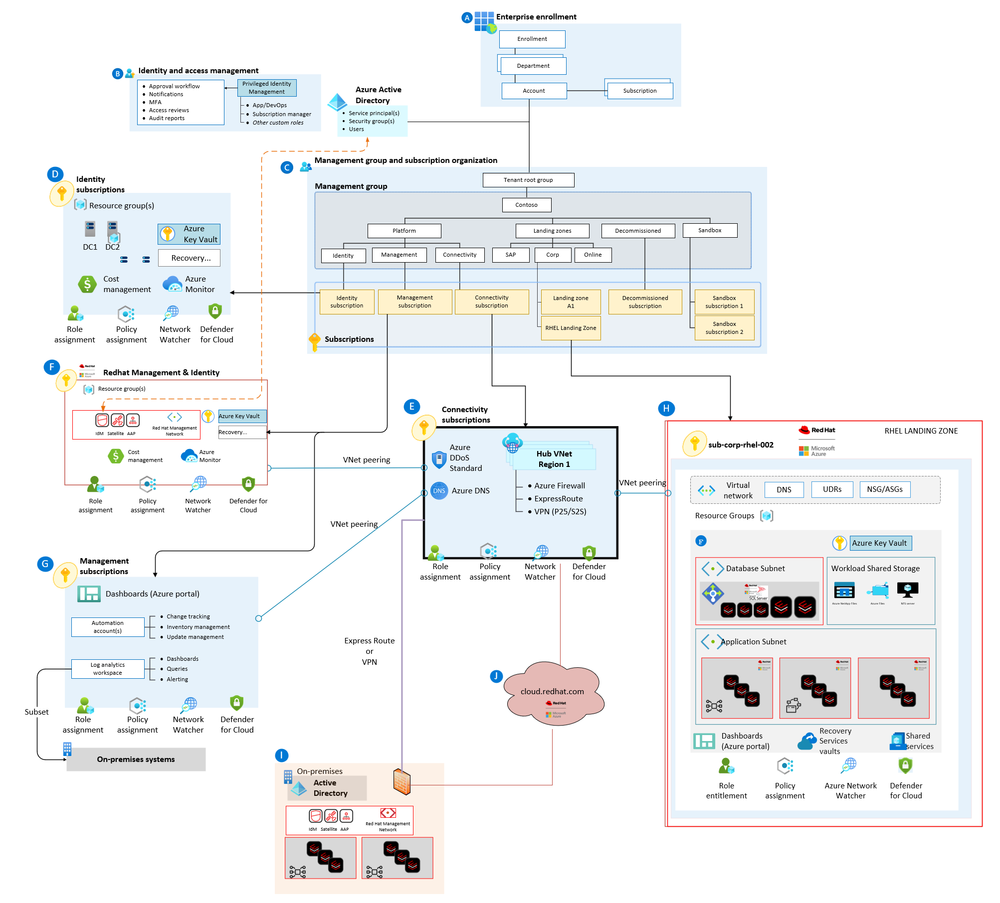
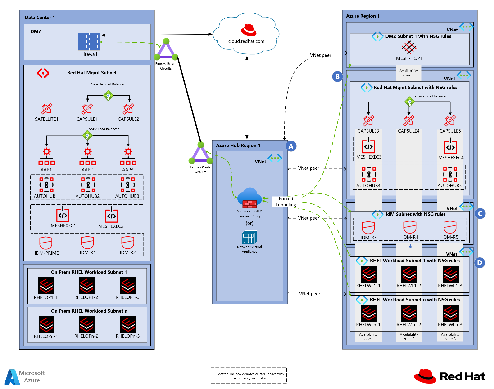
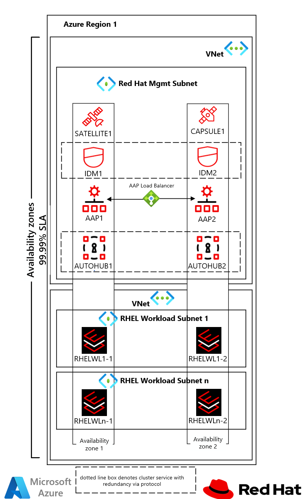
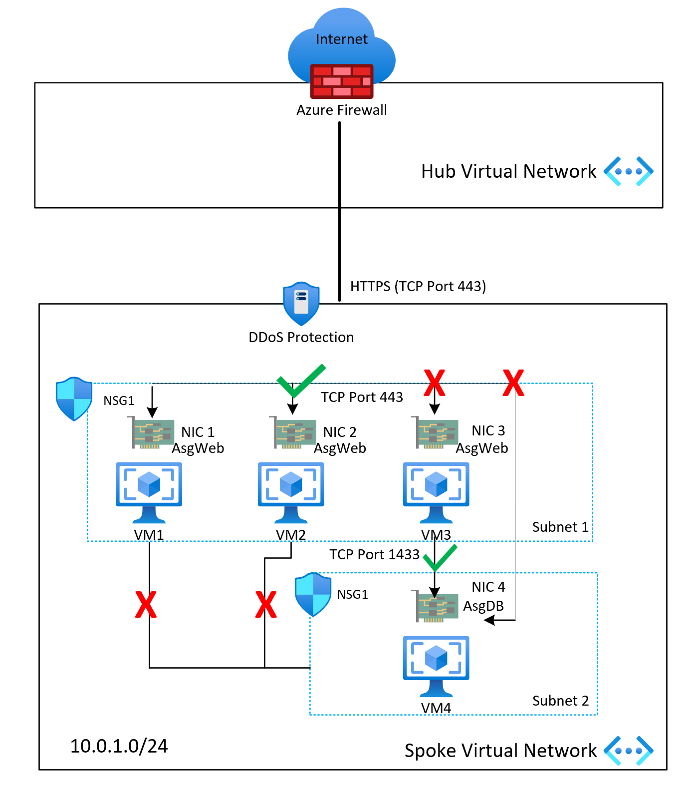

# Overview

The Red Hat Enterprise Linux (RHEL) network considerations and recommendations are based on the guidance found in the Azure landing zone article [Azure landing zone design area for network topology and connectivity](/azure/cloud-adoption-framework/ready/landing-zone/design-area/network-topology-and-connectivity).

## Architecture

The RHEL reference architecture is a starting point and should be further adapted to meet your specific business and technical requirements. The various RHEL platform components and roles can be deployed on virtual machines with specific sizing and redundancy as needed. The network layout in these examples is simplified to demonstrate architectural principles and not intended to describe an entire enterprise network.

[Download the Visio file](azure-landing-zone-rhel-full-view.vsdx)

|               |                                 |
|:-------------:|:--------------------------------|
| Element A | Components in the Microsoft Customer Agreement and Billing. |
| Element B | Components in Microsoft Entra Identity and Access Management. |
| Element C | Components in Azure Management Groups. |
| Element D | Components in Active Directory Identity Management Subscription. |  
| Element E | Components in Network Hub Subscription. |
| Element F | Components in the RHEL Management and Identity subscription. |
| Element G | Components in the Azure Management Group Subscription. |
| Element H | Components in the RHEL Production Workload subscription. |  
| Element I | Components on-premises. |
| Element J | Red Hat Cloud Services. |

## Design considerations for RHEL Platform landing zones networking

Consider the following recommendations for the landing zone networking design:

- A hub & spoke network is the recommended topology for single or multi-region deployments. [Azure Virtual WAN Hub](/azure/virtual-wan/virtual-wan-about) can provide extra features or a traditional virtual network hub can be used. For more information, see the article [Azure Landing Zone Networking](/azure/cloud-adoption-framework/ready/landing-zone/design-area/network-topology-and-connectivity).

- For Virtual WAN topologies, consider using Azure Firewall to route traffic across landing zones using Azure Firewall, which provides traffic filtering and logging capabilitie.

- Hybrid connectivity to the hub is controlled with Azure VPN Gateway or an ExpressRoute gateway. The traffic can be monitored and controlled with Azure Firewall or a virtual network appliance (NVA) in the hub.

- An on-premises firewall can be used for protecting and routing all ingress and egress internet traffic, but it may introduce latency for cloud-based resources. Determine your performance and security requirements to determine how ingress and egress traffic should be routed.

  >

|               |                                 |
|:-------------:|:--------------------------------|
| Element A | Components in the Red Hat Management virtual network contained via the Red Hat Management subscription. |
| Element B | Components in the RHEL Workloads virtual network contained via the RHEL Production Workloads subscription. |
| Element C | Components in the Identity Management virtual network contained via the Red Hat Identity Management subscription. |
| Element D | Components in the RHEL Workloads virtual network contained via the RHEL Production Workloads subscription. |
  
  >

|               |                                 |
|:-------------:|:--------------------------------|
| Element A | Components in the Red Hat Management virtual network contained via the Red Hat Management subscription. |
| Element B | Components in the RHEL Workloads virtual network contained via the RHEL Production Workloads subscription. |
| Element C | Components in the Identity Management virtual network contained via the Red Hat Identity Management subscription. |
| Element D | Components in the RHEL Workloads virtual network contained via the RHEL Production Workloads subscription. |

- Utilize [private endpoints](/azure/private-link/private-endpoint-overview) for all supported Azure services to improve security. Private endpoints ensure that all traffic routes through your private networking rather than over public IP addresses.

- IP address scopes and virtual network size planning for the RHEL landing zone should consider dedicated subnets for application, database, and storage resources.
  
- Adopt a zero-trust-based approach for your perimeter networking, and traffic security. For more information about this approach, see [Network security strategies on Azure](/azure/well-architected/security/networking)

- Use Network Security Groups (NSGs) to help protect traffic across subnets and east/west traffic across the platform (traffic between landing zones). [Azure Policy](/azure/networking/policy-reference) can make it default for all subnets.

- Use NSGs and [application security groups](/azure/virtual-network/application-security-groups) to micro-segment traffic within the landing zone and avoid using a central NVA to filter traffic flows.

- Enable NSG flow logs and feed them into [Traffic Analytics](/azure/network-watcher/traffic-analytics). Flow logs should be enabled on all critical VNets/subnets in your subscription to optimize audit-ability and security.

  >

- Use NSGs to selectively allow connectivity between landing zones.

- The application team should use application security groups at the subnet-level NSGs to help protect multi-tier VMs within the landing zone.

- If your organization decides to implement forced tunneling (advertise default route) to on-premises, consider incorporating outbound NSG rules to deny egress traffic from the virtual network directly to the internet, in case the Border Gateway Protocol (BGP) session drops. For more information, see the article [Plan for landing zone network segmentation](/azure/cloud-adoption-framework/ready/azure-best-practices/plan-for-landing-zone-network-segmentation).

- Automate your deployments, configuration management, and day-2 operations for all landing zone network-related components through [Infrastructure-as-Code](/azure/well-architected/operational-excellence/infrastructure-as-code-design).

## Outbound options for enabling internet and filtering and inspecting traffic

- Outbound access to Red Hat Cloud via the hub network.
- On-premises default route should use on-premises internet access.
- Virtual WAN or traditional virtual network hub secured with Azure Firewall or NVA.

## Inbound options for delivering content and applications

- Azure Application Gateway with L7, Transport Layer Security (TLS) termination, and Web Application Firewall.
- Dynamic Network Translation (DNAT) and load balancer from on-premises.
- Azure Virtual Network  with Azure Firewall or NVA, and Azure Route Server in various scenarios.
- Virtual WAN hub with Azure Firewall, with L4 and DNAT.
- Virtual WAN hub with NVA in various scenarios.

## Domain Name Resolution for on-premises and Azure Resources

Redhat Enterprise environment often uses both on-premises and Azure resources requiring effective name resolution of resources. The following recommendations should be considered.

- Azure provides a default internal name resolution within a virtual network. There's no configuration required for this scenario. Do note, the Domain Name Resolution (DNS) suffix can't be modified and manual registration isn't possible. For more information, see the article [Name resolution that Azure Provides](/azure/virtual-machines/linux/azure-dns?tabs=ubuntu#name-resolution-that-azure-provides).

- For name resolution across virtual networks, RHEL deployments often use DNS services supplied by the Redhat Identity Management Server (IDm) or [Azure DNS](/azure/dns/dns-overview). Combining [Azure Private DNS Resolver](/azure/dns/dns-private-resolver-overview) and existing DNS infrastructure can provide rule-based forwarding if needed.

## Next Steps

Learn about deployment, management, and patching considerations for Red Hat Enterprise Linux systems
