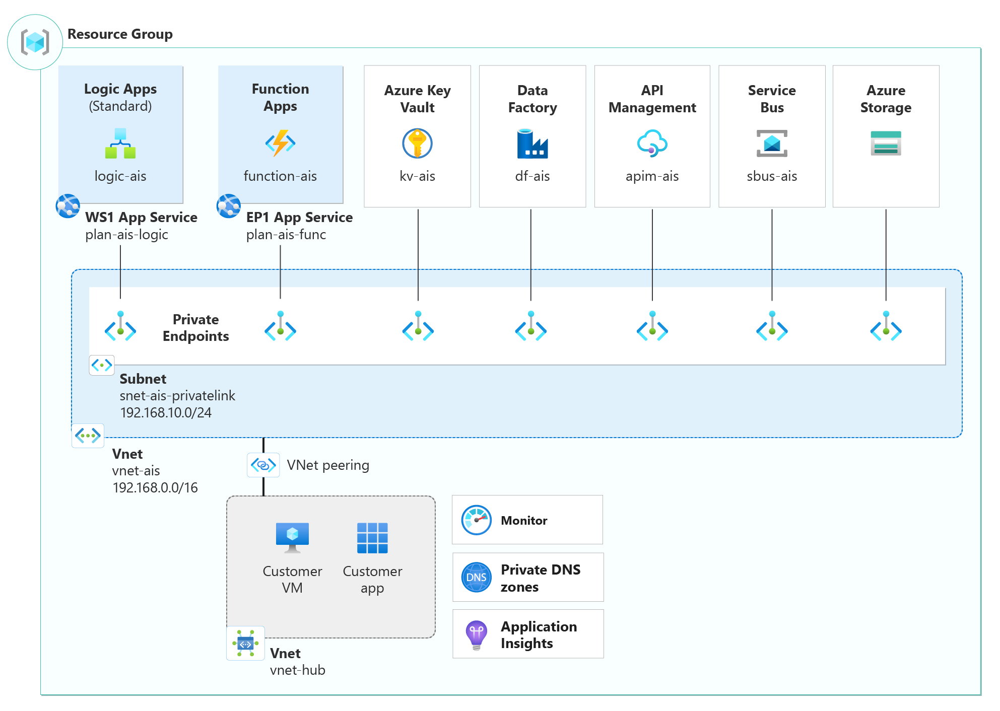

# Azure Integration Services landing zone accelerator

Azure Integration Services landing zone accelerator is intended for an **application team** that's **building and deploying an integration platform** in a typical enterprise landing zone design. As the workload owner, use the **architectural guidance** to achieve your target technical state with confidence.  

## What's included in the accelerator

The landing zone accelerator is a set of design considerations, reference architecture, backed by an implementation.

- **Design areas** cover considerations and recommendations for common technical areas that integrate with the centralized services.

    - [Identity and access management](./identity-and-access-management.md)
    - [Network topology and connectivity](./network-topology-and-connectivity.md)
    - [Security](./security.md)
    - [Management](./management.md)
    - [Governance](./governance.md)

- **Reference architecture** provides design guidance that applies the recommendations for an example workload.

    

- **Reference implementation** accompanies the architecture and demonstrates the best practices, deploying all the resources needed for an enterprise-ready AIS platform. Once deployed, all you need to do is upload your own code/workflows/files to start using this environment.

    > [!IMPORTANT]
    >  Refer to the [Azure Integration Services Reference Implementation](https://github.com/Azure/Integration-Services-Landing-Zone-Accelerator/blob/main/docs/Reference%20Implementation.md).

## Integration with platform landing zones

The accelerator assumes that the enterprise (platform) landing zones are based on [Azure landing zone](../../../ready/landing-zone/index.md) guidance. The platform landing zones have shared services managed by centralized teams, so that you can focus your efforts on application development and workload resources. 

It's highly recommended that you have a good understanding of the **integration points between the shared resources and workload resources**. If there are changes required in the platform, work with the centralized team to get the changes implemented with a **shared responsibility mindset**. For example, communicate the expected potential of the workload early so that the central networking team can allocate a virtual network with address space that's large enough to accommodate that growth.

## Next steps

Review the critical design areas to make complete considerations and recommendations for your architecture. 

> [!div class="nextstepaction"] 
> [Review the identity and access management design area](./identity-and-access-management.md)
