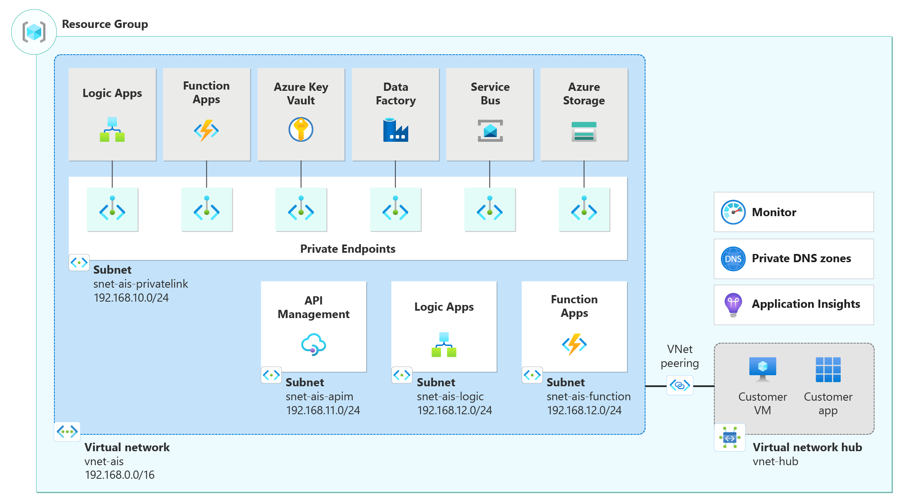

# Network topology and connectivity considerations for the Integration Services landing zone accelerator

This article provides design considerations and recommendations for network topology and connectivity that you can apply when you use the Azure Integration Services (AIS) landing zone accelerator. Networking is central to almost everything in a landing zone.

The network topology and connectivity considerations for this architecture depend on the requirements of the workloads being hosted and on the security and compliance requirements of your organization.

## Design considerations

Use a network topology based on [Virtual WAN](/azure/cloud-adoption-framework/ready/azure-best-practices/virtual-wan-network-topology) if your organization:

- Plans to deploy resources across several Azure regions and requires global connectivity between VNets in these Azure regions and multiple on-premises locations.

- Needs to integrate a large-scale branch network directly into Azure, either via a software-defined WAN (SD-WAN) deployment or requires more than 30 branch sites for native IPsec termination.

- You require transitive routing between VPN and ExpressRoute, such as remote branches connected via Site-to-Site VPN or remote users connected via Point-to-Site VPN, require connectivity to an ExpressRoute connected DC, via Azure.

Organizations use Virtual WAN to meet large-scale interconnectivity requirements. Microsoft manages this service, which helps reduce overall network complexity and modernizes your organization's network.

Use a [traditional Azure network topology](/azure/cloud-adoption-framework/ready/azure-best-practices/traditional-azure-networking-topology) based around a hub-and-spoke architecture if your organization:

- Plans to deploy resources in only select Azure regions.

- Doesn't need a global, interconnected network.

- Has few remote or branch locations per region and needs fewer than 30 IP security (IPsec) tunnels.

- Requires full control of the configuration or requires manual custom configuration of your Azure network.

### Reference network topology

The following architecture diagram shows the reference architecture for an AIS enterprise deployment:

## Plan for IP addressing

Enterprise deployments of AIS should include the use of Private Endpoints and Virtual Networks. The following design considerations should be taken into account when planning your IP addressing:

- Some AIS services require [dedicated subnets](/azure/virtual-network/virtual-network-for-azure-services#services-that-can-be-deployed-into-a-virtual-network)

    - [API Management](/azure/api-management/api-management-using-with-vnet?toc=%2Fazure%2Fvirtual-network%2Ftoc.json&tabs=stv2#enable-vnet-connectivity-using-the-azure-portal-stv2-compute-platform)
    
    - [Logic Apps](/azure/logic-apps/secure-single-tenant-workflow-virtual-network-private-endpoint#prerequisites)
    
    - You can designate a given subnet t0 a given service to create instances of that service within the subnet. For example, you can designate a subnet to app service plans so that you can add additional apps over time.
    
    - Azure VPN Gateway can connect overlapping, on-premises sites with overlapping IP address spaces through its [network address translation (NAT) capability](/azure/vpn-gateway/nat-howto).

## Custom DNS

Most AIS services allow customers to use their own DNS names for public endpoints, either using their own DNS servers, or via the Azure DNS offering. Configuration of these is done on a resource by resource basis, but the supported resources are listed below:

- API Management supports [custom domains](/azure/api-management/configure-custom-domain?tabs=custom).

- Function Apps and Logic Apps support [custom domains](/azure/app-service/app-service-web-tutorial-custom-domain?tabs=a%2Cazurecli), when hosted by an App Service Plan or App Service Environment.

- Storage accounts support [custom domains](/azure/storage/blobs/storage-custom-domain-name?tabs=azure-portal) for blob storage endpoints.

- Data Factory, Service Bus and Event Grid do not support custom domains.

## Private DNS

[Azure Private DNS](/azure/dns/private-dns-overview) provides a reliable and secure DNS service for your virtual network. Azure Private DNS manages and resolves domain names in the virtual network without the need to configure a custom DNS solution.

To resolve the records of a private DNS zone from your virtual network, you must [link the virtual network with the zone](/azure/dns/private-dns-virtual-network-links). Linked virtual networks have full access to and can resolve all DNS records published in the private zone.

### Design considerations

- It's important to correctly configure your DNS settings to resolve the private endpoint IP address to the fully qualified domain name (FQDN) of your resources.

- Existing Microsoft Azure services might already have a DNS configuration for a public endpoint. This configuration must be overridden to connect using your private endpoint.

## Encryption and certificate authentication

If your network design requires encryption of in-transit traffic, and/or certificate-based authentication, you may need to consider where and how this encryption/authentication is performed. For example, you need to identify which service performs TLS termination.

### Design considerations

- Does your design require that traffic between Azure services be encrypted? Can your encryption be terminated at an [Azure Front Door](/azure/frontdoor/front-door-overview), and then be non-encrypted while traversing Azure backbone or within your VNet?

- Will you need to terminate encryption at multiple places?

- Do you need to handle authentication at multiple places, or can it be performed once for an external request?

### Design recommendations

- If using an enterprise hub-and-spoke design, consider using Azure Front Door as your entry point for internet-based requests.

- Consider using [Azure Application Gateway](/azure/application-gateway/create-ssl-portal) as the termination point for any external TLS-based requests or [API Management](/azure/api-management/api-management-howto-mutual-certificates) for certificate authentication and/or SSL termination.

## Connectivity to on-premises resources

Many enterprise integration scenarios require connecting your on-premises systems to Azure. It is important to consider the recommended models to provide this connectivity.

### Design considerations

- [Azure ExpressRoute](/azure/expressroute/expressroute-introduction) provides dedicated private connectivity to Azure Infrastructure as a Service (IaaS) and Platform as a Service (PaaS) resources from on-premises locations.

- [Azure VPN Gateway](/azure/vpn-gateway/vpn-gateway-about-vpngateways) provides Site-to-Site (S2S) shared connectivity over the public internet to Azure Infrastructure as a Service (IaaS) virtual network resources from on-premises locations.

- Azure ExpressRoute and Azure VPN Gateway have [different capabilities, costs and performance](/azure/vpn-gateway/vpn-gateway-about-vpngateways#planningtable).

- The [on-premises data gateway](/data-integration/gateway/service-gateway-onprem) (OPDG) or [Azure Hybrid Connections](/azure/app-service/app-service-hybrid-connections) can be used where ExpressRoute or VPN Gateway is not practical – OPDG/Hybrid Connections are both examples relay services, utilizing Service Bus to make connections outbound from your on-premises network to receive requests from Azure, without having to open ports in your external firewall/network.

    - OPDG is limited in the number of requests per minute it supports (the throttling limit), has specific data size limits, and only works with limited Azure resources (Logic Apps, Power BI, Power Apps, Power Automate, Analysis Services).
    
    - Hybrid connections work with App Services (Function Apps or Web Apps) and has its own throttling and sizing limits.
    
    - [Azure Relay Hybrid Connections](/azure/azure-relay/relay-hybrid-connections-protocol) is a key part of Service Bus which allows for relays outside of App Services or OPDG.

### Design recommendations

- Use Azure **ExpressRoute** as the primary connectivity channel for connecting an on-premises network to Azure.

- Ensure that you are using the right SKU for the ExpressRoute and/or VPN Gateway based on bandwidth and performance requirements.

- Use Azure **VPN Gateway** to connect branches or remote locations to Azure.

- Use **OPDG** and/or **Hybrid Connections** where ExpressRoute or VPN Gateway can’t be used, where the throughput limits will not be an issue, and where you are using a support Azure Resource (e.g. Logic Apps, Function Apps).

## Connectivity to AIS PaaS services

Azure AIS PaaS services are typically accessed over public endpoints. The Azure platform provides capabilities for securing these endpoints or even making them entirely private.

Securing these endpoints can be achieved using either [service endpoints](/azure/virtual-network/virtual-network-service-endpoints-overview) or [private endpoints](/azure/private-link/private-endpoint-overview). These two options are similar but the choice between using a service endpoint or private endpoint depends largely on your security requirements.

- To block all internet traffic to a target resource, use a private endpoint.

- If you want to secure a specific sub-resource to your VNet resources, use a private endpoint.

- If you want to secure a specific storage account to your VNet resources, you can use a private endpoint or a service endpoint with a service endpoint policy.

- If you don't need a private IP address at the destination, service endpoints are considerably easier to create and maintain, and they don't require special DNS configuration.

- Service endpoints have zero cost.

[Azure Private Link](/azure/private-link/private-link-overview) enables you to [access Azure AIS Services](/azure/private-link/availability#integration) (for example, Service Bus and API Management) and Azure-hosted customer-owned/partner services over a private endpoint in your virtual network.

When using Private Link, traffic between your virtual network and the service traverses the Microsoft backbone network, so exposing your service to the public internet is no longer necessary. You can create your own private link service in your virtual network and deliver it to your customers. Setup and consumption using Azure Private Link is consistent across Azure PaaS, customer-owned, and shared partner services.

### Design considerations

- Virtual network injection provides dedicated private deployments for supported services. Management plane traffic still flows through public IP addresses.

- Azure Private Link provides dedicated access by using private IP addresses for Azure PaaS instances or custom services behind Azure Load Balancer Standard tier.

- Enterprise customers often have concerns about public endpoints for PaaS services that must be appropriately mitigated.

### Design recommendations

- Use virtual network injection for supported Azure services to make them available from within your virtual network.

- Azure PaaS services injected into a virtual network still perform management plane operations by using service specific public IP addresses. Connectivity must be guaranteed for the service to operate correctly.

- Access Azure PaaS services from on-premises through ExpressRoute with private peering. Use either virtual network injection for dedicated Azure services or Azure Private Link for available shared Azure services.

- To access Azure PaaS services from on-premises when virtual network injection or Private Link isn't available, use ExpressRoute with Microsoft peering, which lets you avoid traversing the public internet.

- Accessing Azure PaaS services from on-premises via ExpressRoute with Microsoft peering doesn't prevent access to the public endpoints of the PaaS service. You must configure and restrict that separately as required.

- Don't enable virtual network service endpoints by default on all subnets.

- Disable public access to AIS PaaS services.

## Network design for API Management

### Design considerations

- Decide if APIs are accessible externally, internally, or a hybrid of both.

- Decide if you want to use the internal [API Management gateway](/azure/api-management/virtual-network-concepts?tabs=stv2#limitations) as your main endpoint, or if you want to use a Web Application Firewall (WAF) service like [Azure Application Gateway](/azure/web-application-firewall/ag/ag-overview) or [Azure Front Door](/azure/web-application-firewall/afds/afds-overview).

- Decide if there should be multiple gateways deployed and how these are load balanced - for example, by using [Application Gateway in front of the API Management gateway](/azure/architecture/reference-architectures/apis/protect-apis).

- Decide whether connectivity to on-premises or multicloud environments is required.

### Design recommendations

- Deploy your API Management instance [in a VNet](/azure/api-management/api-management-using-with-vnet) to allow access to backend services in the network.

- Use [Application Gateway](/azure/api-management/api-management-howto-integrate-internal-vnet-appgateway) for external access to API Management when the API Management instance is deployed in a VNet in internal mode.

- Use a [private endpoint for your API Management](/azure/api-management/private-endpoint) instance to allow clients in your private network to securely access the instance over Azure Private Link.

## Network design for Storage Accounts

Azure Storage is used as the storage solution for Azure Logic Apps and Azure Functions.

### Design recommendations

- Enable a [Service Endpoint for Azure Storage](/azure/storage/common/storage-network-security?toc=%2Fazure%2Fvirtual-network%2Ftoc.json&tabs=azure-portal#grant-access-from-a-virtual-network) within the VNet if you need to keep the public IP address of the storage account available. The service endpoint routes traffic from the VNet through an optimal path to the Azure Storage service. The identities of the subnet and the virtual network are also transmitted with each request. Administrators can then configure network rules for the storage account that allow requests to be received from specific subnets in a VNet.

- For best performance, your Logic App/Function App should use a storage account in the same region, which reduces latency.

- Use [private endpoints](/azure/storage/common/storage-private-endpoints) for Azure Storage accounts to allow clients on a virtual network (VNet) to securely access data over a Private Link.

- Different private endpoints should be created for each table, queue and blob storage service.

## Network design for App Service Environments

An [App Service Environment](/azure/app-service/environment/overview) (ASE) is a dedicated, isolated environment for running web apps, function apps, and Logic Apps (Standard). It is deployed in your VNet, and contains a number of App Service Plans, each of which are used to host your app services.

### Design considerations

- An ASE is deployed onto a single subnet within your VNet. An ASE can be deployed using a Virtual IP Address (VIP) allowing external connections to use a publicly-visible IP address, which can be added to a public DNS record.

- Applications within an ASE will have access to all other resources within the Virtual Network, depending on network access rules. Access to resources in other VNets can be achieved using Virtual Network peering.

- Applications within an ASE don’t need to be configured to belong to a VNet – they are automatically within the VNet by virtue of being deployed to the ASE. This means that instead of having to configure network access on a per-resource basis, you can configure it once at the ASE level.

### Design recommendations

- Use ASE v3 where possible, as this gives the greatest amount of [network flexibility](/azure/app-service/environment/overview#virtual-network-support), while reducing configuration needed for individual resources within the ASE. ASE v3 also supports Zone Redundancy.

## Network design for App Service Plans

- App Services in a multi-tenanted environment can be deployed with a private or a public endpoint. When deployed with a [private endpoint](/azure/app-service/networking/private-endpoint), public exposure of the App Service is removed. If there's a requirement for the private endpoint of the App Service to also be reachable via the internet, consider the use of App Gateway to expose the app service.

- Plan your subnets carefully for outbound VNet integration considering the number of IP addresses that are required. VNet integration requires a dedicated subnet. When planning your subnet size, be aware that Azure [reserves 5 IP addresses](/azure/virtual-network/virtual-networks-faq#are-there-any-restrictions-on-using-ip-addresses-within-these-subnets) in each subnet. Additionally, one address is used from the integration subnet for each plan instance. When you scale your app to four instances, then four addresses are used. When you scale up or down in size, the required address space is doubled for a short period of time. This affects the real, available supported instances in your subnet.

When there is a need to connect from an App Service to on-premises, private, or IP-restricted services, consider that:

- When running in the multi-tenanted environment, the App Service call can originate from a wide range of IP addresses, and VNet integration may be needed to meet your networking requirements.

- Services like API Management (APIM) can be used to proxy calls between networking boundaries and can provide a static IP if needed.

### Design recommendations

- Since subnet sizes can't be changed after assignment, use a subnet that is large enough to accommodate whatever scale your app might reach. To avoid any issues with subnet capacity, you should use a /26 suffix (64 addresses) for VNet integration.

## Network design for Azure Data Factory

### Design considerations

- To connect Data Factory to a data source located in your on-premises network, or perhaps on an Azure service that has been configured to block access from all Azure services unless they are specifically permitted, you need to consider integrating your Data Factory with a virtual network that provides network access to the target data source.

- Data Factory employs separate environments called [integration runtimes](/azure/data-factory/concepts-integration-runtime). The default Data Factory runtime, the Azure integration runtime, is not associated with a VNet and as such it cannot be used to connect to data sources that are secured with the most restrictive firewalls. Consider [which of these runtimes](/azure/data-factory/choose-the-right-integration-runtime-configuration) best meet your requirements.

- Managed VNets take some time to start up, whereas normal Azure runtimes are available almost instantly. This is something you need to keep in mind when both scheduling your pipelines and debugging them.

- SSIS runtimes with a VNet-integrated runtime will take up to 30 minutes to start.

- Self-hosted integration runtimes can only execute the copy activity, which copies data from one source to another as-is. If you want to perform any transformations to the data, you can’t do those using Data Factory’s data flows.

- [Managed Private Endpoints](/azure/data-factory/managed-virtual-network-private-endpoint#managed-private-endpoints) are private endpoints created in the Azure Data Factory Managed Virtual Network establishing a private link to Azure resources (generally data sources for ADF). Azure Data Factory manages these private endpoints on your behalf.

- [Private endpoints](/azure/data-factory/data-factory-private-link) are only available for self-hosted integration runtimes to connect to Data Factory.

## Network design for Logic Apps (Standard) - VNet integrated apps

### Design considerations

- Inbound traffic to your logic apps will come through private endpoints. Refer to the [considerations for inbound traffic through private endpoints](/azure/logic-apps/secure-single-tenant-workflow-virtual-network-private-endpoint#considerations-for-inbound-traffic-through-private-endpoints) documentation when planning your Logic Apps networking design.

- Outbound traffic from your logic apps flows through the VNet.  Refer to the [considerations for outbound traffic through virtual network integration](/azure/logic-apps/secure-single-tenant-workflow-virtual-network-private-endpoint#considerations-for-outbound-traffic-through-virtual-network-integration) documentation when planning your Logic Apps networking design.

## Network design for Service Bus

### Design considerations

- Are you using [Private DNS zones](/azure/private-link/private-endpoint-dns)
  or your own DNS server (with DNS forwarding) to resolve to a private
  link resource?

- IP Filtering and VNets are only supported in the Premium SKU tier for Service Bus. If the Premium Tier isn’t practical, look at using [SAS Tokens](/azure/service-bus-messaging/service-bus-authentication-and-authorization#shared-access-signature) as your primary way of locking down access to your namespace.

### Design recommendations

- Public network access should be disabled using [IP Filtering](/azure/service-bus-messaging/service-bus-ip-filtering), which applies to all supported protocols (for example, AMQP and HTTPS).

- Traffic to this namespace should be restricted over [private endpoints](/azure/service-bus-messaging/private-link-service) only, by restricting public network access (using IP Filtering).

- Place your private endpoint in its own dedicated subnet reserved for Service Bus.

- Add a DNS record using the private DNS zone for the private endpoint. Enable trusted services within Azure to access your namespace directly (thereby bypassing the firewall) to prevent issues with your integration design.

## Network design for Function Apps

### Design considerations

- Are you using [Private DNS zones](/azure/private-link/private-endpoint-dns) or your own DNS server (with DNS forwarding) to resolve to a private link resource?

### Design recommendations

- Public network access should be disabled.

- Traffic to this namespace should be restricted over private endpoints only.

- Place your private endpoint in its own dedicated subnet reserved for Functions.

- Add a DNS record using private DNS zone for the private endpoint.

## Network design for Azure Key Vault

### Design recommendations

- Public network access should be disabled.

- Create a private endpoint for [restricting access](/azure/key-vault/general/private-link-service?tabs=portal) via VNet’s only.

- Place your private endpoint in its own dedicated subnet reserved for Key Vault.

- Add a DNS record using private DNS zone for the private endpoint.

## Network design for Event Grid

### Design considerations

- Are you using [Private DNS zones](/azure/private-link/private-endpoint-dns) or your own DNS server (with DNS forwarding) to resolve to a private  link resource?

### Design recommendations

- Public network access should be disabled using IP Filtering.

- Traffic to your topics and domain should be restricted over Private Endpoints only.

- Place your private endpoint in its own dedicated subnet reserved for Event Grid.

- Add a DNS record using private DNS zone for the private endpoint.

## Network design for Event Hubs

### Design considerations

- Restricting network access does not work with the Basic SKU tier in Event Hubs

### Design recommendations

- Public network access should be disabled using IP Filtering.

- Public network access should be disabled using Service Endpoints: Create a Virtual Network Service Endpoint in your VNet and bind this to your Event Hubs namespace using a virtual network rule

- Enable the Trusted Services option to allow select Azure resources to access your namespace.

## Next step

Review the critical design areas to make complete considerations and recommendations for your architecture. 

> [!div class="nextstepaction"] 
> [Security](./security.md)

## Recommended content

- [What is Azure Private Link](/azure/private-link/private-link-overview)

- [Azure Private Link availability](/azure/private-link/availability#integration)

- [Virtual Network Service Endpoints Overview](/azure/virtual-network/virtual-network-service-endpoints-overview)

- [Azure Private Endpoint DNS configuration](/azure/private-link/private-endpoint-dns)

- [App Service Environments (ASE) Overview](/azure/app-service/environment/overview)

- [Integrate Key Vault with Azure Private Link](/azure/key-vault/general/private-link-service?tabs=portal)

- [Protect APIs with Application Gateway and API Management](/azure/architecture/reference-architectures/apis/protect-apis)

- [Network Security for Azure Event Grid](/azure/event-grid/network-security)

- [Network Security for Azure Event Hubs](/azure/event-hubs/network-security)

- [Allow access to Azure Event Hubs namespaces from specific virtual networks](/azure/event-hubs/event-hubs-service-endpoints)

- [Overview of TLS termination using Application Gateway](/azure/application-gateway/ssl-overview)
