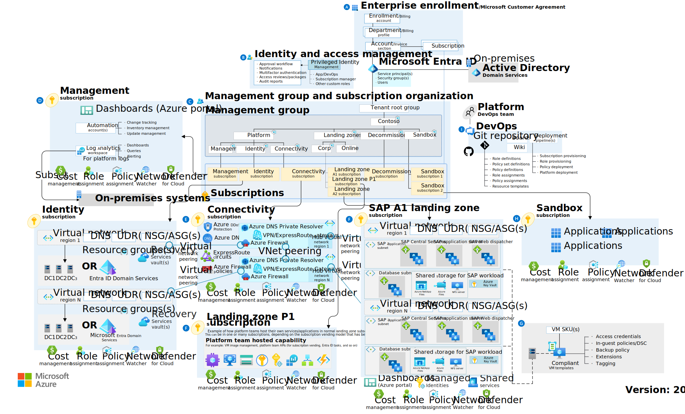

# Azure landing zones for modern application platforms

The [Ready methodology](../../ready/index.md) of the Cloud Adoption Framework guides the creation of all Azure environments using [Azure landing zones](../../ready/landing-zone/index.md). Azure landing zones provide many [implementation options](../../ready/landing-zone/implementation-options.md) built around a set of [common design areas](../../ready/landing-zone/design-areas.md).

With Azure landing zones, you can start with a small implementation and expand over time. For more sophisticated environments, you can start with enterprise-scale implementation options. You need to evaluate any landing zone to be used for modern application platform solutions, no matter what implementation option you choose.

## Azure landing zone conceptual architecture

When preparing any environment for sustained cloud adoption, we use the [Azure landing zones](../../ready/landing-zone/index.md) conceptual architecture to represent what a target end state should look like in Azure, as pictured below.

*For more information on the design areas labeled A-I in the visual, see [environment design areas](../../ready/landing-zone/design-areas.md#environment-design-areas).*

When developing a long-term vision for landing zones, consider the design above. Working within this scenario, we focus on the most appropriate starting point to meet your strategic and planning requirements related to modern application platforms. This article is about the starting point, not necessarily all of the details required to reach the longer-term target.

## Strategic and planning considerations for application platforms landing zones

Prioritization decisions made during [strategy](./strategy.md) and [plan](./plan.md) conversations have a direct impact on the most appropriate landing zone configuration to support your modern application platforms plan. The following are the most critical considerations from those phases:

- Will central IT, CCoE, or other forms of centralized operations be responsible for operating the container hosts?
- Does your strategy and plan require shared containers supporting multiple workloads per cluster?
- Will the centralized teams also support segmented container solutions for hostile workloads?

The questions influence landing zone design since each suggests a need for a centralized operations team to manage containers. When operational responsibilities are shared across centralized teams and development teams, more considerations need to go into the environment's design to allow for shared services and separation of duties, suggesting an enterprise-grade landing zone.

## Demonstrating actionable scope

To maximize output during initial implementations, the remainder of this guide focuses on implementing Azure Kubernetes Service (AKS) with the ability to add an overlay for Azure App Service on Kubernetes with Azure Arc. This approach narrows the scope of options by providing a reference architecture and implementation.

To establish a foundation for other [Azure products](./azure-products.md) for modern application platforms, see the [container architectures](/azure/architecture/guide/technology-choices/compute-decision-tree?bc=/azure/cloud-adoption-framework/_bread/toc.json&toc=/azure/cloud-adoption-framework/scenarios/app-platform/toc.json) tab in the left navigation for rich architecture and implementation references for each tool.

## Implementation option considerations

Selecting the best Azure landing zone implementation option will directly impact how well a landing zone can support the implementation options above. Review the [Azure landing zones](../../ready/landing-zone/index.md) article series for more information on Azure landing zone implementation options. Which of the Azure landing zone implementation options best addresses the strategy and planning considerations governing your modern application platforms scenario?

- **Existing Azure landing zone strategy:** If your organization has already implemented an Azure landing zone strategy, your modern application platforms scenario likely must adhere to the existing strategy. Otherwise, choose one of the following as your first step toward repeatable landing zone environments.
- **Start-small and expand with the AKS baseline:** The [baseline architecture for an Azure Kubernetes Service (AKS) cluster](/azure/architecture/reference-architectures/containers/aks/secure-baseline-aks?bc=/azure/cloud-adoption-framework/_bread/toc.json&toc=/azure/cloud-adoption-framework/scenarios/app-platform/toc.json) provides a proven approach to deploying your first AKS environment.
  - This option is most commonly used when the developer or DevOps teams are directly responsible for the operations of the clusters, cloud environments, and applications.
  - Processes and best practices in the Ready, Govern and Manage methodologies of the Cloud Adoption Framework could be added later to prepare this deployment for central operations and shared hosts.
- **Enterprise-scale landing zones:** The [AKS landing zone accelerator](./aks/landing-zone-accelerator.md) includes a reference implementation to deploy an instance of the AKS baseline into an enterprise-scale landing zone to support your AKS platform within the specific environmental configuration required by the broader enterprise-scale landing zone solutions.
  - This is the most common option when compliance, governance, or security requirements must be applied centrally to any container environment.
  - It's also the most common option for centralized teams delivering container hosting operations, allowing developers to focus more on the application and less on developing for Kubernetes.

The primary difference between the two options above resides in how the separation of duties is expressed and implemented regarding Azure resources, subscription topology, and usage of Azure Policy for governance. Understand your organization's plan around centralized versus decentralized operations and which works best for your organization's workloads. Both models can be flexed to provide the exact experience your organization and workloads require, but you want to start with the one most closely aligned with your defined strategy. Ensure all workload teams understand the operating model and duties required of all IT groups and members.

## Application platform overlays

Once the core AKS landing zone is deployed and ready for further application deployment, more application platform configuration can be applied to the container hosts. With Azure App Service for Kubernetes with Azure Arc, this includes the installation of a specific application platform on top of each of your clusters.

Depending on your deployment pipeline and your container registry, you have two options for adding the application platform overlays:

- The overlay installation can be included in the container images in your container registry, standardizing the application platform deployment with the container deployment.
- Alternatively, the overlay can be deployed during your DevOps pipeline adding the runtime to an existing instance of your container hosts.

These two options depend on host operations practices and the degree of variability in application runtimes across your portfolio of workloads.

## Azure landing zone design areas

All Azure landing zones are designed around a set of common design areas listed below. Each article includes a set of AKS-specific considerations and recommendations that can help the modern application platforms team prepare a landing zone for AKS containers:

- [Enterprise enrollment](./aks/azure-billing-ad-tenant.md)
- [Identity and access management](./aks/identity-and-access-management.md)
- [Network topology and connectivity](./aks/network-topology-and-connectivity.md)
- [Resource organization](./aks/resource-organization.md)
- [Governance disciplines](./aks/security.md)
- [Operations baseline](./aks/management.md)
- [Business continuity and disaster recovery](./aks/management.md)
- [Deployment options](./aks/platform-automation-and-devops.md)

## Next step: Migrate workloads to modern application platforms

The following articles take you to the guidance found at specific points in the cloud adoption journey to help you succeed in the cloud adoption scenario.

- [Migrate workloads to modern application platforms](./migrate.md)
- [Innovate using modern application platform solutions](./innovate.md)
- [Govern modern application platform solutions](./govern.md)
- [Manage modern application platform solutions](./manage.md)
