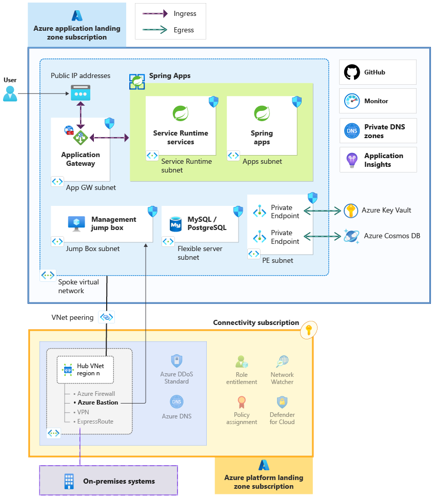

# Azure Spring Apps landing zone accelerator

Azure Spring Apps landing zone accelerator is intended for an application team that's building and deploying Spring Boot applications in a typical enterprise landing zone design. As the workload owner, use architectural guidance provided in this accelerator to achieve your target technical state with confidence.  

## What's included in the accelerator

The landing zone accelerator is a set of design considerations and reference architecture that's backed by an implementation.

- **Design areas** cover considerations and recommendations for common technical areas that integrate with the centralized services.

  - [Identity and access management](./identity-and-access-management.md)
  - [Network topology and connectivity](./network-topology-and-connectivity.md)
  - [Security](./security.md)
  - [Monitor operations](./management.md)

- **Reference architecture** provides design guidance that applies the recommendations to an example Spring app. The practical approach is used as design guidance for greenfield implementation and as an assessment for brownfield customers that already use Spring Boot apps.

    For more information about this architecture, see [Azure Spring Apps integrated with landing zones](/azure/architecture/web-apps/spring-apps/spring-apps-landing-zone).

    

- **Reference implementation** accompanies the architecture and demonstrates the best practices. It provides infrastructure as code (IaC) templates for a sample Spring app.

For more information, see [Azure Spring Apps reference implementation](https://github.com/Azure/springapps-landing-zone-accelerator).

## Integration with platform landing zones

The accelerator assumes that the enterprise (platform) landing zones are based on [Azure landing zone](../../../ready/landing-zone/index.md) guidance. The platform landing zones have shared services that centralized teams manage. You can focus your efforts on application development and workload resources.

It's highly recommended that you have a good understanding of the integration points between the shared resources and workload resources. If the platform requires changes, work with the centralized team to get the changes implemented with a shared responsibility mindset. For example, communicate the expected potential of the workload early so that the central networking team can allocate a virtual network with address space that's large enough to accommodate that growth.

## Next steps

[Identity and access management](./identity-and-access-management.md)
