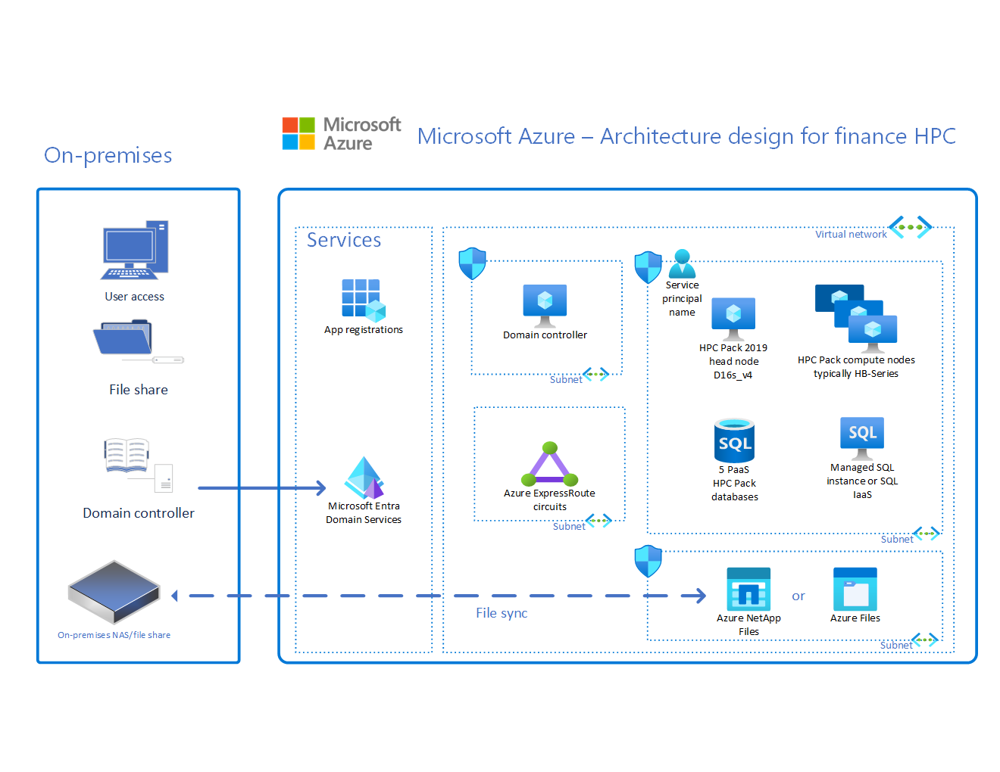

# Azure high-performance computing (HPC) landing zone accelerator

The high-performance computing (HPC) landing zone accelerator automates the deployment of an environment. This environment provides a base framework that you can customize to create an end-to-end deployment mechanism for a complete HPC cluster solution in Azure. The accelerator is a collection of open-source scripts & templates that can prepare your enterprise-scale landing zones. It can provide a specific architectural approach and a reference implementation that adhere to the architecture and best practices of the Cloud Adoption Framework. 

Customers adopt HPC in various ways to suit their business needs, and you can adapt the HPC landing zone accelerator to produce an architecture that fits *your* way. Using the accelerator helps to put your organization on a path to a sustainable scale.

## Implement an enterprise-scale landing zone

The HPC landing zone accelerator assumes that you're starting with an enterprise-scale landing zone that's been successfully implemented. For more information on this prerequisite, see the following articles:

- [Start with Cloud Adoption Framework enterprise-scale landing zones](../../ready/enterprise-scale/index.md)
- [Implement Cloud Adoption Framework enterprise-scale landing zones in Azure](../../ready/enterprise-scale/implementation.md)

## What the HPC landing zone accelerator provides

The approach to landing zones of the HPC landing zone accelerator provides the following assets to your project:

- A modular approach, so that you can customize environment variables
- Design guidelines to aid in evaluating critical decisions
- The landing zone architecture
- An implementation that includes:
  - A deployable reference capable of creating the environment for your HPC deployment
  - A Microsoft-approved HPC reference implementation to test the deployed environment

## Design guidelines for energy, manufacturing, and finance

The architectures of landing zones vary by business sector, in addition to varying by organization. This section lists articles by sector that provide guidelines for creating your landing zone:

- Energy (Oil and Gas)
  - [Azure Billing and Azure Active Directory tenants for energy HPC](./energy/azure-billing-active-directory-tenant.md)
  - [Identity and access management for Azure HPC in energy](./energy/identity-access-management.md)
  - [Management for Azure HPC in energy](./energy/management.md)
  - [Network topology and connectivity for Azure HPC in energy](./energy/network-topology-connectivity.md)
  - [Platform automation and DevOps for Azure HPC in energy](./energy/platform-automation-devops.md)
  - [Resource organization for HPC in the energy industry](./energy/resource-organization.md)
  - [Governance for HPC in energy industries](./energy/security-governance-compliance.md)
  - [Security for Azure HPC in energy](./energy/security.md)
  - [Compute large-scale HPC application workloads in Azure VMs](./energy/compute.md)
  - [Storage for HPC energy environments](./energy/storage.md)

- Manufacturing
  - [Manufacturing HPC Azure billing and Active Directory tenants](./manufacturing/azure-billing-active-directory-tenant.md)
  - [Azure identity and access management for HPC in manufacturing](./manufacturing/identity-access-management.md)
  - [Management for HPC in the manufacturing industry](./manufacturing/management.md)
  - [Manufacturing HPC network topology and connectivity](./manufacturing/network-topology-connectivity.md)
  - [Platform automation and DevOps for Azure HPC in the manufacturing industry](./manufacturing/platform-automation-devops.md)
  - [Manufacturing HPC resource organization](./manufacturing/resource-organization.md)
  - [Azure governance for manufacturing HPC](./manufacturing/security-governance-compliance.md)
  - [Security for HPC in manufacturing industries](./manufacturing/security.md)
  - [Manufacturing HPC storage](./manufacturing/storage.md)
  
- Finance
  - [Azure billing offers and Active Directory tenants for finance HPC](./finance/azure-billing-active-directory-tenant.md)
  - [Finance HPC Azure identity and access management](./finance/identity-access-management.md)
  - [Management for HPC in the finance sector](./finance/management.md)
  - [Network topology and connectivity for HPC in the finance sector](./finance/network-topology-connectivity.md)
  - [Platform automation and DevOps for HPC in the finance sector](./finance/platform-automation-devops.md)
  - [Resource organization for Azure HPC in the finance sector](./finance/resource-organization.md)
  - [Governance for finance HPC](./finance/security-governance-compliance.md)
  - [Security for HPC in the finance sector](./finance/security.md)
  - [Storage for HPC in the finance sector](./finance/storage.md)

### Design Guidelines for choosing HPC compute for AI workloads

Choosing the right SKU of GPU optimized compute for AI workloads is important for optimizing performance and controlling costs. Microsoft offers many different SKUs that are optimized for workloads that benefit from more GPU power. There are several considerations when choosing the right SKU for AI workloads. Smaller workloads may only take advantage of a fraction of the CPU, GPU and bandwidth of more powerful SKUs like NDv4. You may want to consider other compute SKUs such as NCv4 and NDv2 for smaller jobs. Here are some considerations when choosing the right SKU of GPU optimized compute for AI workloads:

- Checkpointing. Consider factors such as the checkpoint interval when running your machine learning models. This can impact the GPU performance during the training phase. Strike a balance between storage efficiency and maintaining smooth GPU operations. Monitor your GPU usage.
- Inferencing. Inferencing requirements differ from training requirements, with a possible higher CPU load that can max out the CPU performance. Consider the inferencing requirements of your model when selecting a compute SKU. Monitor your CPU usage.
- Training. Consider the requirements of your model during training, monitoring both the CPU and GPU usage.
- Job Sizing. When considering the compute SKU for your AI workloads, consider the size of the job. Smaller jobs, such as those approximately OPT 1.3B may not take advantage larger SKU sizes and may leave CPU and GPU power idle depending on the stage of the job (inferencing, training).
- Bandwidth. Larger, lower latency bandwidth can be an expense when not utilized. Consider InfiniBand for only the largest models that will require the extra bandwidth.

View Azure's [GPU optimized virtual machine sizes](/azure/virtual-machines/sizes-gpu).

## Example: conceptual reference architecture for energy

The following conceptual reference architecture is an example that shows design areas and best practices for *energy* environments.

:::image type="content" alt-text="Diagram that shows an example architecture for an energy environment, including compute, storage, subnets, a database, and a front end for on-premises users." source="./media/network-interconnect.png" lightbox="./media/network-interconnect.png":::

## Example: conceptual reference architecture for finance

The following conceptual reference architecture is an example that shows design areas and best practices for *finance* environments.

## Example: conceptual reference architecture for manufacturing

The following conceptual reference architecture is an example that shows design areas and best practices for *manufacturing* environments.

:::image type="content" alt-text="Diagram that shows an example architecture for a manufacturing environment, including on-premises and cloud resources and an HPC landing zone." source="./media/hpc-manufacturing-architecture-example.png" lightbox="./media/hpc-manufacturing-architecture-example.png":::

## Obtain the HPC landing zone accelerator

The HPC landing zone accelerator is available on GitHub: [Azure HPC OnDemand Platform Accelerator](https://azure.github.io/az-hop/)

## Next steps

For considerations and recommendations for your HPC landing zone accelerator architecture, review the critical design areas of the HPC landing zone accelerator in [Azure Identity and Access Management](./energy/identity-access-management.md).
