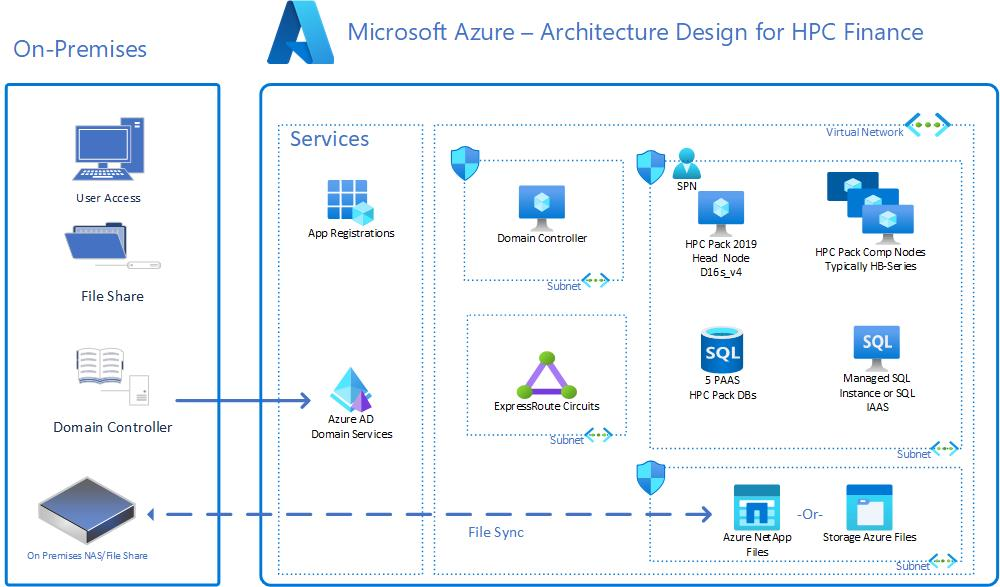

# Azure VMs to run large-scale HPC application workloads for the Finance industry

These workloads, also known as big compute, require a large number of cores and can include tasks such as financial risk modeling and engineering stress analysis.

Big compute applications typically have the following characteristics:

- The workload can be divided into discrete tasks that can be run simultaneously across many cores.
- Each task takes input, processes it, and produces output. The entire application runs for a finite amount of time.
- The application doesn’t need to run 24/7, but it must be able to handle node failures or crashes.
- Tasks could be independent or tightly coupled, requiring high-speed networking technologies such as InfiniBand and RDMA.
- Compute-intensive VM sizes such as H16r, H16mr, and A9 could be used depending on the workload.

Azure offers a range of VM instances optimized for both CPU and GPU intensive workloads that can run into Virtual Machine Scale Sets to provide resiliency and load balance. It is also the only cloud platform that offers InfiniBand-enabled hardware, providing a significant performance advantage for running tasks such as financial risk modeling and engineering stress analysis. This improved performance results in near or better performance than current on-premises infrastructures.

Azure VMs offer a variety of options, known as VM sizes, for HPC and GPU-optimized computing. It’s important to select the appropriate VM size for your workload, and you can use the [Sizes for VMs in Azure selector tool](/azure/virtual-machines/sizes) to help you choose.
Keep in mind that not all Azure products are available in all regions.

You can check the current [list of products available by region](https://azure.microsoft.com/explore/global-infrastructure/products-by-region/) to see what’s available in your area.

For best practices on choosing Azure compute options, you can check out the [Azure compute blog](https://techcommunity.microsoft.com/t5/azure-compute-blog/bg-p/AzureCompute) or the [Azure compute service](/azure/architecture/guide/technology-choices/compute-decision-tree) content.

Azure offers both CPU-based and GPU-enabled virtual machines. The N-series VMs feature NVIDIA GPUs designed for compute-intensive or graphics-intensive applications such as AI, learning, and visualization.

HPC SKUs are specifically designed for high-performance scenarios, but other SKUs such as the E and F series could also be suitable for certain workloads.

## Design considerations

When designing your HPC infrastructure, there are several tools and services available to help you manage and schedule your workloads.

[Azure CycleCloud](/azure/cyclecloud/) is a tool for creating, managing, operating, and optimizing HPC and Big Compute clusters in Azure. With Azure CycleCloud, users can dynamically configure HPC Azure clusters and orchestrate data and jobs for hybrid and cloud workflows. Azure CycleCloud provides the simplest way to manage HPC workloads, by using various work load managers (such as Grid Engine, HPC Pack, HTCondor, LSF, PBS Pro, Slurm, or Symphony) on Azure.

### Finance architecture design example
The following architecture is an example that shows the use of VMs in HPC for Finance workloads.

This workload is utilizing HPC Pack HB-Series.
The HB-series (Virtual Machine series | Microsoft Azure)VMs are optimized for HPC applications, such as financial analysis, weather simulation, and silicon RTL modeling. HB VMs feature up to 120 AMD EPYC™ 7003-series CPU cores, 448 GB of RAM, and no hyperthreading. HB-series VMs also provide 350 GB/sec of memory bandwidth, up to 32 MB of L3 cache per core, up to 7 GB/s of block device SSD performance, and clock frequencies up to 3.675 GHz.
At the same time another VM for the HPC head node is in use utilizing a different size, the D16s_v4, categorized as General Purpose.

For more information on reference architecture or cookbooks for relevant HPC ISV applications that support HPC for manufacturing use cases, see:

- [Virtual Machine Series](https://azure.microsoft.com/en-us/pricing/details/virtual-machines/series/)
- [Azure HPC certification.github.io](https://azurehpc-certification.github.io/)
- [Microsoft Azure HPC OnDemand Platform](https://techcommunity.microsoft.com/t5/azure-global/azure-hpc-ondemand-platform-cloud-hpc-made-easy/ba-p/2537338). Standalone reference architecture might not be compliant with the ALZ paradigm.

## Next steps

The following articles provide guidance that you might find helpful during various stages of the cloud adoption process. They can help you succeed in your cloud adoption scenario for HPC environments in the finance sector.

- [Azure billing offers and Active Directory tenants](./azure-billing-active-directory-tenant.md)
- [Identity and access management](./identity-access-management.md)
- [Management](./management.md)
- [Platform automation and DevOps](./platform-automation-devops.md)
- [Resource organization](./resource-organization.md)
- [Governance](./security-governance-compliance.md)
- [Security](./security.md)
- [Storage](./storage.md)
- [HPC landing zone accelerator](../azure-hpc-landing-zone-accelerator.md)
- [Spot Virtual Machines](../../../../architecture/guide/spot/spot-eviction)
