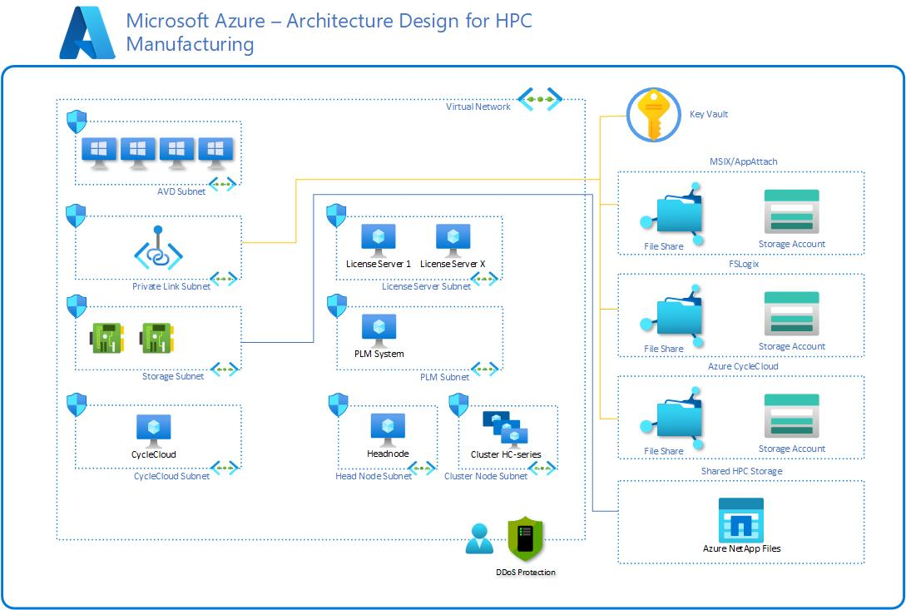

# Big compute in the Manufacturing industry

High Performance Computing (HPC) is used in the manufacturing industry to run large-scale workloads, also known as big compute and can help manufacturers at every stage of product development and supply chain, from running advanced design simulations to automating processes and predicting maintenance issues.

Big compute workloads are tasks that require a large number of cores to process. These workloads can include financial risk modeling, engineering stress analysis, and other compute-intensive tasks. The characteristics of big compute workloads are as follows:

- The workload can be divided into discrete tasks that can be run simultaneously across many cores.
- Each task takes input, processes it, and produces output. The entire application runs for a finite amount of time.
- The application doesn’t need to run 24/7, but it must be able to handle node failures or crashes.
Tasks could be independent or tightly coupled, requiring high-speed networking technologies such as InfiniBand and RDMA.

Compute-intensive VM sizes such as H16r, H16mr, and A9 could be used depending on the workload.
Azure offers a range of VM instances optimized for both CPU- and GPU-intensive workloads. It is also the only cloud platform that offers InfiniBand-enabled hardware, providing a significant performance advantage for running reservoir simulation and seismic workloads. This improved performance results in near or better performance than current on-premises infrastructures.

Azure VMs offer a variety of options, known as VM sizes, for HPC and GPU-optimized computing. It’s important to select the appropriate VM size for your workload, and you can use the [Sizes for VMs in Azure selector tool](/azure/virtual-machines/sizes) to help you choose. Keep in mind that not all Azure products are available in all regions.

You can check the current [list of products available by region](https://azure.microsoft.com/explore/global-infrastructure/products-by-region/) to see what’s available in your area.

For best practices on choosing Azure compute options, you can check out the [Azure compute blog](https://techcommunity.microsoft.com/t5/azure-compute-blog/bg-p/AzureCompute) or the [Azure compute service](/azure/architecture/guide/technology-choices/compute-decision-tree) content.

Azure offers both CPU-based and GPU-enabled virtual machines. The N-series VMs feature NVIDIA GPUs designed for compute-intensive or graphics-intensive applications such as AI, learning, and visualization.

HPC SKUs are specifically designed for high-performance scenarios, but other SKUs such as the E and F series could also be suitable for certain workloads. It is important to carefully evaluate your workload requirements and choose the appropriate VM size to ensure optimal performance.

## Design considerations

When designing your HPC infrastructure, there are several tools and services available to help you manage and schedule your workloads.

[Azure CycleCloud](/azure/cyclecloud/) is a tool for creating, managing, operating, and optimizing HPC and Big Compute clusters in Azure. With Azure CycleCloud, users can dynamically configure HPC Azure clusters and orchestrate data and jobs for hybrid and cloud workflows. Azure CycleCloud provides the simplest way to manage HPC workloads, by using various work load managers (such as Grid Engine, HPC Pack, HTCondor, LSF, PBS Pro, Slurm, or Symphony) on Azure.

### Manufacturing architecture design example
The following architecture is an example that shows the use of VMs in HPC in Manufacturing.

This architecture diagram shows an arrangement that utilizes Azure File Shares and Storage accounts connected to a private link subnet.

CycleCloud is present utilizing its own subnet and an arrangement of cluster nodes is connected utilizing the HC-Series.
The HC-series VMs are optimized for HPC applications driven by intensive computation, such as implicit finite element analysis, reservoir simulation, and computational chemistry. HC VMs feature 44 Intel Xeon Platinum 8168 processor cores, 8 GB of RAM per CPU core, no hyperthreading, and up to 4 Managed Disks. The Intel Xeon Platinum platform supports Intel’s rich ecosystem of software tools and features an all-cores clock speed of 3.4 GHz for most workloads.

For more information on reference architecture or cookbooks for relevant HPC ISV applications that support HPC for manufacturing use cases, see:

- [Virtual Machine Series](https://azure.microsoft.com/pricing/details/virtual-machines/series/)
- [Azure HPC certification.github.io](https://azurehpc-certification.github.io/)
- [Microsoft Azure HPC OnDemand Platform](https://techcommunity.microsoft.com/t5/azure-global/azure-hpc-ondemand-platform-cloud-hpc-made-easy/ba-p/2537338). Standalone reference architecture might not be compliant with the ALZ paradigm.

## Next steps

The following articles provide guidance that you might find helpful at various points during your cloud adoption process. They can help you succeed in your cloud adoption scenario for manufacturing HPC environments.

- [Azure billing and Active Directory tenants](./azure-billing-active-directory-tenant.md)
- [Management](./management.md)
- [Network topology and connectivity](./network-topology-connectivity.md)
- [Platform automation and DevOps](./platform-automation-devops.md)
- [Resource organization](./resource-organization.md)
- [Governance](./security-governance-compliance.md)
- [Security](./security.md)
- [Storage](./storage.md)
- [HPC landing zone accelerator](../azure-hpc-landing-zone-accelerator.md)