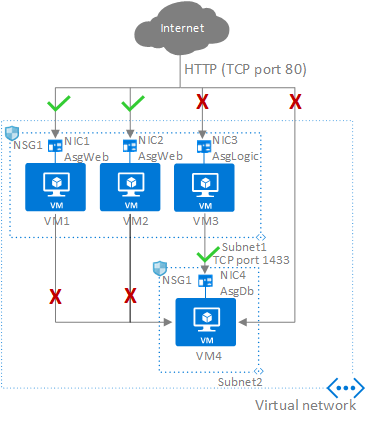

# In this article

- Overview
- Architecture
- Design considerations
- Next steps

## Overview

The Red Hat Enterprise Linux (RHEL) specific network topology builds on number of considerations and recommendations defined in Azure landing zone article [Azure landing zone design area for network topology and connectivity](https://learn.microsoft.com/en-us/azure/cloud-adoption-framework/ready/landing-zone/design-area/network-topology-and-connectivity).

## Architecture

The RHEL reference architecture is a starting point and further adapted to specific business and technical requirements for the landing zone implementation. The various RHEL platform components and roles can be deployed on virtual machines with specific sizing and redundancy as needed.The network layout in these examples are simplified to demonstrate architectural principles and are not intended to describe an entire enterprise network.

[Download the Visio file](https://raw.githubusercontent.com/microsoft/CloudAdoptionFramework/master/scenarios/azure-landing-zone-rhel-full-view.vsdx)
]

## Design considerations for RHEL Platform landing zones networking

During the design phase decisions will be made to adapt the architecture as per requirements and given constraints. The following exploration can guide the process.

- What type of workload deployment is planned? Greenfield? Migration?
- Is the deployment for POC, Development or Testing on shorter timeline?
- Are there any business continuity requirements to consider during the migration?
- Are mature processes for operations, security and governance in place for this environment?

Following are some key considerations in the design.

- Hub & Spoke Network is recommended topology, multi-region deployment can take advantage of [Azure VWAN Hub](https://learn.microsoft.com/en-us/azure/virtual-wan/virtual-wan-about) or use the traditional Virtual Network as Hub. Refer [Azure Landing Zone Networking](https://learn.microsoft.com/en-us/azure/cloud-adoption-framework/ready/landing-zone/design-area/network-topology-and-connectivity) for more details.

- For Virtual WAN topologies, route traffic across landing zones via Azure Firewall if your organization requires filtering and logging capabilities for traffic flowing across landing zones.

- Hybrid connectivity to the Hub will be using Azure VPN Gateway or Express route circuit with bi-directional traffic control & monitoring using Azure Firewall or 3rd party Network appliances in the Hub. 
	
- RHEL Landing Zone, RHEL Management & Identity Services are separate Virtual Network for segmentation preferably in dedicated subscriptions.

- IP address and Virtual Network size for RHEL Landing Zone should consider dedicated subnets for application, database and storage. 

- Zero-trust-based network for perimeter and traffic security. For more information see [Network security strategies on Azure](https://learn.microsoft.com/en-us/azure/well-architected/security/networking)

- Use NSGs to help protect traffic across subnets, as well as east/west traffic across the platform (traffic between landing zones). The platform team can utilize Azure Policy to ensure this is implemented by default on all subnets.

- Use NSGs and application security groups to micro-segment traffic within the landing zone and avoid using a central Network Virtualization Appliance (NVA) to filter traffic flows.

- Enable NSG flow logs and feed them into [Traffic Analytics](https://learn.microsoft.com/en-us/azure/network-watcher/traffic-analytics) to gain insights into internal and external traffic flows. Flow logs should be enabled on all critical VNets/subnets in your subscription as an audit-ability and security best practice.

- Use NSGs to selectively allow connectivity between landing zones.

- The application team should use application security groups at the subnet-level NSGs to help protect multi-tier VMs within the landing zone.

- If your organization decides to implement forced tunneling (advertise default route) to on-premises, we recommend incorporating outbound NSG rules to deny egress traffic from VNets directly to the internet should the BGP session drop. See [Plan for landing zone network segmentation](https://learn.microsoft.com/en-us/azure/cloud-adoption-framework/ready/azure-best-practices/plan-for-landing-zone-network-segmentation) for more information.

## Next Steps

Learn about deployment, management, and patching considerations for Red Hat Enterprise Linux systems

