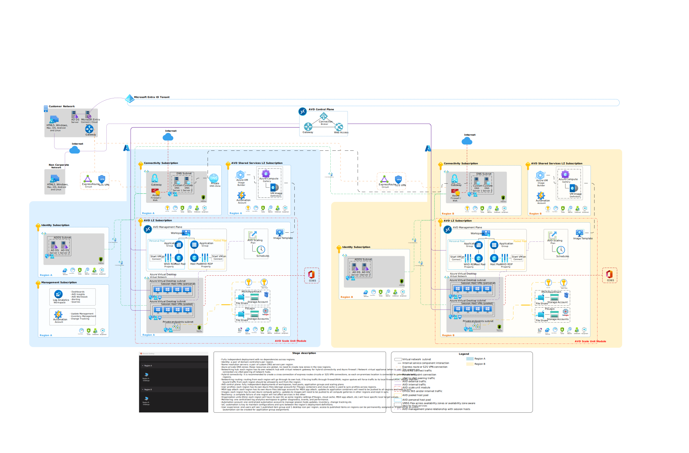

# Enterprise-scale support for Microsoft Azure Virtual Desktop

The Microsoft Azure Virtual Desktop landing zone accelerator provides a specific architectural approach and reference implementation for preparing landing zone subscriptions for an enterprise Azure Virtual Desktop deployment.

Its reference implementation adheres to the architecture and best practices of the Cloud Adoption Framework's Azure landing zones, focusing on enterprise-scale design principles. Although you can deploy this implementation in any Azure environment that complies with the [prerequisites](https://github.com/Azure/avdaccelerator/blob/main/workload/docs/getting-started-baseline.md#prerequisites), we recommend that you implement an enterprise-scale landing zone first. For more information, see [Start with Cloud Adoption Framework enterprise-scale landing zones](../../ready/enterprise-scale/index.md). You should also review the [implementation guidance](../../ready/enterprise-scale/implementation.md) before you deploy the enterprise-scale for Azure Virtual Desktop solution.

This Azure Virtual Desktop solution is open source. You can adapt its templates to create an architecture that meets your needs. This article's guidance includes design considerations for building an enterprise-ready Azure Virtual Desktop deployment.

## Adopt Azure Virtual Desktop landing zone accelerator

Not everyone adopts Azure Virtual Desktop in the same way; architectures vary between organizations. This landing zone accelerator's technical considerations and design recommendations might result in trade-offs based on your organization's needs.

Some variation is normal. If you follow the core recommendations, your resulting architecture prepares your organization for sustainable scaling. The Azure Virtual Desktop landing zone accelerator is modular by design to let you customize environmental variables.

### Design guidelines

Learn the guidelines that direct the design of the Cloud Adoption Framework for Azure enterprise-scale landing zone. The guidelines cover eight critical design areas:

- [Enterprise enrollment](./eslz-enterprise-enrollment.md)
- [Identity and access management](./eslz-identity-and-access-management.md)
- [Network topology and connectivity](./eslz-network-topology-and-connectivity.md)
- [Resource organization](./eslz-resource-organization.md)
- [Management and monitoring](./eslz-management-and-monitoring.md)
- [Business continuity and disaster recovery](./eslz-business-continuity-and-disaster-recovery.md)
- [Security governance and compliance](./eslz-security-governance-and-compliance.md)
- [Platform automation and DevOps](./eslz-platform-automation-and-devops.md)

### Architecture

The following diagram shows a conceptual reference architecture that demonstrates major design areas and design best practices in an Azure Virtual Desktop environment.

To learn more about the design areas for Virtual Desktop, see [network topology and connectivity for Virtual Desktop](./eslz-network-topology-and-connectivity.md).

_Download a [Visio file](https://github.com/microsoft/CloudAdoptionFramework/raw/main/ready/accelerator-baseline-architecture.vsdx) of this architecture._

### Guidance for regional expansion

Although having an Azure Virtual Desktop deployment in a single Azure region is enough for many customers, some customers might require expanding their Azure Virtual Desktop deployment to another Azure region. A couple of reasons that would require a customer to expand their Azure Virtual Desktop deployment across Azure regions include:

- **Scenario A:** Customer requires to deploy additional Azure Virtual Desktop Virtual Machines, but there's no more capacity in the existing Azure region.

- **Scenario B:** Customers have a need to deploy Azure Virtual Desktop Virtual Machines closer to where their users and on-premises datacenters are located.

The following are the network considerations for both Azure Virtual Desktop expansion scenarios.

The following list describes the key networking considerations to implement in the new Azure region when expanding an Azure Virtual Desktop deployment into a secondary Azure region for **Scenario A:**

- Deploy a new Virtual Network with non-overlapping IP address space.
- Connect the Virtual Network in the new region to the Virtual Network in the primary region with Global VNet Peering and enabling Gateway Transit.
- Enabling Gateway Transit is important, as that ensures that the Virtual Network in the new region can access on-premises resources via VPN or ExpressRoute with Private Peering.
- Deploy the storage solution required to store user’s profiles.
- (Optional) Deploy a Domain Controller in the Virtual Network in the new region.
- Configure internet outbound connectivity in the Virtual Network in the new region with either NSG or NVA/Azure Firewall.
- Deploy Azure Virtual Desktop Virtual Machines in the new Azure region
- Ensure users are assigned to Windows Virtual Desktops in only one region, to ensure they don’t have different profiles (if users are assigned to Virtual Desktops on both regions, then they'll have different profiles, as profiles are stored in the regional storage system).

The following list describes the key networking considerations to implement in the new Azure region(s) when expanding an Azure Virtual Desktop deployment into a secondary Azure region that will be connected to an on-premises datacenter in the same geo for **Scenario B:**

Some customers should deploy Azure Virtual Desktop across multiple Azure regions, as they might want to deploy the Azure Virtual Desktop Virtual Machines closer to where the users are, but also, closer to where the existing systems and applications exist in on-premises datacenters.

- Deploy a new Virtual Network with non-overlapping IP address space.
- Connect the Virtual Network in the new region to on-premises datacenter by using VPN or ExpressRoute with Private Peering.
- This connectivity ensures Azure Virtual Desktop users have access to resources located in on-premises datacenters in their region.
- Deploy the storage solution required to store user's profiles.
- (Optional) Deploy a Domain Controller in the Virtual Network in the new region.
- Configure internet outbound connectivity in the Virtual Network in the new region with either NSG or NVA/Azure Firewall
- Deploy Azure Virtual Desktop Virtual Machines in the new Azure region
- Ensure users are assigned to Windows Virtual Desktops in only one region, to ensure they don't have different profiles (if users are assigned to Virtual Desktops on both regions, then they'll have different profiles, since profiles are stored in the regional storage system).

## Deploy Azure Virtual Desktop with the landing zone accelerator

The Azure Virtual Desktop landing zone accelerator includes an open-source collection of Azure Resource Manager and Bicep templates to help you quickly set up your Azure Virtual Desktop environment following best practices and Cloud Adoption Framework. The accelerator creates an Azure Virtual Desktop environment, including virtual machines, virtual networks, and storage in Azure.

The Azure Virtual Desktop accelerator is available in the [Azure Virtual Desktop accelerator](https://github.com/Azure/avdaccelerator) GitHub repository. It contains Infrastructure as Code based on [Common Azure Resource Modules Library (CARML)](https://github.com/Azure/ResourceModules). The Azure Virtual Desktop landing zone accelerator ([deployment prerequisites](https://github.com/Azure/avdaccelerator/blob/main/workload/docs/getting-started-baseline.md)) can be deployed using integration into your CI/CD pipelines, command line [PowerShell or Azure CLI](https://github.com/Azure/avdaccelerator/tree/main/workload/bicep) or Azure portal deployments:

**(Optional) Custom Image Build:**
Deploy a custom image based on the latest version of the Azure Marketplace image to an Azure Compute Gallery.

**Azure Virtual Desktop Accelerator Baseline:**
Deploy Azure Virtual Desktop resources and dependent services for establishing the baseline.

The Azure Virtual Desktop accelerator can be used as the initial deployment of Azure Virtual Desktop in the enterprise environment. You can develop and customize the code to expand its functionality, adapting to your Enterprise-Scale Azure landing zones environment.

The Azure Virtual Desktop accelerator is designed to deploy an Azure Virtual Desktop workload, and we recommend coupling it with an Enterprise-Scale landing zone deployment. See [Deploying enterprise-scale architecture in your own environment](https://github.com/Azure/Enterprise-Scale#deploying-enterprise-scale-architecture-in-your-own-environment).

## Next steps

Review the critical design considerations and recommendations for identity and access management specific to the deployment of Azure Virtual Desktop.

> [!div class="nextstepaction"]
> [Identity and access management](./eslz-identity-and-access-management.md)
