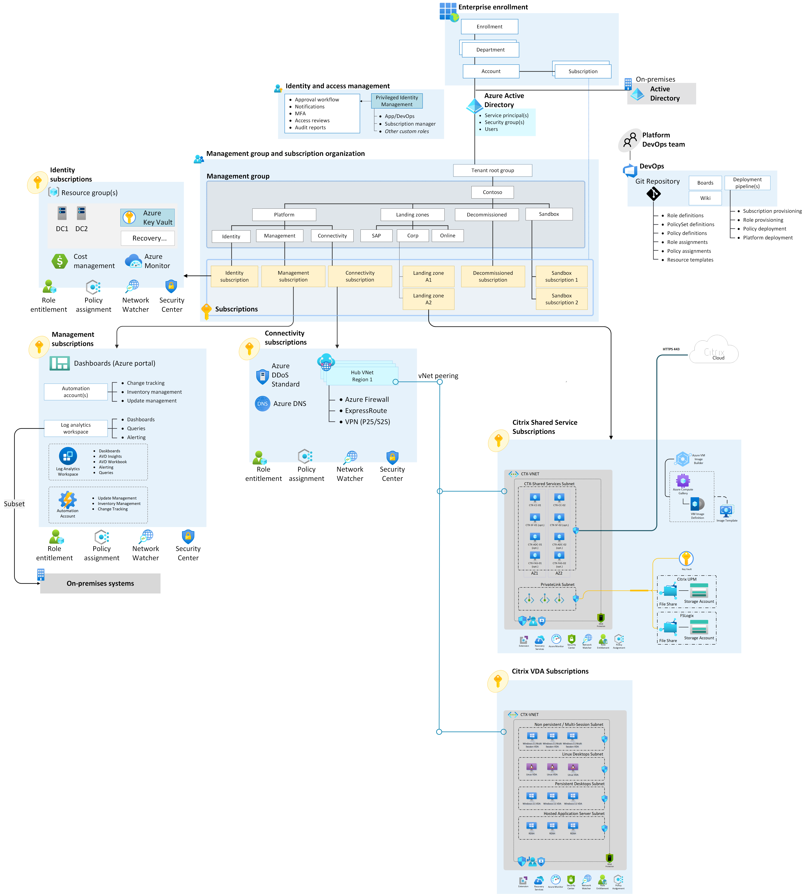

# Enterprise-scale support for Citrix on Azure

Employees need a consistent experience and seamless access to vital applications and insights whether they work in the office, on the road, or at home. In this reference implementation, Citrix and Microsoft partner to accelerate the future of work.

This implementation follows the Cloud Adoption Framework Azure landing zone architecture and best practices, with a focus on enterprise-scale design principles. While this implementation can be deployed in any Azure environment that meets the [prerequisites](https://github.com/Azure/avdaccelerator#getting-started), it's recommended to use this solution after deploying an [enterprise-scale landing zone](../../../ready/landing-zone/index.md). For more information, see [Landing zone implementation options](../../../ready/landing-zone/implementation-options.md).

## Implementation checklist

After reviewing the conceptual design recommendations for Citrix on Azure, see [Baseline Deployment Prerequisites for Citrix on Azure](https://community.citrix.com/tech-zone/build/tech-papers/deployment-prerequisites-citrix-on-azure). This article focuses on the prerequisites for building an Azure environment to host a Citrix solution. It outlines the key design areas, Citrix environment implications, and initial requirements, emphasizing the importance of a well-architected, secure platform. 

## Architecture

The following diagram shows a reference architecture that demonstrates key design areas and best practices for deploying Citrix Cloud and Azure environment.

[Download the Visio file.](https://raw.githubusercontent.com/microsoft/CloudAdoptionFramework/master/scenarios/azure-virtual-desktop/landing-zone-citrix/Citrix-accelerator-enterprise-scale-alz-architecture.vsdx)

## Design guidelines

The Cloud Adoption Framework design guidelines for deploying Citrix Cloud in an Azure enterprise-scale landing zone address the following critical areas:

- [Enterprise enrollment](../eslz-enterprise-enrollment.md)
- [Identity and access management](citrix-identity-access-management.md)
- [Resource organization](citrix-resource-organization.md)
- [Network topology and connectivity](citrix-network-topology-connectivity.md)
- [Management and monitoring](citrix-management-monitoring.md)
- [Security governance and compliance](citrix-security-governance-compliance.md)
- [Business continuity and disaster recovery](citrix-business-continuity-disaster-recovery.md)

Design guidance for [Citrix DaaS on Microsoft Azure](https://docs.citrix.com/en-us/citrix-daas-azure.html) is available on Citrix TechZone. This guidance covers the concepts and terminology that administrators use in Citrix DaaS for Azure, deployment scenarios, and management interfaces, all developed in alignment with the design principles of the Cloud Adoption Framework.

## Potential use cases

This solution is ideal for scenarios that require:

- Critical applications or services on-premises.
- Migrations from on-premises to Azure that occur in multiple phases, but provide seamless access by end users throughout.
- Advanced security capabilities to accommodate user workflows or meet compliance requirements. Security requirements can cover session recording, screen capture and keylogging protection, and granular control over peripherals such as USB devices, clipboard, and printing.
- Support for 3D graphics or connectivity in environments with limited bandwidth or high latency.
- A unified platform for secure remote access to both virtual desktops and physical workstations.
- Built-in image lifecycle and provisioning tools to help streamline management of large and complex portfolios of virtual apps and virtual desktops.
- Citrix application delivery per software vendor recommendations.
- Linux support.
- Support for non-persistent workloads.
- Non-Microsoft solutions for collaboration, authentication, or identity management.
- Business-to-business or guest user access scenarios.

## Next steps

Review the key design considerations and recommendations for identity and access management, specifically for deploying Citrix on Azure:

- [Identity and access management](citrix-identity-access-management.md)
