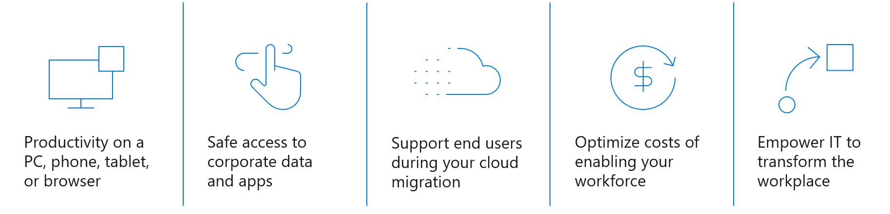

# Strategic benefits of a virtual desktop

When you plan your organization's move to the cloud, a best practice is to create a single, centralized strategy by using the [Strategy methodology](../../strategy/index.md) of the Cloud Adoption Framework.

The guidance in this article can help to expose several considerations about virtual desktops that could affect your strategy.

## Virtual desktop outcomes

Virtual desktop migrations are motivated by a few common target outcomes:

- **Productivity**. Organizations want to extend productivity to PCs, phones, tablets, or browsers that might not be under the direct control of the IT team.

- **Safe access**. Employees need access to corporate data and applications from their devices.

- **Support end users**. As workloads are migrated to the cloud, employees need more support for a low-latency, optimized experience. Azure Virtual Desktop forms a business-critical platform for many organizations. The cloud adoption plan for this platform can directly and indirectly affect cloud adoption for all related workloads. While Azure Virtual Desktop isn't typically the first platform that an organization moves to the cloud, it can be the most important. Understanding the strategy for an Azure Virtual Desktop cloud migration and the future-state innovation targets is critical to the success of all other cloud adoption plans.

- **Empower IT**. The IT team wants to transform the workplace, which often starts with transforming employees' user experience.

You can support realization of these outcomes by virtualizing desktops in the cloud for your end users.

## Strategic impact of Azure Virtual Desktop

Azure Virtual Desktop is a business-critical platform for many organizations. When Azure Virtual Desktop is foundational to an organization's business processes, services throughout the organization's cloud portfolio depend on it. The adoption plan for Azure Virtual Desktop can directly and indirectly affect cloud adoption for all related workloads. While Azure Virtual Desktop isn't typically an organization's first platform in the cloud, it can be the most important. Understanding the strategy for migrating to Azure Virtual Desktop and how to achieve the outcomes that you want in the future is critical to the success of all your plans for cloud adoption.

This article uses resources from the Cloud Adoption Framework to capture the strategic impact of adopting Azure Virtual Desktop.

## Reasons to move to Azure Virtual Desktop

An organization's strategic objectives are often the basis for adopting Azure Virtual Desktop and might include the following goals:

- **Critical business events**. An organization often adopts Azure Virtual Desktop to mitigate risks that are related to contracts, regulations, compliance, or sovereignty.

- **Migration motivations**. If migration of other assets depends on Azure Virtual Desktop, then an organization tends to focus on reducing costs, complexities, or operational overhead.

- **Innovation motivations**. Azure Virtual Desktop in the cloud supports delivery of transformative products and services.

- **Infrastructure scale flexibility requirements**. By using cloud services, an organization can seamlessly scale up and down with infrastructure.

- **Choice and flexibility**. An organization can choose from many virtual machine families and sizes that are optimized for various compute requirements.

- **Potential cost savings**. An organization can consider Azure to be an operational cost rather than an upfront cost, because pricing is based on consumption. For example, the charge for using a virtual machine is based on the time that it's active, which can realize cost savings for the organization.

Customers often have motivations in all of the preceding categories. To successfully implement Azure Virtual Desktop, it's imperative for your cloud strategy team—including your business and IT leaders—to review and prioritize the motivations that are identified in [Why are we moving to the cloud?](../../strategy/motivations.md) Having your priorities documented helps your cloud adoption team to make informed decisions throughout implementation.

When deciding whether to adopt Azure Virtual Desktop, your cloud strategy should consider the following factors:

- Refreshing on-premises virtual desktop infrastructure requires significant capital expenditures. If it's time to refresh your virtual desktop infrastructure, cloud adoption can be a timely strategy to reduce costs.

- Infrastructure hosting contracts lock in vendors for multiple years. If your contracts for hosting, managed services, or maintenance are nearing renewal, consider migrating to Azure services for greater agility, innovation opportunities, and streamlined operation of your business-critical platforms.

- Refresh and contract renewals can be triggered by upgrade cycles of on-premises virtual desktop services or a business driver to adopt Azure Virtual Desktop. Cloud adoption provides opportunities to reduce costs, innovate, optimize, and be more agile.

## Reasons to move to Citrix DaaS

Citrix DaaS simplifies the delivery and management of virtual apps and desktop technologies, helping organizations extend existing on-premises software deployments or move completely to the cloud.

Citrix DaaS enables secure access to Windows, Linux, and Web apps, and Windows and Linux virtual desktops. Citrix DaaS lets you manage apps and desktops centrally across multiple resource locations or clouds while maintaining a great end user experience.

## Build a business justification for cloud migration

[Creating a business case for cloud migration](../../strategy/cloud-migration-business-case.md) can dispel many common myths for your team's financial plan. However, your finance team might need to develop a detailed financial model to account for all parts that are associated with Azure Virtual Desktop.

The 2021 Forrester study "The total economic impact of Microsoft Azure Virtual Desktop" offers an analysis in which the following justifications are typically defendable:

- Time to market benefits exceed $3 million USD
- Cost avoidance exceeds $7 million USD
- 102 percent return on investment
- Pay back in nine months

Actual returns are likely to vary for individual customers. However, the tables in the Forrester study can capture your organization's financial data for validation and business justification.

Understand that your initial business justification is a directional estimate that can help to drive strategic alignment. You can create transparency between your cloud strategy team and other stakeholders by affirming that the business justification might change significantly during planning stages. Look for consensus that there's enough value to gather inventory and develop a plan, as described in [Azure Virtual Desktop planning](./plan.md). After your digital estate is cataloged and assessed, you can refine your business case and present clear plans for financial returns.

## Approach: Azure Virtual Desktop refactoring and modernization

In the approach outlined in this article series, the existing Citrix, VMware, or Remote Desktop Services farms are modernized and replaced with Azure Virtual Desktop. In this scenario, desktop images are either migrated to Azure or new images are generated. Similarly, user profiles are either migrated to Azure or new profiles are created. Usually, the client solution is enabled and largely unchanged by this migration effort.

When the migration to the cloud is finished, the overhead and costs of managing a virtual desktop farm are replaced with a cloud-native solution that manages the virtual desktop experience for your team. The team is responsible only for support of the desktop images, available applications, identity service provider (Active Directory, Microsoft Entra Domain Services, or Microsoft Entra ID), and user profiles. You get the benefits of Microsoft managed broker, gateway, diagnostics, and web access services as part of the Azure Virtual Desktop offering.

## How to measure progress on adopting Azure Virtual Desktop

When your stakeholders have identified the top motivations for this scenario, your cloud strategy team can define measurable outcomes to further guide adoption activities. For examples of common business outcomes for organizations that pursue cloud adoption, see [What business outcomes are associated with transformation journeys?](../../strategy/business-outcomes/index.md)

Given the impact of Azure Virtual Desktop, you need to create many defined objectives and key results (OKRs). These can help you to break down adoption into manageable efforts. To understand OKRs in more detail, see [Measure business outcomes using objectives and key results](../../strategy/business-outcomes/okr.md).

## Next step: Plan for a virtual desktop environment

The following resources provide guidance for specific points throughout the cloud adoption journey to help you succeed in adopting Azure Virtual Desktop as part of your cloud environment.

- [Plan for Azure Virtual Desktop migration or deployment](./plan.md)
- [Review your environment or Azure landing zones](./ready.md)
- [Complete an Azure Virtual Desktop proof-of-concept](./proof-of-concept.md)
- [Assess for Azure Virtual Desktop migration or deployment](./migrate-assess.md)
- [Deploy or migrate Azure Virtual Desktop instances](./migrate-deploy.md)
- [Release your Azure Virtual Desktop deployment to production](./migrate-release.md)
- [Enterprise-scale support for Microsoft Azure Virtual Desktop](./enterprise-scale-landing-zone.md)
- [Manage an Azure Virtual Desktop environment](./manage.md)
- [Governing an Azure Virtual Desktop environment](./govern.md)
