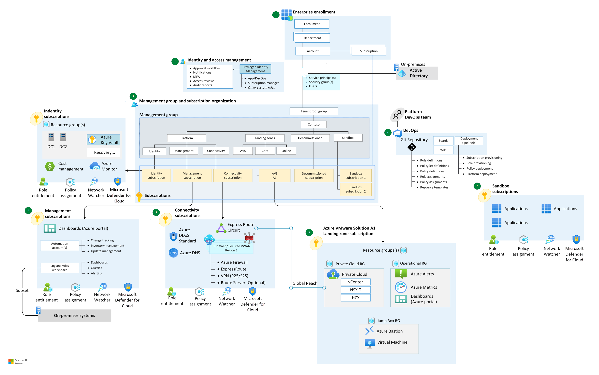

# Enterprise-scale for Microsoft Azure VMware Solution

Enterprise-scale for Azure VMware Solution is an open-source collection of Azure Resource Manager and Bicep templates. It represents the strategic design path and target technical state for an Azure VMware Solution deployment. This open-source solution provides an architectural approach and reference implementation to prepare Azure landing zone subscriptions for a scalable Azure VMware Solution. The implementation adheres to the architecture and best practices of the Cloud Adoption Framework's Azure landing zones, with a focus on the design principles of enterprise-scale.

The following guidance provides design considerations for implementing a scalable Azure VMware Solution in your landing zone. The design decisions your organization makes, based on this guidance, lays the groundwork for scalability.

Customers adopt Azure VMware Solution in various ways. You can adopt the enterprise-scale for your Azure VMware Solution set to produce an architecture that fits your needs and puts your organization on a path to sustainable scale.

Enterprise-scale for Azure VMware Solution provides these assets to support your project:

- A modular approach, so that you can customize environment variables
- Design guidelines to aid in evaluating critical decisions
- Landing zone architecture
- An implementation that includes:
  - A deployable reference to create the environment for your Azure VMware Solution deployment
  - A Microsoft-approved Azure VMware Solution reference implementation to test the deployed environment

## Prerequisites

The Azure VMware Solution construction set assumes that you've successfully implemented an enterprise-scale landing zone. For more information about enterprise-scale landing zones, see:

- [Start with Cloud Adoption Framework enterprise-scale landing zones](../../ready/enterprise-scale/index.md)
- [Implement Cloud Adoption Framework enterprise-scale landing zones in Azure](../../ready/enterprise-scale/implementation.md)

## Design guidelines

The following articles provide guidelines for creating your landing zone:

- [Enterprise-scale identity and access management for Azure VMware Solution](./eslz-identity-and-access-management.md)
- [Network topology and connectivity for Azure VMware Solution](./eslz-network-topology-connectivity.md)
- [Management and monitoring for an Azure VMware Solution enterprise-scale scenario](./eslz-management-and-monitoring.md)
- [Business continuity and disaster recovery for Azure VMware Solution enterprise-scale scenario](./eslz-business-continuity-and-disaster-recovery.md)
- [Security, governance, and compliance for Azure VMware Solution](./eslz-security-governance-and-compliance.md)
- [Platform automation for Azure VMware Solution enterprise-scale scenario](./eslz-platform-automation-and-devops.md)

## Bicep and Azure Resource Manager templates

## Architecture

The following architecture diagram is an example that shows design areas and best practices.

## Next steps

Review design considerations and recommendations related to identity and access management specific to the deployment of Azure VMware Solution.

> [!div class="nextstepaction"]
> [Enterprise-scale identity and access management for Azure VMware Solution](./eslz-identity-and-access-management.md).
