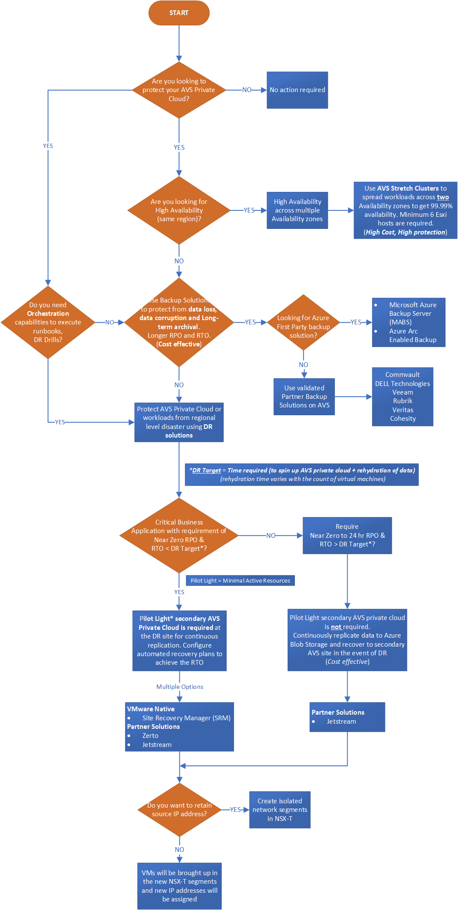
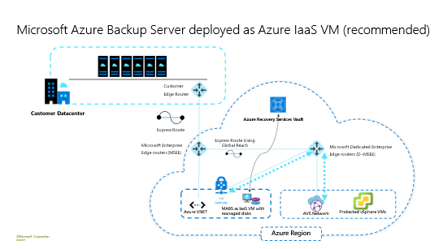
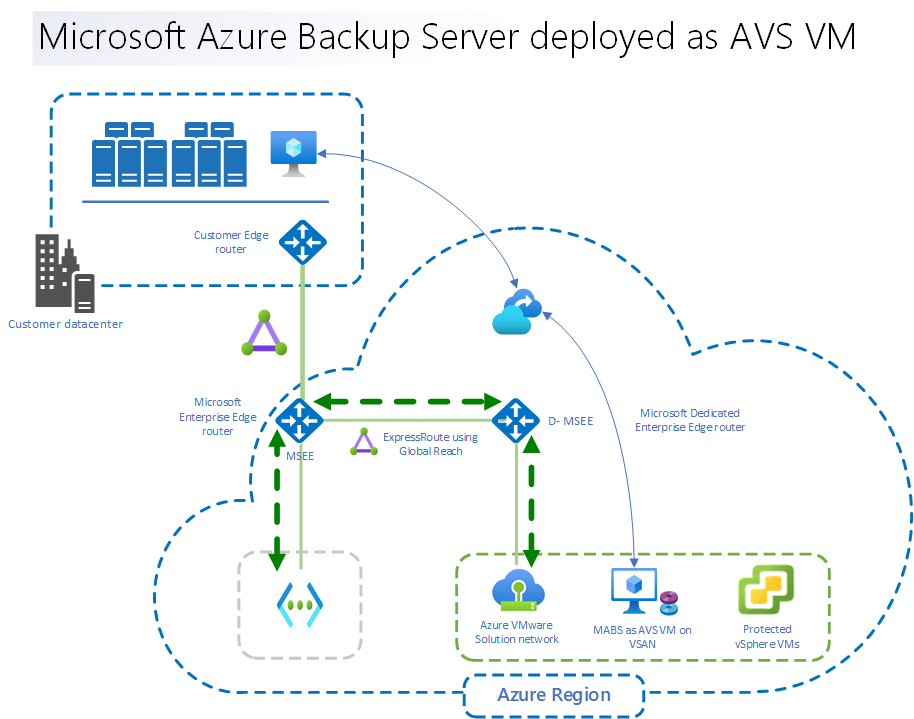
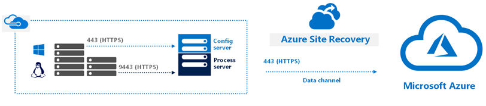
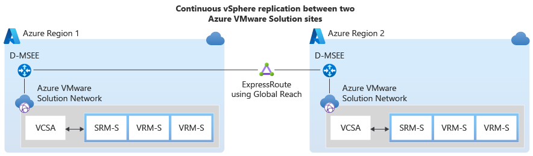
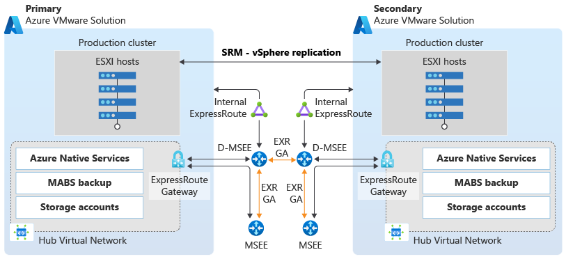
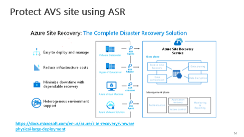

# Business continuity and disaster recovery for Azure VMware Solution enterprise-scale scenario

Azure VMware Solution provides one or more Private Clouds that contain vSphere clusters which are built from dedicated bare-metal Azure infrastructure. The solution provides a minimum of three ESXi hosts   , up to a maximum of 16 hosts per cluster. Up to 96 hosts can be run in one private cloud. vCenter Server, vSAN, vSphere and NSX-T are all provided as part of the private cloud solution. Although Azure VMware Solution has a SLA of 99.9%, it is always wise to consider additional BCDR factors.

## Business Continuity (BC) Design considerations

- A validated backup solution should be chosen for the VMware Virtual Machines, such as [Microsoft Azure Backup Server (MABS)](https://docs.microsoft.com/azure/backup/backup-azure-backup-server-vmware?context=/azure/azure-vmware/context/context) or from our [backup partners](https://docs.microsoft.com/azure/azure-vmware/ecosystem-back-up-vms).
- **NOTE:** Private cloud vCenter and NSX-T configurations are on an hourly backup schedule. Backups are kept for three days. 
- VMware vSAN storage policies on Azure VMware Solution are implemented with storage availability in mind. When the cluster has between 3 and 5 hosts, the number of host failures to tolerate without loss of data equals 1; when the cluster has between 6 and 16 hosts, the number of host failures to tolerate before data loss can occur equals 2. VMware vSAN storage policies can be applied on a per-VM basis. Whilst these are the default policies, there is the ability to amend the policy used for VMware VMs to suit custom requirements. Further reading is found in [this article](https://docs.microsoft.com/azure/azure-vmware/concepts-storage).
- VMware High Availability (HA) is enabled by default on AVS. The HA admittance policy ensures a reservation of the compute and memory capacity of a single node ensuring sufficient reserve capacity to restart workloads in another node in an AVS cluster.
- Currently Microsoft Azure Backup Server (MABS) does not support restoring backups to an alternative (secondary) AVS private cloud. Refer to the disaster recovery section of this guidance when cross AVS recovery is required.

## Business Continuity (BC) Design recommendations

- Use Azure Backup with Azure Backup Server to back up the AVS private cloud. See more at: [Back up VMware VMs with Azure Backup Server](https://docs.microsoft.com/azure/backup/backup-azure-backup-server-vmware?context=/azure/azure-vmware/context/context).
- Deploy the Microsoft Azure Backup Server in the same region as the AVS private cloud.
- MABS can be deployed as an Azure IaaS VM or within the AVS private cloud. It is highly recommended to deploy it outside of the AVS private cloud in an Azure Virtual Network that is connected to the same ExpressRoute to reduce vSAN consumption as this is a ‘limited capacity’ resource within the AVS private cloud. 

- If restoration from a backup is needed for AVS platform components like vCenter, NSX manager or HCX manager, a support ticket should be opened from the [Azure Portal Help + Support section](https://docs.microsoft.com/azure/azure-portal/supportability/how-to-create-azure-support-request). 

## Disaster Recovery (DR) design considerations

- Business requirements need to align with RTCPOs (Recovery time, capacity, and point objectives) for Apps/VMs tiers. Plan and design accordingly to achieve them using the most adequate replication technology; App Native (e.g., SQL Always On availability group), or non-native (for better orchestration) like VMware SRM (Site Recovery Manager), Azure Site Recovery).
- A decision should be made as to what the target DR site for the AVS private cloud will be as this will influence which DR tooling is suitable to the environment.
- Migration from third party locations into AVS will have support through Site Recovery Manager through scale. This is found in their documentation in the future.
- As of time of writing, VMware Site Recovery Manager is supported to provide DR for AVS private cloud to a secondary AVS private cloud in private preview only.
- As of time of writing, Azure Site Recovery is the primary DR service that is native to Microsoft and supported to provide DR for AVS private cloud to Azure IaaS. See more at: [Prepare Azure Site Recovery resources for disaster recovery of Azure VMware Solution VMs](https://docs.microsoft.com/en-us/azure/site-recovery/avs-tutorial-prepare-azure)

- [Azure Site Recovery Deployment Planner](https://docs.microsoft.com/azure/site-recovery/site-recovery-deployment-planner) can be used to begin planning DR to Azure Native.
- When planning the workloads to start after Azure Site Recovery failover, the recovery plan should include the correct startup order for workloads.
- Partner Solutions like JetStream Software and [HCX (testing purposes only)](https://docs.microsoft.com/en-us/azure/azure-vmware/deploy-disaster-recovery-using-vmware-hcx#:~:text=%20Deploy%20disaster%20recovery%20using%20VMware%20HCX%20,VMware%20Solution%20private%20cloud%2C%20and%20access...%20More%20) support disaster recovery scenarios for AVS as well.
- An analysis and decision should be made which (sub-)set of AVS workloads require protection in case of a DR event. Consider protecting only those workloads critical to business operations to control the costs associated with the DR implementation.
- Functional domain roles (e.g. Active Directory Domain Controllers, DNS) should be set up in the secondary environment
- Necessary sites, services, and connectivity to treat as another site in estate for disaster recovery environment.
- To enable DR between AVS private clouds in distinct Azure regions, ExpressRoute Global Reach needs to be enabled between both (back-end) ExpressRoute circuits to allow AVS-to-AVS connectivity when required for solutions like VMware SRM and VMware HCX for DR.
- DR overlapping vs non-overlapping IP addressing.
  - Retain same IP address: The same IP address can be used on the recovered VM as the one allocated to the AVS VMs. For this isolated VLANS / segments in the secondary site will need to be created and ensure none of these isolated VLANS / segments are connected to the environment. DR routes will need to be modified to reflect that the subnet has moved to the secondary site, and new IP address locations. 
  - Use different IP address: A different IP address can be used for the recovered VMs. If the VM is moved to a secondary site, the recovery plan within the SRM will detail out the custom IP map that will need to be selected for the change of IP address and in case of ASR a defined VNET will be chosen for new IP allocation.
- Understanding Partial vs. Full Disaster Recovery (DR).
  - When working with Azure Site Recovery, preparing for full disaster recovery should be understood. This means failing over from AVS into an Azure Native environment.
  - Utilising VMware SRM partial and full DR are supported. This means that running AVS in Region 1 and Region 2, the option to fail some or all of the VMs from primary to secondary regions are supported. 
  - The requirement for VM recovery and the IP address retention requirements will define if Partial vs Full DR is possible or not. 
  - In order to maintain the IP address and achieve a partial disaster recovery in SRM, gateway of the subnet will need to move to the secondary AVS.
  - Active-Standby DR doesn’t require L2 stretching.

## Disaster Recovery (DR) design recommendations

- When working with Azure VMware Solution in both primary (protected) and secondary (recovery) sites, VMware Site Recovery Manager should be used.

- Using the above point as a high-level overview, a more detailed diagram can be found below:

- Azure Site Recovery should be used if Azure IaaS is the DR target for the AVS private cloud

- When working with either VMware Site Recovery Manager or Azure Site Recovery to provide DR for the AVS private cloud, manual input should be minimized as much as possible by leveraging automated Recovery plans within each of the respective solutions. A recovery plan gathers machines into recovery groups for the purpose of failover and helps to define a systematic recovery process by creating small independent units that can fail over.
- Utilizing the geopolitical region pair as the secondary DR environment is recommended for proximity of regions and cost reductions.
- Keep address spaces completely different (i.e., 192.168.0.0/16 for Region 1 and 10.0.0.0/16 for Region 2) to reduce risk of IP address overlap 
- Leverage ExpressRoute Global Reach connectivity between the primary and secondary AVS private clouds. 

## Enterprise-scale assumptions

The following are assumptions that went into the development of the deployable asset: Enterprise-scale for Azure VMware Solution.

## Additional considerations

Create as many H2 "##" headers as is required to educate the customer on this topic.

