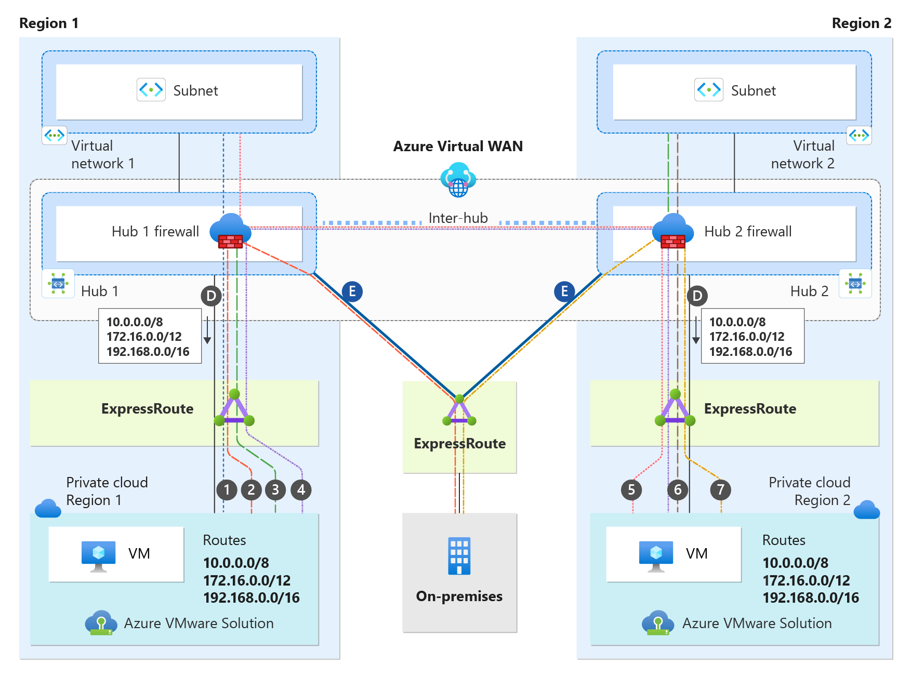
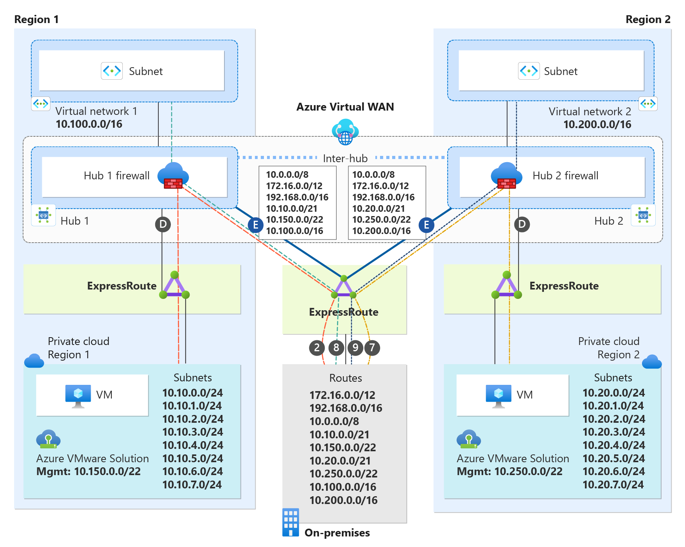
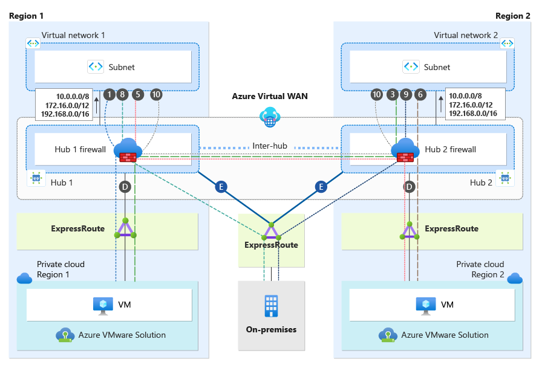
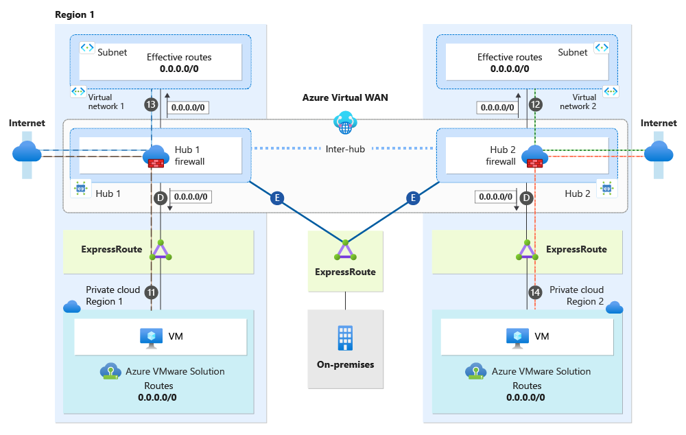

# Dual-region deployments using Secure Virtual WAN Hub with Routing-Intent without Global Reach

This article describes the best practices for connectivity, traffic flows, and high availability of dual-region Azure VMware Solution when using Azure Secure Virtual WAN with Routing Intent. You learn the design details of using Secure Virtual WAN with Routing-Intent, without Global Reach. This article breaks down Virtual WAN with Routing Intent topology from the perspective of Azure VMware Solution private clouds, on-premises sites, and Azure native. The implementation and configuration of Secure Virtual WAN with Routing Intent are beyond the scope and are not discussed in this document.  

In regions without Global Reach support or with a security requirement to inspect traffic between Azure VMware Solution and on-premises at the hub firewall, a support ticket must be opened to enable ExpressRoute to ExpressRoute transitivity. ExpressRoute to ExpressRoute transitivity isn't supported by default with Secure Virtual WAN. - see [Transit connectivity between ExpressRoute circuits with routing intent](/azure/virtual-wan/how-to-routing-policies#expressroute)
  
## Dual-region with Secure Virtual WAN without Global Reach scenario  
Secure Virtual WAN with Routing Intent is only supported with Virtual WAN Standard SKU. Secure Virtual WAN with Routing Intent provides the capability to send all Internet traffic and Private network traffic to a security solution like Azure Firewall, a third-party Network Virtual Appliance (NVA), or SaaS solution. In the scenario, we have a network topology that spans two regions. There's one Virtual WAN with two Hubs, Hub1 and Hub2. Hub1 is in Region 1, and Hub2 is in Region 2. Each Hub has its own instance of Azure Firewall deployed(Hub 1 Firewall, Hub 2 Firewall), essentially making them each Secure Virtual WAN Hubs. Having Secure Virtual WAN hubs is a technical prerequisite to Routing Intent. Secure Virtual WAN Hub1 and Hub2 have Routing Intent enabled.    

Each region also has an Azure VMware Solution Private Cloud and an Azure Virtual Network. There's also an on-premises site connecting to both regions, which we review in more detail later in this document. 

>[!NOTE]
>  If you're using non-RFC1918 prefixes in your connected on-premises, Virtual Networks or Azure VMware Solution, make sure you have specified those prefixes in the "Private Traffic Prefixes" text box for Routing Intent. Keep in mind that you should always enter summarized routes only in the “Private Traffic Prefixes” section to cover your range. Do not input the exact range that is being advertised to Virtual WAN as this can lead to routing issues. For example, if the ExpressRoute Circuit is advertising 40.0.0.0/24 from on-premises, put a /23 CIDR range or larger in the Private Traffic Prefix text box (example: 40.0.0.0/23). - see [Configure routing intent and policies through Virtual WAN portal](/azure/virtual-wan/how-to-routing-policies#nva)
>

>[!NOTE]
>  When configuring Azure VMware Solution with Secure Virtual WAN Hubs, ensure optimal routing results on the hub by setting the Hub Routing Preference option to "AS Path." - see [Virtual hub routing preference](/azure/virtual-wan/about-virtual-hub-routing-preference)
>

**Understanding Topology Connectivity**

| Connection | Description  |
|:-------------------- |:--------------------  |
| Connections (D) | Azure VMware Solution private cloud connection to its local regional hub.  |
| Connections (E) | on-premises connectivity via ExpressRoute to both regional hubs.  |
| Inter-Hub | Inter-Hub logical connection between two hubs that are deployed under the same Virtual WAN.  |

### Dual-region Secure Virtual WAN Traffic Flows

The following sections cover traffic flows and connectivity for Azure VMware Solution, on-premises, Azure Virtual Networks, and the Internet.

## Azure VMware Solution cross-region connectivity & traffic flows

This section focuses on only the Azure VMware Solution private clouds in both regions. Each Azure VMware Solution private cloud has an ExpressRoute connection to the hub (connections labeled as "D").

With ExpressRoute to ExpressRoute transitivity enabled on the Secure Hub and Routing-Intent enabled, the Secure Hub sends the default RFC 1918 addresses (10.0.0.0/8, 172.16.0.0/12, 192.168.0.0/16) to both Azure VMware Solution private clouds over connection "D". In addition to the default RFC 1918 addresses, both Azure VMware Solution private clouds learn more specific routes from Azure Virtual Networks and Branch Networks that are connected to both Hub 1 and Hub 2. Both Azure VMware Solution private clouds don't learn specific routes from on-premises networks. For routing traffic back to on-premises networks, it uses the default RFC 1918 addresses that it learned via connection "D" from it's local regional hub. This traffic transits through the local regional Hub firewall, as shown in the diagram. The Hub firewall has the specific routes for on-premises networks and routes traffic toward the destination over connection “E”. Traffic from both Azure VMware Solution private clouds, heading towards Virtual Networks, will transit the Hub firewall. For more information, see the traffic flow section.

The diagram illustrates traffic flows from the perspective of the Azure VMware Solution Private Cloud Region 1 and Azure VMware Solution Private Cloud Region 2. 

  

**Traffic Flow Chart**  

| Traffic Flow Number | Source |   Direction | Destination | Traffic Inspected on Secure Virtual WAN Hub firewall? |
| - | -------------- | -------- | ---------- | ---------- |
| 1 | Azure VMware Solution Cloud Region 1 | &#8594;| Virtual Network 1| Yes, traffic is inspected at the Hub 1 firewall|
| 2 | Azure VMware Solution Cloud Region 1 | &#8594;| On-premises| Yes, traffic is inspected at the Hub 1 firewall|
| 3 | Azure VMware Solution Cloud Region 1 | &#8594;| Virtual Network 2| Yes, traffic is inspected at the Hub 1 firewall, then Hub 2 firewall.|
| 4 | Azure VMware Solution Cloud Region 1 | &#8594;| Azure VMware Solution Cloud Region 2| Yes, traffic is inspected at the Hub 1 firewall, then Hub 2 firewall.|
| 5 | Azure VMware Solution Cloud Region 2 | &#8594;| Virtual Network 1| Yes, traffic is inspected at the Hub 2 firewall, then Hub 1 firewall.|
| 6 | Azure VMware Solution Cloud Region 2 | &#8594;| Virtual Network 2| Yes, traffic is inspected at the Hub 2 firewall.|
| 7 | Azure VMware Solution Cloud Region 2 | &#8594;| On-premises| Yes, traffic is inspected at the Hub 2 firewall.|

## on-premises connectivity & traffic flow

This section focuses only on the on-premises site. As shown in the diagram, the on-premises site has an ExpressRoute connection to both Hub 1 and Hub 2 (connection labeled as "E").

With ExpressRoute to ExpressRoute transitivity enabled on both Secure Hubs and Routing-Intent enabled, each Secure Hub sends the default RFC 1918 addresses (10.0.0.0/8, 172.16.0.0/12, 192.168.0.0/16) to on-premises over connection "E". In addition to the default RFC 1918 addresses, on-premises learns more specific routes from Azure Virtual Networks and Branch Networks that are connected to both Hub 1 and Hub 2. 

By default, on-premises doesn’t learn the specific routes for both Azure VMware Solution Private Clouds. Instead, it routes to both Azure VMware Solution Private Clouds using the default RFC 1918 addresses it learns over connection “E”. On-premises will learn the default RFC 1918 addresses from both Hub 1 and Hub 2 via connection “E”. 

>[!NOTE]
>  It’s extremely important to add specific routes on both hubs. If you don’t add specific routes on the hubs, it leads to suboptimal routing because on-premises uses Equal Cost multi-path (ECMP) between the "E" connections for traffic destined to any Azure VMware Solution Private Cloud. As a result, traffic between on-premises and any Azure VMware Solution Private Cloud may experience latency, performance issues, or packet drops.
>

To advertise a more specific route down to on-premises, it needs to be accomplished from the "Private Traffic Prefixes" box within Routing Intent. - see [Configure routing intent and policies through Virtual WAN portal](/azure/virtual-wan/how-to-routing-policies#nva). You need to add a summarized route that encompasses both your Azure VMware Solution /22 block and your Azure VMware Solution subnets. If you add the same exact prefix or a more specific prefix instead of a summary route, you introduce routing issues within the Azure environment. Therefore, it’s important to remember that any prefixes added to the "Private Traffic Prefixes" box must be summarized routes.

As illustrated in the diagram, Azure VMware Solution Private Cloud 1 includes workload subnets from 10.10.0.0/24 to 10.10.7.0/24. On Hub 1, the summary route 10.10.0.0/21 is added to "Private Traffic Prefixes" because it encompasses all eight subnets. Additionally, on Hub 1, the summary route 10.150.0.0/22 is added to "Private Traffic Prefixes" to cover the Azure VMware Solution management block. Summary routes 10.10.0.0/21 and 10.150.0.0/22 are then advertised down to on-premises via connection "E", providing on-premises with a more specific route than 10.0.0.0/8.

Azure VMware Solution Private Cloud 2 includes workload subnets from 10.20.0.0/24 to 10.20.7.0/24. On Hub 2, the summary route 10.20.0.0/21 is added to "Private Traffic Prefixes" because it encompasses all eight subnets. Additionally, on Hub 2, the summary route 10.250.0.0/22 is added to “Private Traffic Prefixes.” This covers the Azure VMware Solution management block. Summary routes 10.10.0.0/21 and 10.150.0.0/22 are then advertised down to on-premises via connection “E.” This provides on-premises with a more specific route than 10.0.0.0/8

There’s no issue in adding the entire Azure VMware Solution Management /22 block under “Private Traffic Prefixes” because Azure VMware Solution doesn’t advertise the exact /22 block back to Azure; it always advertises more specific routes.

As mentioned earlier, when you enable ExpressRoute to ExpressRoute transitivity on the Hub, it sends the default RFC 1918 addresses (10.0.0.0/8, 172.16.0.0/12, 192.168.0.0/16) to your on-premises network. Therefore, you shouldn't advertise the exact RFC 1918 prefixes (10.0.0.0/8, 172.16.0.0/12, 192.168.0.0/16) back to Azure. Advertising the same exact routes creates routing problems within Azure. Instead, you should advertise more specific routes back to Azure for your on-premises networks.

The diagram illustrates traffic flows from the perspective of on-premises. 

  

**Traffic Flow Chart**

| Traffic Flow Number | Source |   Direction | Destination | Traffic Inspected on Secure Virtual WAN Hub firewall? |
| - | -------------- | -------- | ---------- | ---------- |
| 2 | on-premises | &#8594;| Azure VMware Solution Cloud Region 1 | Yes, traffic is inspected at the Hub 1 firewall|
| 7 | on-premises | &#8594;| Azure VMware Solution Cloud Region 2 | Yes, traffic is inspected at the Hub 2 firewall|
| 8 | on-premises | &#8594;| Virtual Network 1 | Yes, traffic is inspected at the Hub 1 firewall|
| 9 | on-premises | &#8594;| Virtual Network 2 | Yes, traffic is inspected at the Hub 2 firewall|

## Azure Virtual Network connectivity & traffic flow

This section focuses only on connectivity from the Azure Virtual Networks perspective. As depicted in the diagram, each Virtual Network has a Virtual Network peering directly to its regional hub.

The diagram illustrates how all Azure native resources in both Virtual Networks learn routes under their "Effective Routes". With Routing Intent enabled, Hub 1 and Hub 2 always send the default RFC 1918 addresses (10.0.0.0/8, 172.16.0.0/12, 192.168.0.0/16) to their peered Virtual Networks. Azure native resources in the Virtual Networks don’t learn specific routes from outside their Virtual Network. With Routing Intent enabled, all resources in the Virtual Network currently learn the default RFC 1918 address and use their regional hub firewall as the next hop. All traffic ingressing and egressing the Virtual Networks will always transit their regional hub firewall. For more information, see the traffic flow section.

The diagram illustrates traffic flows from the Azure Virtual Networks perspective.

  

**Traffic Flow Chart**

| Traffic Flow Number | Source |   Direction | Destination | Traffic Inspected on Secure Virtual WAN Hub firewall? |
| - | -------------- | -------- | ---------- | ---------- |
| 1 | Virtual Network 1 | &#8594;| Azure VMware Solution Cloud Region 1 | Yes, traffic is inspected at the Hub 1 firewall|
| 3 | Virtual Network 2 | &#8594;| Azure VMware Solution Cloud Region 1| Yes, traffic is inspected at Hub 2 firewall then Hub firewall 1|
| 5 | Virtual Network 1 | &#8594;| Azure VMware Solution Cloud Region 2| Yes, traffic is inspected at Hub 1 firewall then Hub firewall 2|
| 6 | Virtual Network 2 | &#8594;| Azure VMware Solution Cloud Region 2| Yes, traffic is inspected at the Hub 2 firewall|
| 8 | Virtual Network 1 | &#8594;| On-premises| Yes, traffic is inspected at the Hub 1 firewall|
| 9 | Virtual Network 2 | &#8594;| On-premises| Yes, traffic is inspected at the Hub 2 firewall|
| 10 | Virtual Network 1 | &#8594;| Virtual Network 2| Yes, traffic is inspected at the Hub 1 firewall then Hub 2 firewall|
| 10 | Virtual Network 2 | &#8594;| Virtual Network 1| Yes, traffic is inspected at the Hub 2 firewall then Hub 1 firewall|

## Internet connectivity

This section focuses only on how internet connectivity is provided for Azure native resources in Virtual Networks and Azure VMware Solution Private Clouds with dual region. There are several options to provide internet connectivity to Azure VMware Solution. - see [Internet Access Concepts for Azure VMware Solution](/azure/azure-VMware/concepts-design-public-internet-access)

Option 1: Internet Service hosted in Azure  
Option 2: VMware Solution Managed SNAT  
Option 3: Azure Public IPv4 address to NSX-T Data Center Edge  

Although you can use all three options with Dual Region Secure Virtual WAN with Routing Intent,  "Option 1: Internet Service hosted in Azure" is the best option when using Secure Virtual WAN with Routing Intent and is the option that is used to provide internet connectivity in the scenario. The reason why "Option 1" is considered the best option with Secure Virtual WAN is due to its ease of security inspection, deployment, and manageability.

As mentioned earlier, when you enable Routing Intent on both Secure Hubs, it advertises RFC 1918 to all directly peered Virtual Networks. However, you can also advertise a default route 0.0.0.0/0 for internet connectivity to downstream resources. With Routing Intent, you can choose to generate a default route from both hub firewalls. This default route is advertised to its directly peered Virtual Networks and to its directly connected Azure VMware Solution. This section is broken into two sections, one that explains internet connectivity from both regional Azure VMware Solution perspective and another from the Virtual Networks perspective.  

#### Azure VMware Solution Internet Connectivity
When Routing Intent is enabled for internet traffic, the default behavior of the Secure Virtual WAN Hub is to not advertise the default route across ExpressRoute circuits. To ensure the default route is propagated to the its directly connected Azure VMware Solution from the Azure Virtual WAN, you must enable default route propagation on your Azure VMware Solution ExpressRoute circuits - see [To advertise default route 0.0.0.0/0 to endpoints](/azure/virtual-wan/virtual-wan-expressroute-portal#to-advertise-default-route-00000-to-endpoints). Once changes are complete, the default route 0.0.0.0/0 is then advertised via connection “D” from the hub. It’s important to note that this setting shouldn't be enabled for on-premises ExpressRoute circuits. As a best practice, it’s recommended to implement a BGP Filter on your on-premises equipment. A BGP Filter in place prevents the inadvertent learning of the default route, adds an extra layer of precaution, and ensures that on-premises internet connectivity isn't impacted.

#### Virtual Network Internet Connectivity
When Routing Intent for internet access is enabled, the default route generated from the Secure VWAN Hub is automatically advertised to the hub-peered Virtual Network connections. You'll notice under Effective Routes for the Virtual Machines’ NICs in the Virtual Network that the 0.0.0.0/0 next hop is the regional hub firewall.

For more information, see the traffic flow section.

The diagram illustrates traffic flows from the Virtual Networks and Azure VMware Solution Private Clouds perspective.

   

**Traffic Flow Chart**  

| Traffic Flow Number | Source |   Direction | Destination | Traffic Inspected on Secure Virtual WAN hub firewall? |
| - | -------------- | -------- | ---------- | ---------- |
| 11 | Azure VMware Solution Cloud Region 1 | &#8594;| Internet| Yes, traffic is inspected at the Hub 1 firewall
| 12 | Virtual Network 2 | &#8594;| Internet | Yes, traffic is inspected at the Hub 2 firewall
| 13 | Virtual Network 1 | &#8594;| Internet | Yes, traffic is inspected at the Hub 1 firewall
| 14 | Azure VMware Solution Cloud Region 2 | &#8594;| Internet | Yes, traffic is inspected at the Hub 2 firewall

## Utilizing VMware HCX MON without Global Reach
HCX Mobility Optimized Networking (MON) is an optional feature to enable when using HCX Network Extensions (NE). MON provides optimal traffic routing under certain scenarios to prevent network tromboning between the on-premises-based and cloud-based resources on extended networks.

### Egress Traffic from Azure VMware Solution   
Enabling Mobility Optimized Networking (MON) for a specific extended network and a virtual machine changes the traffic flow. After implementing MON, egress traffic from that virtual machine does not trombone back to on-premises. Instead, it bypasses the Network Extensions (NE) IPSEC tunnel. Traffic for that virtual machine will now egress out of the Azure VMware Solution NSX-T Tier-1 Gateway> NSX-T Tier-0 Gateway>Azure Virtual WAN.

### Ingress Traffic to Azure VMware Solution  
Enabling Mobility Optimized Networking (MON) for a specific extended network and a virtual machine results in a change. From Azure VMware Solution NSX-T, it injects a /32 host route back to Azure Virtual WAN. Azure Virtual WAN advertises this /32 route back to on-premises, Virtual Networks, and Branch Networks. The purpose of this /32 host route is to ensure that traffic from on-premises, Virtual Networks, and Branch Networks doesn't use the Network Extensions (NE) IPSEC tunnel when destined for the MON enabled Virtual Machine. Traffic from source networks is directed straight to the MON-enabled Virtual Machine due to the /32 route that is learned. 

### HCX MON Limitation With Secure Virtual WAN Without Global Reach 
With ExpressRoute to ExpressRoute transitivity enabled on the Secure Hub and Routing-Intent enabled, the Secure Hub sends the default RFC 1918 addresses (10.0.0.0/8, 172.16.0.0/12, 192.168.0.0/16) to both the on-premises and Azure VMware Solution. In addition to the default RFC 1918 addresses, both on-premises and Azure VMware Solution learn more specific routes from Azure Virtual Networks and Branch Networks that are connected to the hub. However, on-premises networks don't learn any specific routes from the Azure VMware Solution, nor does the reverse occur. Instead, both environments rely on the default RFC 1918 addresses to facilitate routing back to one another via the Hub firewall. This means that more specific routes, such as HCX MON Host Routes, aren't advertised from the Azure VMware Solution ExpressRoute to the on-premises-based ExpressRoute circuit and vice-versa. The inability to learn specific routes introduces asymmetric traffic flows. Traffic egresses Azure VMware Solution via the NSX-T Tier-0 gateway, but returning traffic from on-premises returns over the Network Extensions (NE) IPSEC tunnel.

### Resolution 
To correct any traffic asymmetry, you need to adjust the HCX MON Policy Routes. MON policy routes determine which traffic goes back to the on-premises Gateway via an L2 extension. They also decide which traffic is routed through the Azure VMware Solution NSX Tier-0 Gateway.

If a destination IP matches and is set to "allow" in the MON policy configuration, then two actions occur. First, the packet is identified. Second, it's sent to the on-premises gateway through the HCX Network Extension appliance.

If a destination IP doesn't match, or is set to "deny" in the MON policy, the system sends the packet to the Azure VMware Solution Tier-0 for routing.

**HCX Policy Routes**  
| Network |Redirect to Peer | Note |
| - | -------------- | -------- |
| Azure Virtual Network Address Space | Deny | Please ensure to explicitly include the address ranges for all your Virtual Networks. Traffic intended for Azure is directed out via the Azure VMware Solution and doesn't return to the on-premises network.
| Default RFC 1918 Address Spaces | Allow | Add in the default RFC 1918 addresses 10.0.0.0/8, 172.16.0.0/12, and 192.168.0.0/16. This configuration ensures that any traffic not matching the above criteria is rerouted back to the on-premises network. If your on-premises setup utilizes addresses that aren't part of RFC 1918, you must explicitly include those ranges.
| 0.0.0.0/0 | Deny | For addresses that aren’t covered by RFC 1918, such as Internet-routable IPs, or any traffic that doesn’t match the specified entries above, exits directly through the Azure VMware Solution and isn't redirected back to the on-premises network.

## Next steps

- For more information on Virtual WAN hub configuration, see [About virtual hub settings](/azure/virtual-wan/hub-settings).
- For more information on how to configure Azure Firewall in a Virtual Hub, see [Configure Azure Firewall in a Virtual WAN hub](/azure/virtual-wan/howto-firewall).
- For more information on how to configure the Palo Alto Next Generation SAAS firewall on Virtual WAN, see [Configure Palo Alto Networks Cloud NGFW in Virtual WAN](/azure/virtual-wan/how-to-palo-alto-cloud-ngfw).
- For more information on Virtual WAN hub routing intent configuration, see [Configure routing intent and policies through Virtual WAN portal](/azure/virtual-wan/how-to-routing-policies#nva).
