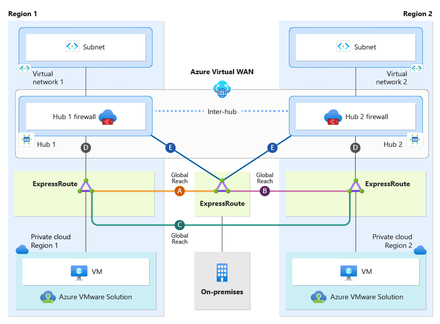
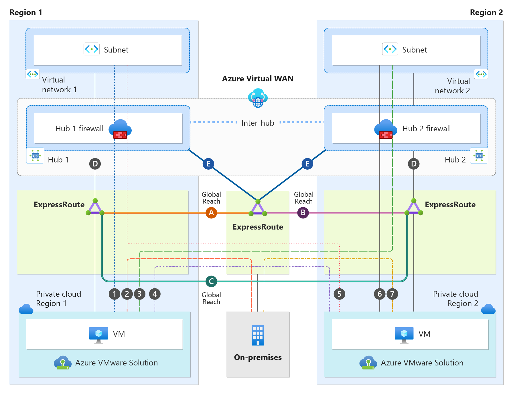
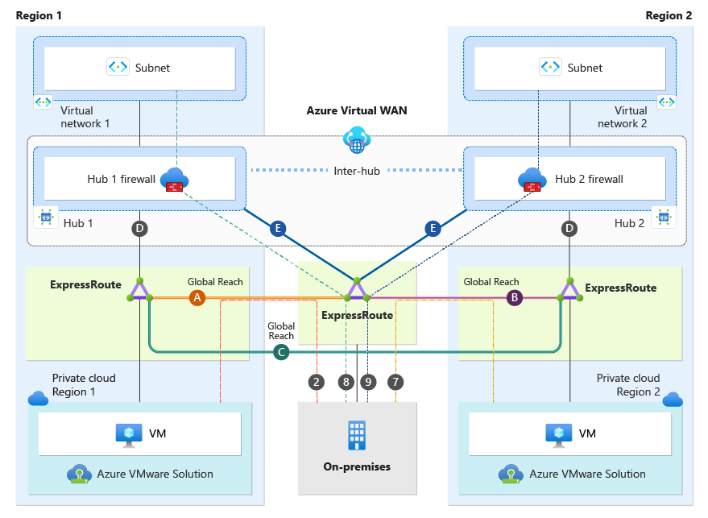
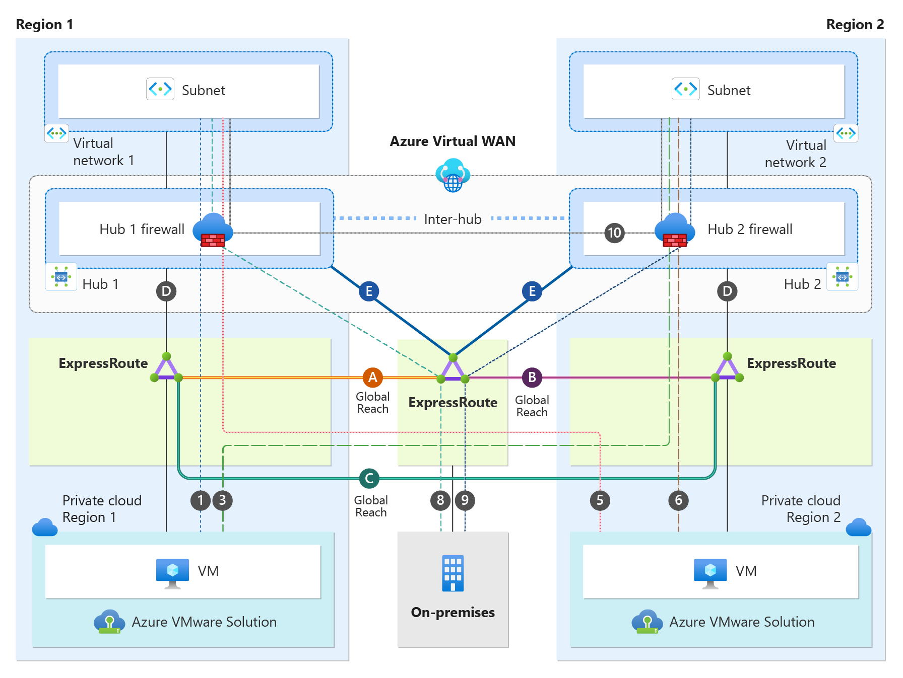
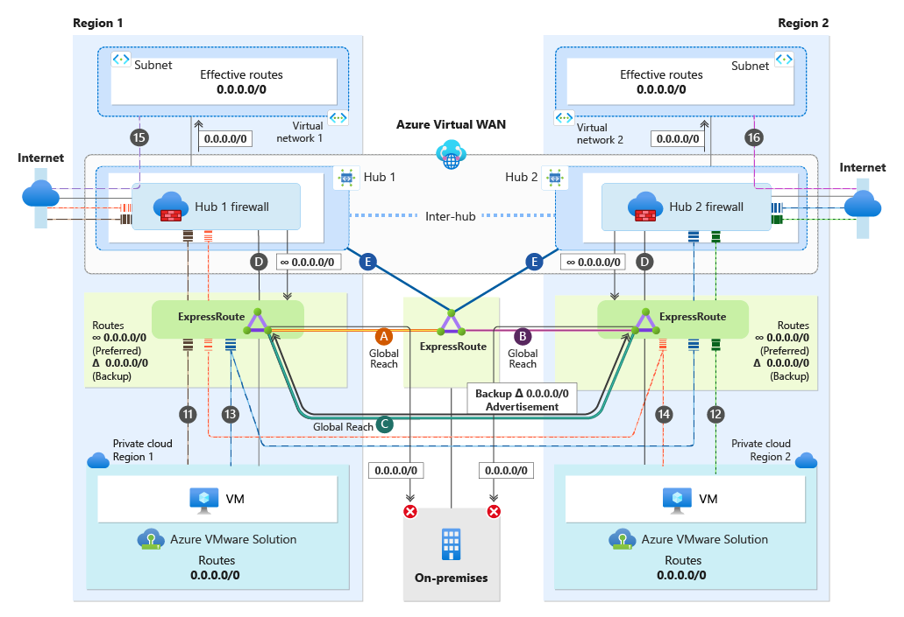

# Network considerations for Azure VMware Solution dual-region deployments using Secure Virtual WAN Hub with Routing-Intent

This article describes the best practices for connectivity, traffic flows, and high availability of dual-region Azure VMware Solution when using Azure Secure Virtual WAN with Routing Intent. This article breaks down Virtual WAN with Routing Intent topology from the perspective of Azure VMware Solution private clouds, on-premises sites, and Azure native. The implementation and configuration of Secure Virtual WAN with Routing Intent are beyond the scope and are not discussed in this document.

The document assumes readers have a basic understanding of Virtual WAN and Secure Virtual WAN with Routing Intent.

**Virtual WAN**  
[What is Virtual WAN?](/azure/virtual-wan/virtual-wan-about)

**Virtual WAN Routing Intent**  
[How to configure Virtual WAN Hub routing intent and routing policies](/azure/virtual-wan/how-to-routing-policies)
  
## Dual-region with Secure Virtual WAN scenario  
Secure Virtual WAN with Routing Intent is only supported with Virtual WAN Standard SKU. Secure Virtual WAN with Routing Intent provides the capability to send all Internet traffic and Private network traffic (RFC 1918) to a security solution like Azure Firewall, a third-party NVA, or SaaS. In the scenario, we have a network topology that spans two regions. There is one Virtual WAN with two Hubs, Hub1 and Hub2. Hub1 is in Region 1, and Hub2 is in Region 2. Each Hub in both regions has its instance of Azure Firewall deployed(Hub1Fw, Hub2Fw), essentially making them Secure Virtual WAN Hubs. Having Secure Virtual WAN hubs is a technical prerequisite to Routing Intent. Secure Virtual WAN Hub1 and Hub2 have Routing Intent enabled.  

Each region has its own Azure VMware Solution Private Cloud and an Azure Virtual Network. There is also an on-premises site connecting to both regions, which we review in more detail later in this document.  

### Understanding Topology Connectivity 
Connection Color | Description  |
|:-------------------- |:--------------------  |
| Brown Connections | Azure VMware Solution private cloud connection to its local regional hub.  |
| Pink Connections | Azure VMware Solution private cloud connection to its cross-regional hub.  |
| Orange Connection | Azure VMware Solution Region 1 Global Reach connection back to on-premises.  |
| Green Connection | Azure VMware Solution Region 2 Global Reach connection back to on-premises.  |
| Purple Connection | Azure VMware Solution Global Reach connection between the two private clouds' managed circuits.  |
| Black Connections | on-premises connectivity via ExpressRoute to both regional hubs.  |
| Inter-Hub Connection | When two hubs are deployed under the same Virtual WAN  |

## Dual-region Secure Virtual WAN Traffic Flows

The upcoming sections cover traffic flows and connectivity for Azure VMware Solution, on-premises, Azure Virtual Networks, and the Internet.

### Azure VMware Solution cross-region connectivity & traffic flows

This section focuses on only the Azure VMware Solution Cloud Region 1 and Azure VMware Solution Cloud Region 2. Each Azure VMware Solution private cloud has an ExpressRoute connection to its local regional hub (brown connections) and an ExpressRoute connection to the cross-regional hub (pink connections).

Each Azure VMware Solution Cloud Region connects back to on-premises via Global Reach. Azure VMware Solution Cloud Region 1 Global Reach connection is shown in orange as "Global Reach (A)". Azure VMware Solution Cloud Region 2 Global Reach connection is shown in green as "Global Reach (B)". Both Azure VMware Solution private clouds are connected directly to each other via Global Reach shown in purple as Global Reach (C). Keep in mind that Global Reach traffic will never transit any hub firewalls. See traffic flow section for more information.  

The diagram depicts how each Azure VMware Solution Cloud learns routes from their local and cross-regional hubs. All blue routes are from Region 1, and all red routes are from Region 2. 

**Traffic Flow**
| From |   To |  Hub 1 Virtual Networks | on-premises | Hub 2 Virtual Networks | Cross-Regional Azure VMware Solution Private Cloud|
| -------------- | -------- | ---------- | ---| ---| ---|
| Azure VMware Solution Cloud Region 1    | &#8594;| Hub1Fw>Virtual Network1|  GlobalReach(A)>on-premises   | Hub2Fw>Virtual Network2 | Global Reach(C)>Azure VMware Solution Cloud Region 2|
| Azure VMware Solution Cloud Region 2   | &#8594;|  Hub1Fw>Virtual Network1 |  GlobalReach(B)>on-premises   | Hub2Fw>Virtual Network2 | Global Reach(C)>Azure VMware Solution Cloud Region 1|

### on-premises connectivity & traffic flow

This section focuses only on the on-premises site. As shown in the diagram, the on-premises site has an ExpressRoute connection to both Region 1 and Region 2 hubs (black connections).

on-premises can communicate to Azure VMware Solution Cloud Region 1 via orange connection "Global Reach (A)". on-premises is also able to communicate with Azure VMware Solution Cloud Region 2 via the green connection "Global Reach (B)".

The diagram illustrates how on-premises learns routes from both regional hubs and both Azure VMware Solution Private clouds. All blue routes are from Region 1, and all red routes are from Region 2. Black routes are on-premises routes and are advertised back to Azure.

**Traffic Flow**
| From |   To |  Hub 1 Virtual Networks | Hub 2 Virtual Networks | Azure VMware Solution Region 1| Azure VMware Solution Region 2| 
| -------------- | -------- | ---------- | ---| ---| ---|
| on-premises    | &#8594;| Hub1Fw>Virtual Network1|  Hub2Fw>Virtual Network2  | Global Reach(A)>Azure VMware Solution Cloud Region 1 | Global Reach(B)>Azure VMware Solution Cloud Region 2| 

### Azure Virtual Network connectivity & traffic flow

This section focuses only on connectivity from an Azure Virtual Network perspective. As depicted in the diagram, both Virtual Network1 and Virtual Network2 have a Virtual Network peering directly to their local regional hub.

The diagram illustrates how all Azure native resources in Virtual Network1 and Virtual Network2 learn routes under their "Effective Routes". A Secure Hub with enabled Routing Intent always sends the default RFC 1918 addresses (10.0.0.0/8, 172.16.0.0/12, 192.168.0.0/16) to peered Virtual Networks, plus any other prefixes that have been added as "Private Traffic Prefixes" - see [Routing Intent Private Address Prefixes](/azure/virtual-wan/how-to-routing-policies#azurefirewall). In our scenario, with Routing Intent enabled, all resources in Virtual Network1 and Virtual Network2 currently possess the default RFC 1918 address and use their local regional hub firewall as the next-hop. All traffic ingressing and egressing the Virtual Networks will always transit the Hub Firewalls. For more information, see the traffic flow section for more detailed information.

**Traffic Flow**
| From |   To |  on-premises | Azure VMware Solution Region 1 | Azure VMware Solution Region 2| Cross-Region Virtual Network| 
| -------------- | -------- | ---------- | ---| ---| ---|
| Virtual Network1    | &#8594;| Hub1Fw>on-premises|  Hub1Fw>Azure VMware Solution Cloud Region 1  | Hub1Fw>Azure VMware Solution Cloud Region 2 | Hub1Fw>Hub2Fw>Virtual Network2 |
| Virtual Network2    | &#8594;| Hub2Fw>on-premises|  Hub2Fw>Azure VMware Solution Cloud Region 1  | Hub2Fw>Azure VMware Solution Cloud Region 2 | Hub2Fw>Hub1Fw>Virtual Network1 |

### Internet connectivity

This section focuses only on how internet connectivity is provided for Azure native resources in Virtual Networks and Azure VMware Solution Private Clouds in both regions. There are several options to provide internet connectivity to Azure VMware Solution. - see [Internet Access Concepts for Azure VMware Solution](/azure/azure-VMware/concepts-design-public-internet-access)

Option 1: Internet Service hosted in Azure  
Option 2: VMware Solution Managed SNAT  
Option 3: Azure Public IPv4 address to NSX-T Data Center Edge  

Although you can use all three options with Dual Region Secure Virtual WAN with Routing Intent,  "Option 1: Internet Service hosted in Azure" is the best option when using Secure Virtual WAN with Routing Intent and is the option that is used to provide internet connectivity in the scenario.  

As mentioned earlier, when you enable Routing Intent on the Secure Hub, it advertises RFC 1918 to all peered Virtual Networks. However, you can also advertise a default route 0.0.0.0/0 for internet connectivity to downstream resources. The blue default route came from Hub1 via HubFw1, and the red one from Hub2 through HubFw2.

 Each Virtual Network will egress to the internet using its local regional hub firewall. The default route is never advertised across regional hubs over the "inter-hub" link. Therefore, Virtual Networks can only use their local regional hub for internet access. 

From an Azure VMware Solution Private Cloud perspective, when advertising the default route across regional connections (pink connections), you need to configure route maps with BGP prepending on the Secure Virtual WAN hubs. When you do not use BGP prepending, Azure VMware Solution Cloud regions load balance internet traffic between their local and regional hubs. This load balance would introduce asymmetric traffic and impact internet performance. 

Before we continue, let's go over what BGP prepending is. BGP prepending is a technique in inter-domain routing where an AS artificially extends the AS Path by adding its own AS number multiple times to influence inbound traffic. By making the path appear longer, the AS aims to divert traffic away from the prepended route and towards other potentially more favorable paths. You can use any BGP Private AS when using BGP prepending. 

The goal here is to use BGP prepending for only the default routes across cross regional ExpressRoute links (pink connections) down to Azure VMware Solution Private clouds. We are not prepending the default route across local ExpressRoute links (brown connections) to the Azure VMware Solution Private Clouds. There is a new feature in Virtual WAN called Route Maps where you can configure a Route Map and apply the Route Map to the ExpressRoute connection of your choosing. 

In short, Azure VMware Solution Private Clouds prioritize internet access via regional local hubs, using the cross-regional hub as backup during local hub outages. See traffic flow section more information.

Another important point is that with Routing Intent, you can choose to not advertise the default route over specific ExpressRoute connections. We recommend not to advertise the default route to your on-premises ExpressRoute connections. 

**Traffic Flow**
| From |   To |  Primary Internet Route | Backup Internet Route
| -------------- | -------- | ---------- | ---------- |
| Virtual Network1    | &#8594;| Hub1Fw>Internet| None|
| Virtual Network2    | &#8594;| Hub2Fw>Internet| None|
| Azure VMware Solution Cloud Region 1    | &#8594;| Hub1Fw>Internet| Hub2Fw>Internet|
| Azure VMware Solution Cloud Region 2    | &#8594;| Hub2Fw>Internet| Hub1Fw>Internet|

## Next steps

- For more information on Azure VMware Solution network features, see [Azure VMware Solution networking and interconnectivity concepts](/azure/azure-VMware/concepts-networking).
- For more information on internet connectivity for Azure VMware Solution, see [Internet connectivity design considerations](/azure/azure-VMware/concepts-design-public-internet-access).
- For more information on Azure VMware Solution network topologies, see [Example architectures for Azure VMware Solutions](/azure/cloud-adoption-framework/scenarios/azure-VMware/example-architectures)
