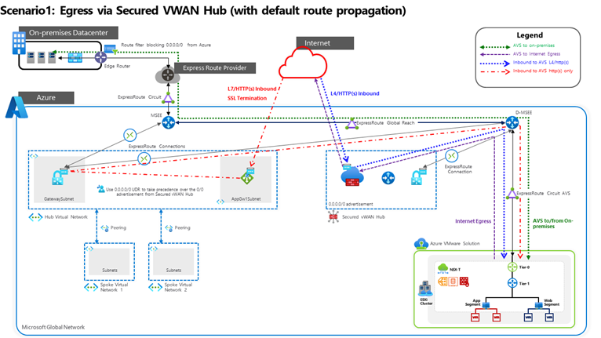

# Network topology and connectivity for Azure VMware Solution enterprise-scale scenario

Leveraging VMWare's Software Defined Data Center with Azure's Cloud ecosystem presents a unique set of design considerations for establishing and maintaining connectivity at scale for both cloud native and hybrid scenarios. This article builds on several architecture principles and recommendations defined in the Cloud Adoption Framework [Enterprise-Scale Landing Zones (ESLZ)](https://docs.microsoft.com/azure/cloud-adoption-framework/ready/enterprise-scale/network-topology-and-connectivity) design area for [network topology and connectivity](https://docs.microsoft.com/en-us/azure/cloud-adoption-framework/ready/enterprise-scale/network-topology-and-connectivity).

Following the guidance in this article will help examine key design considerations and best practices surrounding networking and connectivity to, from, and within Microsoft Azure and [Azure VMware Solution (AVS)](https://docs.microsoft.com/azure/azure-vmware/introduction) deployments. For mission-critical AVS platforms, leverages the guidance on the enterprise-scale design areas as the design foundations including:

**Hybrid integration** - Connectivity between on-premises, multi-cloud, edge, and global users [Enterprise-Scale support for hybrid and multicloud](https://docs.microsoft.com/en-us/azure/cloud-adoption-framework/scenarios/hybrid/enterprise-scale-landing-zone).
**Performance and reliability at scale** - Consistent, low-latency experience and scalability
for workloads.
**Zero trust-based network security** - Securing network perimeter and traffic flows [Network security strategies on Azure](https://docs.microsoft.com/en-us/azure/architecture/framework/security/design-network).
**Extensibility** - Ease of expanding network footprint without design rework.

## Terminology used in this document

- **NVA**: Network Virtual Appliance: A network device used to support functions including but not limited to connectivity, application delivery, WAN optimization, and security such as Firewalls, Load balancers, etc.
- **North-South traffic inspection**: Bidirectional traffic flow to and from AVS to the Datacenter
- **East-West traffic inspection**: Traffic to Azure VNET's and cross region.
- **Virtual Extensible LAN (VXLAN)**: network virtualization technology aimed at scaling that cloud by generating a virtual network to overlap a Local Access Network (LAN) leveraging Layer 3 (L3) technology to extend the network.
- **Destination Network Address Translation (DNAT):** Destination Network Address Translation for translating and filtering ingress traffic.
- **Source Network Address Translation (SNAT):** Source Network Address Translation (SNAT)for translating outbound traffic.

## Common Networking Scenarios

Designing and implementing AVS networking capabilities is critical for establishing the Landing Zone. Azure Networking Products and Services support a wide variety of networking capabilities. How these services are structured and the networking architectures chosen depends on the organization's workload, governance, and requirements.

These are some **key considerations** that affect your AVS deployment:

- Traffic inspection requirements (AVS to internet egress, AVS to on-premises, AVS to Azure Virtual Network, and within AVS). These represent the first four columns of the table below.
- Internet egress path considerations.
- Internet Ingress (HTTP(s) or non-HTTP(s)) requirements into applications in AVS
- L2 extension for migrations
- Use of NVAs in the current architecture.
- AVS connectivity to a standard Hub Virtual Network or Azure Virtual WAN Hub
- Private connectivity (ExpressRoute) used from on-premises to AVS and whether or not global reach is enabled

This section describes the four most common scenarios used in an AVS Private cloud. This is not an exhaustive list. For additional scenarios outside of the scope of this document, see [Deploy NVAs that support VXLAN with Route Server and Transit VNET](https://github.com/Azure/AzureCAT-AVS/tree/main/networking/deploy-nva-with-vxlan-in-transit-vnet-and-route-server).

## Scenario 1: Secured vWAN Hub with default route propagation

- **Customer Profile/Requirements**

  This scenario is ideal for customers who do not need traffic inspection between AVS and Azure Virtual Networks, and between AVS and On-Premises but do need traffic inspection between AVS workloads and Internet.

  Azure VMware Solution will be consumed as a full PaaS offering.  Note that the customer does not own the public IPs, and if needed, public-facing L4 and L7 inbound services will need to be added.  Customers may or may not already have ExpressRoute connectivity between on-premises and Azure.  

- **Architectural Components**

  This customer profile can be achieved with Azure firewall in secured vWAN Hub for firewalling, Application Gateway for L7 load balancing, L4 DNAT using Azure firewall, outbound internet via Azure firewall in vWAN hub, ExR, VPN, or SD-WAN for connectivity between On-Prem and AVS.

- **Considerations**

  Azure firewall in secured vWAN Hub would advertise the 0.0.0.0/0 route to AVS. Note that this 0.0.0.0/0 will also get advertised to on-prem via Global Reach. Customer should implement a route filter on-premises to prevent the 0.0.0.0/0 learnt on-premises. If using SD-WAN or VPN, this issue will not come up.

  If you are currently utilizing a VNET based Hub & Spoke topology that is connected to via an Express Route Virtual Network Gateway rather than connected to vWAN directly, you will need to consider that the default route (0.0.0.0/0) from the secure vWAN Hub will be propagated to the Virtual Network Gateway and take precedence over the in-built Internet System-route within the VNET.   To work around this, implement a 0.0.0.0/0 [User Defined Routes](https://docs.microsoft.com/en-us/azure/virtual-network/virtual-networks-udr-overview#default-route) in the virtual networks to override the learned default route.

  If there are VPN or ExpressRoute connections already established to the secure vWAN hub that do not require 0.0.0.0/0 advertisement from secure vWAN hub, those connections will also receive the 0.0.0.0/0 advertisement.  To overcome that, either filter out the 0.0.0.0/0 with the on-premises edge device, or disconnect the ExpressRoute/VPN, enable 0.0.0.0/0 propagation, then disable 0.0.0.0/0 propagation on those specific connections, then re-connect those connections.

  If there are Azure Virtual Networks connected to vWAN hub those connections will receive the 0.0.0.0/0, if that is not needed disconnect those Azure Virtual Networks, enable 0.0.0.0/0 advertisement, disable 0.0.0.0/0 on those vNet connections, then re-connect the Virtual Networks.

  The Application Gateway can be hosted on a spoke Virtual Network connected to the hub or the hub Virtual Network.

  

## Scenario 2: Third-Party NVA in Azure vNET with Route Server (Global Reach disabled)

- **Customer Profile/Requirements**
  
  This scenario is ideal for customers who need fine grain control over firewalling outside of the AVS Private Cloud and need to implement a security appliance consistent with their current appliance vendor used in on-premises or other Azure environments.
  
  Customers who need multiple Public IPs for inbound services and need a block of predefined IP Addresses in Azure.  Note that the customer does not own the public IPs. Usually, public facing L4 and L7 inbound services are required for services hosted in AVS, and outbound internet connectivity is required as well. In this scenario customers already have ExpressRoute connectivity between on-premises and Azure.

- **Architectural Components**
  
  This customer profile can be achieved with Third-Party NVAs hosted in Azure Virtual Network for firewalling and some other networking functionalities. Azure Route Server is required to route the traffic between AVS, on-premises and Azure Virtual Networks, and in this scenario Azure ExpressRoute Global Reach must be disabled. The NVAs are responsible for providing Outbound internet to AVS. Application Gateway is the preferred solution for L7 HTTP(s) Load Balancing.

- **Considerations**
  
  Since all the traffic needs to be inspected in the Hub Virtual Network, where the NVAs are hosted, customers need to disable Azure ExpressRoute Global Reach, as Global Reach would allow the traffic to/from AVS to flow directly between the MSEE and D-MSEE skipping the Hub Virtual Network. Then the customer will need to implement the Azure Route Server (Note: Still in Preview) to make sure the traffic is routed through the Hub. The customer is responsible for implementing and managing its NVA solution, an existing one can be used as well.
  
  If High-Availability for the NVAs is required, deploy the NVAs in an Active-Standby configuration to preserve symmetric routing. Further details can be found [here](https://docs.microsoft.com/en-us/azure/architecture/reference-architectures/dmz/nva-ha?tabs=cli) and review your NVA vendor documentation for best practices guidance.

  The architecture diagram below shows NVA with VXLAN support. For use case with NVA without VXLAN support refer the documentation [here](https://github.com/Azure/AzureCAT-AVS/tree/main/networking/deploy-non-integrated-nvas-without-vxlan-in-vwan-with-transit-vnet-and-route-server).

  

## Scenario 3. Egress from AVS with or without NSX-T or NVA

- **Customer Profile/Requirements**

  This scenario is ideal for customers that needs to use AVS native NSX platform (hence AVS PaaS solution) or BYOL NVA within AVS for traffic inspection. All traffic from AVS to Azure VNET, AVS to internet and AVS to on-premises is funneled through the NSX tier-0/tier-1 routers or the NVAs. Customer may or may not already have ExpressRoute connectivity between on-premises and Azure.  Customer requires inbound http(s) or L4 services.

- **Architectural Components**

  This customer profile can be leveraged with NSX DFW (Distributed firewall) or with NVA behind tier-1 in AVS, Application Gateway for L7 load balancing, L4 DNAT using Azure firewall and using internet breakout from AVS.

- **Considerations**

  The customer needs to enable internet access on the Azure Portal.  With this design, outbound IP can change and is not deterministic.  Public IPs reside outside of the NVA.  NVA in AVS would still have private IPs and would not be determine the outbound public IP.  NVA would be BYOL and it is customer's responsibility to bring a license and high availability of the NVA.  Please refer to NVA vendor documentation for more details.

  

## Scenario 4. Egress from AVS via on-premises (0.0.0.0/0 advertisement from on-premises)

- **Customer Profile/Requirements**

  In this scenario customer wants to use the on-premises an FW NVA and advertise 0.0.0.0/0 from on-premises. Customer already has or will have ExpressRoute between on-premises and Azure and Global Reach enabled. Internet egress traffic inspection is handled on-premises. Traffic inspection between AVS and Azure vNET is done by the Azure Secured vWAN hub. Customer already has or will have ExpressRoute between on-premises and Azure and Global Reach enabled.  Public facing HTTP(s) or L4 inbound services are required.

- **Architectural Components**

  Application Gateway for L7 load balancing, L4 DNAT using Azure firewall, internet breakout on-premises and ExpressRoute for connectivity between on-premises and AVS.

- **Considerations**

  With this design the outbound Public IPs reside on-premises with the on-premises NVA.

  If you are currently utilizing a VNET based Hub & Spoke topology that is connected to via an Express Route Virtual Network Gateway rather than connected to vWAN directly, you will need to consider that the default route (0.0.0.0/0) from the secure vWAN Hub will be propagated to the Virtual Network Gateway and take precedence over the in-built Internet System-route within the VNET. To work around this implement a 0.0.0.0/0 [User Defined Routes](https://docs.microsoft.com/en-us/azure/virtual-network/virtual-networks-udr-overview#default-route) in the virtual networks to override the learned default route.

  Consult VMware documentation for NVA placement options available.

  

## General Design Considerations and Recommendations

- Private Clouds and Clusters
  - Design your Private Clouds and Clusters in advance, prior to any deployment. The number of Private Clouds impacts your networking requirements directly as each [Private Cloud requires its own /22 address space for Private Cloud management](https://docs.microsoft.com/azure/azure-vmware/production-ready-deployment-steps#define-the-ip-address-segment-for-private-cloud-management) and [IP address segment for VM workloads](https://docs.microsoft.com/azure/azure-vmware/production-ready-deployment-steps#define-the-ip-address-segment-for-vm-workloads). Consider defining that in advance with your VMware and Networking Teams, discuss how you will segment and prefer to distribute your Private Clouds, Clusters, Network Segments for Workloads, etc.; specially to avoid the waste of IP Addresses.
  - All Clusters can talk to each other within the same AVS Private Cloud, as they all share the same /22 Address Space.
  - Another important consideration is that all Clusters will also share the same Connectivity Settings such as: internet, ExpressRoute, HCX, Public IP, and ExpressRoute Global Reach. Your workloads can also share some basic Networking settings such as: Network Segments, DHCP, and DNS.
  - Recommended references:
    - [Define the IP address segment for private cloud management](https://docs.microsoft.com/en-us/azure/azure-vmware/production-ready-deployment-steps#determine-the-number-of-clusters-and-hosts)
    - [Define the IP address segment for VM workloads](https://docs.microsoft.com/en-us/azure/azure-vmware/production-ready-deployment-steps#define-the-ip-address-segment-for-vm-workloads)
- Bandwidth
  - Choose an adequate [Virtual Network Gateway SKUs](https://docs.microsoft.com/azure/expressroute/expressroute-about-virtual-network-gateways) for optimal bandwidth between AVS to Azure Virtual Networks. Currently, you can connect a maximum of 4 ExpressRoute circuits in one region to an ExpressRoute gateway.
- DNS and DHCP
  - DHCP: Use the DHCP service built-in to NSX or use a local DHCP server in the private cloud instead of routing broadcast DHCP traffic over the WAN back to on-premises.
  - DNS: Depending on the scenario you are adopting, and the requirements that you have, you may have different options, see the examples below according to the different connectivity options:
    - 1) AVS environment only: Deploy a new DNS Infrastructure inside your AVS Private Cloud.
    - 2) AVS connected to on-premises: Use existing DNS infrastructure, extending it to inside Azure Virtual Network or AVS (preferred) if required by deploying DNS Forwarders. Recommended VMware reference: [Add a DNS Forwarder Service](https://docs.vmware.com/en/VMware-NSX-T-Data-Center/2.5/administration/GUID-A0172881-BB25-4992-A499-14F9BE3BE7F2.html)
    - 3) AVS connected to on-premises and Azure Environments and Services: Extend existing on-premises DNS infrastructure to the Azure Hub or Identity Virtual Network (See [Enterprise Scale Landing Zones diagram](https://docs.microsoft.com/en-us/azure/cloud-adoption-framework/ready/enterprise-scale/architecture#high-level-architecture)), or use existing DNS infrastructure if already available. They are usually DNS Servers or simply DNS Forwarders deployed in your Hub Vnet.
    - Recommended references:
      - [DHCP and DNS resolution considerations](https://docs.microsoft.com/en-us/azure/azure-vmware/tutorial-network-checklist#dhcp-and-dns-resolution-considerations)
      - [Configure DHCP for Azure VMware Solution](https://docs.microsoft.com/en-us/azure/azure-vmware/configure-dhcp-azure-vmware-solution)
      - [Configure DHCP on L2 stretched VMware HCX networks](https://docs.microsoft.com/en-us/azure/azure-vmware/configure-l2-stretched-vmware-hcx-networks)
      - [Configure a DNS forwarder in the Azure portal](https://docs.microsoft.com/en-us/azure/azure-vmware/configure-nsx-network-components-azure-portal#configure-a-dns-forwarder-in-the-azure-portal)
- Ports and Protocols requirements
  - It is important to ensure all necessary ports are configured if there is a firewall on-premises to ensure all different components of the AVS private cloud can be accessed properly. See [Tutorial – Network planning checklist – Azure Vmware Solution](https://docs.microsoft.com/en-us/azure/azure-vmware/tutorial-network-checklist#required-network-ports).
- Network Topology ([Hub Spoke](https://docs.microsoft.com/azure/azure-vmware/concepts-hub-and-spoke) vs vWAN)
  - For scenarios where [transit routing between Site-2Site VPN ExpressRoute](https://docs.microsoft.com/azure/virtual-wan/virtual-wan-about#transit-er) is required, it is supported with the use of vWAN but Hub-Spoke topology is not supported.
  - Use the Scenarios presented in the beginning of this document to decide which deployment model is the best for your needs.
- Internet
  - The list below is just a simple reference. Use the Decision Tree and Scenarios described in the beginning of this document to decide which deployment model is the best for your needs.
  - Outbound – Possible Options to enable internet and filter/inspect traffic:
    - Vnet + NVA + Route Server (uses Azure internet)
    - On-premises Default Route (uses on-premises internet)
    - vWAN Secured Hub with Azure Firewall or NVA (uses Azure internet)
  - Inbound – Possible Options to deliver content/applications:
    - Azure Application Gateway (L7, SSL termination, Web Application Firewall)
    - DNAT/LB via on-premises
    - Virtual Network + NVA + Route Server (various scenarios)
    - vWAN Secured Hub with Azure Firewall (L4, DNAT)
    - vWAN Secured Hub with NVA (various scenarios)
- On-premises Networks
  - It is possible to stretch on-premises networks to AVS, see the following reference for more details: [Configure DHCP on L2 stretched Vmware HCX networks – Azure Vmware Solution](https://docs.microsoft.com/en-us/azure/azure-vmware/configure-l2-stretched-vmware-hcx-networks)
- ExpressRoute
  - Location
    - Consider deploying AVS on [paired regions](https://docs.microsoft.com/azure/best-practices-availability-paired-regions), near to your Datacenters
  - ExpressRoute
    - If you are using ExpressRoute Local you will need to transit from AVS to on-premises via 3rd party NVAs in an Azure Virtual Network. This is because global reach isn't supported with ExpressRoute Local circuits.
    - One ExpressRoute circuit is automatically provisioned by the AVS deployment, and it connects AVS to the D-MSEE, this circuit is free of charge and comes out-of-the-box with the AVS Private Cloud.
    - Global Reach
      - It can be used peering with, ExpressRoute circuits through an ISP, or/and ExpressRoute Direct circuits.
      - Global Reach is a required add-on in case you want AVS to communicate with on-premises and/or Azure Virtual Networks/vWAN, otherwise you will have to design your network connectivity using Azure Route Server, see the scenarios presented in the beginning of this document for more details.
      - You can peer the ExpressRoute circuit for AVS with other ExpressRoute circuits using Global Reach without charges.
      - Exceptions may apply, e.g.: Brazil, and other Locations where Global Reach I not available yet.
- VMware NSX network segments
  - [Configure NSX network components using Azure Vmware Solution – Azure Vmware Solution](https://docs.microsoft.com/en-us/azure/azure-vmware/configure-nsx-network-components-azure-portal#create-an-nsx-t-segment-in-the-azure-portal)
- Network Security
  - Traffic Inspection
    - East / West within the SDDC (NVA vs NSX-T)
    - North / South
      - NVA + Route Server (Azure internet)
      - On-premises Default Route (on-premises internet)
      - Azure Firewall + VWAN (Azure internet)
      - NSX-T within SDDC (AVS internet)
      - NVA in AVS within SDDC (AVS internet)
  - Port Mirroring
- AVS management access
  - During the deployment, consider using a bastion host in Azure vNET to access the AVS environment. Once the routing to the on-premises environment is established, AVS management network does not honor the 0.0.0.0/0 routes from on-premises so you have to advertise more specific routes for the on-prem networks.
- BCDR & Migrations
  - VMware HCX – Migration
    - [Deploy and configure VMware HCX – Azure VMware Solution](https://docs.microsoft.com/en-us/azure/azure-vmware/tutorial-deploy-vmware-hcx)
    - HCX L2 extension.
    - Default gateway remains on-premises.
  - Layer-2 Extension Design
    - [Layer 2 Bridging in Manager Mode (vmware.com)](https://docs.vmware.com/en/VMware-NSX-T-Data-Center/3.1/administration/GUID-7B21DF3D-C9DB-4C10-A32F-B16642266538.html)
    - For migrations that require Layer 2 extension ExpressRoute is required. VPN is not supported.
    - MTU size should be 1350 to accommodate for the overhead of HCX.