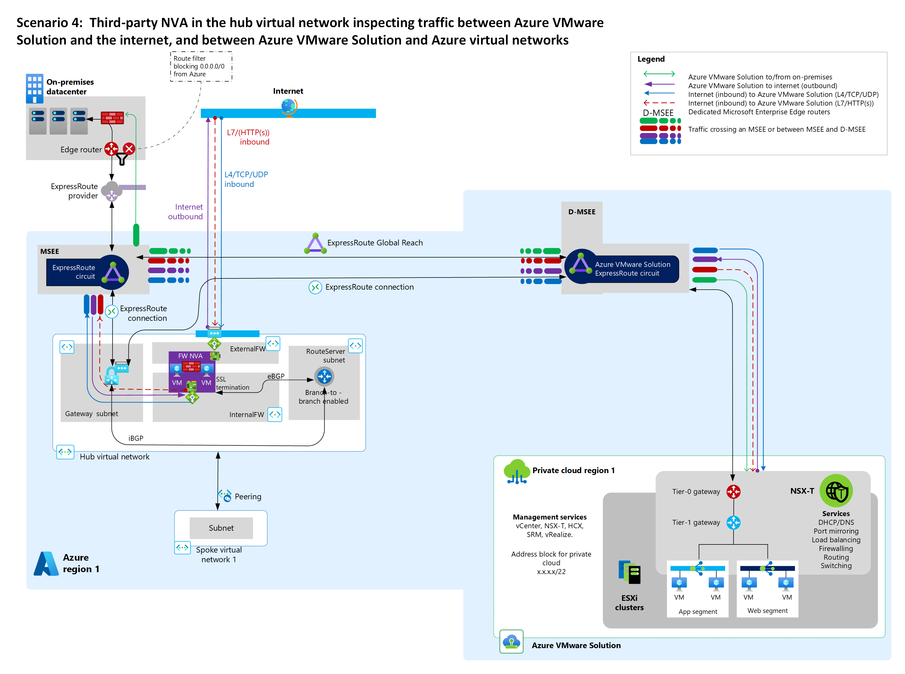

# Network topology and connectivity for Azure VMware Solution

When using a VMware software-defined datacenter (SDDC) with an Azure cloud ecosystem, you have a unique set of design considerations to follow for both cloud-native and hybrid scenarios. This article provides key considerations and best practices for networking and connectivity to, from, and within Azure and [Azure VMware Solution](/azure/azure-vmware/introduction) deployments.

The article builds on several Cloud Adoption Framework [enterprise-scale landing zones](https://learn.microsoft.com/azure/cloud-adoption-framework/ready/landing-zone/design-area/network-topology-and-connectivity) architectural principles and recommendations for managing network topology and connectivity at scale. You can use this Azure landing zone design area guidance for mission-critical Azure VMware Solution platforms. Design areas include:

- **Hybrid integration** for connectivity between on-premises, multicloud, edge, and global users. For more information, see [Enterprise-scale support for hybrid and multicloud](../hybrid/enterprise-scale-landing-zone.md).
- **Performance and reliability at scale** for workload scalability and consistent, low-latency experience.
- **Zero-trust-based network security** for network perimeter and traffic flow security. For more information, see [Network security strategies on Azure](/azure/architecture/framework/security/design-network).
- **Extensibility** for easy expansion of network footprints without any need for design reworks.

## Networking components and concepts

- **Azure Virtual Network** is the fundamental building block for private networks in Azure. Many types of Azure resources, including Azure Virtual Machines (VMs), can securely communicate with each other, the internet, and on-premises datacenters by using Azure Virtual Network. A virtual network is similar to a traditional network you operate out of your own datacenter, but has the Azure infrastructure benefits of scale, availability, and isolation.

- **Network virtual appliances (NVAs)** are network devices that support functions like connectivity, application delivery, wide-area network (WAN) optimization, and security. NVAs include Azure Firewall and Azure Load Balancer.

- **Azure Virtual WAN** is a networking service that brings multiple networking, security, and routing functions together within a single operational interface. Functions include:

  - Branch connectivity automation from Virtual WAN partner devices such as SD-WAN or customer premises equipment (CPE) based virtual private networks (VPNs)
  - Site-to-Site VPN connectivity
  - Remote user Point-to-Site VPN connectivity
  - Private Azure ExpressRoute connectivity
  - Intracloud connectivity like transitive connectivity for virtual networks
  - VPN ExpressRoute interconnectivity
  - Routing
  - Azure Firewall
  - Encryption for private connectivity

- **Hub-spoke network topology** involves a hub virtual network acting as a central point of connectivity for many spoke virtual networks. Your hub can also be the connectivity point for on-premises datacenter access. All spoke virtual networks peer with your hub, and you can use them to isolate workloads.

- **VXLAN (virtual extension LAN)** is a network virtualization technology for scaling cloud networks. VXLAN generates a virtual network to overlap a local area network (LAN) by using Layer 3 (L3) technology to extend the network.

- **Layer 2 (L2) extension** extends a virtual LAN or network broadcast domain across two sites. L2 extension has many names, such as datacenter interconnect (DCI), datacenter extension (DCE), extended Layer 2 network, stretched Layer 2 network, stretched VLAN, extended VLAN, stretched deploy, or Layer 2 VPN.

- **Layer 4 (L4)** refers to the fourth layer of the open systems interconnection (OSI) model. L4 provides transparent transmission or transfer of data between end systems or hosts. L4 is responsible for end-to-end error recovery and flow control. Some of the main protocols used in L4 include:

  - Transmission Control Protocol (TCP)
  - User Datagram Protocol (UDP)
  - AppleTalk Transaction Protocol (ATP)
  - Multipath TCP (MPTCP)
  - Sequenced packet exchange (SPX)

- **Layer 7 (L7)** is the seventh and topmost layer of the OSI model and is referred to as the application layer. L7 identifies communicating parties and the quality of service between them. It also handles privacy and user authentication, and identifies any constraints on the data syntax. This layer is wholly application-specific, and API calls and responses belong in this layer. L7's main protocols are HTTP, HTTPS, and SMTP.

## Networking scenarios

To establish an Azure VMware Solution landing zone, you need to first design and implement networking capabilities. Azure networking products and services support a wide variety of networking scenarios. Choose an appropriate architecture and plan for structuring services for your needs by evaluating your organization's workloads, governance, and requirements.

Review the following considerations and key requirements before making your Azure VMware Solution deployment decision.

- HTTP/S or non-HTTP/S internet ingress requirements into Azure VMware Solution applications
- Internet egress path considerations
- L2 extension for migrations
- NVA use in the current architecture
- Azure VMware Solution connectivity to either a standard hub virtual network or Virtual WAN hub
- Private ExpressRoute connectivity from on-premises datacenters to Azure VMware Solution (and if you should enable ExpressRoute Global Reach or not)
- Traffic inspection requirements for:
  - Internet ingress into Azure VMware Solution applications
  - Azure VMware Solution egress access to the internet
  - Azure VMware Solution access to on-premises datacenters
  - Azure VMware Solution access to Azure Virtual Network
  - Traffic within the Azure VMware Solution private cloud

The following table uses VMware solution traffic inspection requirements to provide recommendations and considerations for the most common networking scenarios.

| Scenario | Traffic inspection requirements | Recommended solution design | Considerations |
|---|----|---|---|
| 1 | <li> Internet ingress <li> Internet egress | <li> Use a Virtual WAN secured hub with default gateway propagation. <li> For HTTP/S traffic, use Azure Application Gateway. For non-HTTP/S traffic, use Azure Firewall. <li> Deploy a secured Virtual WAN hub and enable public IP in Azure VMware Solution. | This solution doesn't work for on-premises filtering. Global Reach bypasses Virtual WAN hubs. |
| 2 | <li> Internet ingress <li> Internet egress <li> To on-premises datacenter <li> To Azure Virtual Network| <li> Use third-party firewall NVA solutions in your hub virtual network with Azure Route Server. <li> Disable Global Reach. <li> For HTTP/S traffic, use Azure Application Gateway. For non-HTTP/S traffic, use a third-party firewall NVA on Azure.| Choose this option if you want to use your existing NVA and centralize all traffic inspection in your hub virtual network. |
| 3 | <li> Internet ingress <li> Internet egress <li> To on-premises datacenter <li> To Azure Virtual Network <li> Within Azure VMware Solution| <li> Use NSX-T Data Center or a third-party NVA firewall in Azure VMware Solution. <li> Use Application Gateway for HTTPs, or Azure Firewall for non-HTTPs traffic. <li>  Deploy the secured Virtual WAN hub and enable public IP in Azure VMware Solution.| Choose this option if you need to inspect traffic from two or more Azure VMware Solution private clouds.    This option lets you use NSX-T Data Center native features. You can also combine this option with NVAs running on Azure VMware Solution between L1 and L0. |
| 4 | <li> Internet ingress <li> To Azure Virtual Network|<li> Use Virtual WAN secured hub. <li> For HTTP/S traffic, use Azure Application Gateway. For non-HTTP/S traffic, use Azure Firewall. <li> Deploy a secured Virtual WAN hub and enable public IP in Azure VMware Solution. | Choose this option to advertise the `0.0.0.0/0` route from on-premises datacenters. |
| 5 | <li> Internet ingress <li> Internet egress <li> To on-premises datacenter <li> To Azure Virtual Network | <li> Use third-party firewall solutions in a hub virtual network with Azure Route Server. <li> For HTTP/S traffic, use Azure Application Gateway. For non-HTTP/S traffic, use a third-party firewall NVA on Azure. <li> Use an on-premises third-party firewall NVA. <li> Deploy third-party firewall solutions in a hub virtual network with Azure Route Server. | Choose this option to advertise the `0.0.0.0/0` route from an NVA in your Azure hub virtual network to an Azure VMware Solution.|

Key points about the networking scenarios:
- All scenarios have similar ingress patterns via Application Gateway and Azure Firewall.
- You can use L4-L7 load balancer NVAs in Azure VMware Solution.
- You can use NSX-T Data Center Firewall for any of these scenarios.

The following sections outline the most common networking scenarios for Azure VMware Solution private clouds. This list isn't exhaustive. For more scenarios, see [Azure VMware Solution Network Planning Checklist](/azure/azure-vmware/tutorial-network-checklist).

## Scenario 1: Secured Virtual WAN hub with default route propagation

This scenario involves the following customer profile, architectural components, and considerations.

### Customer profile

This scenario is ideal if:

- You don't need traffic inspection between Azure VMware Solution and Azure Virtual Network.
- You don't need traffic inspection between Azure VMware Solution and on-premises datacenters.
- You need traffic inspection between Azure VMware Solution workloads and the internet.

For this scenario, consume Azure VMware Solution like a platform as a service (PaaS) offering. In this scenario, you don't own the public IP addresses. Add public-facing L4 and L7 inbound services if needed. You may not already have ExpressRoute connectivity between on-premises datacenters and Azure.

### Architectural components

Implement this scenario with:

- Azure Firewall in a secured Virtual WAN hub for firewalls
- Application Gateway for L7 load balancing
- L4 destination network address translation (DNAT) with Azure Firewall to translate and filter network ingress traffic
- Outbound internet via Azure Firewall in your Virtual WAN hub
- EXR, VPN, or SD-WAN for connectivity between on-premises datacenters and Azure VMware Solution

### Considerations

If you don't want to receive the default route `0.0.0.0/0` advertisement from Azure VMware Solution because it conflicts with your existing environment, you need to do some extra work.

Azure Firewall in a secured Virtual WAN hub advertises the `0.0.0.0/0` route to Azure VMware Solution. This route is also advertised on-premises through Global Reach. Implement an on-premises route filter to prevent `0.0.0.0/0` route learning. Avoid this issue by using SD-WAN or VPN.

If you currently connect to a virtual network-based hub-and-spoke topology through an ExpressRoute gateway instead of connecting directly, the default `0.0.0.0/0` route from the Virtual WAN hub propagates to that gateway and takes precedence over the internet system route built into your virtual network. Avoid this issue by implementing a `0.0.0.0/0` [user-defined route](/azure/virtual-network/virtual-networks-udr-overview#user-defined) in your virtual network to override the learned default route.

Established VPN, ExpressRoute, or virtual network connections to a secure Virtual WAN hub that don't require `0.0.0.0/0` advertisement receive the advertisement anyway. To prevent this, you can either:

- Filter out the `0.0.0.0/0` route with an on-premises edge device.
- Disable `0.0.0.0/0` propagation on specific connections.
  1. Disconnect the ExpressRoute, VPN, or virtual network.
  2. Enable `0.0.0.0/0` propagation.
  3. Disable `0.0.0.0/0` propagation on those specific connections.
  4. Reconnect those connections.

You can host Application Gateway on a spoke virtual network connected to your hub or on the hub virtual network.

## Scenario 2: A third-party NVA in hub Azure Virtual Network inspects all network traffic

This scenario involves the following customer profile, architectural components, and considerations.

### Customer profile

This scenario is ideal if:

- You need to use your third-party firewall NVAs in a hub virtual network to inspect all traffic, and you can't use Global Reach for geopolitical or other reasons.
  - You are between on-premises datacenters and Azure VMware Solution.
  - You are between Azure Virtual Network and Azure VMware Solution.
  - You need internet ingress from Azure VMware Solution.
  - You need internet egress to Azure VMware Solution.
- You need fine-grained control over firewalls outside the Azure VMware Solution private cloud.
- You need multiple public IP addresses for inbound services and need a block of predefined IP addresses in Azure. In this scenario, you don't own the public IP addresses.

This scenario assumes you have ExpressRoute connectivity between on-premises datacenters and Azure.

### Architectural components

Implement this scenario with:

- Third-party firewall NVAs hosted in a virtual network for traffic inspection and other networking functions.
- [Azure Route Server](/azure/route-server/overview), to route traffic between Azure VMware Solution, on-premises datacenters, and virtual networks.
- Application Gateway to provide L7 HTTP/S load balancing.

You must disable ExpressRoute Global Reach in this scenario. The third-party NVAs are responsible for providing outbound internet to Azure VMware Solution.

### Considerations

- Never configure ExpressRoute Global Reach for this scenario, because it lets Azure VMware Solution traffic flow directly between Microsoft Enterprise Edge (MSEE) ExpressRoute routers, skipping the hub virtual network.
- Azure Route Server must be deployed in your hub VNet and BGP-peered with the NVAs in the transit VNet. Configure Azure Route Server to allow [branch-to-branch](/azure/route-server/quickstart-configure-route-server-portal#configure-route-exchange) connectivity.
- Use custom route tables and user-defined routes are used to route traffic to/from Azure VMware Solution to the third-party firewall NVAs' load balancer. All HA modes (active/active and active/standby) are supported, with guaranteed routing symmetry.
- If you need high availability for NVAs, consult your NVA vendor documentation and [deploy highly available NVAs](/azure/architecture/reference-architectures/dmz/nva-ha?tabs=cli).

## Scenario 3: Egress from Azure VMware Solution with or without NSX-T Data Center or NVA

This scenario involves the following customer profile, architectural components, and considerations.

### Customer profile

This scenario is ideal if:

- You must use the native NSX-T Data Center platform, so you need a PaaS deployment for Azure VMware Solution.
- You need a bring-your-own-license (BYOL) NVA within Azure VMware Solution for traffic inspection.
- You might or might not already have ExpressRoute connectivity between on-premises datacenters and Azure.
- You need inbound HTTP/S or L4 services.

All traffic from Azure VMware Solution to Azure Virtual Network, from Azure VMware Solution to the internet, and from Azure VMware Solution to on-premises datacenters gets funneled through the NSX-T Data Center tier-0/tier-1 routers or the NVAs.

### Architectural components

Implement this scenario with:

- An NSX-T Data Center distributed firewall (DFW), or an NVA behind tier-1 in Azure VMware Solution.
- Application Gateway to provide L7 load balancing.
- L4 DNAT using Azure Firewall.
- Internet breakout from Azure VMware Solution.

### Considerations

Enable internet access on the Azure portal. In this design, an outbound IP address can change and isn't deterministic. Public IP addresses reside outside the NVA. The NVA in Azure VMware Solution still has private IP addresses and doesn't determine the outbound public IP address.

The NVA is BYOL. It's your responsibility to bring a license and implement high availability for the NVA.

See the VMware documentation for NVA placement options and for information about the VMware limitation of up to eight virtual network interface cards (NICs) on a VM. For more information, see [Firewall integration in Azure VMware Solution](https://techcommunity.microsoft.com/t5/azure-migration-and/firewall-integration-in-azure-vmware-solution/ba-p/2254961).

## Scenario 4: Egress from Azure VMware Solution through `0.0.0.0/0` advertisement from on-premises

This scenario involves the following customer profile, architectural components, and considerations.

### Customer profile

This scenario is ideal if:

- You want to use an on-premises NVA and advertise `0.0.0.0/0` from the on-premises environment.
- You have (or will have) ExpressRoute between on-premises datacenters and Azure, and Global Reach is enabled.
- You need public-facing HTTP/S or L4 inbound services.

In this scenario, internet egress traffic inspection is handled on-premises. The secured Azure Virtual WAN hub does traffic inspection between Azure VMware Solution and Azure Virtual Network.

### Architectural components

Implement this scenario with:

- Application Gateway to provide L7 load balancing.
- L4 DNAT using Azure Firewall.
- Internet breakout on-premises.
- ExpressRoute for connectivity between on-premises datacenters and Azure VMware Solution.

### Considerations

In this design, outbound public IP addresses reside on-premises with the on-premises NVA.

If you currently connect to a virtual network-based hub-and-spoke topology through an ExpressRoute gateway rather than connecting directly, the default `0.0.0.0/0` route from the Virtual WAN hub propagates to the gateway and takes precedence over the internet system route built into your virtual network. Avoid this issue by implementing a `0.0.0.0/0` [user-defined route](/azure/virtual-network/virtual-networks-udr-overview#user-defined) in the virtual network to override the learned default route.

## Scenario 5: A third-party NVA in the hub VNet inspects traffic between AVS and the internet and between AVS and Azure VNets

This scenario has the following customer profile, architectural components, and considerations:

### Customer profile

This scenario is ideal if:

- You want Azure VMware Solution internet egress using your third-party NVA in Azure VNet hub and you want to inspect traffic between Azure VMware Solution and Azure Virtual Network.
- You want to inspect traffic between on-premises datacenters and Azure by using your on-premises third-party NVA.
- You need multiple public IP addresses for inbound services and need a block of predefined IP addresses in Azure. In this scenario, you don't own the public IPs.
- You need fine-grained control over firewalls outside the Azure VMware Solution private cloud.

### Architectural components

Implement this scenario with:

- Third-party NVAs active-active or active-standby hosted in a VNet for firewalls and other networking functions.
- [Azure Route Server](/azure/route-server/overview) to exchange routes between Azure VMware Solution, on-premises datacenters, and virtual networks.
- Your third-party NVAs in your Azure Virtual Network hub to provide outbound internet to Azure VMware Solution.
- ExpressRoute for connectivity between on-premises datacenters and Azure VMware Solution.

### Considerations

- In this design, outbound public IP addresses reside with NVAs in the Azure VNet.
- Third-party NVAs in the virtual network hub BGP are peered with Azure Route Server ([ECMP](/azure/route-server/route-server-faq#if-azure-route-server-receives-the-same-route-from-more-than-one-nva-how-does-it-handle-them)) and [advertise the default route](/azure/route-server/vmware-solution-default-route)) `0.0.0.0/0` to Azure VMware Solution.
- The default route `0.0.0.0/0` is also advertised on-premises via Global Reach. Implement a route filter on-premises to prevent default route `0.0.0.0/0` learning.
- Traffic between Azure VMware Solution and your on-premises network flows through the ExpressRoute Global Reach, as described in [Peer on-premises environments to Azure VMware Solution](/azure/azure-vmware/tutorial-expressroute-global-reach-private-cloud). Traffic inspection between on-premises and Azure VMware Solution is performed by your on-premises third-party NVA, not your third-party NVAs in Azure Virtual Network hub.
- You can host Application Gateway on a spoke virtual network connected to a hub or on the hub virtual network.

## General design considerations and recommendations

The following sections provide general design considerations and recommendations for Azure VMware Solution network topology and connectivity.

### Hub-spoke vs. Virtual WAN network topology

If you don't have an ExpressRoute connection from on-premises to Azure and you're instead using S2S VPN, you can use Virtual WAN to [transit connectivity between your on-premises VPN and the Azure VMware Solution ExpressRoute](/azure/virtual-wan/virtual-wan-about#transit-er). If you're using a hub-spoke topology, you need Azure Route Server. For more information, see [Azure Route Server support for ExpressRoute and Azure VPN](/azure/route-server/expressroute-vpn-support).

### Private clouds and clusters

- All clusters can communicate within an Azure VMware Solution private cloud because they all share the same /22 address space.

- All clusters share the same connectivity settings, including internet, ExpressRoute, HCX, public IP, and ExpressRoute Global Reach. Application workloads can also share some basic networking settings like network segments, dynamic host configuration protocol (DHCP), and Domain Name System (DNS) settings.

- Design private clouds and clusters in advance before your deployment. The number of private clouds you require directly affects your networking requirements. Each private cloud requires its own [/22 address space for private cloud management](/azure/azure-vmware/production-ready-deployment-steps#define-the-ip-address-segment-for-private-cloud-management) and [IP address segment for VM workloads](/azure/azure-vmware/production-ready-deployment-steps#define-the-ip-address-segment-for-vm-workloads). Consider defining those address spaces in advance.

- Discuss with your VMware and networking teams how to segment and distribute your private clouds, clusters, and network segments for workloads. Plan well and avoid wasting IP addresses.

For more information about managing IP addresses for private clouds, see [Define the IP address segment for private cloud management](/azure/azure-vmware/production-ready-deployment-steps#determine-the-number-of-clusters-and-hosts).

For more information about managing IP addresses for VM workloads, see [Define the IP address segment for VM workloads](/azure/azure-vmware/production-ready-deployment-steps#define-the-ip-address-segment-for-vm-workloads).

### DNS and DHCP

For DHCP, use the DHCP service built into NSX-T Data Center, or use a local DHCP server in a private cloud. Don't route broadcast DHCP traffic over the WAN back to on-premises networks.

For DNS, depending on the scenario you adopt and your requirements, you have multiple options:

- For an Azure VMware Solution environment only, you can deploy a new DNS infrastructure in your Azure VMware Solution private cloud.
- For Azure VMware Solution connected to an on-premises environment, you can use existing DNS infrastructure. If necessary, deploy DNS forwarders to extend into Azure Virtual Network or, preferably, into Azure VMware Solution. For more information, see [Add a DNS forwarder service](https://docs.vmware.com/en/VMware-NSX-T-Data-Center/2.5/administration/GUID-A0172881-BB25-4992-A499-14F9BE3BE7F2.html).
- For Azure VMware Solution connected to both on-premises and Azure environments and services, you can use existing DNS servers or DNS forwarders in your hub virtual network if available. You can also extend existing on-premises DNS infrastructure to the Azure hub virtual network. For details, see the [enterprise-scale landing zones diagram](../../ready/landing-zone/index.md#high-level-architecture).

For more information, see the following articles:

- [DHCP and DNS resolution considerations](/azure/azure-vmware/tutorial-network-checklist#dhcp-and-dns-resolution-considerations)
- [Configure DHCP for Azure VMware Solution](/azure/azure-vmware/configure-dhcp-azure-vmware-solution)
- [Configure DHCP on L2 stretched VMware HCX networks](/azure/azure-vmware/configure-l2-stretched-vmware-hcx-networks)
- [Configure a DNS forwarder in the Azure portal](/azure/azure-vmware/configure-nsx-network-components-azure-portal#configure-a-dns-forwarder-in-the-azure-portal)

### Internet

Outbound options for enabling internet and filtering and inspecting traffic include:

- Azure Virtual Network, NVA, and Azure Route Server using Azure internet access.
- On-premises default route using on-premises internet access.
- Virtual WAN secured hub with Azure Firewall or NVA, using Azure internet access.

Inbound options for delivering content and applications include:

- Azure Application Gateway with L7, Secure Sockets Layer (SSL) termination, and Web Application Firewall.
- DNAT and load balancer from on-premises.
- Azure Virtual Network, NVA, and Azure Route Server in various scenarios.
- Virtual WAN secured hub with Azure Firewall, with L4 and DNAT.
- Virtual WAN secured hub with NVA in various scenarios.

### ExpressRoute

The Azure VMware Solution out-of-the-box private cloud deployment automatically one free 10 Gbps ExpressRoute circuit. This circuit connects Azure VMware Solution to the D-MSEE.

Consider deploying Azure VMware Solution in [Azure paired regions](/azure/best-practices-availability-paired-regions) near your datacenters.

#### Global Reach

- Global Reach is a required ExpressRoute add-on for Azure VMware Solution to communicate with on-premises datacenters, Azure Virtual Network, and Virtual WAN. The alternative is to design your network connectivity with Azure Route Server.

- You can peer the Azure VMware Solution ExpressRoute circuit with other ExpressRoute circuits using Global Reach at no charge.

- You can use Global Reach for peering ExpressRoute circuits through an ISP and for ExpressRoute Direct circuits.

- Global Reach isn't supported for ExpressRoute Local circuits. For ExpressRoute Local, transit from Azure VMware Solution to on-premises datacenters via third-party NVAs in an Azure virtual network.
- Global Reach isn't available in all locations.

### Bandwidth

Choose an appropriate [virtual network gateway SKU](/azure/expressroute/expressroute-about-virtual-network-gateways) for optimal bandwidth between Azure VMware Solution and Azure Virtual Network. Azure VMware Solution supports a [maximum of four ExpressRoute circuits](/azure/azure-vmware/concepts-networking#limitations) to an ExpressRoute gateway in one region.

### Network security

Network security involves traffic inspection and port mirroring.

*East-West traffic inspection* within an SDDC uses NSX-T Data Center or NVAs to inspect traffic to Azure Virtual Network across regions.

*North-South traffic inspection* inspects bidirectional traffic flow between Azure VMware Solution and datacenters. North-south traffic inspection can use:

- A third-party firewall NVA and Azure Route Server over Azure internet.
- An on-premises default route over on-premises internet.
- Azure Firewall and Virtual WAN over Azure internet
- NSX-T Data Center within the SDDC over Azure VMware Solution internet.
- A third-party firewall NVA in Azure VMware Solution within the SDDC over Azure VMware Solution internet

### Ports and protocol requirements

Configure all necessary ports for an on-premises firewall to ensure proper access to all Azure VMware Solution private cloud components. For more information, see [Required network ports](/azure/azure-vmware/tutorial-network-checklist#required-network-ports).

### Azure VMware Solution management access

- Consider using an Azure Bastion host in Azure Virtual Network to access the Azure VMware Solution environment during deployment.

- Once you establish routing to your on-premises environment, Azure VMware Solution management network doesn't honor the `0.0.0.0/0` routes from on-premises networks, so you need to advertise more specific routes for your on-premises networks.

### Business continuity, disaster recovery (BCDR), and migrations

- In VMware HCX migrations, the default gateway remains on-premises. For more information, see [Deploy and configure VMware HCX](/azure/azure-vmware/tutorial-deploy-vmware-hcx).

- VMware HCX migrations can use HCX L2 extension. Migrations that require Layer 2 extension also require ExpressRoute. S2S VPN is supported as long as the minimum [network underlay minimum requirements](https://docs.vmware.com/en/VMware-HCX/4.2/hcx-user-guide/GUID-8128EB85-4E3F-4E0C-A32C-4F9B15DACC6D.html) are net. Maximum transmission unit (MTU) size should be 1350 to accommodate the overhead of HCX. For more information about Layer 2 extension design, see [Layer 2 bridging in manager mode (VMware.com)](https://docs.vmware.com/en/VMware-NSX-T-Data-Center/3.1/administration/GUID-7B21DF3D-C9DB-4C10-A32F-B16642266538.html).

## Next steps

- For more information about Azure VMware Solution in hub-and-spoke networks, see [Integrate Azure VMware Solution in a hub and spoke architecture](/azure/azure-vmware/concepts-hub-and-spoke).
- For more information on VMware NSX-T Data Center network segments, see [Configure NSX-T Data Center network components using Azure VMware Solution](/azure/azure-vmware/configure-nsx-network-components-azure-portal#create-an-nsx-t-segment-in-the-azure-portal).
- To learn Cloud Adoption Framework enterprise-scale landing zone architectural principles, various design considerations, and best practices for Azure VMware Solution, see the next article in this series:

  > [!div class="nextstepaction"]
  > [Security, governance, and compliance disciplines for Azure VMware Solution](./eslz-security-governance-and-compliance.md)
