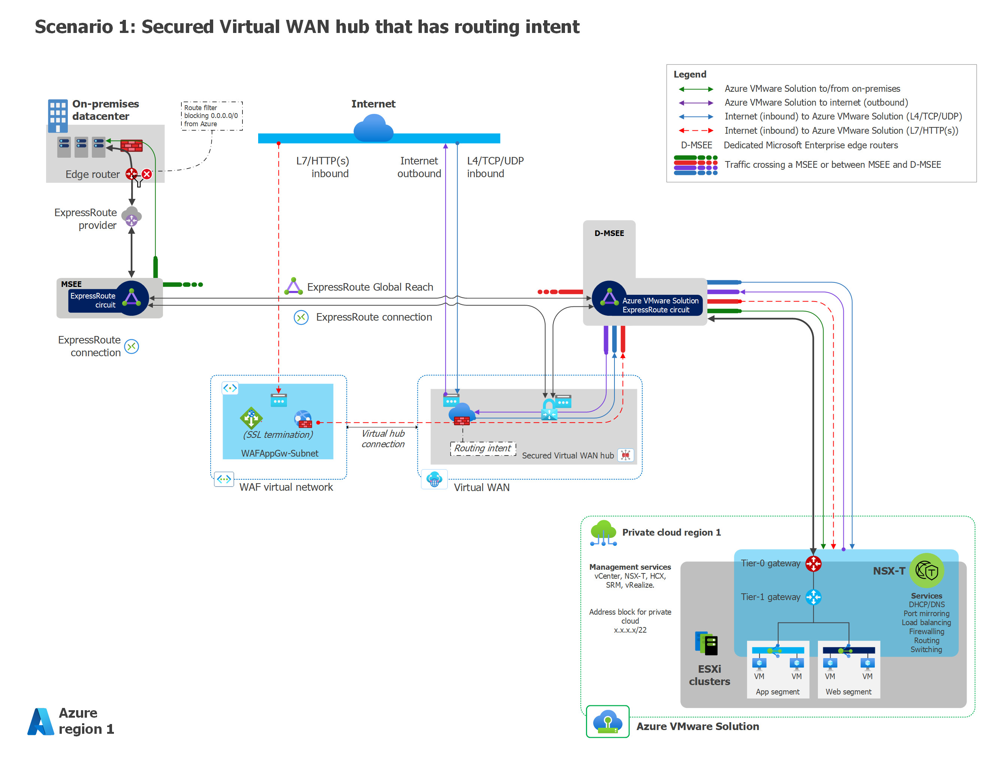

# Network topology and connectivity for Azure VMware Solution

Using the VMware Software-Defined Datacenter (SDDC) with the Azure cloud ecosystem presents a unique set of design considerations for both cloud-native and hybrid scenarios. This article examines key considerations and best practices around networking and connectivity to, from, and within Azure and [Azure VMware Solution](/azure/azure-vmware/introduction) deployments.

The article builds on several Cloud Adoption Framework [enterprise-scale landing zones](/azure/cloud-adoption-framework/ready/enterprise-scale/network-topology-and-connectivity) architectural principles and recommendations for managing network topology and connectivity at scale. You can use this enterprise-scale design area guidance for mission-critical Azure VMware Solution platforms. Design foundations include:

- **Hybrid integration** for connectivity between on-premises, multicloud, edge, and global users. For more information, see [Enterprise-Scale support for hybrid and multicloud](/azure/cloud-adoption-framework/scenarios/hybrid/enterprise-scale-landing-zone).
- **Performance and reliability at scale** for consistent, low-latency experience and scalability for workloads.
- **Zero-trust-based network security** to secure network perimeter and traffic flows. For more information, see [Network security strategies on Azure](/azure/architecture/framework/security/design-network).
- **Extensibility** for easily expanding network footprint without design rework.

## Networking components and concepts

- **Azure Virtual Network** is the fundamental building block for private networks in Azure. With Virtual Network, many types of Azure resources, such as Azure Virtual Machines (VMs), can securely communicate with each other, the internet, and on-premises datacenters. Virtual Network is similar to a traditional network that you operate in your own datacenter, but has the Azure infrastructure benefits of scale, availability, and isolation.

- A **network virtual appliance (NVA)** is a network device that supports functions like connectivity, application delivery, wide-area network (WAN) optimization, and security. NVAs include Azure Firewall and Azure Load Balancer.

- **Azure Virtual WAN** is a networking service that brings many networking, security, and routing functions together in a single operational interface. These capabilities include:

  - Branch connectivity automation from Virtual WAN partner devices such as SD-WAN or customer premises equipment (CPE)-based Virtual Private Networks (VPNs)
  - Site-to-site VPN connectivity
  - Remote user point-to-site VPN connectivity
  - Private Azure ExpressRoute connectivity
  - Intracloud connectivity like transitive connectivity for virtual networks
  - VPN ExpressRoute interconnectivity
  - Routing
  - Azure Firewall
  - Encryption for private connectivity

- In **hub-spoke network topology**, a hub virtual network acts as a central point of connectivity to many spoke virtual networks. The hub can also be the connectivity point to on-premises datacenters. The spoke virtual networks peer with the hub and can be used to isolate workloads.

- **Virtual Extensible LAN (VXLAN)** is network virtualization technology for scaling cloud networks. VXLAN generates a virtual network to overlap a local area network (LAN) by using Layer 3 (L3) technology to extend the network.

- **Layer 2 (L2) extension** extends a virtual LAN or network broadcast domain across two sites. L2 extension has many names, such as datacenter Interconnect (DCI), datacenter Extension (DCE), Extended Layer 2 Network, Stretched Layer 2 Network, Stretched VLAN, Extended VLAN, Stretched Deploy, or Layer 2 VPN.

- **Layer 4 (L4)** refers to the fourth layer of the Open Systems Interconnection (OSI) Model. L4 provides transparent transmission or transfer of data between end systems or hosts. L4 is responsible for end-to-end error recovery, as well as flow control. Some of the main protocols used in L4 are:

  - User Datagram Protocol (UDP)
  - UDP Lite
  - Cyclic UDP (CUDP)
  - Reliable UDP (RUDP)
  - AppleTalk Transaction Protocol (ATP)
  - Multipath TCP (MTCP)
  - Transaction Control Protocol (TCP)
  - Sequenced Packet Exchange (SPX)

- **Layer 7 (L7)** is the seventh and topmost layer of the OSI Model, called the application layer. Layer 7 identifies the communicating parties and the quality of service between them. L7 handles privacy and user authentication, and identifies any constraints on the data syntax. This layer is wholly application-specific. API calls and responses belong to this layer. Some of the main L7 protocols are HTTP, HTTPS, and SMTP.

## Networking scenarios

Designing and implementing networking capabilities is critical for establishing the Azure VMware Solution landing zone. Azure networking products and services support a wide variety of capabilities. Which architecture to choose and how to structure services depends on your organization's workloads, governance, and requirements.

The following key requirements and considerations affect your Azure VMware Solution deployment decision:

- HTTP(s) or non-HTTP(s) internet ingress requirements into Azure VMware Solution applications
- Internet egress path considerations
- L2 extension for migrations
- NVA use in the current architecture
- Azure VMware Solution connectivity to a standard hub virtual network or Virtual WAN hub
- Private ExpressRoute connectivity from on-premises datacenters to Azure VMware Solution, and whether Global Reach is enabled
- Traffic inspection requirements for:

  - Internet ingress into Azure VMware Solution applications
  - Azure VMware Solution egress access to the internet
  - Azure VMware Solution access to on-premises datacenters
  - Azure VMware Solution access to Azure Virtual Network
  - Traffic within the Azure VMware Solution private cloud

The following table provides recommendations and considerations for the four most common networking scenarios, based on Azure VMware Solution traffic inspection requirements.

|Scenario|Traffic inspection requirements|Recommended solution design|Considerations
|-------|-------|------|------
|1|-  Internet ingress  -  Internet egress|-  Use Virtual WAN secured hub with default gateway propagation.  -  Use Azure Application Gateway for HTTP(s), or Azure Firewall for non-HTTP(s) traffic.  -  Deploy the secured Virtual WAN hub and enable Public IP in Azure VMware Solution.|-  This solution doesn't work for on-premises filtering. Global Reach bypasses the Virtual WAN hub.
|2|-  Internet ingress  -  Internet egress  -  To on-premises datacenter  -  To Azure Virtual Network|-  Use third-party firewall NVA solutions in the hub virtual network with Azure Route Server.  -  Disable Global Reach.  -  Use Application Gateway for HTTP(s), or third-party firewall NVA for non-HTTP(s) traffic.|-  This option is the most common for customers who want to use their existing NVA and centralize all traffic inspection in the hub virtual network.
|3|-  Internet ingress  -  Internet egress  -  To on-premises datacenter  -  To Azure Virtual Network  -  Within Azure VMware Solution|-  Use NSX-T or a third-party NVA firewall in Azure VMware Solution.  -  Use Application Gateway for HTTP(s), or Azure Firewall for non-HTTP(s) traffic.  -  Deploy the secured Virtual WAN hub and enable Public IP in Azure VMware Solution.|-  Use this option if you need to inspect traffic from two or more Azure VMware Solution private clouds.  -  This option can use NSX-T native features, or be combined with NVAs running on Azure VMware Solution between L1 and L0.
|4|-  Internet ingress  -  To Azure Virtual Network|-  Use Virtual WAN secured hub.  -  Use Azure Application Gateway for HTTP(s), or Azure Firewall for non-HTTP(s) traffic.  -  Deploy the secured Virtual WAN hub and enable Public IP in Azure VMware Solution.|-  Use this option to advertise the `0.0.0.0`./0 route from on-premises datacenters.

- Ingress patterns via Application Gateway and Azure Firewall are similar for all scenarios.
- You can use L4-L7 load balancer NVAs in Azure VMware Solution.
- You can use NSX-T firewall with any of these scenarios.

The following sections describe the four most common networking scenarios for Azure VMware Solution private clouds. This list isn't exhaustive. For more scenarios, see [Deploy NVAs that support VXLAN with Route Server and Transit VNet](https://github.com/Azure/AzureCAT-AVS/tree/main/networking/deploy-nva-with-vxlan-in-transit-vnet-and-route-server).

## Scenario 1: Secured Virtual WAN hub with default route propagation

This scenario has the following customer profile, architectural components, and considerations:

### Customer profile

This scenario is ideal if:

- You don't need traffic inspection between Azure VMware Solution and Azure Virtual Network.
- You don't need traffic inspection between Azure VMware Solution and on-premises datacenters.
- You do need traffic inspection between Azure VMware Solution workloads and the internet.

In this scenario, you consume Azure VMware Solution as a platform as a service (PaaS) offering. You don't own the public IP addresses. You have to add public-facing L4 and L7 inbound services if needed. You might or might not already have ExpressRoute connectivity between on-premises datacenters and Azure.

### Architectural components

You can implement this scenario with:

- Azure Firewall in the secured Virtual WAN hub for firewalls
- Application Gateway for L7 load balancing
- L4 Destination Network Address Translation (DNAT) with Azure Firewall to translate and filter network ingress traffic
- Outbound internet via Azure Firewall in the Virtual WAN hub
- ExR, VPN, or SD-WAN for connectivity between on-premises datacenters and Azure VMware Solution

### Considerations

If you don't want to receive the default route `0.0.0.0/0` advertisement from Azure VMware Solution because it conflicts with your existing environment, you need to take more action.

Azure Firewall in the secured Virtual WAN hub advertises the `0.0.0.0/0` route to Azure VMware Solution. The `0.0.0.0/0` route is also advertised on-premises via Global Reach. Implement an on-premises route filter to prevent `0.0.0.0/0` route learning. If you're using SD-WAN or VPN, this issue won't occur.

If you currently connect to a virtual network-based hub-and-spoke topology via an ExpressRoute gateway rather than directly, the default `0.0.0.0/0` route from the Virtual WAN hub propagates to the gateway and takes precedence over the internet system route built into the virtual network. To work around this issue, implement a `0.0.0.0/0` [user-defined route](/azure/virtual-network/virtual-networks-udr-overview#user-defined) in the virtual network to override the learned default route.

Established VPN, ExpressRoute, or Virtual Network connections to the secure Virtual WAN hub that don't require `0.0.0.0/0` advertisement will also receive the advertisement. To overcome that issue, you can either:

- Filter out the `0.0.0.0/0` route with an on-premises edge device.

- Or:
  1. Disconnect the ExpressRoute, VPN, or virtual network.
  1. Enable `0.0.0.0/0` propagation.
  1. Disable `0.0.0.0/0` propagation on those specific connections.
  1. Reconnect those connections.

You can host Application Gateway on a spoke virtual network connected to the hub or on the hub virtual network.

## Scenario 2: Third-party NVA in Virtual Network with Route Server, with Global Reach disabled

This scenario has the following customer profile, architectural components, and considerations:

### Customer profile

This scenario is ideal if:

- You need fine-grained control over firewalls outside of the Azure VMware Solution private cloud.
- You need to use a security appliance from your current vendor in on-premises or other Azure environments.
- You need multiple Public IP addresses for inbound services, and need a block of predefined IP addresses in Azure. In this scenario, you don't own the public IPs.
- You want to inspect traffic between Azure VMware Solution and on-premises datacenters by using NVAs, and you can't use Global Reach for geopolitical reasons.
- Usually, you need public-facing L4 and L7 inbound services for Azure VMware Solution services, and also need outbound internet connectivity.

In this scenario, you already have ExpressRoute connectivity between on-premises datacenters and Azure.

### Architectural components

You can implement this scenario with:

- Third-party NVAs hosted in Virtual Network for firewalls and other networking functions.
- [Azure Route Server](/azure/route-server/overview) to route the traffic between Azure VMware Solution, on-premises datacenters, and virtual networks.
- Application Gateway as the preferred solution for L7 HTTP(s) load balancing.

In this scenario, you must disable ExpressRoute Global Reach. The NVAs are responsible for providing outbound internet to Azure VMware Solution.

 [Diagram of egress through third-party NVA in Virtual Network with Route Server global reach enabled.](media/eslz-net-scenario-2.png). ](media/eslz-net-scenario-2.png#lightbox)

### Considerations

This scenario must inspect all traffic in the hub virtual network, which hosts the NVAs, so you need to disable ExpressRoute Global Reach. Global Reach would let Azure VMware Solution traffic flow directly between the Microsoft Enterprise Edge (MSEE) ExpressRoute routers, skipping the hub virtual network.

Implement Azure Route Server to make sure to route traffic through the hub. You're responsible for implementing and managing an NVA solution, or using an existing one.

> [!NOTE]
> Azure Route Server is currently in public preview.

If you need high availability for the NVAs, deploy the NVAs in an active-standby configuration to preserve symmetric routing. For more information, see your NVA vendor documentation and [Deploy highly available NVAs](/azure/architecture/reference-architectures/dmz/nva-ha?tabs=cli).

The preceding architectural diagram shows an NVA with VXLAN support. For NVAs without VXLAN support, see [Deploying a non-integrated NVA in Virtual WAN without VXLAN and a transit VNet](https://github.com/Azure/AzureCAT-AVS/tree/main/networking/deploy-non-integrated-nvas-without-vxlan-in-vwan-with-transit-vnet-and-route-server).

## Scenario 3: Egress from Azure VMware Solution with or without NSX-T or NVA

This scenario has the following customer profile, architectural components, and considerations:

### Customer profile

This scenario is ideal if:

- You must use the native NSX platform, so you need a PaaS deployment for Azure VMware Solution.
- Or, you need to bring your own license (BYOL) NVA within Azure VMware Solution for traffic inspection.
- You might or might not already have ExpressRoute connectivity between on-premises datacenters and Azure.
- You need inbound HTTP(s) or L4 services.

All traffic from Azure VMware Solution to Azure Virtual Network, Azure VMware Solution to the internet, and Azure VMware Solution to on-premises datacenters funnels through the NSX tier-0/tier-1 routers or the NVAs.

### Architectural components

You can implement this scenario with:

- NSX Distributed Firewall (DFW), or NVA behind tier-1 in Azure VMware Solution
- Application Gateway for L7 load balancing
- L4 DNAT using Azure Firewall
- Internet breakout from Azure VMware Solution

[Diagram of egress from Azure VMware Solution through NSX-T and NVA.](media/eslz-net-scenario-3.png). ](media/eslz-net-scenario-3.png#lightbox)

### Considerations

You need to enable internet access on the Azure portal. With this design, the outbound IP address can change and isn't deterministic. Public IP addresses reside outside the NVA. The NVA in Azure VMware Solution still has private IP addresses, and doesn't determine the outbound public IP address.

The NVA is BYOL, and it's your responsibility to bring the license and implement high availability for the NVA.

See the VMware documentation for NVA placement options, and for information about the VMware limitation of up to eight virtual network interface cards (NICs) on a VM. For more information, see [Firewall integration in Azure VMware Solution](https://techcommunity.microsoft.com/t5/azure-migration-and/firewall-integration-in-azure-vmware-solution/ba-p/2254961).

## Scenario 4: Egress from Azure VMware Solution via `0.0.0.0/0` advertisement from on-premises

This scenario has the following customer profile, architectural components, and considerations:

### Customer profile

This scenario is ideal if:

- You want to use the on-premises NVA and advertise `0.0.0.0/0` from the on-premises environment.
- You already have or will have ExpressRoute between on-premises datacenters and Azure, with Global Reach enabled.
- You need public-facing HTTP(s) or L4 inbound services.

Internet egress traffic inspection is handled on-premises. The secured Azure Virtual WAN hub does the traffic inspection between Azure VMware Solution and Azure Virtual Network.

### Architectural components

You can implement this scenario with:

- Application Gateway for L7 load balancing
- L4 DNAT using Azure Firewall
- Internet breakout on-premises
- ExpressRoute for connectivity between on-premises datacenters and Azure VMware Solution

 [Diagram of egress from Azure VMware Solution via on-premises.](media/eslz-net-scenario-4.png). ](media/eslz-net-scenario-4.png#lightbox)

### Considerations

With this design, the outbound Public IP addresses reside on-premises with the on-premises NVA.

If you currently connect to a virtual network-based hub-and-spoke topology via an ExpressRoute gateway rather than directly, the default `0.0.0.0/0` route from the Virtual WAN hub propagates to the gateway and takes precedence over the internet system route built into the virtual network. To work around this issue, implement a `0.0.0.0/0` [user-defined route](/azure/virtual-network/virtual-networks-udr-overview#user-defined) in the virtual network to override the learned default route.

## General design considerations and recommendations

Here are some general design considerations and recommendations for Azure VMware Solution network topology and connectivity:

### Hub-spoke vs. Virtual WAN network topology

Virtual WAN supports [transit connectivity between VPN and ExpressRoute](/azure/virtual-wan/virtual-wan-about#transit-er), but doesn't support hub-spoke topology.

### Private clouds and clusters

- All clusters can communicate within an Azure VMware Solution private cloud, because they all share the same /22 address space.

- All clusters also share the same connectivity settings, such as internet, ExpressRoute, HCX, Public IP, and ExpressRoute Global Reach. Application workloads can also share some basic networking settings like network segments, Dynamic Host Configuration Protocol (DHCP), and Domain Name System (DNS).

- Design your private clouds and clusters in advance, before deployment. The number of private clouds impacts your networking requirements directly. Each private cloud requires its own [/22 address space for private cloud management](/azure/azure-vmware/production-ready-deployment-steps#define-the-ip-address-segment-for-private-cloud-management) and [IP address segment for VM workloads](/azure/azure-vmware/production-ready-deployment-steps#define-the-ip-address-segment-for-vm-workloads). Consider defining those address spaces in advance.

- Discuss with your VMware and networking teams how to segment and distribute your private clouds, clusters, and network segments for workloads. Preplan to avoid wasting IP addresses.

- For more information about managing IP addresses for private clouds, see [Define the IP address segment for private cloud management](/azure/azure-vmware/production-ready-deployment-steps#determine-the-number-of-clusters-and-hosts).

- For more information about managing IP addresses for VM workloads, see [Define the IP address segment for VM workloads](/azure/azure-vmware/production-ready-deployment-steps#define-the-ip-address-segment-for-vm-workloads).

### DNS and DHCP

For DHCP, use the DHCP service built into NSX, or use a local DHCP server in the private cloud. Don't route broadcast DHCP traffic over the WAN back to on-premises networks.

For DNS, depending on the scenario you adopt and your requirements, you have different options:

- For an Azure VMware Solution environment only, deploy a new DNS infrastructure in your Azure VMware Solution private cloud.
- For Azure VMware Solution connected to an on-premises environment, use existing DNS infrastructure. If necessary, deploy DNS forwarders to extend into Azure Virtual Network or, preferably, into Azure VMware Solution. For more information, see [Add a DNS Forwarder Service](https://docs.vmware.com/en/VMware-NSX-T-Data-Center/2.5/administration/GUID-A0172881-BB25-4992-A499-14F9BE3BE7F2.html).
- For Azure VMware Solution connected to both on-premises and Azure environments and services, use existing DNS servers or DNS forwarders in your hub virtual network if available. Or, you can extend existing on-premises DNS infrastructure to the Azure hub virtual network. For details, see the [enterprise-scale landing zones diagram](/azure/cloud-adoption-framework/ready/enterprise-scale/architecture#high-level-architecture).

For more information, see:

- [DHCP and DNS resolution considerations](/azure/azure-vmware/tutorial-network-checklist#dhcp-and-dns-resolution-considerations)
- [Configure DHCP for Azure VMware Solution](/azure/azure-vmware/configure-dhcp-azure-vmware-solution)
- [Configure DHCP on L2 stretched VMware HCX networks](/azure/azure-vmware/configure-l2-stretched-vmware-hcx-networks)
- [Configure a DNS forwarder in the Azure portal](/azure/azure-vmware/configure-nsx-network-components-azure-portal#configure-a-dns-forwarder-in-the-azure-portal)

### Internet

The following list is a quick reference:

Outbound options to enable internet and filter and inspect traffic include:

- Virtual Network, NVA, and Route Server using Azure internet access
- On-premises default route using on-premises internet access
- Virtual WAN secured hub with Azure Firewall or NVA, using Azure internet access

Inbound options to deliver content and applications include:

- Azure Application Gateway with L7, Secure Sockets Layer (SSL) termination, and Web Application Firewall
- DNAT and load balancer via on-premises
- Virtual Network, NVA, and Route Server in various scenarios
- Virtual WAN secured hub with Azure Firewall, with L4 and DNAT
- Virtual WAN secured hub with NVA in various scenarios

### ExpressRoute

The Azure VMware Solution out-of-the-box private cloud deployment automatically provisions one free ExpressRoute circuit. This circuit connects Azure VMware Solution to the D-MSEE.

For location, consider deploying Azure VMware Solution on [Azure paired regions](/azure/best-practices-availability-paired-regions) near your datacenters.

#### Global Reach

- Global Reach is a required ExpressRoute add-on for Azure VMware Solution to communicate with on-premises datacenters, Virtual Network, and Virtual WAN. The alternative is to design your network connectivity with Azure Route Server.

- You can peer the Azure VMware Solution ExpressRoute circuit with other ExpressRoute circuits using Global Reach at no charge.

- You can use Global Reach for peering ExpressRoute circuits through an ISP, and for ExpressRoute Direct circuits.

- Global Reach isn't supported for ExpressRoute Local circuits. For ExpressRoute Local, transit from Azure VMware Solution to on-premises datacenters via third-party NVAs in an Azure virtual network.
- Global Reach isn't available in all locations.

### Bandwidth

Choose an adequate [Virtual Network Gateway SKU](/azure/expressroute/expressroute-about-virtual-network-gateways) for optimal bandwidth between Azure VMware Solution and Azure Virtual Network. Azure VMware Solution supports a maximum of four ExpressRoute circuits to an ExpressRoute gateway in one region.

### Network security

Network security uses traffic inspection and port mirroring.

*East-West traffic inspection* within the SDDC uses NSX-T or NVAs to inspect traffic to Azure Virtual Network across regions.

*North-South traffic inspection* inspects bidirectional traffic flow between Azure VMware Solution and datacenters. North-South traffic inspection can use:

- NVA and Route Server over Azure internet
- On-premises default route over on-premises internet
- Azure Firewall and Virtual WAN over Azure internet
- NSX-T within the SDDC over Azure VMware Solution internet
- NVA in Azure VMware Solution within the SDDC over Azure VMware Solution internet

### Ports and protocols requirements

Configure all necessary ports for an on-premises firewall to ensure proper access to all components of the Azure VMware Solution private cloud. For more information, see [Required network ports](/azure/azure-vmware/tutorial-network-checklist#required-network-ports).

### Azure VMware Solution management access

- During deployment, consider using an Azure Bastion host in Azure Virtual Network to access the Azure VMware Solution environment.

- Once the routing to the on-premises environment is established, Azure VMware Solution management network doesn't honor the `0.0.0.0/0` routes from on-premises networks, so you have to advertise more specific routes for the on-premises networks.

### Business Continuity and Disaster Recovery (BCDR) and migrations

- With VMware HCX Migrations, the default gateway remains on-premises. For more information, see [Deploy and configure VMware HCX](/azure/azure-vmware/tutorial-deploy-vmware-hcx).

- VMware HCX Migration can use HCX L2 extension. Migrations that require Layer 2 extension require ExpressRoute. VPN isn't supported. Maximum transmission unit (MTU) size should be 1350 to accommodate the overhead of HCX. For more information about Layer-2 extension design, see [Layer 2 Bridging in Manager Mode (VMware.com)](https://docs.vmware.com/en/VMware-NSX-T-Data-Center/3.1/administration/GUID-7B21DF3D-C9DB-4C10-A32F-B16642266538.html).

## Next steps

- For more information about Azure VMware Solution in hub-and-spoke networks, see [Integrate Azure VMware Solution in a hub and spoke architecture](/azure/azure-vmware/concepts-hub-and-spoke).
- For more information on VMware NSX network segments, see [Configure NSX network components using Azure VMware Solution](/azure/azure-vmware/configure-nsx-network-components-azure-portal#create-an-nsx-t-segment-in-the-azure-portal).
- To continue learning about the Cloud Adoption Framework enterprise-scale landing zone architectural principles, design considerations, and best practices for Azure VMware Solution, see the next article in the series:

  > [!div class="nextstepaction"]
  > [Security, governance, and compliance disciplines for Azure VMware Solution](eslz-security-governance-and-compliance.md)
