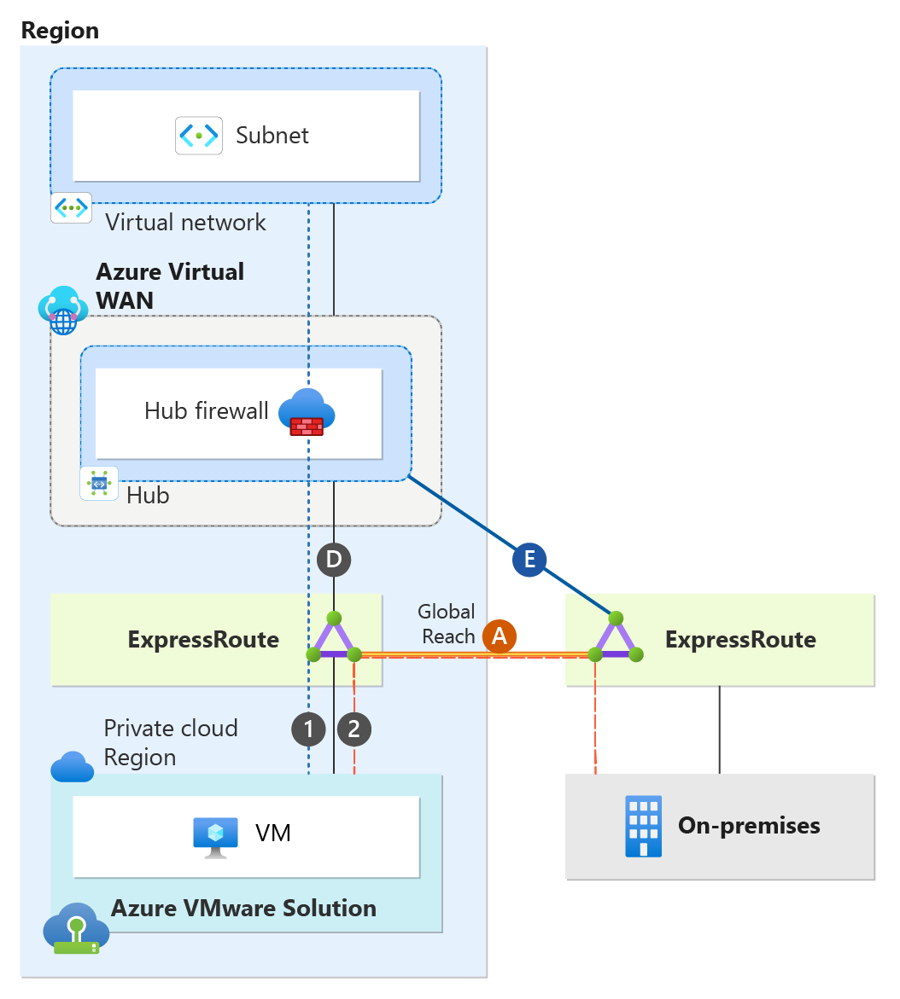
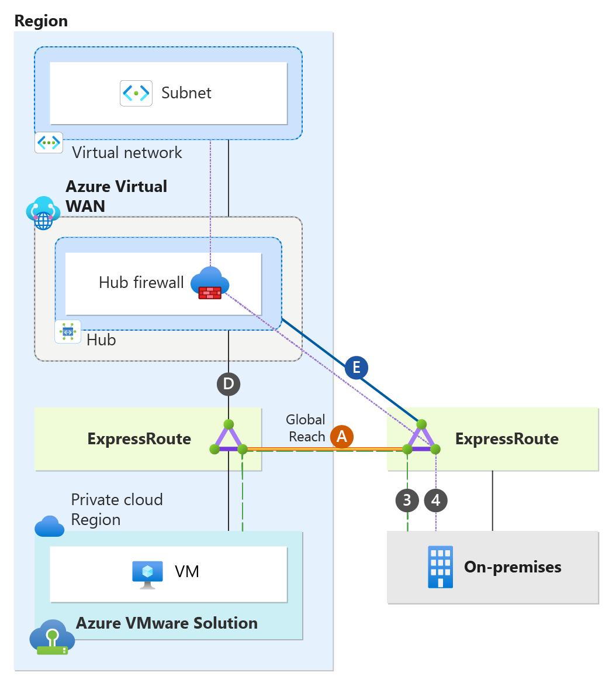
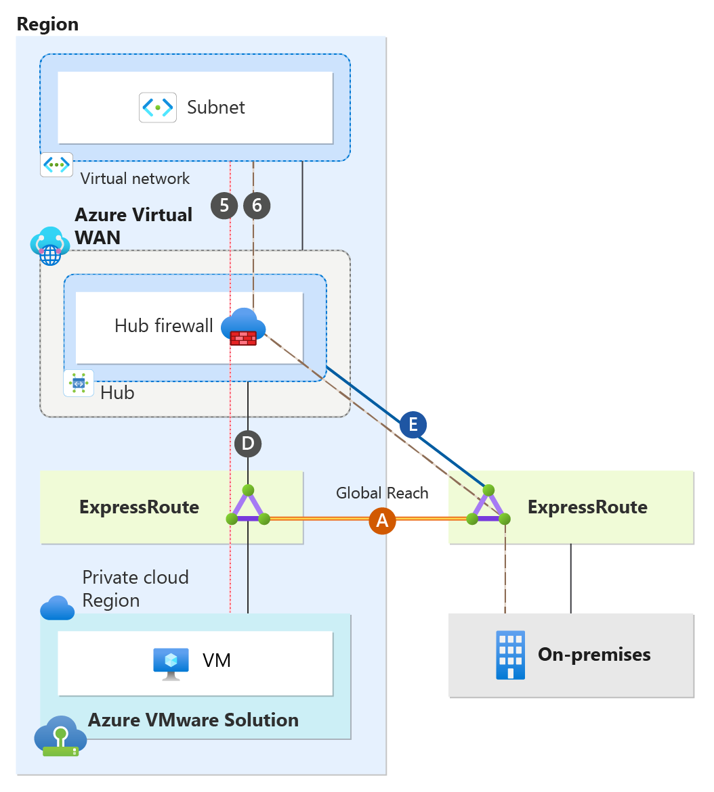
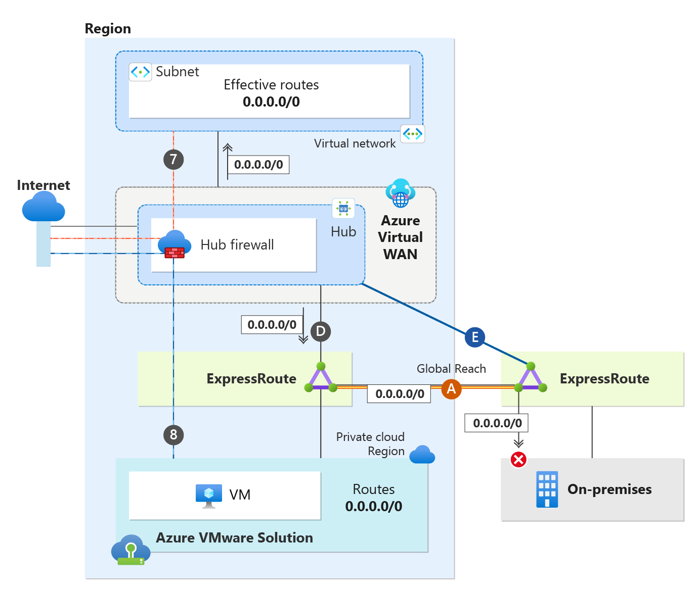

# Single-region deployment using Secure Virtual WAN Hub with Routing-Intent and Global Reach

This article describes the best practices for connectivity and traffic flows with single-region Azure VMware Solution when using Azure Secure Virtual WAN with Routing Intent. You learn the design details of using Secure Virtual WAN with Routing-Intent, when you use Global Reach. This article breaks down Virtual WAN with Routing Intent topology from the perspective of an Azure VMware Solution private cloud, on-premises sites, and Azure native. The implementation and configuration of Secure Virtual WAN with Routing Intent are beyond the scope and aren't discussed in this document.

## Single-region with Secure Virtual WAN scenario  
Secure Virtual WAN with Routing Intent is only supported with Virtual WAN Standard SKU. Secure Virtual WAN with Routing Intent provides the capability to send all Internet traffic and Private network traffic to a security solution like Azure Firewall, a third-party Network Virtual Appliance (NVA), or SaaS solution. In the scenario, we have a single region network. There's a Virtual WAN with one Hub. The hub has an Azure Firewall deployed, essentially making it a Secure Virtual WAN hub. Having a Secure Virtual WAN hub is a technical prerequisite to Routing Intent. The Secure Virtual WAN hub has Routing Intent enabled.

>[!NOTE]
>  When configuring Azure VMware Solution with Secure Virtual WAN Hubs, ensure optimal routing results on the hub by setting the Hub Routing Preference option to "AS Path." - see [Virtual hub routing preference](/azure/virtual-wan/about-virtual-hub-routing-preference)
>

The single region consists of its own Azure VMware Solution Private Cloud and an Azure Virtual Network. Additionally, there's an on-premises site connecting back to the hub. Furthermore, Global Reach connectivity exists within the environment. Global Reach establishes a direct logical link via the Microsoft backbone, connecting Azure VMware Solution to on-premises. As shown in the diagram, Global Reach connections don't transit the Hub firewall. So, Global Reach traffic between on-premises and Azure VMware Solution, and vice versa, remains uninspected. 

> [!NOTE]
> When utilizing Global Reach, consider enhancing security between Global Reach sites by inspecting traffic within the Azure VMware Solution environment’s NSX-T or an on-premises firewall.
>

**Understanding Topology Connectivity**

| Connection | Description  |
|:-------------------- |:--------------------  |
| Connections (D) | Azure VMware Solution private cloud managed ExpressRoute connection to the hub.  |
| Connection (A) | Azure VMware Solution Global Reach connection back to on-premises.  |
| Connections (E) | on-premises ExpressRoute connection to the hub.  |

### Single-region Secure Virtual WAN Traffic Flows

The following sections cover traffic flows and connectivity for Azure VMware Solution, on-premises, Azure Virtual Networks, and the Internet.

## Azure VMware Solution connectivity & traffic flows

This section focuses only on the Azure VMware Solution Cloud’s perspective. Azure VMware Solution private cloud has an ExpressRoute connection to its hub (connection labeled as "D").

The Azure VMware Solution Cloud Region establishes a connection to on-premises via ExpressRoute Global Reach, depicted as Global Reach (A) in the diagram. It's important to note that traffic via Global Reach doesn't transit the Hub firewall.

Ensure that you explicitly configure Global Reach (A). It's imperative to do this step to prevent connectivity issues between on-premises and Azure VMware Solution. For more information, see traffic flow section.

The diagram illustrates traffic flows from the perspective of the Azure VMware Solution Private Cloud. 

  
 
**Traffic Flow Chart**  

| Traffic Flow Number | Source |   Direction | Destination | Traffic Inspected on Secure Virtual WAN Hub firewall? |
| - | -------------- | -------- | ---------- | ---------- |
| 1 | Azure VMware Solution Cloud | &#8594;| Virtual Network| Yes, traffic is inspected at the Hub firewall|
| 2 | Azure VMware Solution Cloud | &#8594;| on-premises | No, traffic bypasses firewall and transits Global Reach (A)|

## on-premises connectivity & traffic flow

This section focuses only on the on-premises site. As shown in the diagram, the on-premises site has an ExpressRoute connection to the hub (connections labeled as "E"). On-premises systems can communicate to Azure VMware Solution via connection Global Reach (A).

Ensure that you explicitly configure Global Reach (A). It's imperative to do this step to prevent connectivity issues between on-premises and Azure VMware Solution. For more information, see traffic flow section.

The diagram illustrates traffic flows from an on-premises perspective.

  

**Traffic Flow Chart**

| Traffic Flow Number | Source |   Direction | Destination | Traffic Inspected on Secure Virtual WAN Hub firewall? |
| - | -------------- | -------- | ---------- | ---------- |
| 3 | on-premises | &#8594;| Azure VMware Solution Cloud | No, traffic bypasses firewall and transits Global Reach (A)|
| 4 | on-premises | &#8594;| Virtual Network | Yes, traffic is inspected at the Hub firewall|

## Azure Virtual Network connectivity & traffic flow

This section focuses only on connectivity from the Azure Virtual Network perspective. As depicted in the diagram, the Virtual Network is peering directly to the hub.

A Secure Hub with enabled Routing Intent always sends the default RFC 1918 addresses (10.0.0.0/8, 172.16.0.0/12, 192.168.0.0/16) to peered Virtual Networks, plus any other prefixes that are added as "Private Traffic Prefixes" - see [Routing Intent Private Address Prefixes](/azure/virtual-wan/how-to-routing-policies#nva). In our scenario, with Routing Intent enabled, all resources in the Virtual Network currently possess the default RFC 1918 addresses and use the Hub firewall as the next hop. All traffic ingressing and egressing the Virtual Network will always transit the Hub firewall. For more information, see traffic flow section.

  

**Traffic Flow Chart**

| Traffic Flow Number | Source |   Direction | Destination | Traffic Inspected on Secure Virtual WAN hub firewall? |
| - | -------------- | -------- | ---------- | ---------- |
| 5 | Virtual Network | &#8594;| Azure VMware Solution Cloud | Yes, traffic is inspected at the Hub firewall|
| 6 | Virtual Network | &#8594;| Azure VMware Solution Cloud | Yes, traffic is inspected at the Hub firewall|

## Internet connectivity

This section focuses only on how internet connectivity is provided for Azure native resources in the Virtual Network and the Azure VMware Solution Private Cloud. There are several options to provide internet connectivity to Azure VMware Solution. - see [Internet Access Concepts for Azure VMware Solution](/azure/azure-VMware/concepts-design-public-internet-access)

Option 1: Internet Service hosted in Azure  
Option 2: VMware Solution Managed SNAT  
Option 3: Azure Public IPv4 address to NSX-T Data Center Edge  

Although you can use all three options with Single Region Secure Virtual WAN with Routing Intent,  "Option 1: Internet Service hosted in Azure" is the best option when using Secure Virtual WAN with Routing Intent and is the option that is used to provide internet connectivity in the scenario. The reason why "Option 1" is considered the best option with Secure Virtual WAN is due to its ease of security inspection, deployment, and manageability.

With Routing Intent, you can choose to generate a default route from the hub firewall. This default route is advertised to your Virtual Network and to Azure VMware Solution. This section is broken into two sections, one that explains internet connectivity from an Azure VMware Solution perspective and another from the Virtual Network perspective.

#### Azure VMware Solution Internet Connectivity
When Routing Intent is enabled for internet traffic, the default behavior of the Secure Virtual WAN Hub is to not advertise the default route across ExpressRoute circuits. To ensure the default route is propagated to the Azure VMware Solution from the Azure Virtual WAN, you must enable default route propagation on your Azure VMware Solution ExpressRoute circuits - see [To advertise default route 0.0.0.0/0 to endpoints](/azure/virtual-wan/virtual-wan-expressroute-portal#to-advertise-default-route-00000-to-endpoints). Once changes are complete, the default route 0.0.0.0/0 is then advertised via connection “D” from the hub. It's important to note that this setting shouldn't be enabled for on-premises ExpressRoute circuits. Even though connection “D” advertises the default route 0.0.0.0/0 to Azure VMware Solution, the default route is also advertised to on-premises via Global Reach (A). As a result, the recommendation is to implement a BGP Filter on your on-premises equipment to exclude learning the default route. This step ensures that on-premises internet connectivity isn't impacted.

#### Virtual Network Internet Connectivity
When Routing Intent for internet access is enabled, the default route generated from the Secure VWAN Hub is automatically advertised to the hub-peered Virtual Network connections. You'll notice under Effective Routes for the Virtual Machines’ NICs in the Virtual Network that the 0.0.0.0/0 next hop is the hub firewall.

For more information, see the traffic flow section.

  

**Traffic Flow Chart**  

| Traffic Flow Number | Source |   Direction | Destination | Traffic Inspected on Secure Virtual WAN hub firewall? |
| - | -------------- | -------- | ---------- | ---------- |
| 7 | Azure VMware Solution Cloud | &#8594;| Internet| Yes, traffic is inspected at the Hub firewall
| 8 | Virtual Network | &#8594;| Internet | Yes, traffic is inspected at the Hub firewall

## Next steps

- For more information on Virtual WAN hub configuration, see [About virtual hub settings](/azure/virtual-wan/hub-settings).
- For more information on how to configure Azure Firewall in a Virtual Hub, see [Configure Azure Firewall in a Virtual WAN hub](/azure/virtual-wan/howto-firewall).
- For more information on how to configure the Palo Alto Next Generation SAAS firewall on Virtual WAN, see [Configure Palo Alto Networks Cloud NGFW in Virtual WAN](/azure/virtual-wan/how-to-palo-alto-cloud-ngfw).
- For more information on Virtual WAN hub routing intent configuration, see [Configure routing intent and policies through Virtual WAN portal](/azure/virtual-wan/how-to-routing-policies#nva).

