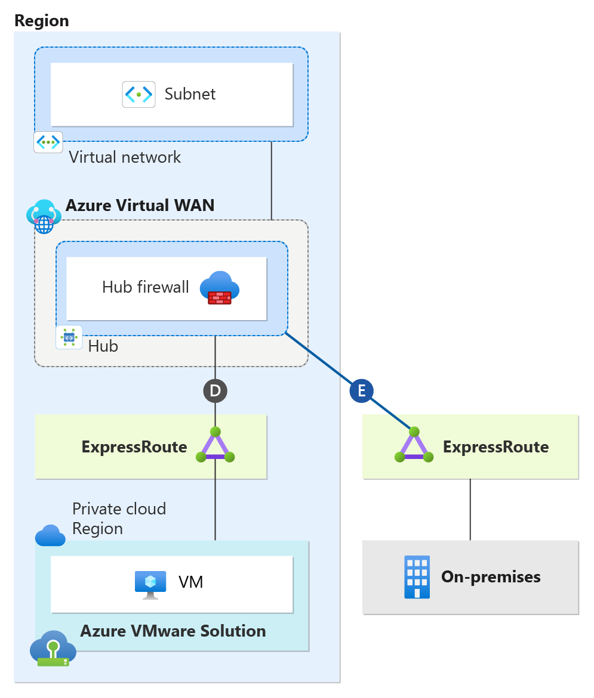
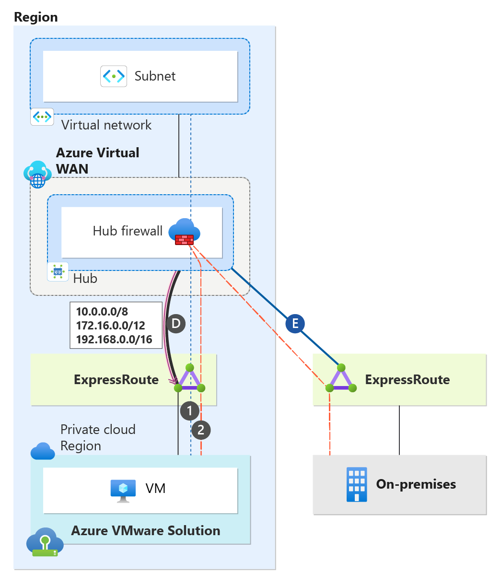
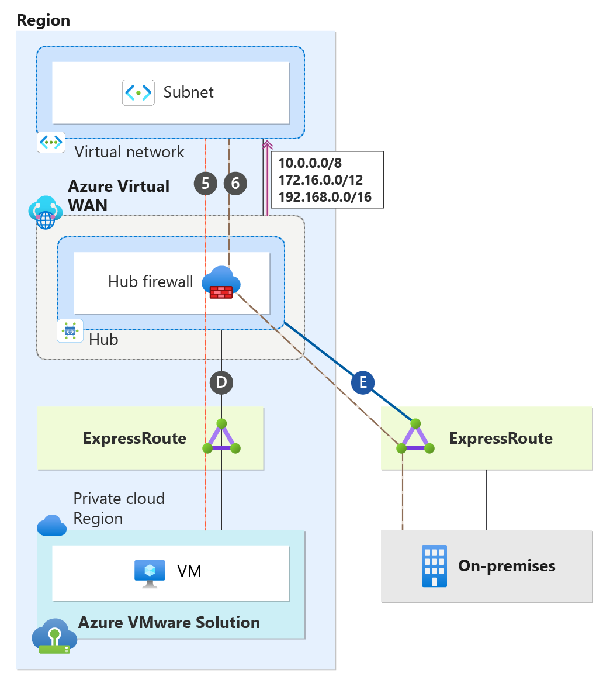
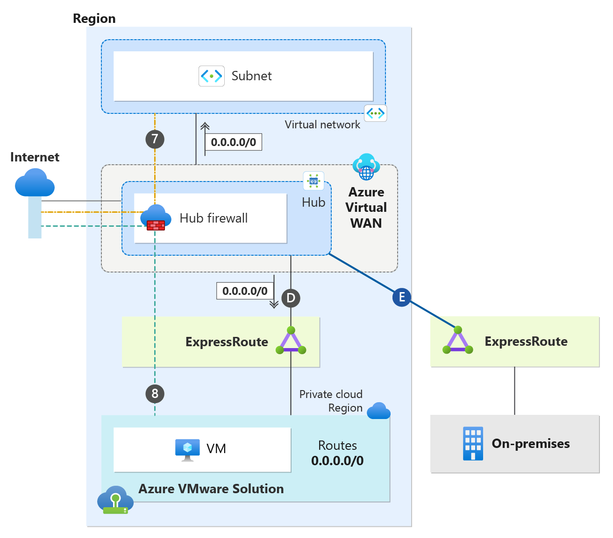

# Single-region deployment without Global Reach, using Secure Virtual WAN Hub with Routing-Intent

This article describes the best practices for connectivity and traffic flows with single-region Azure VMware Solution when using Azure Secure Virtual WAN with Routing Intent. You learn the design details of using Secure Virtual WAN with Routing-Intent without Global Reach. This article breaks down Virtual WAN with Routing Intent topology from the perspective of an Azure VMware Solution private cloud, on-premises sites, and Azure native. The implementation and configuration of Secure Virtual WAN with Routing Intent are beyond the scope and aren't discussed in this document.

In regions without Global Reach support or with a security requirement to inspect traffic between Azure VMware Solution and on-premises at the hub firewall, a support ticket must be opened to enable ExpressRoute to ExpressRoute transitivity. ExpressRoute to ExpressRoute transitivity isn't supported by default with Virtual WAN. - see [Transit connectivity between ExpressRoute circuits with routing intent](/azure/virtual-wan/how-to-routing-policies#expressroute)

## Single-Region Scenario: Secure Virtual WAN without Global Reach  
Secure Virtual WAN with Routing Intent is only supported with Virtual WAN Standard SKU. Secure Virtual WAN with Routing Intent provides the capability to send all Internet traffic and Private network traffic (RFC 1918) to a security solution like Azure Firewall, a third-party Network Virtual Appliance (NVA), or SaaS solution. In the scenario, we have a network topology that spans a single region. There's one Virtual WAN with a single hub located in the Region. The Hub has its own instance of an Azure Firewall deployed, essentially making it a Secure Virtual WAN Hub. Having a Secure Virtual WAN hub is a technical prerequisite to Routing Intent. The Secure Virtual WAN Hub has Routing Intent enabled.    

The single region also has an Azure VMware Solution Private Cloud and an Azure Virtual Network. There's also an on-premises site connecting to the region, which we review in more detail later in this document. 

>[!NOTE]
>  If you're using non-RFC1918 prefixes in your connected on-premises, Virtual Networks or Azure VMware Solution, make sure you have specified those prefixes in the "Private Traffic Prefixes" text box for Routing Intent. Keep in mind that you should always enter summarized routes only in the “Private Traffic Prefixes” section to cover your range. Do not input the exact range that is being advertised to Virtual WAN as this can lead to routing issues. For example, if the ExpressRoute Circuit is advertising 40.0.0.0/24 from on-premises, put a /23 CIDR range or larger in the Private Traffic Prefix text box (example: 40.0.0.0/23). - see [Configure routing intent and policies through Virtual WAN portal](/azure/virtual-wan/how-to-routing-policies#nva)
>

>[!NOTE]
>  When configuring Azure VMware Solution with Secure Virtual WAN Hubs, ensure optimal routing results on the hub by setting the Hub Routing Preference option to "AS Path." - see [Virtual hub routing preference](/azure/virtual-wan/about-virtual-hub-routing-preference)
>

### Understanding Topology Connectivity 

| Connection | Description  |
|:-------------------- |:--------------------  |
| Connections (D) | Azure VMware Solution private cloud managed ExpressRoute connection to the hub.  |
| Connections (E) | on-premises ExpressRoute connection to the hub.  |

### Traffic Flows For Single-Region Virtual WAN without Global Reach

The following sections cover traffic flows and connectivity for Azure VMware Solution, on-premises, Azure Virtual Networks, and the Internet.

## Azure VMware Solution connectivity & traffic flows

This section focuses on only the Azure VMware Solution private cloud. The Azure VMware Solution private cloud has an ExpressRoute connection to the hub (connections labeled as "D").

With ExpressRoute to ExpressRoute transitivity enabled on the Secure Hub and Routing-Intent enabled, the Secure Hub sends the default RFC 1918 addresses (10.0.0.0/8, 172.16.0.0/12, 192.168.0.0/16) to Azure VMware Solution over connection "D". In addition to the default RFC 1918 addresses, Azure VMware Solution learns more specific routes from Azure Virtual Networks and Branch Networks (S2S VPN, P2S VPN, SDWAN) that are connected to the hub. Azure VMware Solution doesn't learn specific routes from on-premises networks. For routing traffic back to on-premises networks, it uses the default RFC 1918 addresses that it learned from connection "D". This traffic transits through the Hub firewall, as shown in the diagram. The Hub firewall has the specific routes for on-premises networks and routes traffic toward the destination over connection “E”. Traffic from Azure VMware Solution, heading towards Virtual Networks, will transit the Hub firewall. For more information, see the traffic flow section.

The diagram illustrates traffic flows from the perspective of the Azure VMware Solution Private Cloud. 

  

**Traffic Flow Chart**  

| Traffic Flow Number | Source |   Direction | Destination | Traffic Inspected on Secure Virtual WAN Hub firewall? |
| - | -------------- | -------- | ---------- | ---------- |
| 1 | Azure VMware Solution Cloud | &#8594;| Virtual Network| Yes, traffic is inspected at the Hub firewall|
| 2 | Azure VMware Solution Cloud | &#8594;| on-premises | Yes, traffic is inspected at the Hub firewall|

## on-premises connectivity & traffic flow

This section focuses only on the on-premises site. As shown in the diagram, the on-premises site has an ExpressRoute connection to the hub (connection labeled as "E").

With ExpressRoute to ExpressRoute transitivity enabled on the Secure Hub and Routing-Intent enabled, the Secure Hub sends the default RFC 1918 addresses (10.0.0.0/8, 172.16.0.0/12, 192.168.0.0/16) to on-premises over connection "E". In addition to the default RFC 1918 addresses, on-premises learns more specific routes from Azure Virtual Networks and Branch Networks that are connected to the hub. On-premises doesn't learn specific routes from Azure VMware Solution networks. For routing traffic back to Azure VMware Solution networks, it uses the default RFC 1918 addresses that it learned from connection "E". This traffic transits through the Hub firewall, as shown in the diagram. The Hub firewall has the specific routes for Azure VMware Solution networks and routes traffic toward the destination over connection “D”. Traffic from on-premises, heading towards Virtual Networks, will transit the Hub firewall. For more information, see the traffic flow section for more detailed information.

As mentioned earlier, when you enable ExpressRoute to ExpressRoute transitivity on the Hub, it sends the default RFC 1918 addresses (10.0.0.0/8, 172.16.0.0/12, 192.168.0.0/16) to your on-premises network. Therefore, you shouldn't advertise the exact RFC 1918 prefixes (10.0.0.0/8, 172.16.0.0/12, 192.168.0.0/16) back to Azure. Advertising the same exact routes creates routing problems within Azure. Instead, you should advertise more specific routes back to Azure for your on-premises networks.

>[!NOTE]
>  If you’re currently advertising the default RFC 1918 addresses from on-premises to Azure and wish to continue this practice, you need to split each RFC 1918 range into two equal sub-ranges and advertise these sub-ranges back to Azure. The sub-ranges are 10.0.0.0/9, 10.128.0.0/9, 172.16.0.0/13, 172.24.0.0/13, 192.168.0.0/17, and 192.168.128.0/17.
>

The diagram illustrates traffic flows from the perspective of on-premises. 

  

**Traffic Flow Chart**

| Traffic Flow Number | Source |   Direction | Destination | Traffic Inspected on Secure Virtual WAN Hub firewall? |
| - | -------------- | -------- | ---------- | ---------- |
| 3 | on-premises | &#8594;| Azure VMware Solution Cloud | Yes, traffic is inspected at the Hub firewall|
| 4 | on-premises | &#8594;| Virtual Network | Yes, traffic is inspected at the Hub firewall|

## Azure Virtual Network connectivity & traffic flow

This section focuses only on connectivity from an Azure Virtual Network perspective. As depicted in the diagram, the Virtual Network has a Virtual Network peering directly to the hub.

The diagram illustrates how all Azure native resources in the Virtual Network learn routes under their "Effective Routes". A Secure Hub with Routing Intent enabled always sends the default RFC 1918 addresses (10.0.0.0/8, 172.16.0.0/12, 192.168.0.0/16) to peered Virtual Networks. Azure native resources in the Virtual Network don't learn specific routes from outside of their Virtual Network. With Routing Intent enabled, all resources in the Virtual Network currently possess the default RFC 1918 address and use the hub firewall as the next hop. All traffic ingressing and egressing the Virtual Networks will always transit the Hub Firewall. For more information, see the traffic flow section for more detailed information.

The diagram illustrates traffic flows from an Azure Virtual Network perspective.

  

**Traffic Flow Chart**

| Traffic Flow Number | Source |   Direction | Destination | Traffic Inspected on Secure Virtual WAN Hub firewall? |
| - | -------------- | -------- | ---------- | ---------- |
| 5 | Virtual Network | &#8594;| Azure VMware Solution Cloud | Yes, traffic is inspected at the Hub firewall|
| 6 | Virtual Network | &#8594;| on-premises | Yes, traffic is inspected at the Hub firewall|

## Internet connectivity

This section focuses only on how internet connectivity is provided for Azure native resources in Virtual Networks and Azure VMware Solution Private Clouds in a single region. There are several options to provide internet connectivity to Azure VMware Solution. - see [Internet Access Concepts for Azure VMware Solution](/azure/azure-VMware/concepts-design-public-internet-access)

Option 1: Internet Service hosted in Azure  
Option 2: VMware Solution Managed SNAT  
Option 3: Azure Public IPv4 address to NSX-T Data Center Edge  

Although you can use all three options with Single Region Secure Virtual WAN with Routing Intent,  "Option 1: Internet Service hosted in Azure" is the best option when using Secure Virtual WAN with Routing Intent and is the option that is used to provide internet connectivity in the scenario. The reason why "Option 1" is considered the best option with Secure Virtual WAN is due to its ease of security inspection, deployment, and manageability.

As mentioned earlier, when you enable Routing Intent on the Secure Hub, it advertises RFC 1918 to all peered Virtual Networks. However, you can also advertise a default route 0.0.0.0/0 for internet connectivity to downstream resources. With Routing Intent, you can choose to generate a default route from the hub firewall. This default route is advertised to your Virtual Network and to Azure VMware Solution. This section is broken into two sections, one that explains internet connectivity from an Azure VMware Solution perspective and another from the Virtual Network perspective.  

#### Azure VMware Solution Internet Connectivity
When Routing Intent is enabled for internet traffic, the default behavior of the Secure Virtual WAN Hub is to not advertise the default route across ExpressRoute circuits. To ensure the default route is propagated to the Azure VMware Solution from the Azure Virtual WAN, you must enable default route propagation on your Azure VMware Solution ExpressRoute circuits - see [To advertise default route 0.0.0.0/0 to endpoints](/azure/virtual-wan/virtual-wan-expressroute-portal#to-advertise-default-route-00000-to-endpoints). Once changes are complete, the default route 0.0.0.0/0 is then advertised via connection “D” from the hub. It’s important to note that this setting shouldn't be enabled for on-premises ExpressRoute circuits. As a best practice, it's recommended to implement a BGP Filter on your on-premises equipment. A BGP Filter in place prevents the inadvertent learning of the default route, adds an extra layer of precaution, and ensures that on-premises internet connectivity isn't impacted.

#### Virtual Network Internet Connectivity
When Routing Intent for internet access is enabled, the default route generated from the Secure Virtual WAN Hub is automatically advertised to the hub-peered Virtual Network connections. You'll notice under Effective Routes for the Virtual Machines’ NICs in the Virtual Network that the 0.0.0.0/0 next hop is the hub firewall.

For more information, see the traffic flow section.

The diagram illustrates traffic flows from a Virtual Network and Azure VMware Solution perspective.

   

**Traffic Flow Chart**  

| Traffic Flow Number | Source |   Direction | Destination | Traffic Inspected on Secure Virtual WAN hub firewall? |
| - | -------------- | -------- | ---------- | ---------- |
| 7 | Virtual Network | &#8594;| Internet| Yes, traffic is inspected at the Hub firewall
| 8 | Azure VMware Solution Cloud | &#8594;| Internet | Yes, traffic is inspected at the Hub firewall

## Utilizing VMware HCX Mobility Optimized Networking (MON) without Global Reach
HCX Mobility Optimized Networking (MON) is an optional feature to enable when using HCX Network Extensions (NE). Mobility Optimized Networking (MON) provides optimal traffic routing under certain scenarios to prevent network tromboning between the on-premises-based and cloud-based resources on extended networks.

### Egress Traffic from Azure VMware Solution   
Enabling Mobility Optimized Networking (MON) for a specific extended network and a virtual machine changes the traffic flow. After implementing Mobility Optimized Networking (MON), egress traffic from that virtual machine does not trombone back to on-premises. Instead, it bypasses the Network Extensions (NE) IPSEC tunnel. Traffic for that virtual machine will now egress out of the Azure VMware Solution NSX-T Tier-1 Gateway> NSX-T Tier-0 Gateway>Azure Virtual WAN.

### Ingress Traffic to Azure VMware Solution  
Enabling Mobility Optimized Networking (MON) for a specific extended network and a virtual machine results in a change. From Azure VMware Solution NSX-T, it injects a /32 host route back to Azure Virtual WAN. Azure Virtual WAN advertises this /32 route back to on-premises, Virtual Networks, and Branch Networks. The purpose of this /32 host route is to ensure that traffic from on-premises, Virtual Networks, and Branch Networks doesn't use the Network Extensions (NE) IPSEC tunnel when destined for the Mobility Optimized Networking (MON) enabled Virtual Machine. Traffic from source networks is directed straight to the Mobility Optimized Networking (MON) enabled Virtual Machine due to the /32 route that is learned. 

### HCX Mobility Optimized Networking (MON) Limitation With Secure Virtual WAN Without Global Reach 
With ExpressRoute to ExpressRoute transitivity enabled on the Secure Hub and Routing-Intent enabled, the Secure Hub sends the default RFC 1918 addresses (10.0.0.0/8, 172.16.0.0/12, 192.168.0.0/16) to both the on-premises and Azure VMware Solution. In addition to the default RFC 1918 addresses, both on-premises and Azure VMware Solution learn more specific routes from Azure Virtual Networks and Branch Networks that are connected to the hub. However, on-premises networks don't learn any specific routes from the Azure VMware Solution, nor does the reverse occur. Instead, both environments rely on the default RFC 1918 addresses to facilitate routing back to one another via the Hub firewall. This means that more specific routes, such as HCX Mobility Optimized Networking (MON) Host Routes, aren't advertised from the Azure VMware Solution ExpressRoute to the on-premises-based ExpressRoute circuit and vice-versa. The inability to learn specific routes introduces asymmetric traffic flows. Traffic egresses Azure VMware Solution via the NSX-T Tier-0 gateway, but returning traffic from on-premises returns over the Network Extensions (NE) IPSEC tunnel.

### Resolution 
To correct any traffic asymmetry, you need to adjust the HCX Mobility Optimized Networking (MON) Policy Routes. Mobility Optimized Networking (MON) policy routes determine which traffic goes back to the on-premises Gateway via an L2 extension. They also decide which traffic is routed through the Azure VMware Solution NSX Tier-0 Gateway.

If a destination IP matches and is set to "allow" in the Mobility Optimized Networking (MON) policy configuration, then two actions occur. First, the packet is identified. Second, it's sent to the on-premises gateway through the HCX Network Extension appliance.

If a destination IP doesn't match, or is set to "deny" in the Mobility Optimized Networking (MON) policy, the system sends the packet to the Azure VMware Solution Tier-0 for routing.

**HCX Policy Routes**  
| Network |Redirect to Peer | Note |
| - | -------------- | -------- |
| Azure Virtual Network Address Space | Deny | Please ensure to explicitly include the address ranges for all your Virtual Networks. Traffic intended for Azure is directed out via the Azure VMware Solution and doesn't return to the on-premises network.
| Default RFC 1918 Address Spaces | Allow | Add in the default RFC 1918 addresses 10.0.0.0/8, 172.16.0.0/12, and 192.168.0.0/16. This configuration ensures that any traffic not matching the above criteria is rerouted back to the on-premises network. If your on-premises setup utilizes addresses that aren't part of RFC 1918, you must explicitly include those ranges.
| 0.0.0.0/0 | Deny | For addresses that aren’t covered by RFC 1918, such as Internet-routable IPs, or any traffic that doesn’t match the specified entries above, exits directly through the Azure VMware Solution and isn't redirected back to the on-premises network.

## Next steps

- For more information on Virtual WAN hub configuration, see [About virtual hub settings](/azure/virtual-wan/hub-settings).
- For more information on how to configure Azure Firewall in a Virtual Hub, see [Configure Azure Firewall in a Virtual WAN hub](/azure/virtual-wan/howto-firewall).
- For more information on how to configure the Palo Alto Next Generation SAAS firewall on Virtual WAN, see [Configure Palo Alto Networks Cloud NGFW in Virtual WAN](/azure/virtual-wan/how-to-palo-alto-cloud-ngfw).
- For more information on Virtual WAN hub routing intent configuration, see [Configure routing intent and policies through Virtual WAN portal](/azure/virtual-wan/how-to-routing-policies#nva).
