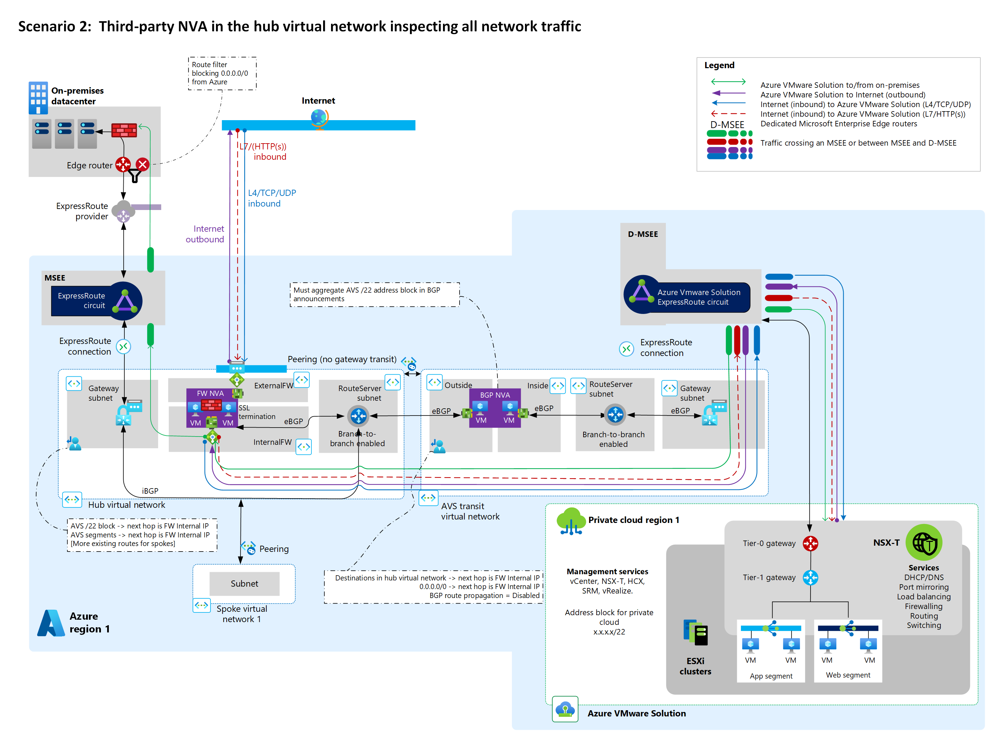

# Example architectures for **Azure VMware Solutions**

To establish an Azure VMware Solution landing zone, you need to first design and implement networking capabilities. Azure networking products and services support a wide variety of networking scenarios. Choose an appropriate architecture and plan for structuring services for your needs by evaluating your organization's workloads, governance, and requirements.

Review the following considerations and key requirements before making your Azure VMware Solution deployment decision.

- HTTP/S or non-HTTP/S internet ingress requirements into Azure VMware Solution applications
- Internet egress path considerations
- L2 extension for migrations
- NVA use in the current architecture
- Azure VMware Solution connectivity to either a standard hub virtual network or Virtual WAN hub
- Private ExpressRoute connectivity from on-premises datacenters to Azure VMware Solution (and if you should enable ExpressRoute Global Reach or not)
- Traffic inspection requirements for:
  - Internet ingress into Azure VMware Solution applications
  - Azure VMware Solution egress access to the internet
  - Azure VMware Solution access to on-premises datacenters
  - Azure VMware Solution access to Azure Virtual Network
  - Traffic within the Azure VMware Solution private cloud

The following table uses VMware solution traffic inspection requirements to provide recommendations and considerations for the most common networking scenarios.

| Scenario | Traffic inspection requirements | Recommended solution design | Considerations |
|---|----|---|---|
| 1 |  - Internet ingress   - Internet egress | Use a Virtual WAN secured hub with default gateway propagation.    For HTTP/S traffic, use Azure Application Gateway. For non-HTTP/S traffic, use Azure Firewall.   Deploy a secured Virtual WAN hub and enable public IP in Azure VMware Solution. | This solution doesn't work for on-premises filtering. Global Reach bypasses Virtual WAN hubs. |
| 2 |  - Internet ingress   - Internet egress   - To on-premises datacenter   - To Azure Virtual Network| Use third-party firewall NVA solutions in your hub virtual network with Azure Route Server.    Disable Global Reach.    For HTTP/S traffic, use Azure Application Gateway. For non-HTTP/S traffic, use a third-party firewall NVA on Azure.| Choose this option if you want to use your existing NVA and centralize all traffic inspection in your hub virtual network. |
| 3 | - Internet ingress   - Internet egress   - To on-premises datacenter   - To Azure Virtual Network   Within Azure VMware Solution  |   Use NSX-T Data Center or a third-party NVA firewall in Azure VMware Solution.     Use Application Gateway for HTTPs, or Azure Firewall for non-HTTPs traffic.    Deploy the secured Virtual WAN hub and enable public IP in Azure VMware Solution.| Choose this option if you need to inspect traffic from two or more Azure VMware Solution private clouds.    This option lets you use NSX-T native features. You can also combine this option with NVAs running on Azure VMware Solution between L1 and L0. |
| 4 | - Internet ingress   - Internet egress   - To on-premises datacenter   - To Azure Virtual Network   |    Use third-party firewall solutions in a hub virtual network with Azure Route Server.    For HTTP & HTTPS traffic, use Azure Application Gateway. For non-HTTP/HTTPS traffic, use a third-party firewall NVA on Azure.    Use an on-premises third-party firewall NVA.    Deploy third-party firewall solutions in a hub virtual network with Azure Route Server. | Choose this option to advertise the `0.0.0.0/0` route from an NVA in your Azure hub virtual network to an Azure VMware Solution.|

Key points about the networking scenarios:
- All scenarios have similar ingress patterns via Application Gateway and Azure Firewall.
- You can use L4-L7 load balancer NVAs in Azure VMware Solution.
- You can use NSX-T Data Center Firewall for any of these scenarios.

The following sections outline architectural patterns for Azure VMware Solution private clouds. This list is not exhaustive. For more information, see [Azure VMware Solution networking and interconnectivity concepts](/azure/azure-vmware/concepts-networking).

## Secured Virtual WAN hub with default route propagation

This scenario involves the following customer profile, architectural components, and considerations.

### Customer profile

This scenario is ideal if:

- You don't need traffic inspection between Azure VMware Solution and Azure Virtual Network.
- You don't need traffic inspection between Azure VMware Solution and on-premises datacenters.
- You need traffic inspection between Azure VMware Solution workloads and the internet.

For this scenario, consume Azure VMware Solution like a platform as a service (PaaS) offering. In this scenario, you don't own the public IP addresses. Add public-facing L4 and L7 inbound services if needed. You might or might not already have ExpressRoute connectivity between on-premises datacenters and Azure.

### Architectural components

Implement this scenario with:

- Azure Firewall in a secured Virtual WAN hub for firewalls
- Application Gateway for L7 load balancing
- L4 destination network address translation (DNAT) with Azure Firewall to translate and filter network ingress traffic
- Outbound internet via Azure Firewall in your Virtual WAN hub
- EXR, VPN, or SD-WAN for connectivity between on-premises datacenters and Azure VMware Solution

### Considerations

If you don't want to receive the default route `0.0.0.0/0` advertisement from Azure VMware Solution because it conflicts with your existing environment, you need to do some extra work.

Azure Firewall in a secured Virtual WAN hub advertises the `0.0.0.0/0` route to Azure VMware Solution. This route is also advertised on-premises through Global Reach. Implement an on-premises route filter to prevent `0.0.0.0/0` route learning. Avoid this issue by using SD-WAN or VPN.

If you currently connect to a virtual network-based hub-and-spoke topology through an ExpressRoute gateway instead of connecting directly, the default `0.0.0.0/0` route from the Virtual WAN hub propagates to that gateway and takes precedence over the internet system route built into your virtual network. Avoid this issue by implementing a `0.0.0.0/0` [user-defined route](/azure/virtual-network/virtual-networks-udr-overview#user-defined) in your virtual network to override the learned default route.

Established VPN, ExpressRoute, or virtual network connections to a secure Virtual WAN hub that don't require `0.0.0.0/0` advertisement receive the advertisement anyway. To prevent this, you can either:

- Filter out the `0.0.0.0/0` route with an on-premises edge device.
- Disable `0.0.0.0/0` propagation on specific connections.
  1. Disconnect the ExpressRoute, VPN, or virtual network.
  2. Enable `0.0.0.0/0` propagation.
  3. Disable `0.0.0.0/0` propagation on those specific connections.
  4. Reconnect those connections.

You can host Application Gateway on a spoke virtual network connected to your hub or on the hub virtual network.

## Network Virtual Appliance in Azure Virtual Network to inspect all network traffic

This scenario involves the following customer profile, architectural components, and considerations.

### Customer profile

This scenario is ideal if:

- You need to use your third-party firewall NVAs in a hub virtual network to inspect all traffic, and you can't use Global Reach for geopolitical or other reasons.
  - You are between on-premises datacenters and Azure VMware Solution.
  - You are between Azure Virtual Network and Azure VMware Solution.
  - You need internet ingress from Azure VMware Solution.
  - You need internet egress to Azure VMware Solution.
- You need fine-grained control over firewalls outside the Azure VMware Solution private cloud.
- You need multiple public IP addresses for inbound services and need a block of predefined IP addresses in Azure. In this scenario, you don't own the public IP addresses.

This scenario assumes you have ExpressRoute connectivity between on-premises datacenters and Azure.

### Architectural components

Implement this scenario with:

- Third-party firewall NVAs hosted in a virtual network for traffic inspection and other networking functions.
- [Azure Route Server](/azure/route-server/overview), to route traffic between Azure VMware Solution, on-premises datacenters, and virtual networks.
- Application Gateway to provide L7 HTTP/S load balancing.

You must disable ExpressRoute Global Reach in this scenario. The third-party NVAs are responsible for providing outbound internet to Azure VMware Solution.

### Considerations

- Never configure ExpressRoute Global Reach for this scenario, because it lets Azure VMware Solution traffic flow directly between Microsoft Enterprise Edge (MSEE) ExpressRoute routers, skipping the hub virtual network.
- Azure Route Server must be deployed in your hub VNet and BGP-peered with the NVAs in the transit VNet. Configure Azure Route Server to allow [branch-to-branch](/azure/route-server/quickstart-configure-route-server-portal#configure-route-exchange) connectivity.
- Use custom route tables and user-defined routes are used to route traffic to/from Azure VMware Solution to the third-party firewall NVAs' load balancer. All HA modes (active/active and active/standby) are supported, with guaranteed routing symmetry.
- If you need high availability for NVAs, consult your NVA vendor documentation and [deploy highly available NVAs](/azure/architecture/reference-architectures/dmz/nva-ha?tabs=cli).

## Egress from Azure VMware Solution with or without NSX-T or NVA

This scenario involves the following customer profile, architectural components, and considerations.

### Customer profile

This scenario is ideal if:

- You must use the native NSX-T Data Center platform, so you need a PaaS deployment for Azure VMware Solution.
- You need a bring-your-own-license (BYOL) NVA within Azure VMware Solution for traffic inspection.
- You might or might not already have ExpressRoute connectivity between on-premises datacenters and Azure.
- You need inbound HTTP/S or L4 services.

All traffic from Azure VMware Solution to Azure Virtual Network, from Azure VMware Solution to the internet, and from Azure VMware Solution to on-premises data centers gets funneled through the NSX-T Data Center Tier-0/Tier-1 gateways or the NVAs.

### Architectural components

Implement this scenario with:

- An NSX distributed firewall (DFW), or an NVA behind tier-1 in Azure VMware Solution.
- Application Gateway to provide L7 load balancing.
- L4 DNAT using Azure Firewall.
- Internet breakout from Azure VMware Solution.

### Considerations

Enable internet access on the Azure portal. In this design, an outbound IP address can change and isn't deterministic. Public IP addresses reside outside the NVA. The NVA in Azure VMware Solution still has private IP addresses and doesn't determine the outbound public IP address.

The NVA is BYOL. It's your responsibility to bring a license and implement high availability for the NVA.

See the VMware documentation for NVA placement options and for information about the VMware limitation of up to eight virtual network interface cards (NICs) on a VM. For more information, see [Firewall integration in Azure VMware Solution](https://techcommunity.microsoft.com/t5/azure-migration-and/firewall-integration-in-azure-vmware-solution/ba-p/2254961).

## Third-party firewall solutions in a hub virtual network with Azure Route Server

This scenario has the following customer profile, architectural components, and considerations:

### Customer profile

This scenario is ideal if:

- You want Azure VMware Solution internet egress using your third-party NVA in Azure VNet hub and you want to inspect traffic between Azure VMware Solution and Azure Virtual Network.
- You want to inspect traffic between on-premises datacenters and Azure by using your on-premises third-party NVA.
- You need multiple public IP addresses for inbound services and need a block of predefined IP addresses in Azure. In this scenario, you don't own the public IPs.
- You need fine-grained control over firewalls outside the Azure VMware Solution private cloud.

### Architectural components

Implement this scenario with:

- Third-party NVAs active-active or active-standby hosted in a VNet for firewalls and other networking functions.
- [Azure Route Server](/azure/route-server/overview) to exchange routes between Azure VMware Solution, on-premises datacenters, and virtual networks.
- Your third-party NVAs in your Azure Virtual Network hub to provide outbound internet to Azure VMware Solution.
- ExpressRoute for connectivity between on-premises datacenters and Azure VMware Solution.

### Considerations

- In this design, outbound public IP addresses reside with NVAs in the Azure VNet.
- Third-party NVAs in the virtual network hub BGP are peered with Azure Route Server ([ECMP](/azure/route-server/route-server-faq#if-azure-route-server-receives-the-same-route-from-more-than-one-nva-how-does-it-handle-them)) and [advertise the default route](/azure/route-server/vmware-solution-default-route)) `0.0.0.0/0` to Azure VMware Solution.
- The default route `0.0.0.0/0` is also advertised on-premises via Global Reach. Implement a route filter on-premises to prevent default route `0.0.0.0/0` learning.
- Traffic between Azure VMware Solution and your on-premises network flows through the ExpressRoute Global Reach, as described in [Peer on-premises environments to Azure VMware Solution](/azure/azure-vmware/tutorial-expressroute-global-reach-private-cloud). Traffic inspection between on-premises and Azure VMware Solution is performed by your on-premises third-party NVA, not your third-party NVAs in Azure Virtual Network hub.
- You can host Application Gateway on a spoke virtual network connected to a hub or on the hub virtual network.

## Next steps

- For more information about Azure VMware Solution in hub-and-spoke networks, see [Integrate Azure VMware Solution in a hub and spoke architecture](/azure/azure-vmware/concepts-hub-and-spoke).
- For more information on VMware NSX-T Data Center network segments, see [Configure NSX-T Data Center network components using Azure VMware Solution](/azure/azure-vmware/configure-nsx-network-components-azure-portal#create-an-nsx-t-segment-in-the-azure-portal).
- To learn Cloud Adoption Framework enterprise-scale landing zone architectural principles, various design considerations, and best practices for Azure VMware Solution, see the next article in this series:

  > [!div class="nextstepaction"]
  > [Security, governance, and compliance disciplines for Azure VMware Solution](./eslz-security-governance-and-compliance.md)
