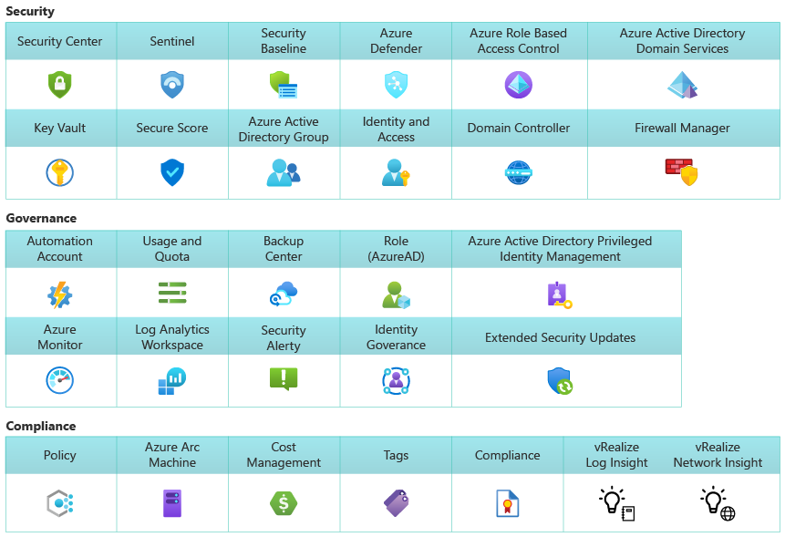

# Govern Azure VMware Solution

Azure VMware Solution combines VMware's software-defined datacenter (SDDC) software with Azure's global cloud platform. Use the [Govern methodology](../../govern/index.md) to incrementally improve governance of your cloud portfolio. Microsoft manages Azure VMware Solution to meet performance, availability, security, and compliance requirements. Microsoft provides the following components to run Azure VMware Solution at scale in Azure - across management systems, networking services, operating platform, and back-end infrastructure operations.

To extend your governance approach across the Azure VMware Solution, evaluate and manage risk tolerance by identifying high-risk areas for business, convert risk vectors into governing corporate policies, and extend governance policies across Cost Management, Security Baseline, Identity Baseline, Resource Consistency, and Deployment Acceleration disciplines.

## Azure VMware Solution management

Azure VMware Solution is an Azure service built with VMware products that delivers vSphere clusters, in a single-tenant private cloud environment. It's accessible for users and applications from on-premises vSphere solutions and Azure-based environments or resources. The VMware technology stack in Azure Cloud runs with a highly secure set of compute, storage, and networking technologies.

A required ExpressRoute circuit can connect to Azure cloud services with a dedicated private and redundant Layer 3 network fiber connection that supports bandwidth up to 10 Gbps.

All provisioned private clouds have vCenter Server, ESXi, vSAN, and NSX-T Data Center, so you can migrate workloads from your on-premises vSphere environments, deploy new virtual machines (VMs), and consume Azure services from your private clouds.

VMware vSphere clusters reside on top of "share nothing" hyper-converged, bare-metal infrastructure. Azure VMware Solution cluster architecture is dedicated and isolated - meaning that networking, storage, or compute is not shared with any other tenant. VMware vSphere clusters are managed by Microsoft to meet performance, availability, security, and compliance requirements, at scale in Azure Cloud, providing unified management, networking, and operational controls.

Because Azure VMware Solution run hybrid workloads across on-premises vSphere and private cloud, unified operations is the best approach to providing a single pane of glass for incrementally deploying required governance and operational management controls. Read the [introduction to unified operations](../hybrid/unified-operations.md) to get started.

## Unified security and compliance

On Azure, you can run, manage, and secure applications across VMware vSphere environments with a common operating framework. Use your existing VMware solution tools, like VMware vCenter Server, vSAN, and NSX-T Manager, combined with the scale, performance, and innovation of Azure. In terms of access and security, Azure VMware Solution private clouds use vSphere role-based access control for enhanced security. You can integrate vSphere SSO LDAP capabilities with Microsoft Entra ID. Read more about [access and identity concepts](/azure/azure-vmware/concepts-identity).

Using a unified operations approach that uses familiar Azure tools to manage and govern your VMware hybrid workloads across on-premises vSphere and private cloud. Monitor, manage, and protect virtual machines in a hybrid environment (Azure, Azure VMware Solution, and on-premises vSphere). Read more about how you can [start small with basic VM management](/azure/architecture/hybrid/azure-arc-hybrid-config?bc=/azure/cloud-adoption-framework/_bread/toc.json&toc=/azure/cloud-adoption-framework/scenarios/hybrid/toc.json).

### Integration with Azure-native services

Integrating with Azure-native services in your Azure VMware Solution private cloud will ensure that your Azure VMware Solution workloads benefit from unified operations best practices for governance guardrails.

**Unified VM management:** Single pane of glass to manage vSphere-based and Azure native VMs, with uniform identities, access control, and monitoring.

 **Native Azure integration:** Connect to Azure services endpoints. For example, deploy Microsoft Entra ID as VMware vCenter Server SSO identity source.

**Single point of support:** Azure VMware Solution is Microsoft-developed, operated, and supported. Microsoft is the first and only contact and coordinates support with VMware as required.

**Unified licensing and consumption:** Avoid unnecessary complexity and take confidence in managing a single vendor for licensing and resource consumption.

**Azure Hybrid Use Benefits:** Maximize the value of existing Windows Server and SQL Server licenses. Save up to 80 percent with Azure hybrid use benefits and Azure Reserved VM Instances.

### Unified operational management controls

We recommend a [unified operations](../hybrid/unified-operations.md) approach, so you can extend consistent Azure governance and operational management controls across your vSphere cluster, and seamlessly modernize your VMware vSphere workloads with native Azure services.

Azure Resource Manager (ARM) is the operating system of Azure that, stretching across VMware vSphere resources, extends Azure-native governance and operational management controls across clusters, resource pools, and private clouds. For more information, see:

- [Monitor and protect VMs with Azure native services](/azure/azure-vmware/integrate-azure-native-services)
- [Integrate security solutions in Microsoft Defender for Cloud](/azure/azure-vmware/azure-security-integration)
- [Integrate Azure NetApp Files with Azure VMware Solution](/azure/azure-vmware/netapp-files-with-azure-vmware-solution)
- [Protect web apps on Azure VMware Solution with Azure Application Gateway](/azure/azure-vmware/protect-azure-vmware-solution-with-application-gateway)
- [Deploy Traffic Manager to balance Azure VMware Solution workloads](/azure/azure-vmware/deploy-traffic-manager-balance-workloads)
- [Configure Azure alerts in Azure VMware Solution](/azure/azure-vmware/configure-alerts-for-azure-vmware-solution)
- [Attach disk pools to Azure VMware Solution hosts (preview)](/azure/azure-vmware/attach-disk-pools-to-azure-vmware-solution-hosts)
- [Back up VMware VMs with Azure Backup Server](/azure/backup/backup-azure-backup-server-vmware)
- [Prepare Azure Site Recovery resources for disaster recovery of Azure VMware Solution VMs](/azure/site-recovery/avs-tutorial-prepare-azure?context=/azure/azure-vmware/context/context)

To learn more about how Azure VMware Solution integrates with native Azure services, see [What is Azure VMware Solution](/training/modules/intro-azure-vmware-solution/2-what-is-azure-vmware-solution)

## Governance MVP for hybrid workloads

An initial governance foundation should consider:

- Hybrid and multicloud network connectivity
- Common identity management
- Integrated resource consistency, resource management, and security
- Unified operational process controls for management operations, governance, and compliance
- Unified, consistent development, and DevOps
- Azure Arc enabled resource management and governance policy enforcement

### Enterprise-scale security, governance, and compliance

These are the main focus areas of governance in an initial Azure VMware Solution implementation. For more information, see:

- [An introduction to Azure Automation](/azure/automation/automation-intro)
- [Azure subscription and service limits, quotas, and constraints](/azure/azure-resource-manager/management/azure-subscription-service-limits)
- [Perform actions using Azure Backup Center](/azure/backup/backup-center-overview)
- [Understand roles in Microsoft Entra ID](/entra/identity/role-based-access-control/concept-understand-roles)
- [What is Microsoft Entra Privileged Identity Management?](/entra/id-governance/privileged-identity-management/pim-configure)
- [Azure Monitor overview](/azure/azure-monitor/overview)
- [Create a Log Analytics workspace in the Azure portal](/azure/azure-monitor/logs/quick-create-workspace)
- [Extended security updates](/lifecycle/faq/extended-security-updates)
- [Security alerts and incidents in Microsoft Defender for Cloud](/azure/security-center/security-center-alerts-overview)
- [Identity governance and administration solutions](/entra/id-governance/identity-governance-overview)

We recommend you implement an Azure VMware Solution that's secure, and that includes solid governance in your environment for the whole lifecycle. This will help your organization meet compliance requirements, and explore recommended design elements during your implementation.

For more recommendations about security, governance, and overall design, including guidance on enterprise-scale landing zone and Azure services, see [Security, governance and compliance disciplines for Azure VMware Solution](./eslz-security-governance-and-compliance.md)

## Expanding hybrid governance

For more information on how to expand your hybrid governance, see:

- [Save costs with Azure VMware Solution](/azure/azure-vmware/reserved-instance)
- [Security recommendations for Azure VMware Solution](/azure/azure-vmware/security-recommendations)
- [Security Control V2: Asset Management](/security/benchmark/azure/security-controls-v2-asset-management)

### Azure VMware infrastructure hybridity

VMware HCX Enterprise can speed up your organization's hybrid cloud adoption with enhanced VMware vSphere-native features that operate seamlessly on Azure.

**Accelerate cloud adoption** create application mobility across any vSphere 5.0+ version deployed on-premises and Azure VMware Solution.

**HCX** delivers multisite, WAN optimized, secured, load-balanced, traffic-engineered network extension.

**Replication Assisted vMotion** execute large scale bulk migrations with Zero-downtime using the HCX Interconnect appliance along with replication and vMotion technologies.

**Mobility Optimized Networking** used to ensure traffic between the source data center and destination private cloud is optimally routed preventing asymmetric traffic flows. Scenarios include optimal VM to VM communication on extended segments and define default gateway options.

## Next steps

> [!div class="nextstepaction"]
> [Manage Azure VMware Solution](./manage.md)
