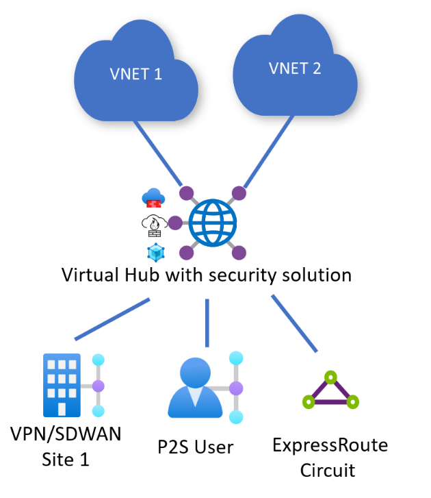
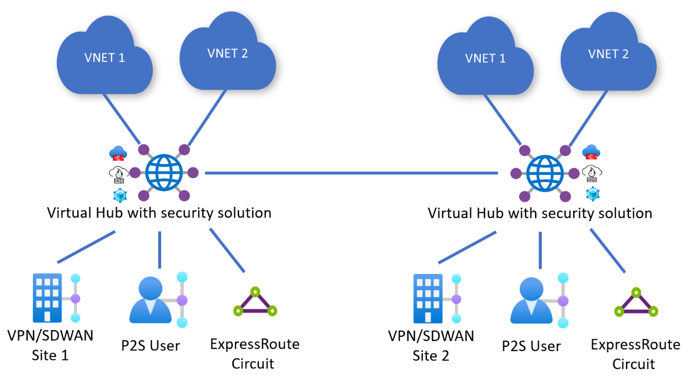
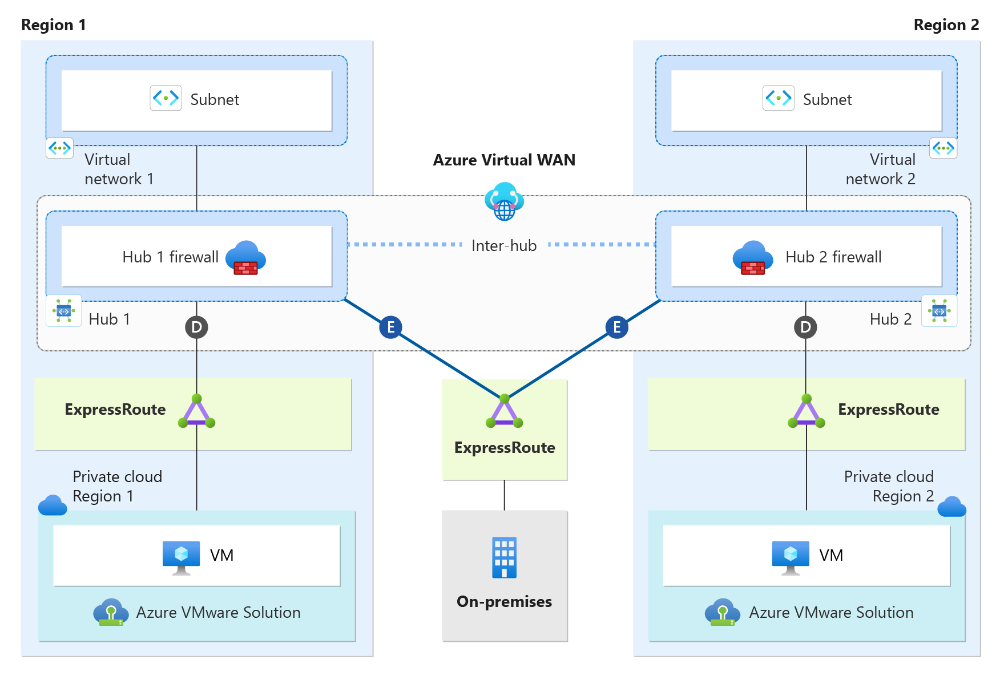

# Secure Virtual WAN for Azure VMware Solution
This document explores the Azure VMware Solution network design topologies and considerations of Single and Dual Region Secure Virtual WAN with Routing Intent. It provides insights into how Routing Intent enhances security and streamlines network management by directing all traffic through a centralized security solution, such as Azure Firewall, a third-party Network Virtual Appliance (NVA), or a SaaS solution. Additionally, it discusses the design considerations for deployments with and without Global Reach, highlighting their respective benefits and challenges.

 A security solution such as Azure Firewall, a third-party Network Virtual Appliance (NVA), or SaaS solution in the Virtual WAN hub effectively converts the hub to a Secure Virtual WAN hub. A Secure Virtual WAN hub is a requirement for configuring Routing Intent. Routing Intent streamlines the routing/security design of the secure hub, by driving all private and internet traffic to the hub security solution. Routing Intent improves the security breadth and conducts traffic inspection for all traffic transiting through the secure hub, including Azure VMware Solution. 

The document assumes readers have a basic understanding of Virtual WAN and Secure Virtual WAN with Routing Intent.

**Virtual WAN**  
[What is Virtual WAN?](/azure/virtual-wan/virtual-wan-about)

**Secured Virtual Hub**  
[What is a secure virtual hub?](/azure/firewall-manager/secured-virtual-hub)

**Virtual WAN Routing Intent**  
[How to configure Virtual WAN Hub routing intent and routing policies](/azure/virtual-wan/how-to-routing-policies)

**ExpressRoute Global Reach**  
[About ExpressRoute Global Reach](/azure/expressroute/expressroute-global-reach)

## Secure Virtual WAN for Azure VMware Solution designs 
Secure Virtual WAN with Routing Intent provides the capability to send all Internet traffic and Private network traffic (RFC 1918) to a security solution like Azure Firewall, a third-party Network Virtual Appliance (NVA), or SaaS solution. With Azure VMware Solution, Secure Virtual WAN with Route-Intent supports both Single-Region and Dual-Region designs.  

### Single-Region design    
The single-region design allows network traffic inspection within the Virtual Hub security solution to and from Azure VMware Solution, which improves security and simplifies network management. This inspection occurs to and from Azure VMware Solution, enhancing overall security posture while streamlining network administration. This design also prepares for future deployments of another Azure VMware Solution Private Cloud in a different region with a dual-region design. Enabling Route-Intent in a Single Region hub helps scale to a dual-hub region design in the future more conveniently. This design supports configurations with or without Global Reach. 

### Dual-Region/Dual-Hub design  
The dual-region design allows network traffic inspection on both Virtual Hub security solutions. This covers traffic to and from Azure VMware Solution and across Azure VMware Solution private clouds in different regions. Routing Intent must be enabled on both regional hubs to allow traffic to pass through both hub security solutions. The dual-region design with Routing Intent improves security and simplifies network management across regions. This design works with or without Global Reach.

## ExpressRoute Global Reach deployment options  
Global Reach establishes a direct logical link via the Microsoft backbone, connecting Azure VMware Solution to on-premises or regional Azure VMware Solution Private Clouds.

### With Global Reach  
When Global Reach is deployed, traffic between the Global Reach sites bypasses the Secure Virtual WAN Hub Firewall. Secure Virtual WAN Hub firewall doesn't inspect any Global Reach traffic that transits between the Azure VMware Solution and the on-premises, or between the Azure VMware Solution Private Clouds in different regions. For example, the diagram below shows how traffic between Azure VMware Solution and on-premises uses the Global Reach connection labeled as “A” to communicate. This traffic doesn't transit the hub firewall because of the Global Reach connection "A". For optimal security between Global Reach sites, traffic inspection must be completed within the Azure VMware Solution environment’s NSX-T or an on-premises firewall.

 A benefit of using Global Reach is that it simplifies the design with a direct logical connection between Azure VMware Solution and on-premises or regional Azure VMware Solution private clouds. Using Global Reach eases troubleshooting traffic between Global Reach sites and eliminates the concern of throughput limitations at the Secure Virtual WAN. A drawback is that Global Reach prevents the inspection of traffic between regional Azure VMware Solution private clouds and on-premises, as well as within Azure VMware Solution private clouds themselves, using the Secure Virtual Hub security solution. This means that the traffic flowing directly between these entities can't be inspected by the security solution provided by the Secure Virtual Hub.

### Without Global Reach  
It’s crucial to note that unless the situation falls into the following three categories, it’s recommended to consistently use Global Reach. A benefit of not using Global Reach is that all the traffic on the Secure Virtual WAN hub security solution between Azure VMware Solution and the on-premises or regional Azure VMware Solution private clouds can be inspected. However, the throughput limitations at the Secure Virtual WAN hub also need to be considered. A drawback of not using Global Reach is that it increases the complexity of the design.

**Category 1: A requirement to inspect traffic on the Virtual WAN Hub between Azure VMware Solution and on-premises, as well as within Azure VMware Solution Private Clouds.**   
This use case is best when there's a security requirement to inspect traffic between Azure VMware Solution and on-premises, or between regional Azure VMware Solution Private Clouds on the Virtual Hub Firewall. 
   
**Category 2: Global Reach unavailability in the region**   
Connectivity between ExpressRoute connections, whether between Azure VMware Solution and on-premises or among regional Azure VMware Solution private clouds, can be established with Route-Intent when Global Reach is unavailable in a region. By default, Virtual Hubs don't support ExpressRoute to ExpressRoute transitivity. To enable this transitivity, a support ticket needs to be initiated. -See [ExpressRoute Global Reach Availability](/azure/expressroute/expressroute-global-reach#availability)

**Category 3: on-premises ExpressRoute is using the ExpressRoute Local SKU**   
The ExpressRoute Local SKU doesn’t currently support Global Reach. Using the Local SKU, you’ll rely on Routing Intent for connectivity between the Azure VMware Solution and your on-premises network.

  

 ## Single and Dual Regions with Global Reach Enabled and Disabled
 
### Single-region design with Global Reach 
When using single-region with Global Reach, the secure hub routes all private and internet traffic through a security solution, such as Azure Firewall, a third-party NVA, or a SaaS solution. Inspection of traffic is done by using Routing Intent. However, Global Reach traffic between Azure VMware Solution and on-premises bypasses the hub firewall as shown on Global Reach connection “A”. Therefore, you need to inspect this Global Reach traffic with NSX-T in Azure VMware Solution or a firewall on-premises for better security across Global Reach sites.
                            

See the table for the traffic flows that the Secured Virtual Hub inspects with this design.

**Traffic Inspection**

Traffic flow to and from Azure VMware Solution

| Location 1 | Direction |  Location 2 | Traffic Inspected on Secure Virtual WAN hub firewall? |
| -------------- | -------- | ---------- | --- |
| Azure VMware Solution | &#8594; &#8592; | Virtual Networks | Yes|
| Azure VMware Solution | &#8594; &#8592; | Internet | Yes|
| Azure VMware Solution | &#8594; &#8592; | on-premises | No|

Traffic flow to and from Virtual Networks
| Location 1 |   Direction |  Location 2 | Traffic Inspected on Secure Virtual WAN hub firewall? |  
| -------------- | -------- | ---------- | --- |
| Virtual Networks | &#8594; &#8592; | on-premises | Yes|
| Virtual Networks | &#8594; &#8592; | Internet | Yes|
| Virtual Networks | &#8594; &#8592; | Virtual Networks | Yes|

## Single-region design without Global Reach
When using single-region without Global Reach, the secure hub routes all private and internet traffic through a security solution, such as Azure Firewall, a third-party NVA, or a SaaS solution. Inspection of traffic is done by using Routing Intent. With this design, traffic between Azure VMware Solution and on-premises transits the hub firewall for inspection. As mentioned earlier, Virtual Hubs do not support ExpressRoute to ExpressRoute transitivity by default. To enable this transitivity, a support ticket needs to be initiated. Once the support ticket has been fulfilled, the secure hub advertises the default RFC 1918 addresses to Azure VMware Solution and to on-premises. When using Routing Intent from on-premises, you cannot advertise the exact default RFC 1918 address prefixes (10.0.0.0/8, 172.16.0.0/12, 192.168.0.0/16) back to Azure. Instead, you must always advertise more specific routes.

See the table for the traffic flows that the Secured Virtual Hub inspects with this design.

**Traffic Inspection**

Traffic flow to and from Azure VMware Solution
| Location 1 |   Direction |  Location 2 | Traffic Inspected on Secure Virtual WAN hub firewall?  
| -------------- | -------- | ---------- | ---|
| Azure VMware Solution   | &#8594; &#8592;| Virtual Networks |  Yes 
| Azure VMware Solution   | &#8594; &#8592;| Internet |  Yes 
| Azure VMware Solution   | &#8594; &#8592;| on-premises |  Yes 

Traffic flow to and from Virtual Networks
| Location 1 |   Direction |  Location 2 | Traffic Inspected on Secure Virtual WAN hub firewall?  
| -------------- | -------- | ---------- | ---|
| Virtual Networks   | &#8594; &#8592;| on-premises |  Yes 
| Virtual Networks   | &#8594; &#8592;| Internet |  Yes 
| Virtual Networks   | &#8594; &#8592;| Virtual Networks |  Yes

## Dual-region design with Global Reach 
When using dual-region with Global Reach, you deploy two secure hubs in different regions within your Virtual WAN. Additionally, you set up two Azure VMware Solution private clouds, each located in a separate region. Each regional Azure VMware Solution private cloud is connected directly to its local regional hub (as shown by connection “D”). on-premises has connectivity to each regional hub (connection “E”). All RFC 1918 and internet traffic routes through a security solution (such as Azure Firewall, a third-party NVA, or a SaaS solution) on both secure hubs using Routing Intent. The Azure VMware Solution private clouds have connectivity back to on-premises via Global Reach (connections “A” and “B”). Azure VMware Solution Clouds have connectivity back to each other via Global Reach (connection “C”). Global Reach traffic between the Azure VMware Solution private clouds or between the Azure VMware Solution private clouds and on-premises bypasses the two hub firewalls (see connections “A”, “B”, and “C”). For enhanced security across Global Reach sites, inspect this traffic using NSX-T in Azure VMware Solution or a firewall on-premises.

See the table for the traffic flows that the Secured Virtual Hub inspects with this design.

**Traffic Inspection**

Traffic flow to and from Azure VMware Solution Private Cloud Region 1
| Location 1 |   Direction |  Location 2 | Traffic Inspected on Secure Virtual WAN hub firewall?  
| -------------- | -------- | ---------- | ---|
| Azure VMware Solution Private Cloud Region 1   | &#8594; &#8592;| Virtual Network 1 |  Yes, via the Hub 1 firewall
| Azure VMware Solution Private Cloud Region 1   | &#8594; &#8592;| Virtual Network 2 |  Yes, via the Hub 1 and Hub 2 firewalls
| Azure VMware Solution Private Cloud Region 1   | &#8594; &#8592;| Internet |  Yes, via the Hub 1 firewall  
| Azure VMware Solution Private Cloud Region 1   | &#8594; &#8592;| on-premises |  No 

Traffic flow to and from Azure VMware Solution Private Cloud Region 2
| Location 1 |   Direction |  Location 2 | Traffic Inspected on Secure Virtual WAN hub firewall?  
| -------------- | -------- | ---------- | ---|
| Azure VMware Solution Private Cloud Region 2   | &#8594; &#8592;| Virtual Network 1 |   Yes, via the Hub 1 and Hub 2 firewalls
| Azure VMware Solution Private Cloud Region 2   | &#8594; &#8592;| Virtual Network 2 |  Yes, via the Hub 2 firewall
| Azure VMware Solution Private Cloud Region 2   | &#8594; &#8592;| Internet |  Yes, via the Hub 2 firewall  
| Azure VMware Solution Private Cloud Region 2   | &#8594; &#8592;| on-premises |  No 

Traffic flow to and from Azure VMware Solution Private Cloud Region 1 and Azure VMware Solution Private Cloud Region 2
| Location 1 |   Direction |  Location 2 | Traffic Inspected on Secure Virtual WAN hub firewall?  
| -------------- | -------- | ---------- | ---|
| Azure VMware Solution Private Cloud Region 1   | &#8594; &#8592;| Azure VMware Solution Private Cloud Region 2 |  No

Traffic flow to and from Virtual Networks
| Location 1 |   Direction |  Location 2 | Traffic Inspected on Secure Virtual WAN hub firewall?  
| -------------- | -------- | ---------- | ---|
| Virtual Network 1   | &#8594; &#8592;| on-premises |  Yes, via the Hub 1 firewall  
| Virtual Network 1   | &#8594; &#8592;| Internet |  Yes, via the Hub 1 firewall 
| Virtual Network 1  | &#8594; &#8592;| Virtual Network 2 |  Yes, via the Hub 1 and Hub 2 firewalls 
| Virtual Network 2   | &#8594; &#8592;| on-premises |  Yes, via the Hub 2 firewall  
| Virtual Network 2   | &#8594; &#8592;| Internet |  Yes, via the Hub 2 firewall  

## Dual-region design without Global Reach 
When using dual-region with Global Reach, you deploy two secure hubs in different regions within your Virtual WAN. Additionally, you set up two Azure VMware Solution private clouds, each located in a separate region. Each regional Azure VMware Solution private cloud is connected directly to its local regional hub (as shown by connection “D”). On-premises has connectivity to each regional hub (connection “E”). All RFC 1918 and internet traffic routes through a security solution (such as Azure Firewall, a third-party NVA, or a SaaS solution) on both secure hubs using Routing Intent.

As mentioned earlier, Virtual Hubs do not support ExpressRoute to ExpressRoute transitivity by default. To enable this transitivity, a support ticket needs to be initiated. Once the support ticket has been fulfilled, the secure hubs advertises the default RFC 1918 addresses to Azure VMware Solution and to on-premises. Make sure to reference both regional hubs when opening the ticket. ExpressRoute to ExpressRoute transitivity allows Azure VMware Solution private clouds to communicate with each other over the Virtual WAN inter-hub and allow the Azure VMware Solution Cloud to communicate with on-premises.

RFC 1918 addresses are advertised to on-premises, you cannot advertise the exact default RFC 1918 address prefixes (10.0.0.0/8, 172.16.0.0/12, 192.168.0.0/16) back to Azure. Instead, you must always advertise more specific routes.

See the table for the traffic flows that the Secured Virtual Hub inspects with this design.

**Traffic Inspection**

Traffic flow to and from Azure VMware Solution Private Cloud Region 1
| Location 1 |   Direction |  Location 2 | Traffic Inspected on Secure Virtual WAN hub firewall?  
| -------------- | -------- | ---------- | ---|
| Azure VMware Solution Private Cloud Region 1   | &#8594; &#8592;| Virtual Network 1 |  Yes, via the Hub 1 firewall
| Azure VMware Solution Private Cloud Region 1   | &#8594; &#8592;| Virtual Network 2 |  Yes, via the Hub 1 and Hub 2 firewalls
| Azure VMware Solution Private Cloud Region 1   | &#8594; &#8592;| Internet |  Yes, via the Hub 1 firewall  
| Azure VMware Solution Private Cloud Region 1   | &#8594; &#8592;| on-premises |  Yes, via the Hub 1 firewall  

Traffic flow to and from Azure VMware Solution Private Cloud Region 2
| Location 1 |   Direction |  Location 2 | Traffic Inspected on Secure Virtual WAN hub firewall?  
| -------------- | -------- | ---------- | ---|
| Azure VMware Solution Private Cloud Region 2   | &#8594; &#8592;| Virtual Network 1 |  Yes, via the Hub 2 firewall
| Azure VMware Solution Private Cloud Region 2   | &#8594; &#8592;| Virtual Network 2 |  Yes, via the Hub 1 and Hub 2 firewalls
| Azure VMware Solution Private Cloud Region 2   | &#8594; &#8592;| Internet |  Yes, via the Hub 2 firewall  
| Azure VMware Solution Private Cloud Region 2   | &#8594; &#8592;| on-premises |  Yes, via the Hub 2 firewall 

Traffic flow to and from Azure VMware Solution Private Cloud Region 1 and Azure VMware Solution Private Cloud Region 2
| Location 1 |   Direction |  Location 2 | Traffic Inspected on Secure Virtual WAN hub firewall?  
| -------------- | -------- | ---------- | ---|
| Azure VMware Solution Private Cloud Region 1   | &#8594; &#8592;| Azure VMware Solution Private Cloud Region 2 |  Yes, via the Hub 1 and Hub 2 firewalls

Traffic flow to and from Virtual Networks
| Location 1 |   Direction |  Location 2 | Traffic Inspected on Secure Virtual WAN hub firewall?  
| -------------- | -------- | ---------- | ---|
| Virtual Network 1   | &#8594; &#8592;| on-premises |  Yes, via the Hub 1 firewall  
| Virtual Network 1   | &#8594; &#8592;| Internet |  Yes, via the Hub 1 firewall 
| Virtual Network 1  | &#8594; &#8592;| Virtual Network 2 |  Yes, via the Hub 1 and Hub 2 firewalls 
| Virtual Network 2   | &#8594; &#8592;| on-premises |  Yes, via the Hub 2 firewall  
| Virtual Network 2   | &#8594; &#8592;| Internet |  Yes, via the Hub 2 firewall  

## Next steps

- For more information on Azure VMware Solution with Single Region Virtual WAN with Global Reach, see [Single-Region Azure VMware Solution design with Global Reach, using Secure Virtual WAN with Routing Intent](single-region-with-secure-virtual-wan-with-globalreach.md).
- For more information on Azure VMware Solution with Single Region Virtual WAN without Global Reach, see [Single-Region Azure VMware Solution design without Global Reach, using Secure Virtual WAN with Routing Intent](single-region-with-secure-virtual-wan-without-globalreach.md).
 - For more information on Azure VMware Solution with Dual Region Virtual WAN with Global Reach, see [Dual-Region Azure VMware Solution design with Global Reach, using Secure Virtual WAN with Routing Intent](dual-region-with-secure-virtual-wan-with-globalreach.md).
- For more information on Azure VMware Solution with Dual Region Virtual WAN without Global Reach, see [Dual-Region Azure VMware Solution design without Global Reach, using Secure Virtual WAN with Routing Intent](dual-region-with-secure-virtual-wan-without-globalreach.md).

