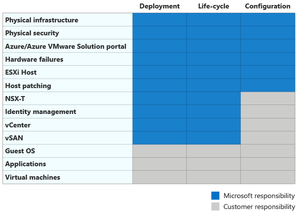

# Manage Azure VMware Solution

The [Manage methodology](../../manage/index.md) in the Microsoft Cloud Adoption Framework for Azure outlines a path for implementing an operations baseline, and maturing that baseline throughout your cloud adoption lifecycle.

Azure VMware Solution is a VMware validated solution with ongoing verification and testing related to VMware product enhancements and upgrades. Microsoft manages and maintains the private cloud infrastructure and software on behalf of a customer. Transitioning that responsibility to Microsoft allows you to focus on developing and running workloads within your private cloud and running within Azure native resources. Regular upgrades of the Azure VMware Solution private cloud and VMware software ensure you have the latest security, stability, and feature sets running in your deployed private cloud.

Microsoft regularly shows the shared responsibility matrix for infrastructure as a service (IaaS), platform as a service (PaaS), and software as a service (SaaS) based products. There's also a shared responsibility matrix for Azure VMware Solution. As you can see, Microsoft abstracts much of the ongoing maintenance, security, and management, leaving your company in charge of the things that matter most, like guest OS provisioning, applications, and virtual machines. You're also able to think through your own lifecycle process and configuration management techniques that can be brought to Azure. By using this model, certain types of operational responsibilities disappear as Microsoft holds more responsibility for the overall Azure VMware Solution infrastructure.

## Azure VMware Solution business alignment

With Azure VMware Solution, Microsoft holds responsibility for the underlying infrastructure when the solution deploys in Azure. IT departments do not have access to perform specific tasks like gaining root access to the individual ESXi hosts, or joining vCenter Server to a domain, unless a ticket is opened for support. This changes standard operating procedures and process flows a bit for IT departments where central IT personnel have complete control of the on-premises VMware vSphere environment. Operating a traditional VMware vSphere environment in this manner frees up operations engineers to focus on innovation within the applications and workloads that define their business charter. It allows for a comprehensive digital transformation that spans across more than Azure VMware Solution.

## Azure VMware Solution operations baseline

Many times VMware vSphere environments on-premises have sprawled. Individual business units might have deployed many different workloads on servers that may not meet a standard baseline. If Azure VMware Solution becomes the first workload placed in Azure, IT engineers can make use of more Azure native resources to help streamline the operations baseline of vSphere VMs being migrated into Azure. Customers can onboard a combination of Azure Policy, Microsoft Defender for Cloud, Azure Monitor, and Azure Automation to ensure both state and infrastructure configuration remains consistent for each application or workload migrated into Azure VMware Solution.

## Azure VMware Solution platform operations

Before deploying Azure VMware Solution, customers need to account for the following components for a landing zone:

1. Establish hybrid network connectivity with an ExpressRoute circuit and a non-overlapping Azure Virtual Network.
2. Establish hybrid replica domain controllers for legacy authentication and authorization if necessary.
3. Deploy a Log Analytics workspace to capture log data from each VM resource within Azure VMware Solution.
4. Plans to Azure Arc enable all servers within Azure VMware Solution so you can see each VM as a resource within the Azure portal.
5. Deploy Microsoft Defender for Cloud and configure with the Standard SKU so you can see how the VMs are reporting into the environment and measure the baselines.
6. Deploy and configure Azure Policy to adhere to Azure specific requirements for the VMs within Azure VMware Solution.
7. Deploy and configure an Azure Automation account to manage Desired State Configuration within the application workload VMs for Azure VMware Solution.

## Azure VMware Solution workload operations

Legacy operating systems must be avoided. Microsoft will support all current Windows Server operating systems listed in the [product and services lifecycle information](/lifecycle/products/?products=microsoft-servers). For Linux-based workloads, the recommendation is to follow the latest supported information from whatever distribution you choose to deploy or migrate into Azure VMware Solution.

## Your next migration iteration

Once the Azure VMware Solution migration is complete, the cloud adoption team can begin your next scenario-specific migration. Instead, if there are additional platforms to be migrated, this article series can be used again to guide your next Azure VMware Solution migration or deployment.

## Next steps

> [!div class="nextstepaction"]
> [Compute services on Azure and AWS](./govern.md)
