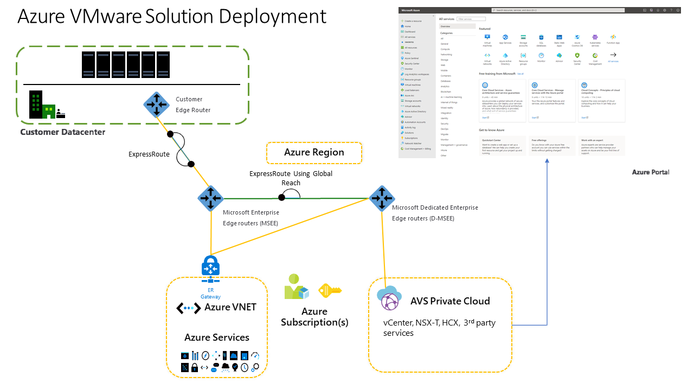

# Migrate workloads for Azure VMware Solution

Azure VMware Solution lets you seamlessly migrate VMware workloads from your datacenter to Azure and integrate more Azure services with ease. You can manage your IT environments with the same VMware tools you already know st the same time. You have the choice and flexibility to determine what workloads to migrate, and you decide the right time to migrate them. With platform symmetry, you have complete control to transform based on how your organization defines its unique cloud journey.

Migrating VMware workloads to Azure can accelerate the standard methodology outlined in the Cloud Adoption Framework.

*Figure 1*

Planning and preparing your environment for Azure VMware Solution deployment is critical for a successful migration. Use your documented plan as a reference during deployment and migration, and make sure you've created a landing zone to host the workloads you plan to build in, or migrate to the cloud. A successful deployment results in a production-ready environment for creating or migrating Azure VMware Solution.

## Azure VMware Solution process details

There are data points outside of a standard Azure Migrate assessment that you need to prepare for build out and migration.

- Identify the Azure subscription, resource group, region, and resource name
- Identify the number hosts required for deployment
- Request a host quota for a subscription with an eligible Azure plan
- Identify a minimum of a non-overlapping /22 CIDR IP segment for private cloud management
- Identify or deploy a single Azure virtual network
- Deploy the virtual network gateway in the virtual network to peer with the Azure VMware Solution ExpressRoute
- Define VMware NSX network segments for various administrative tasks like vMotioning servers from on-premises into Azure VMware Solution

From a technical point of view, it's important to get the core foundations right around networking and migration methodology.

- Use the right IP address space for networking will ensure that you can move workloads seamlessly between on-premises and Azure VMware Solution.
- Plan your migration methodology up front: live, cold, and bulk.
- Define the correct Firewall rules: the right ports need to be open between on-premises and Azure VMware Solution before you deploy the service.

## Azure VMware Solution process flow

Microsoft has a network of Azure VMware Solution certified partners. These partners can help you assess, deploy, and migrate your on-premises workloads into Azure VMware Solution.

You can deploy Azure VMware Solution by using one of the following options:

- Azure portal, where Azure VMware Solution can be deployed like any other service
- Azure command line interface
- Azure Resource Manager template, Bicep template, or Terraform template

When you deploy Azure VMware Solution, you get a software defined data center that has vCenter Server, vSAN, vSphere, and NSX-T deployed. As a result, you can migrate workloads from your on-premises environments, deploy new virtual machines (VMs) within Azure VMware Solution, and consume Azure services from your private clouds. Everything you need to set up a successful migration, transformation, data center extension, is included when you deploy Azure VMware Solution.

### Example migration process

Azure VMware Solution lets you seamlessly move VMware workloads from your datacenter to Azure and integrate more Azure services with ease—all while continuing to manage your IT environments with the same VMware tools you already know. You have the choice and flexibility to determine what workloads to migrate, and you decide the right time to migrate them. With platform symmetry, you have complete control to transform based on how your organization defines its unique cloud journey.

You can take the tooling the operational best practices that you’re already using and repurpose them in Azure with the Azure VMware Solution platform.

The hardware and software specifications should be familiar if you're a VMware admin. If you're deploying VMware Solution it should match up to something that you've got on premises, or maybe it's a version ahead.

What’s important to note is that you’ll need a minimum of three nodes per vsphere cluster. There's a maximum of 16 nodes per vsphere cluster, and then a maximum of 96 nodes in an Azure private cloud instance.

When you deploy Azure VMware Solution, at a minimum, you get three nodes and an ExpressRoute circuit. Because your Azure VMware environment is deployed on bare metal servers, it needs to be peered into Azure for network connectivity. After you deploy Azure VMware Solution, you'll peer the ExpressRoute into an Azure virtual network. Then you can enable Global Reach between the Azure VMware Solution ExpressRoute and on-premises ExpressRoute circuits. Global Reach handles the east-west traffic routing between the two circuits using BGP. This is how you can think about migrating your VMs from on-premises all the way into the Azure VMware Solution private cloud.

After you deploy Azure VMware Solution, it will look like any other Azure service in the Azure portal. But when you’re building the service, you'll need to provide a management IP address, which is different than the virtual network you're connecting the environment to. The management IP address requires a minimum of /22 CIDR block. You don't have to worry about subnetting your environment, Azure VMware Solution will do it for you. You can also enable the Internet. This is where you might think about using Azure virtual LAN and application gateway.

Once you migrate your on-premises VMware environment into Azure, you have the opportunity to be closer to the Azure Resource Manager APIs, versus trying to think about it in a hybrid scenario. On the ExpressRoute circuit, you request your authorization keys, but some of the configuration is done for you. You’ll also need to configure the HCX environment. That's what does the migrations from on-premises into Azure. Then configure your public IP and the ExpressRoute Global Reach.

The vCenter credentials and the NXS-T Manager credentials are set up for you during deployment. You can add segments to the NSX-T, and setup DHCP or DNS if you need it.

You can think about Azure VMware Solution as VMware as a service. The offering is between infrastructure as a service (IaaS) and platform as a service (PaaS). It’s not one over the other. You can configure a jump host within the environment to access Azure VMware Solution. The jump host can be behind an Azure Bastion resource or configured with a public IP and just in time access. The Azure Bastion host is a way to provide secure access into that VM without having to expose the RDP port on a public IP. A VM with just in time configured allows administrators to access an environment on a timed basis, so the RDP port isn't exposed and not a security vulnerability. Configuring everything in this manner allows access your VM if there’s ever an issue with ExpressRoute circuit coming from on-premises into Azure.

When you go into your Azure VMware Solution environment, it should look just like it did when it was running on-premises. You can also integrate with Azure. For example, you can build content libraries on Azure Blob storage so when you templatize your VMs, you can spin up new VMs quickly.

You can use the web vCenter interface and VMware's PowerShell components (PowerCLI).

Azure VMware Solution allows you to work in a familiar environment, with familiar tools. It allows you to iterate, innovate, and modernize at your own pace as you work through your digital transformation.

To get more experience migrating VMware with Azure VMware Solution, try one of these [hands on labs](https://web.hol.vmware.com/landingPages/index.aspx?id=PN5RRQA9).

- Azure VMware Solution Private Cloud Deployment and Connectivity: A guided lab for VMware administrators, on how to set up the cloud deployment and connectivity.
- Azure VMware Solution Workload Migration with VMware HCX: This lab deals with the migration components. It walks through how to create the environment, deploy the environment, and migrate VMs.

More resources:

- [Azure VMware Solution documentation](/azure/azure-vmware/)
- Learn path: [Run VMware workloads on Azure VMware Solution](/learn/paths/run-vmware-workloads-azure-vmware-solution/)

## Azure VMware Solution workload specific activities

An Azure Migrate assessment will provide a way for you to analyze all workloads running in an on-premises VMware environment. Running the assessment over a period of 30 days (or longer) will provide an opportunity to right size the Azure VMware Solution node size deployment. Additionally, it will help you prioritize the flow for your production migration.

## Next steps

 Review how you can extend your governance approach across the Azure VMware solution. Evaluate and manage risk tolerance by identifying high-risk areas for business, convert risk vectors into governing corporate policies, and extend governance policies across cost, security baseline, identity baseline, resource consistency, and deployment acceleration disciplines.

> [!div class="nextstepaction"]
> [Govern Azure VMware Solution](./govern.md)
