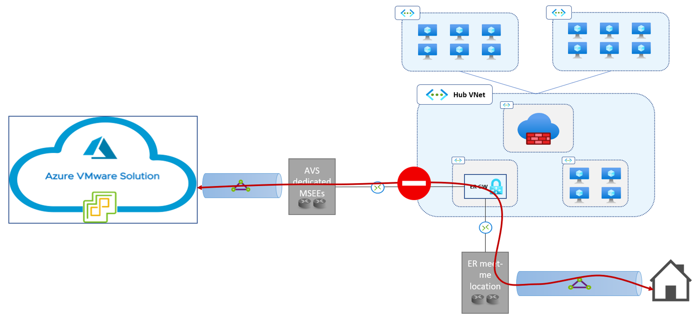
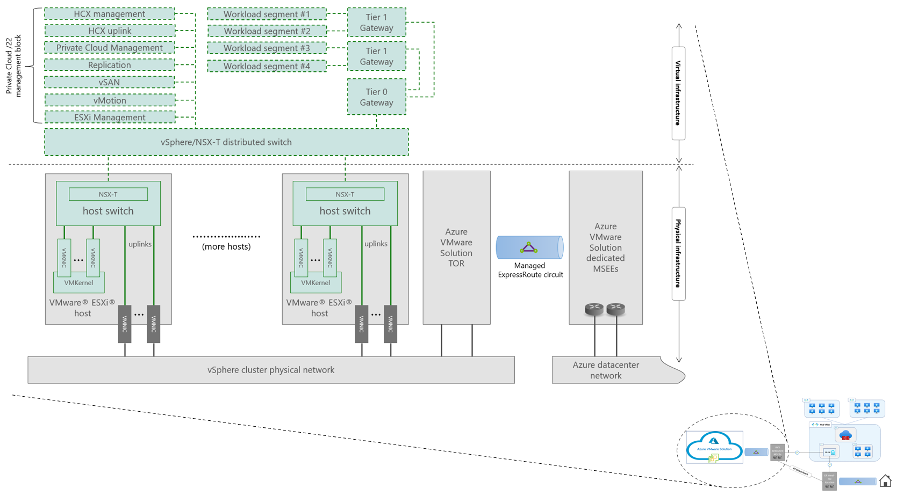
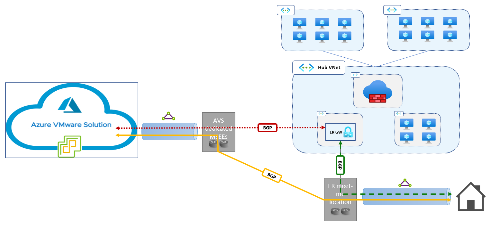

# Azure VMware Solution Networking basics
This section summarizes some fundamental concepts about Azure VMware Solution networking. They are a pre-requisite for understanding the design options covered in the following sections and for designing complex Azure VMware Solution topologies.

## What is the role played by ExpressRoute?

Azure VMware Solution runs on bare-metal VMware ESXi nodes deployed in Azure datacenters and are attached to a physical network. Just like how ExpressRoute circuits allow Azure customers to establish layer-3 connectivity between their cross-premises networks and Azure virtual networks, a dedicated ExpressRoute implementation provides layer-3 connectivity between physical ESXi nodes and Azure virtual networks.
When an Azure VMware Solution Private Cloud is provisioned, an associated ExpressRoute circuit is also instantiated in a Microsoft-managed subscription. The private cloud's owner can then connect the circuit to one or more ExpressRoute Virtual Network Gateways in Azure virtual networks, by redeeming authorization keys for the circuit (the same procedure used to create connections between ExpressRoute Gateways and customer-managed circuits). Please refer to the [Azure VMware Solution official documentation](/azure/azure-vmware/deploy-azure-vmware-solution?tabs=azure-portal#connect-to-azure-virtual-network-with-expressroute) for detailed instructions.
 
 
*Azure VMware Solution uses a dedicated ExpressRoute implementation to provide layer-3 connectivity between Azure virtual networks and the physical network to which the VMWare ESXi clusters are attached. The VMware ESXi clusters are hosted in the same Microsoft datacenter facilities that host the Azure platform.*

## What is the role played by ExpressRoute Global Reach?

An Azure ExpressRoute Gateway cannot be used to route traffic between on-premises locations connected to it over different circuits. This limitation applies to the Azure VMware Solution dedicated ExpressRoute implementation too, as shown in the figure below.
 
 
*ExpressRoute does not support routing traffic between different circuits connected to the same gateway.*

Global Reach is an ExpressRoute feature that allows connecting two circuits, so that the networks connected to each circuit can route traffic to each other over the Microsoft backbone. Global Reach is available in the Azure VMware Solution dedicated ExpressRoute implementation. As such, Azure VMware Solution managed ExpressRoute circuits can be connected to customer-managed circuits, providing layer-3 connectivity between on-premises networks and Azure VMware Solution private clouds.
 
 
*ExpressRoute Global Reach provides direct, layer-3 connectivity over ExpressRoute for on-premises sites.*

## Azure VMware Solution network topology

An Azure VMware Solution private cloud infrastructure includes several network segments. The segments are realized by VMware's network virtualization stack (virtual distributed switches) and connected to the underlying physical infrastructure through the ESXi hosts' physical NICs.
- Management networks support  basic vSphere cluster functions (vCenter Server and NSX-T management virtual machines, vMotion, replication, vSAN, …). The management networks’ address space is allocated from the /22 address block assigned to each Azure VMware Solution private cloud at provisioning time. See the [Azure VMware Solution official documentation](/azure/azure-vmware/tutorial-network-checklist#routing-and-subnet-considerations) for details on how IP address ranges from the /22 block are assigned to management networks.
- Workload segments are customer-defined NSX-T segments to which Azure VMware Solution virtual machines attach. The address range for a workload segment is customer-defined. It cannot overlap with the Azure VMware Solution private cloud's /22 management block, nor with any other address range used in peered Azure virtual networks or remote networks connected to the private cloud that must be reachable from the segment. Workload segments can be attached to Tier-1 gateways. An Azure VMware Solution private cloud can have one or more Tier-1 gateways. Tier-1 gateways can be linked to the private cloud's default Tier-0 gateway, which provides connectivity to the physical network outside the vSphere/NSX-T cluster.

The network topology of an Azure VMware solution private cloud is shown in the figure below.

 
*Network topology of an Azure VMware Solution private cloud.*

## Dynamic routing in Azure VMware Solution

Azure VMware Solution private clouds connect to Azure virtual networks and remote sites over the managed ExpressRoute circuit. BGP is used for dynamic route exchange, as shown in the figure below.
 
 
*Dynamic routing in Azure VMware Solution.*

In the standard topology shown in the above figure:
- Routes for all network segments in the Azure VMware Solution private cloud (both management and workload segments) are announced to all ExpressRoute Gateways connected to the private cloud's managed circuit. In the opposite direction, ExpressRoute Gateways announce routes for all the prefixes that comprise the address space of their own virtual network and the address space of all directly peered networks, if peering is configured to [allow gateway transit](/azure/virtual-network/virtual-network-peering-overview#gateways-and-on-premises-connectivity) (red arrow in the figure). 
- Routes for all network segments in the Azure VMware Solution private cloud (both management and workload segments) are announced to all ExpressRoute circuits connected to the private cloud's managed circuit via Global Reach. In the opposite direction, all routes announced from the on-premises site over the customer-managed ExpressRoute circuit are propagated to the Azure VMware Solution private cloud (yellow arrow in the figure).
- All routes announced from the on-premises site over the customer-managed ExpressRoute circuit are learned by all ExpressRoute Gateways connected to the circuit and injected the route table of the Gateway's virtual network (as well as the route table of all directly peered networks, if peering is configured to [allow gateway transit](/azure/virtual-network/virtual-network-peering-overview#gateways-and-on-premises-connectivity)). In the opposite direction, ExpressRoute Gateways announce routes for all the prefixes that comprise the address space of their own virtual network (as well as the address space of all directly peered network, if peering is configured to [allow gateway transit](/azure/virtual-network/virtual-network-peering-overview#gateways-and-on-premises-connectivity)) (green arrow in the figure.) This is standard ExpressRoute behavior, not related to Azure VMware Solution.

> **Note**  
> It should be noted that ExpressRoute Gateways do not propagate routes across circuit connections. In the above figure, the ExpressRoute Gateway does not propagate routes learned in the “red” BGP session to the “green” BGP peer, and vice versa. This is the reason why Global Reach is required to enable connectivity between the Azure VMware Solution private cloud and the on-premises site.

## Outbound data transfer charges
The managed ExpressRoute circuit associated to an Azure VMware Solution private cloud is instantiated in a Microsoft-owned subscription. Azure VMware Solution customers' subscriptions are not billed for any costs (monthly fees and data transfer fees) associated to the managed circuit. More specifically, customers' subscriptions are not billed for:
- ExpressRoute monthly fees for the managed circuit;
- Traffic transferred from an Azure Virtual Network to the private cloud over the managed circuit;
- ExpressRoute Global Reach ingress and egress traffic charges. It should be noted that, when ExpressRoute Global Reach is used to connect a customer-owned ExpressRoute circuit to an Azure VMware Solution managed circuit, Global Reach ingress and egress charges are suppressed on the customer-owned circuit too (for traffic to/from private clouds), provided that the the customer-owned circuit is in the same [geopolitical region](/azure/expressroute/expressroute-locations#locations) as the private cloud.

The ExpressRoute Virtual Network Gateway connected to the private cloud's managed circuit is instantiated in a customer-owned Virtual Network and, as such, billed at the [standard ExpressRoute Virtual Network Gateway rates](https://azure.microsoft.com/pricing/details/expressroute/). 

Any other network-related resources (Azure VPN Gateways, Azure Route Servers, Virtual Network Peerings, Public IP addresses, ...) required by the topologies discussed in this guide are deployed in customer-owned subscriptions and billed at the standard rates.  

More details on billing for Azure VMware Solution are provided in the [official documentation](/azure/azure-vmware/faq#billing).

## Next Steps
- Go to the next section to learn about [connectivity between Azure VMware Solution and on-prem sites](network-design-guide-onprem-connectivity.md) 
- Go back to the Azure VMware Solution Network Design Guide [introduction](network-design-guide-intro.md).

