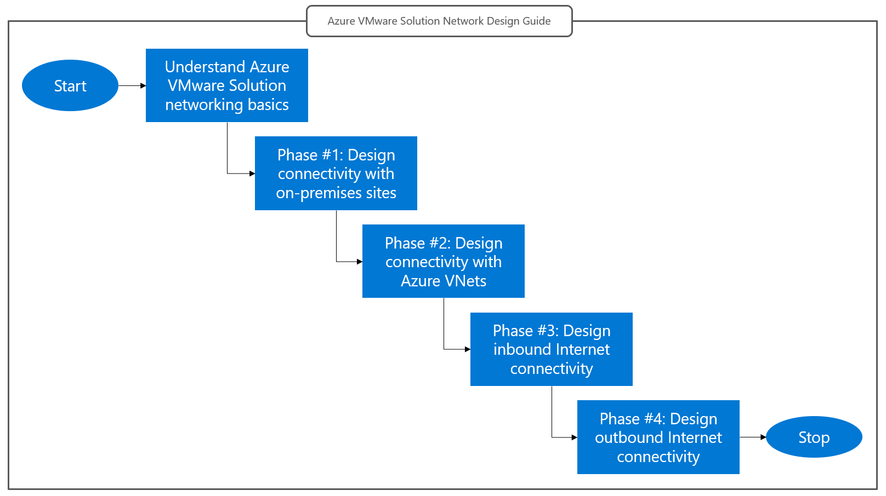

# Azure VMware Solution Landing Zone Accelerator Network Design Guide
This guide covers network design for Azure VMWare Solution. It encompasses four design areas, summarized below.

1. **Connectivity with on-premises datacenters**. Connectivity between Azure VMware Solution private clouds and on-premises sites supports a broad set of use cases, such as HCX migrations, hybrid applications, remote vCenter or NSX-T Data Center administration. Azure VMware Solution supports multiple options for hybrid connectivity, including Azure ExpressRoute circuits and internet-based IPSec VPNs. 

2. **Connectivity with Azure Virtual Networks**. Azure VMware Solution runs on bare-metal VMware vSphere clusters that can be connected to native Azure Virtual Networks (VNets) through Azure ExpressRoute. ExpressRoute connections between Azure VMware Solution private clouds and Azure VNets enable building applications that span the two environments or using “jump-box” virtual machines in Azure IaaS to log into vCenter (vSphere Client) and NSX-T Manager console for administration purposes. 

3. **Inbound Internet connectivity**. Inbound Internet connectivity enables applications running on Azure VMware Solution to be exposed to the Internet behind public IP addresses. Internet-facing applications are almost invariably published through security devices (application delivery controllers, web application firewalls, L3/L4 next-gen firewalls, …). Design decisions about inbound connectivity are primarily driven by the placement of such devices (in Azure VMware Solution or in Azure VNets). 

4. **Outbound Internet connectivity**. Outbound Internet connectivity is needed when applications running on Azure VMware Solution require access to public endpoints. Typical use cases include downloading software updates, consuming public web sites or APIs, Internet browsing (for example, when Azure VMware Solution is used to run [VDI solutions](/azure/azure-vmware/azure-vmware-solution-horizon)). Azure VMware Solution provides several options to implement outbound Internet connectivity, which may or may not rely on Azure native resources. Security requirements (firewalling, forward proxying, …) typically drive design decisions in this area. 

Azure VMware Solution provides native functionalities to address the most common/basic requirements in each design area, with little or no dependence on customer-managed Azure-native resources. However, in enterprise scenarios, it is common for Azure VMware Solution to be part of a larger infrastructure that includes native Azure IaaS and PaaS services. In such cases, some out-of-the-box connectivity features provided in Azure VMware Solution may be replaced by more advanced solutions based on Azure native services, such as 1st-party network services (Azure Firewall, Azure Application Gateway, …) or 3rd-party Network Virtual Appliances (NVAs).

Designing Azure VMware Solution network solutions is a complex endeavor. A solid understanding of [Azure VMware Solution networking basics](network-design-guide-avs-networking-basics.md) is needed for an effective use of this guide.

## Design area prioritization
The four design areas are not independent of each other. Design decisions made for one area may limit the options available in other areas. It is recommended to tackle the four areas in the order they have been introduced in the previous section. 

 
*Design area prioritization recommended in this guide.*

As shown in the flow chart, this guide advocates the following approach to network design for Azure VMware Solution.
1. Design connectivity with on-premises datacenters first. The key decisions for this area are (i) what connectivity service to leverage between on-premises sites and the edge of the Microsoft network (Internet vs. ExpressRoute) and (ii) whether traffic should be routed directly to Azure VMware Solution (recommended) or through virtual devices running in Azure VNets. Read the [Design phase #1: Connectivity with on-prem sites article](network-design-guide-onprem-connectivity.md) to learn what options Azure VMware Solution supports and how to choose one.

2. Identify the VNet connectivity option aligned to the design choices made in Phase #1. Determine which additional routing/security configuration may be needed in Azure VNets to incorporate requirements such as firewall inspection for traffic between Azure VMware Solution and Azure native VMs. Read the [Design phase #2: Azure VNet connectivity article](network-design-guide-vnet-connectivity.md) to learn how design decisions for connectivity with on-premises sites influence the way an Azure VMware Solution private cloud connects to Azure VNets.

3. Decide how Internet-facing applications running on Azure VMware Solution should be published (**inbound** Internet connectivity). Azure VMware Solution allows using Azure Public IPs associated with either virtual appliances running in Azure VMware Solution, or virtual appliances running in an Azure VNet. Both options can be used irrespective of the decisions made for connectivity with on-premises sites and Azure VNets in Phase #1 and Phase #2. Read the [Design phase #3: Internet inbound connectivity article](network-design-guide-internet-inbound-connectivity.md) to learn what options for inbound Internet connectivity Azure VMware Solution supports, and how to choose one.

4. Decide how Azure VMware Solution workloads will connect to the Internet (**outbound** Internet connectivity). This design decision may be constrained by the previous decisions made for outbound Internet connectivity (Phase #3). If [Azure Public IPs to the NSX-T edge](/azure/azure-vmware/enable-public-ip-nsx-edge) are used for inbound connectivity, then they must be used for outbound connections too. If not, more options exist. Read the [Design phase #4: Internet outbound connectivity article](network-design-guide-internet-outbound-connectivity.md) to learn about supported options and how to choose one.

## Next Steps
- Go to the next section to learn about [Azure VMware Solution Networking Basics](network-design-guide-avs-networking-basics.md).
- Go to [Design Phase #1: Connectivity with on-prem sites](network-design-guide-onprem-connectivity.md)
- Go to [Design Phase #2: Azure VNet connectivity](network-design-guide-vnet-connectivity.md)
- Go to [Design Phase #3: Inbound Internet connectivity](network-design-guide-internet-inbound-connectivity.md)
- Go to [Design Phase #4: Outbound Internet connectivity](network-design-guide-internet-outbound-connectivity.md)
